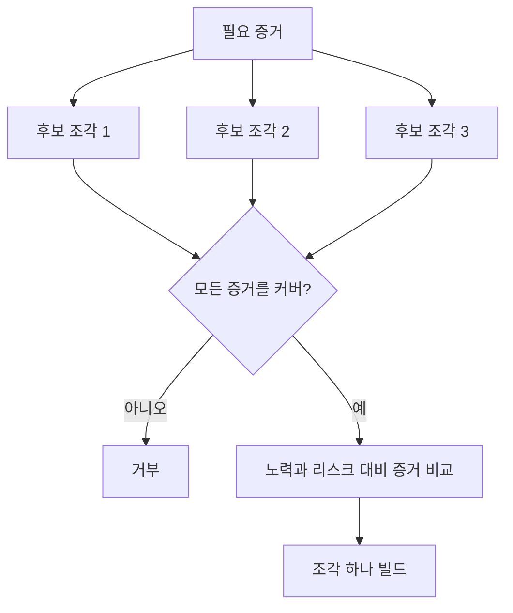

> 🇰🇷 이 문서는 한국어 번역본입니다(ELI5 스타일). 원문: [en.md](en.md)

# 결정을 바꿀 수 있는 가장 작은 조각 고르기

> "작다"는 것은 중요한 무언가를 증명할 때만 쓸모가 있습니다. 다음 결정을 바꿀 수 없는 아주 작은 빌드는 그저 미완성일 뿐입니다.

**유형:** 학습 + 빌드
**언어:** Python (표준 라이브러리)
**선수 지식:** 페이즈 14 레슨 49
**시간:** 약 65분

## 학습 목표

- 그 조각이 증명하는 가정으로 조각(slice)을 정의합니다.
- 결과 가치, 불확실성 감소, 노력, 결과의 심각성 사이의 균형을 잡습니다.
- 성급한 프로덕션(운영 환경) 헌신보다는 되돌릴 수 있는 근거를 우선합니다.
- 워크플로에서 가장 위험한 부분을 빼 버린 조각은 거부합니다.

## 수직 슬라이스란 근거가 처음부터 끝까지 닿는다는 뜻

쓸모 있는 조각은 결과를 관찰하는 데 필요한 최소한의 실제 워크플로를 가로질러야 합니다. 사용자, 데이터, 기간, 기능 면에서는 좁아도 됩니다. 하지만 지금 테스트해야 할 바로 그 불확실성을 제거하는 방식으로 좁아서는 안 됩니다.

예시:

- 실제 장애 열 건을 대상으로 한 읽기 전용 리플레이는 서비스 식별 능력과 운영자의 신뢰를 테스트합니다.
- 가짜(synthetic) 데이터 위의 그럴듯한 대시보드는 이해도는 테스트해도 데이터 실현 가능성은 테스트하지 못합니다.
- 프로덕션 자동 복구기는 감당 못할 결과를 내면서 모든 것을 한꺼번에 테스트합니다.

## 필요한 증거를 먼저 정의하기

가장 리스크가 큰 열린 가정들을 가져와서 "필요 증거 세트"로 바꿉니다. 후보 조각은 그 세트를 커버할 때만 자격이 있습니다.

그다음 자격이 있는 조각들을 다음 기준으로 비교합니다:

| 차원 | 방향 |
|---|---|
| 결과 가치 | 클수록 좋음 |
| 감소한 불확실성 | 클수록 좋음 |
| 노력 | 작을수록 좋음 |
| 결과의 심각성 | 작을수록 좋음 |
| 되돌릴 수 있음 | 클수록 좋음 |

실습의 점수 계산은 의도적으로 단순합니다. 산수보다 자격 심사 게이트가 더 중요합니다.



## 흔한 가짜 최소 슬라이스들

- **UI만 있는 최소본:** 데이터와 운영의 불확실성을 제거해 버립니다.
- **인프라만 있는 최소본:** 사용자 가치 없이 기술적 가능성만 증명합니다.
- **행복 경로만 있는 최소본:** 가장 큰 리스크를 만드는 예외를 빼 버립니다.
- **데모용 최소본:** 설득력 있는 산출물은 내지만 반복 측정은 불가능합니다.
- **플랫폼 최소본:** 하나의 워크플로가 정당해 주기도 전에 재사용 가능한 기계를 만듭니다.

## 중단 규칙을 추가하라

구현 전에, 조각이 실패하면 어떻게 할지 적어 두세요:

- 그 결과(성과)를 포기한다;
- 목표 사용자나 상황을 바꾼다;
- 다른 메커니즘을 테스트한다;
- 더 나은 근거를 수집한다;
- 권한을 더 좁힌다.

모든 결과가 "계속 만든다"로 이어진다면, 그 조각은 실험이 아닙니다.

## 직접 만들어 보기

이 실습은 필요 증거로 후보를 걸러내고, 자격이 있는 조각의 점수를 매긴 뒤, `outputs/slice-decision.json`에 기록합니다.

```bash
python3 code/main.py
python3 -m unittest discover code/tests -v
```

필요한 가정 중 하나만 증명하는 더 싼 후보를 추가해 보세요. 숫자 점수가 높아도 자격이 없는 상태로 남아 있어야 합니다.

## 연습 문제

1. 같은 결과에 대해 결과의 심각성 수준이 다른 조각 세 개를 설계해 보세요.
2. 점수를 매기기 전에 필요 증거 세트를 먼저 밝히세요.
3. 결정적인 증거는 유지하면서 기능 하나를 빼 보세요.
4. 실패한 파일럿(pilot)을 위한 중단 규칙을 추가해 보세요.
5. 조각이 끝난 뒤까지 기다려야 할 재사용 가능한 플랫폼 구성 요소를 찾아 보세요.

## 더 읽을거리

- [Barry Boehm, A Spiral Model of Software Development and Enhancement](https://dl.acm.org/doi/10.1145/12944.12948) — 각 개발 주기를 그 주기가 해소해야 할 리스크에 맞추는 방법을 다룹니다.
- [Lenarduzzi and Taibi, MVP Explained: A Systematic Mapping Study on the Definitions of Minimal Viable Product](https://arxiv.org/abs/1609.07592) — 소프트웨어 제품 실무에서 "최소"와 "실현 가능"을 둘러싼 모호함을 다룹니다.

## 남는 산출물

`outputs/slice-decision.json`을 남겨 두세요. 이 파일에는 이 조각이 왜 "결정을 바꿀 수 있는 가장 작은 조각"인지가 기록됩니다.
