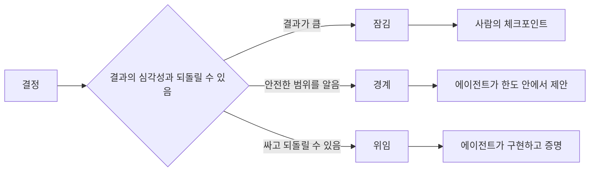

> 🇰🇷 이 문서는 한국어 번역본입니다(ELI5 스타일). 원문: [en.md](en.md)

# 판단을 살려 두는 명세 쓰기

> 쓸모 있는 명세는 불변 조건과 증거는 고정하되, 되돌릴 수 있는 구현 선택은 열어 둡니다. 명세는 시나리오 대본이 아니라 결정 경계입니다.

**유형:** 학습 + 빌드
**언어:** Python (표준 라이브러리)
**선수 지식:** 페이즈 14 레슨 50
**시간:** 약 75분

## 학습 목표

- 결과, 불변 조건, 예시, 비목표, 증거를 서로 구분합니다.
- 결정을 잠김(locked), 경계(bounded), 위임(delegated)으로 표시합니다.
- 선택 비용이 싸고 되돌릴 수 있는 곳에서는 에이전트의 판단을 살려 둡니다.
- 결과의 심각성이 크거나 공개 동작이 바뀌는 곳에는 사람의 체크포인트를 요구합니다.

## 나쁜 양극단

부족하게 쓰인 작업은 에이전트에게 시스템 전체를 맞히게(추측하게) 합니다. 과하게 쓰인 작업은 이미 틀렸을지도 모르는 설계를 받아 적게(전사하게) 합니다.

쓸모 있는 중간 지점은 실행 가능한 계약입니다:

| 층위 | 목적 |
|---|---|
| 결과 | 관찰 가능한 결과 |
| 불변 조건 | 언제나 참으로 유지되어야 하는 조건 |
| 예시 | 의도를 드러내는 구체적인 사례 |
| 비목표 | 의도적으로 제외한 인접 동작 |
| 결정 정책 | 어떤 선택이 잠기고, 경계가 정해지고, 위임되는지 |
| 증거 | 완료 전에 요구되는 근거 |

## 세 가지 결정 모드

- **잠김(Locked):** 에이전트가 선택하면 안 됩니다. 공개 호환성, 권한, 안전, 되돌릴 수 없는 비용, 제품 방향의 약속에 사용합니다.
- **경계(Bounded):** 에이전트가 명시된 한도 안에서 선택할 수 있습니다. 검색 예산, 재시도 횟수, 허용된 의존성, 알려진 인터페이스 계열에 사용합니다.
- **위임(Delegated):** 에이전트가 선택을 소유하고 설명해야 합니다. 로컬 구조, 이름 짓기, 되돌릴 수 있는 리팩터링, 구현 디테일에 사용합니다.



## 예시로 동작을 명세하라

예시는 형용사보다 의도를 더 압축해서 담습니다. "유용한", "견고한", "프로덕션 준비 완료"는 실행할 수 없습니다. 정상, 경계(edge), 실패, 금지 사례를 아우르는 작은 예시 집합이면 만드는 사람과 검증하는 사람 모두에게 구체적인 기준이 됩니다.

예시가 불변 조건을 대체하지는 않습니다. 통과하는 사례 하나로 모든 경우에 통하는 안전 규칙을 증명할 수는 없습니다.

## 증거는 주장과 수준이 맞아야 한다

- 단위 테스트는 로컬 함수 계약을 증명합니다.
- 와이어(wire) 테스트는 직렬화와 전송 동작을 증명합니다.
- 브라우저 여정(journey) 테스트는 인터페이스 경로를 증명합니다.
- 리플레이 세트는 대표 사례들에 걸친 동작을 증명합니다.
- 감사(audit) 로그는 권한 경계가 지켜졌음을 증명합니다.

더 낮은 층의 증거를 더 높은 층의 주장에 대한 증명으로 받아들이지 마세요.

## 모르는 것은 의도적으로 남겨 둔다

명세는 이렇게 말할 수 있습니다: "구현은 시간 예산 안에 답을 돌려주는 임의의 읽기 전용 소스를 선택할 수 있다." 이것은 모호함이 아닙니다. 경계와 증거가 붙은, 의도적인 위임 결정입니다.

명세는 근거가 바뀌면 함께 진화해야 합니다. 잠긴 선택과 경계진 선택에는 이유를 함께 보관하세요. 그래야 나중 팀이 고고학(발굴 작업) 없이도 그 결정을 다시 볼 수 있습니다.

## 직접 만들어 보기

이 실습은 모든 계약 층위를 검증하고, 결정 모드를 점검한 뒤, `outputs/executable-specification.json`에 기록합니다.

```bash
python3 code/main.py
python3 -m unittest discover code/tests -v
```

프로덕션 쓰기(write) 결정을 잠김에서 위임으로 바꿔 보세요. 스키마는 그 값을 받아들이지만 제품 리스크는 받아들이지 않는 이유를 설명해 보세요.

## 연습 문제

1. 백로그 티켓 하나를 여섯 개의 명세 층위로 바꿔 보세요.
2. 구현 지시 세 개를 불변 조건 하나와 예시 두 개로 바꿔 보세요.
3. 모든 결정에 표시를 달고, 잠김 또는 경계 선택마다 이유를 붙이세요.
4. 모든 불변 조건에 증거 영수증을 붙여 보세요.
5. 근거도 리스크 근거도 없는 제약 하나를 제거해 보세요.

## 더 읽을거리

- [Nuseibah and Easterbrook, Requirements Engineering: A Roadmap](https://www.cs.toronto.edu/~sme/papers/2000/ICSE2000.pdf) — 목표, 정밀한 명세, 검증, 합의, 진화 사이의 관계를 다룹니다.
- [Zave and Jackson, Four Dark Corners of Requirements Engineering](https://doi.org/10.1145/267895.267896) — 환경 가정, 요구사항, 명세를 구분하는 방법을 다룹니다.
- [Gotel and Finkelstein, An Analysis of the Requirements Traceability Problem](https://doi.org/10.1109/ICRE.1994.292398) — 요구사항이 왜 존재하고 어디서 왔는지를 보존하는 문제를 다룹니다.

## 남는 산출물

`outputs/executable-specification.json`을 남겨 두세요. 이 파일은 코딩 에이전트와 사람 리뷰어가 함께 사용하는 계약이 됩니다.
