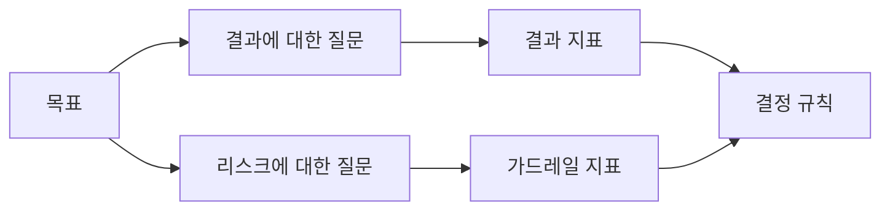

> 🇰🇷 이 문서는 한국어 번역본입니다(ELI5 스타일). 원문: [en.md](en.md)

# 결과가 존재하기 전에 성공 지표를 설계하기

> 측정은 대시보드를 꾸미는 장식이 아니라 어떤 결정에 답해야 합니다. 목표에서 출발해 질문을 끌어내고, 그 질문에 답하는 가장 작은 지표를 고르세요.

**유형:** 학습 + 빌드
**언어:** Python (표준 라이브러리)
**선수 지식:** 페이즈 14 레슨 47과 51
**시간:** 약 70분

## 학습 목표

- 결과 목표에서 질문과 지표를 끌어냅니다.
- 결과를 관찰하기 전에 기준선, 측정 기간, 데이터 출처, 방향을 정의합니다.
- 결과 지표에 가드레일과 역지표(counter-metric)를 짝지어 둡니다.
- 빌드가 뒷받침해야 하는 결정에 맞는 평가 근거를 고릅니다.

## 목표, 질문, 지표

목표부터 시작합니다:

> 안전하지 않은 행동을 늘리지 않으면서, 영향받은 서비스를 식별하는 시간을 줄인다.

질문을 끌어냅니다:

- 올바른 서비스가 얼마나 빨리 식별되는가?
- 식별된 서비스가 얼마나 자주 맞는가?
- 진단이 계속 읽기 전용으로 유지되는가?
- 그 워크플로가 알림 무시나 운영자 작업량을 늘리는가?

그다음 그 질문들을 실행 가능한 형태로 바꿔 주는 지표를 고릅니다.



## 지표에는 계약이 필요하다

모든 지표에는 다음이 필요합니다:

| 필드 | 예시 |
|---|---|
| 이름 | `median_identification_seconds` |
| 방향 | 최대 |
| 기준선(임계값) | 120 |
| 측정 기간 | 장애 리플레이 10건 |
| 출처 | 리플레이 이벤트 로그 |
| 모집단 | 파일럿에 참여한 당직 엔지니어 |
| 종류 | 결과 또는 가드레일 |

출처와 기간이 없으면 그 숫자는 재현할 수 없습니다. 기준선이 없으면 그 숫자로 결정을 내릴 수 없습니다.

## 결과, 가드레일, 역지표

- **결과 지표:** 바라던 상태가 나아졌는가?
- **가드레일:** 고정된 제약이 계속 참으로 유지됐는가?
- **역지표:** 여기서의 개선이 비용이나 피해를 다른 곳으로 전가하지 않았는가?

장애 대응 워크플로에서 속도만으로는 부족합니다. 정확도, 프로덕션 쓰기(write), 운영자 작업량, 놓친 알림 같은 지표가 "빠르지만 안전하지 않은 결과"를 막아 줍니다.

## 오프라인 근거와 온라인 근거

오프라인 리플레이는 재현성과 경계(edge) 사례 커버리지에 유용합니다. 범위가 정해진 파일럿은 실제 행동, 신뢰, 워크플로 효과에 유용합니다. 어느 쪽도 다른 쪽을 대체하지 못합니다.

현재의 결정에 답할 수 있는 가장 싼 근거를 사용하세요. 구현이 준비됐다는 이유만으로 실제 사용자를 노출하지 마세요.

## 측정하기 전에 결정하라

결과를 보기 전에 통과, 실패, 애매한 경우의 처리 경로를 적어 두세요. 그렇지 않으면 팀은 빌드를 지키기 위해 기준선을 옮겨 버립니다.

예시:

- 통과: 올바른 서비스 비율이 0.9 이상이고 중앙값 시간이 120초 이하;
- 실패: 프로덕션 쓰기가 한 번이라도 있었거나 올바른 비율이 0.75 미만;
- 애매: 분산이 큰 작은 개선 — 더 큰 리플레이 세트가 필요.

## 직접 만들어 보기

이 실습은 측정 계획을 검증하고, 경계 값을 포함하는(inclusive) 기준선을 평가하고, 누락된 값을 기록한 뒤, `outputs/measurement-report.json`에 기록합니다.

```bash
python3 code/main.py
python3 -m unittest discover code/tests -v
```

가드레일 지표를 제거해 보세요. 결과 지표는 그대로 남아 있어도 계획 전체가 왜 무효가 되는지 관찰하세요.

## 연습 문제

1. 결과 목표 하나에서 질문 세 개를 끌어내 보세요.
2. 다른 역할로 전가된 비용을 잡아내는 역지표 하나를 추가해 보세요.
3. 모든 지표에 출처, 모집단, 측정 기간을 정의해 보세요.
4. 값을 생성하기 전에 통과, 실패, 애매에 대한 결정을 먼저 적어 보세요.
5. 수집은 쉽지만 결정을 바꿀 수 없는 지표 하나를 찾아 제거해 보세요.

## 더 읽을거리

- [Basili, Software Modeling and Measurement: The Goal/Question/Metric Paradigm](https://drum.lib.umd.edu/items/8119803a-362b-42ec-b6ce-2311713e7236) — 명시적인 목표에서 실행 가능한 측정을 끌어내는 방법을 다룹니다.
- [Basili, Caldiera, and Rombach, The Goal Question Metric Approach](https://www.cs.toronto.edu/~sme/CSC444F/handouts/GQM-paper.pdf) — 이 방법을 피드백과 개선 시스템으로 적용하는 방법을 다룹니다.

## 남는 산출물

`outputs/measurement-report.json`을 남겨 두세요. 이 파일이 프로토타입, 파일럿, 프로덕션 단계로 넘어가기 위한 근거 게이트를 정의합니다.
