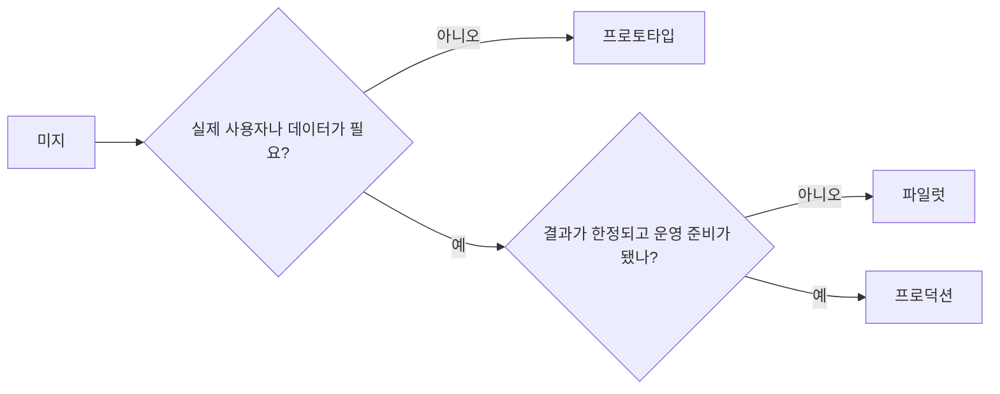

> 🇰🇷 이 문서는 한국어 번역본입니다(ELI5 스타일). 원문: [en.md](en.md)

# 프로토타입, 파일럿, 프로덕션 중 하나를 의도적으로 고르기

> 이 셋은 완성도 단계가 아니라 서로 다른 학습 환경입니다. 불필요한 결과의 심각성을 최소화하면서 현재의 미지를 답해 주는 단계를 고르세요.

**유형:** 학습 + 빌드
**언어:** Python (표준 라이브러리)
**선수 지식:** 페이즈 14 레슨 50~52
**시간:** 약 70분

## 학습 목표

- 미지의 문제, 대상, 데이터, 결과의 심각성, 준비 상태로부터 빌드 단계를 고릅니다.
- 단계별 제어 장치와 탈출 기준을 정의합니다.
- 프로토타입이 조용히 프로덕션(운영 환경) 시스템으로 변하는 것을 막습니다.
- 근거와 운영 준비가 정당해 줄 때까지 실제 권한 부여를 미룹니다.

## 서로 다른 세 가지 질문

| 단계 | 핵심 질문 |
|---|---|
| 프로토타입 | 이 메커니즘이 애초에 그 근거를 만들어 낼 수 있는가? |
| 파일럿 | 한정된 실제 대상과 실제 조건에서 안전하게 작동하는가? |
| 프로덕션 | 약속된 신뢰성과 리스크 수준을 조직이 계속 책임질 수 있는가? |

프로토타입은 기술적으로 완성됐어도 버릴 수 있는 물건일 수 있습니다. 파일럿은 프로덕션 데이터를 쓰면서도 대상과 권한은 제한된 채로 남을 수 있습니다. 조직이 지속적인 책임을 떠안는 순간이 프로덕션의 시작입니다.

## 프로토타입

미지의 문제가 실제 사용자나 실제 데이터를 요구하지 않을 때 프로토타입을 사용하세요. 다음을 유지하세요:

- 버릴 수 있음;
- 격리됨;
- 동작 범위가 좁음;
- 학습 질문이 명시적임;
- 가짜 운영 보장이 없음.

메커니즘이 다음 단계에 올 자격을 얻기 전에는 아키텍처를 최적화하지 마세요.

## 파일럿

미지의 문제가 실제 행동, 현실적인 데이터, 실제 워크플로를 요구하지만, 결과의 심각성이나 준비 상태가 아직 널리 출시하기와 맞지 않을 때 파일럿을 사용하세요.

파일럿에는 다음이 필요합니다:

- 이름이 붙은 대상 집단;
- 책임지는 사람;
- 한정된 기간과 권한;
- 감사(audit)와 롤백;
- 결과와 가드레일 기준선;
- 확대, 수정, 중단을 가리는 탈출 기준.

## 프로덕션

프로덕션에는 배포보다 더 많은 것이 필요합니다:

- 서비스 수준 목표(SLO);
- 당직 체계와 장애 소유권;
- 보안과 프라이버시 검토;
- 비용과 용량 통제;
- 롤백과 복구;
- 지속적인 모니터링;
- 은퇴(서비스 종료) 경로.



## 단계 표류(Stage Drift)

프로토타입 코드가 소유권 없이 사용자, 데이터, 권한을 얻게 되는 순간 위험해집니다. 프로토타입과 파일럿의 경계를 설정(configuration), 접근 제어, 텔레메트리, 문서에 표시해 두세요. 경고 배너 하나로는 부족합니다.

단계는 시스템 자체에서 관찰 가능해야 합니다.

## 직접 만들어 보기

이 실습은 결정 컨텍스트에서 단계를 고르고, 필요한 제어 장치를 돌려주고, `outputs/stage-decisions.json`에 기록합니다.

```bash
python3 code/main.py
python3 -m unittest discover code/tests -v
```

파일럿 예제를 "결과의 심각성이 낮고 운영 준비가 된 상태"로 바꿔 보세요. 프로덕션으로 넘어갈 자격을 주려면 어떤 추가 근거가 필요한지 설명해 보세요.

## 연습 문제

1. 현재 진행 중인 프로젝트 세 개를 배포 상태가 아니라 학습 단계로 분류해 보세요.
2. "중단" 결정을 포함하는 파일럿 탈출 기준을 적어 보세요.
3. 프로토타입이 프로덕션 데이터에 닿지 못하게 막는 기술적 제어 하나를 추가해 보세요.
4. 그 빌드를 프로덕션으로 만드는 첫 번째 운영 책임이 무엇인지 찾아 보세요.
5. 한정된 파일럿을 위한 롤백 영수증을 설계해 보세요.

## 더 읽을거리

- [Barry Boehm, A Spiral Model of Software Development and Enhancement](https://dl.acm.org/doi/10.1145/12944.12948) — 각 반복에서의 헌신을 해소된 리스크에 맞추는 방법을 다룹니다.
- [Fagerholm et al., Building Blocks for Continuous Experimentation](https://doi.org/10.1145/2601248.2601276) — 실험을 계속 돌리기 위해 필요한 조직적·기술적 조건을 다룹니다.

## 남는 산출물

`outputs/stage-decisions.json`을 남겨 두세요. 이 파일에는 각 단계가 왜 정당한지, 다음 단계로 가기 전에 어떤 제어가 존재해야 하는지가 기록됩니다.
