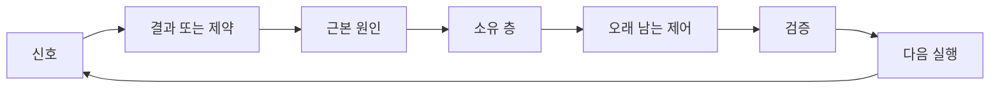

> 🇰🇷 이 문서는 한국어 번역본입니다(ELI5 스타일). 원문: [en.md](en.md)

# 소유권과 은퇴 조건이 있는 피드백 래칫 만들기

> 출시는 한쪽 빌드 루프를 닫고 학습 루프를 엽니다. 근거가 시스템을 바꾸지 못한다면, 그것은 아무도 소유하지 않는 텔레메트리 잔해가 될 뿐입니다.

**유형:** 학습 + 빌드
**언어:** Python (표준 라이브러리)
**선수 지식:** 페이즈 14 레슨 46과 53
**시간:** 약 75분

## 학습 목표

- 장애, 평가, 사용자 행동, 교정을 소유자가 있는 행동으로 바꿉니다.
- 각 신호를 컨텍스트, 평가, 정책, 런타임, 백로그 중 알맞은 곳으로 보냅니다.
- 심각도와 발생 빈도로 재발 항목의 우선순위를 정합니다.
- 모든 제어 장치에 은퇴 조건을 부여합니다.

## 피드백은 곧 인프라다

팀은 트레이스, 평가, 지원 티켓, 장애 로그를 수집하면서도 그중 아무것도 배우지 않을 수 있습니다. 빠진 것은 끌어올림(promotion)이라는 메커니즘입니다. 관찰에서 시작해, 소유자와 증거가 붙은 오래 남는 변화에 이르는 정의된 경로 말입니다.

루프는 이렇게 돕니다:

1. 구체적인 신호를 관찰한다;
2. 그 신호를 결과, 제약, 또는 가정과 연결한다;
3. 원인을 소유하는 가장 이른 시스템 층을 찾는다;
4. 범위가 정해진 변경을 만든다;
5. 재발 가능성이 실제로 낮아졌는지 검증한다;
6. 그 제어가 계속 남아야 하는지 검토한다.

## 소유 층으로 보내기

| 신호 | 목적지 |
|---|---|
| 거짓 양성, 회귀(regression), 잘못된 결과 | 평가 또는 테스트 |
| 빠진 컨텍스트, 중복 작업, 낡은 사실 | 컨텍스트 소스 또는 검색 경로 |
| 안전하지 않은 행동 또는 권한 공백 | 정책 또는 권한 경계 |
| 타임아웃, 재시도 폭풍, 접근 불가한 의존성 | 런타임 제어 |
| 새로운 제품 요구 또는 미해결 트레이드오프 | 다듬어 둔 백로그 항목 |

원인은 가장 이른 유효 층에서 고치세요. 테스트나 권한 설정으로 그 실패를 애초에 불가능하게 만들 수 있는데, 프롬프트에 문단 하나를 더 추가하지 마세요.



## 소유권은 제어의 일부다

모든 래칫 행동에는 다음이 필요합니다:

- 소유자 한 명;
- 결과의 심각성과 재발 빈도에 기반한 우선순위;
- 바꿀 산출물(아티팩트);
- 변경을 증명하는 검증;
- 검토 또는 만료 기간;
- 은퇴 조건.

소유자 없는 개선은 그저 포장이 조금 더 예쁜 관찰 기록입니다.

## 낡은 제어는 은퇴시켜라

피드백 시스템에는 정책이 쌓입니다. 그 정책은 모순덩어리가 되고 비용도 커질 수 있습니다. 다음 경우에는 제어를 검토하세요:

- 아키텍처나 워크플로가 바뀌었을 때;
- 더 낮은 층의 불변 조건이 더 높은 층의 지시를 대체했을 때;
- 보호하던 실패가 정해 둔 기간 동안 나타나지 않았을 때;
- 그 제어가 피해를 막는 것보다 정당한 작업을 막는 일이 더 잦을 때.

은퇴에도 근거가 필요합니다. 오래됐다는 느낌만으로 제어를 삭제하지 마세요.

## 빌드 피드백과 코딩 에이전트 피드백을 연결하라

같은 래칫이 두 트랙을 모두 섬깁니다:

- 제품 근거는 결과 프레임, 가정, 조각(slice), 측정 계획을 바꿉니다.
- 코딩 에이전트 교정은 테스트, 컨텍스트, 범위, 자동화, 인계를 바꿉니다.
- 장애는 제품 경계와 에이전트 작업대(workbench) 양쪽 모두를 바꿀 수 있습니다.

그렇기 때문에 빌드를 다듬는 일은 코딩 전에 끝나는 페이즈가 아닙니다. 받아들여지는 모든 변경을 통틀어 계속 이어집니다.

## 직접 만들어 보기

이 실습은 신호를 분류하고, 소유자가 있는 래칫 행동을 만들고, 우선순위를 매긴 뒤, `outputs/feedback-backlog.json`에 기록합니다.

```bash
python3 code/main.py
python3 -m unittest discover code/tests -v
```

런타임 타임아웃 신호를 추가하고, 일반 백로그가 아니라 런타임으로 라우팅되는지 확인해 보세요.

## 연습 문제

1. 장애 하나와 사용자 불만 하나를 래칫 행동으로 바꿔 보세요.
2. 각 재발을 막을 수 있는 가장 이른 층의 이름을 붙여 보세요.
3. 실습 출력에 검증 명령 또는 관찰을 추가해 보세요.
4. 정책 규칙 하나의 은퇴 조건을 정의해 보세요.
5. 받아들여진 교정 하나를 추적해서 다음 태스크 프레임까지 이어 보세요.

## 더 읽을거리

- [Basili, Caldiera, and Rombach, The Goal Question Metric Approach](https://www.cs.toronto.edu/~sme/CSC444F/handouts/GQM-paper.pdf) — 목표 지향적 측정을 통한 조직 학습을 다룹니다.
- [Fagerholm et al., Building Blocks for Continuous Experimentation](https://doi.org/10.1145/2601248.2601276) — 근거를 지속적인 제품 개발로 이어 주는 기술적·조직적 루프를 다룹니다.
- [Nuseibah and Easterbrook, Requirements Engineering: A Roadmap](https://www.cs.toronto.edu/~sme/papers/2000/ICSE2000.pdf) — 요구사항을 시스템 수명 주기 동안 진화하는 것으로 다루는 관점입니다.

## 남는 산출물

`outputs/feedback-backlog.json`을 남겨 두세요. 이 파일은 제품 판단과 출시(Product Judgment and Delivery) 경로의 마무리 산출물이자, 다음 결과 프레임의 입력입니다.
