> 🇰🇷 이 문서는 한국어 번역본입니다(ELI5 스타일). 원문: [en.md](en.md)

# 통신 프로토콜

> 같은 언어를 못 쓰는 에이전트들은 팀이 아닙니다. 그냥 허공에 대고 소리 지르는 낯선 사람들일 뿐이죠.

**유형:** 빌드
**언어:** TypeScript
**선수 지식:** 페이즈 14(에이전트 엔지니어링), 레슨 16.01(왜 멀티 에이전트인가)
**시간:** 약 120분

## 학습 목표

- MCP 도구 발견(discovery)과 호출을 구현해서, 에이전트가 외부 서버가 노출한 도구를 사용할 수 있게 만듭니다
- A2A 에이전트 카드와 태스크 엔드포인트를 만들어서, 한 에이전트가 HTTP로 다른 에이전트에게 작업을 위임할 수 있게 합니다
- MCP(도구 접근), A2A(에이전트 간 협업), ACP(엔터프라이즈 감사), ANP(탈중앙화 신뢰)를 비교하고, 어떤 프로토콜이 어떤 문제를 해결하는지 설명합니다
- 에이전트가 MCP로 도구를 발견하고 A2A로 태스크를 위임하는, 여러 프로토콜이 한 시스템 안에서 함께 돌아가는 구조를 만듭니다

## 문제 상황

시스템을 여러 에이전트로 쪼갰다고 합시다. 리서처, 코더, 리뷰어가 있고, 각자 맡은 일은 잘합니다. 하지만 이제 이들이 실제로 서로 대화해야 합니다.

가장 먼저 떠오르는 방법은 뻔하죠. 문자열을 주고받는 겁니다. 리서처가 텍스트 덩어리를 반환하면 코더가 되는 대로 파싱하는 거죠. 코더가 리서치 요약을 잘못 해석하거나, 두 에이전트가 서로를 기다리며 교착 상태에 빠지거나, 다른 팀이 만든 에이전트끼리 협업해야 하는 순간까지는 잘 돌아갑니다. 그러면 "그냥 문자열 주고받자"는 방식이 무너집니다.

이게 바로 통신 프로토콜 문제입니다. 에이전트들이 정보를 주고받는 방식에 대한 공유된 약속(계약)이 없으면, 멀티 에이전트 시스템은 잘 깨지고, 감사도 안 되고, 여러분이 직접 작성한 소수의 에이전트 이상으로 확장하는 것 자체가 불가능합니다.

AI 생태계는 이 문제를 서로 다른 조각씩 해결하는 네 가지 프로토콜로 답했습니다:

- **MCP** — 도구 접근용
- **A2A** — 에이전트 간 협업용
- **ACP** — 엔터프라이즈 감사(감사 가능성)용
- **ANP** — 탈중앙화 신원과 신뢰용

이 레슨은 깊게 들어갑니다. 각 스펙의 실제 와이어 포맷(wire format, 네트워크에서 오가는 메시지의 실제 형식)을 읽고, 동작하는 구현체를 만들고, 네 가지를 하나로 묶은 통합 시스템까지 연결해 봅니다.

## 개념

### 프로토콜 지형

이 네 가지 프로토콜을 각각 다른 질문에 답하는 층이라고 생각해 봅시다:

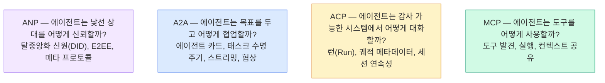

이들은 경쟁 관계가 아닙니다. 서로 다른 수준에서 서로 다른 문제를 풉니다.

### MCP (복습)

MCP는 페이즈 13에서 깊게 다뤘습니다. 짧게 복습하면: MCP는 LLM이 외부 도구와 데이터 소스에 연결되는 방식을 표준화합니다. 에이전트(클라이언트)가 서버가 노출한 도구를 발견하고 호출하는 **클라이언트-서버** 프로토콜이죠.

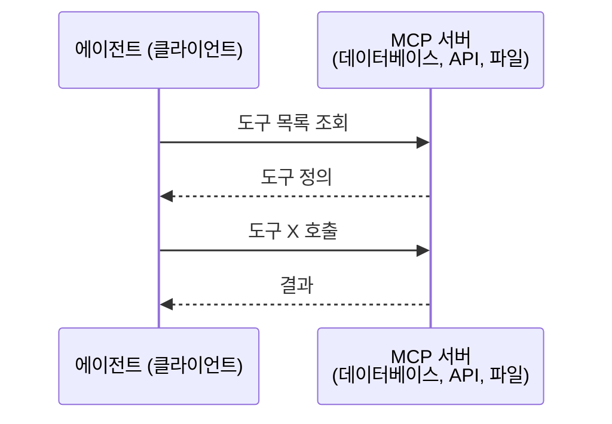

MCP는 **에이전트-도구** 통신입니다. 에이전트끼리 대화하는 데는 도움이 되지 않습니다.

### A2A (Agent2Agent 프로토콜)

**만든 곳:** Google (현재는 Linux Foundation 산하, `lf.a2a.v1`)
**스펙 버전:** 1.0.0
**해결하는 문제:** 자율적인 에이전트들이 서로 협업하고, 협상하고, 태스크를 위임하려면 어떻게 해야 할까?

A2A는 **에이전트 간 P2P 협업**을 위한 프로토콜입니다. MCP가 에이전트를 도구에 연결한다면, A2A는 에이전트를 다른 에이전트에 연결합니다. 각 에이전트는 잘 알려진 URL에 **에이전트 카드(Agent Card)**를 게시하고, 다른 에이전트들이 이를 발견하고, 협상하고, 태스크를 위임합니다.

#### A2A 동작 방식

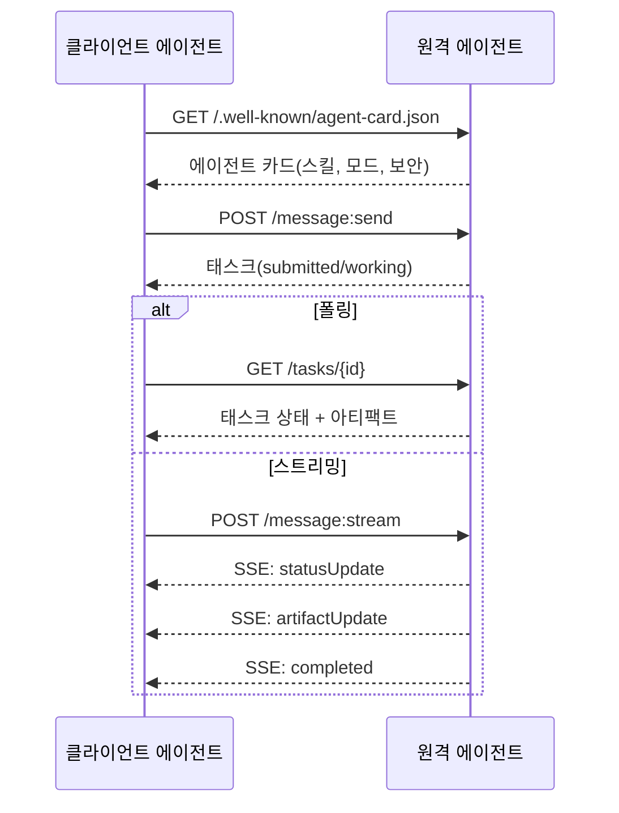

#### 실제 에이전트 카드

실제 세상에서 쓰이는 A2A 에이전트 카드의 모습입니다. `GET /.well-known/agent-card.json`으로 서빙됩니다:

```json
{
  "name": "Research Agent",
  "description": "Searches documentation and summarizes findings",
  "version": "1.0.0",
  "supportedInterfaces": [
    {
      "url": "https://research-agent.example.com/a2a/v1",
      "protocolBinding": "JSONRPC",
      "protocolVersion": "1.0"
    },
    {
      "url": "https://research-agent.example.com/a2a/rest",
      "protocolBinding": "HTTP+JSON",
      "protocolVersion": "1.0"
    }
  ],
  "provider": {
    "organization": "Your Company",
    "url": "https://example.com"
  },
  "capabilities": {
    "streaming": true,
    "pushNotifications": false
  },
  "defaultInputModes": ["text/plain", "application/json"],
  "defaultOutputModes": ["text/plain", "application/json"],
  "skills": [
    {
      "id": "web-research",
      "name": "Web Research",
      "description": "Searches the web and synthesizes findings",
      "tags": ["research", "search", "summarization"],
      "examples": ["Research the latest changes in React 19"]
    },
    {
      "id": "doc-analysis",
      "name": "Documentation Analysis",
      "description": "Reads and analyzes technical documentation",
      "tags": ["docs", "analysis"],
      "inputModes": ["text/plain", "application/pdf"],
      "outputModes": ["application/json"]
    }
  ],
  "securitySchemes": {
    "bearer": {
      "httpAuthSecurityScheme": {
        "scheme": "Bearer",
        "bearerFormat": "JWT"
      }
    }
  },
  "security": [{ "bearer": [] }]
}
```

주목할 점:
- **스킬(Skills)**은 에이전트가 할 수 있는 일입니다. 각 스킬은 ID, 태그, 지원하는 입력/출력 MIME 타입을 가집니다. 클라이언트 에이전트가 이 원격 에이전트가 내 요청을 처리할 수 있는지 판단하는 근거입니다.
- **supportedInterfaces**는 여러 프로토콜 바인딩을 나열합니다. 하나의 에이전트가 JSON-RPC, REST, gRPC를 동시에 말할 수 있습니다.
- **보안**은 카드에 내장되어 있습니다. 클라이언트는 요청을 단 하나 보내기도 전에 어떤 인증이 필요한지 알 수 있습니다.

#### 태스크 수명 주기

태스크는 A2A에서 작업의 핵심 단위입니다. 정의된 상태들을 거쳐 움직입니다:

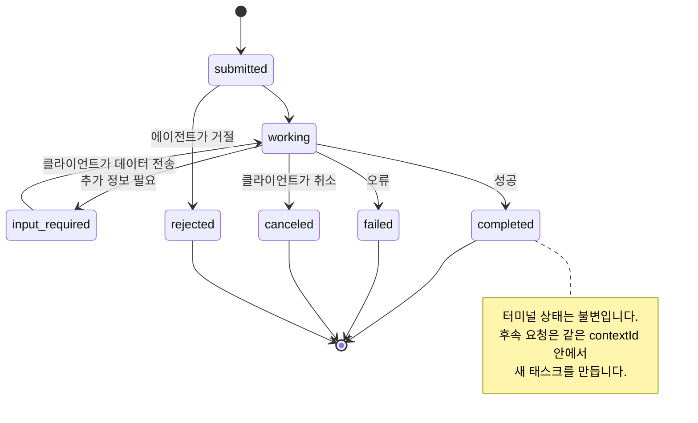

8개 상태 모두 (스펙은 센티널 값인 `UNSPECIFIED`도 정의하지만 여기서는 생략했습니다):

| 상태 | 터미널 상태인가? | 의미 |
|---|---|---|
| `TASK_STATE_SUBMITTED` | 아니오 | 접수됨, 아직 처리 전 |
| `TASK_STATE_WORKING` | 아니오 | 현재 처리 중 |
| `TASK_STATE_INPUT_REQUIRED` | 아니오 | 에이전트가 클라이언트에게 추가 정보 필요 |
| `TASK_STATE_AUTH_REQUIRED` | 아니오 | 인증 필요 |
| `TASK_STATE_COMPLETED` | 예 | 성공적으로 완료 |
| `TASK_STATE_FAILED` | 예 | 오류로 종료 |
| `TASK_STATE_CANCELED` | 예 | 완료 전에 취소됨 |
| `TASK_STATE_REJECTED` | 예 | 에이전트가 태스크를 거절 |

태스크가 터미널 상태에 도달하면 불변입니다. 더 이상 메시지를 받지 않죠. 후속 요청은 같은 `contextId` 안에서 새 태스크를 만듭니다.

#### 와이어 포맷

A2A는 JSON-RPC 2.0을 사용합니다. 실제 메시지 교환은 이렇게 생겼습니다:

**클라이언트가 태스크를 보냅니다:**
```json
{
  "jsonrpc": "2.0",
  "id": 1,
  "method": "SendMessage",
  "params": {
    "message": {
      "messageId": "msg-001",
      "role": "ROLE_USER",
      "parts": [{ "text": "Research React 19 compiler features" }]
    },
    "configuration": {
      "acceptedOutputModes": ["text/plain", "application/json"],
      "historyLength": 10
    }
  }
}
```

**에이전트가 태스크로 응답합니다:**
```json
{
  "jsonrpc": "2.0",
  "id": 1,
  "result": {
    "task": {
      "id": "task-abc-123",
      "contextId": "ctx-xyz-789",
      "status": {
        "state": "TASK_STATE_COMPLETED",
        "timestamp": "2026-03-27T10:30:00Z"
      },
      "artifacts": [
        {
          "artifactId": "art-001",
          "name": "research-results",
          "parts": [{
            "data": {
              "findings": [
                "React 19 compiler auto-memoizes components",
                "No more manual useMemo/useCallback needed",
                "Compiler runs at build time, not runtime"
              ]
            },
            "mediaType": "application/json"
          }]
        }
      ]
    }
  }
}
```

**SSE로 스트리밍:**
```text
POST /message:stream HTTP/1.1
Content-Type: application/json
A2A-Version: 1.0

data: {"task":{"id":"task-123","status":{"state":"TASK_STATE_WORKING"}}}

data: {"statusUpdate":{"taskId":"task-123","status":{"state":"TASK_STATE_WORKING","message":{"role":"ROLE_AGENT","parts":[{"text":"Searching documentation..."}]}}}}

data: {"artifactUpdate":{"taskId":"task-123","artifact":{"artifactId":"art-1","parts":[{"text":"partial findings..."}]},"append":true,"lastChunk":false}}

data: {"statusUpdate":{"taskId":"task-123","status":{"state":"TASK_STATE_COMPLETED"}}}
```

### ACP (Agent Communication Protocol)

**만든 곳:** IBM / BeeAI
**스펙 버전:** 0.2.0 (OpenAPI 3.1.1)
**상태:** Linux Foundation 아래에서 A2A로 통합되는 중
**해결하는 문제:** 에이전트들이 완전한 감사 가능성, 세션 연속성, 궤적(trajectory) 추적을 갖추고 통신하려면 어떻게 해야 할까?

ACP는 **엔터프라이즈 프로토콜**입니다. 많은 요약 글이 주장하는 것과 달리, ACP는 JSON-LD를 사용하지 **않습니다**. OpenAPI로 정의된 아주 단순 명료한 REST/JSON API죠. ACP를 특별하게 만드는 건 **TrajectoryMetadata**입니다. 모든 에이전트 응답이 자신을 만들어낸 추론 단계와 도구 호출의 상세 로그를 함께 실을 수 있습니다.

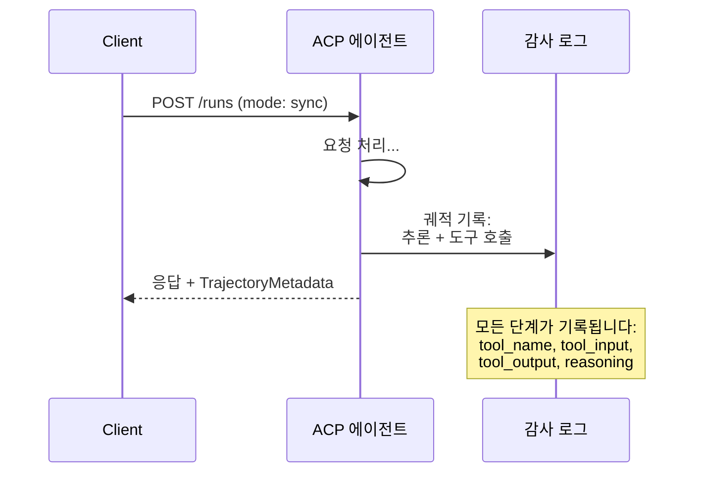

#### ACP에서의 에이전트 발견

ACP는 네 가지 발견 방법을 정의합니다:

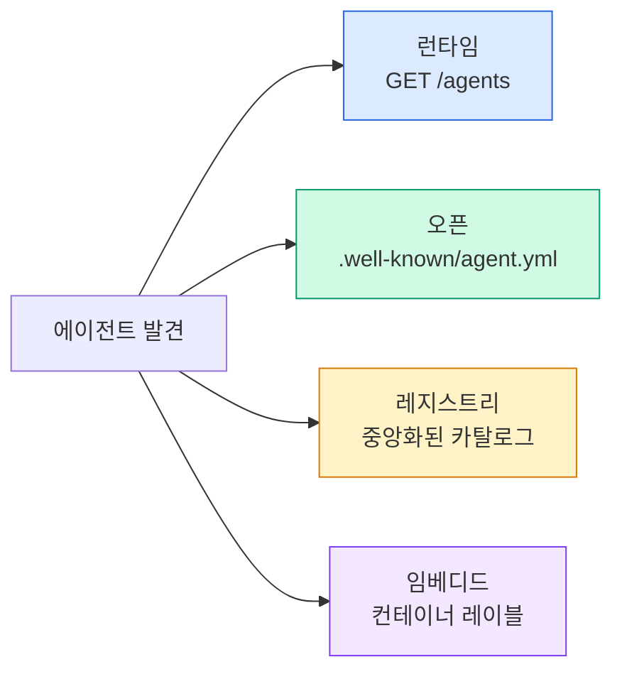

**에이전트 매니페스트(AgentManifest)**는 A2A의 에이전트 카드보다 단순합니다:

```json
{
  "name": "summarizer",
  "description": "Summarizes documents with source citations",
  "input_content_types": ["text/plain", "application/pdf"],
  "output_content_types": ["text/plain", "application/json"],
  "metadata": {
    "tags": ["summarization", "RAG"],
    "framework": "BeeAI",
    "capabilities": [
      {
        "name": "Document Summarization",
        "description": "Condenses long documents into key points"
      }
    ],
    "recommended_models": ["llama3.3:70b-instruct-fp16"],
    "license": "Apache-2.0",
    "programming_language": "Python"
  }
}
```

#### 런(Run) 수명 주기

ACP는 "태스크" 대신 "런(Run)"을 사용합니다. 런은 세 가지 모드를 가진 에이전트 실행입니다:

| 모드 | 동작 |
|---|---|
| `sync` | 블로킹. 응답에 완전한 결과가 담깁니다. |
| `async` | 즉시 202를 반환합니다. `GET /runs/{id}`로 상태를 폴링합니다. |
| `stream` | SSE 스트림. 에이전트가 작동하는 대로 이벤트가 발생합니다. |

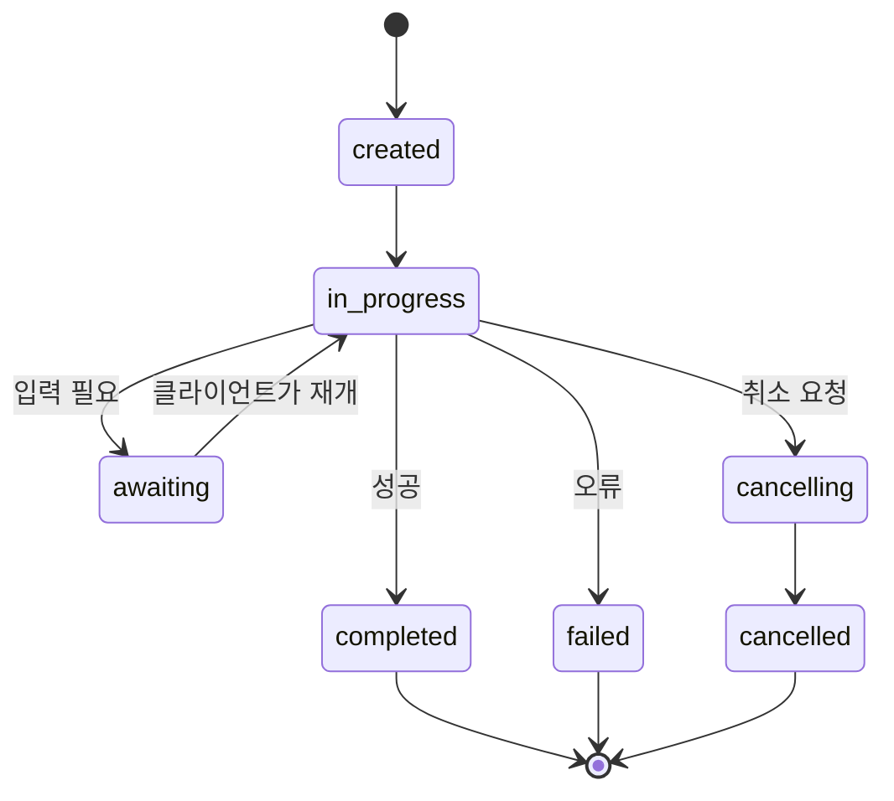

#### TrajectoryMetadata (감사 기록)

이것이 ACP의 핵심 차별점입니다. 모든 메시지 파트는 에이전트가 정확히 무엇을 했는지 보여주는 메타데이터를 포함할 수 있습니다:

```json
{
  "role": "agent/researcher",
  "parts": [
    {
      "content_type": "text/plain",
      "content": "The weather in San Francisco is 72F and sunny.",
      "metadata": {
        "kind": "trajectory",
        "message": "I need to check the weather for this location",
        "tool_name": "weather_api",
        "tool_input": { "location": "San Francisco, CA" },
        "tool_output": { "temperature": 72, "condition": "sunny" }
      }
    }
  ]
}
```

규제 산업에서는 이게 금과옥석입니다. 모든 답변에 검증 가능한 추론 사슬이 따라옵니다: 어떤 도구가 호출됐고, 어떤 입력이 쓰였고, 어떤 출력이 돌아왔는지. 블랙박스가 없습니다.

ACP는 출처 표기를 위한 **CitationMetadata**도 지원합니다:

```json
{
  "kind": "citation",
  "start_index": 0,
  "end_index": 47,
  "url": "https://weather.gov/sf",
  "title": "NWS San Francisco Forecast"
}
```

### ANP (Agent Network Protocol)

**만든 곳:** 오픈소스 커뮤니티 (GaoWei Chang이 창설)
**저장소:** [github.com/agent-network-protocol/AgentNetworkProtocol](https://github.com/agent-network-protocol/AgentNetworkProtocol)
**해결하는 문제:** 서로 다른 조직의 에이전트들이 중앙 권위 없이 서로를 신뢰하려면 어떻게 해야 할까?

ANP는 **탈중앙화 신원 프로토콜**입니다. W3C 탈중앙화 식별자(DID)와 종단 간 암호화(E2EE)로 신뢰를 만듭니다. 알려진 엔드포인트를 통해 에이전트를 발견하는 A2A와 달리, ANP는 에이전트가 자신의 신원을 암호학적으로 증명하게 합니다.

ANP는 세 개의 층으로 이뤄집니다:

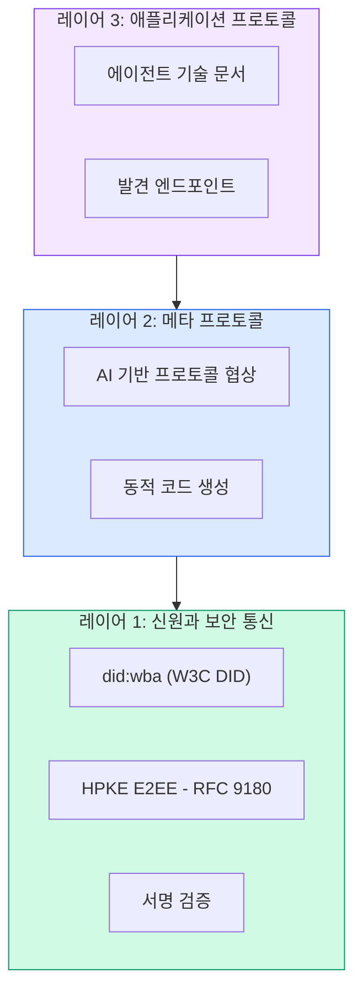

#### DID 문서 (실제 구조)

ANP는 `did:wba`(Web-Based Agent)라는 커스텀 DID 메서드를 사용합니다. DID `did:wba:example.com:user:alice`는 `https://example.com/user/alice/did.json`으로 해석(resolve)됩니다:

```json
{
  "@context": [
    "https://www.w3.org/ns/did/v1",
    "https://w3id.org/security/suites/jws-2020/v1",
    "https://w3id.org/security/suites/secp256k1-2019/v1"
  ],
  "id": "did:wba:example.com:user:alice",
  "verificationMethod": [
    {
      "id": "did:wba:example.com:user:alice#key-1",
      "type": "EcdsaSecp256k1VerificationKey2019",
      "controller": "did:wba:example.com:user:alice",
      "publicKeyJwk": {
        "crv": "secp256k1",
        "x": "NtngWpJUr-rlNNbs0u-Aa8e16OwSJu6UiFf0Rdo1oJ4",
        "y": "qN1jKupJlFsPFc1UkWinqljv4YE0mq_Ickwnjgasvmo",
        "kty": "EC"
      }
    },
    {
      "id": "did:wba:example.com:user:alice#key-x25519-1",
      "type": "X25519KeyAgreementKey2019",
      "controller": "did:wba:example.com:user:alice",
      "publicKeyMultibase": "z9hFgmPVfmBZwRvFEyniQDBkz9LmV7gDEqytWyGZLmDXE"
    }
  ],
  "authentication": [
    "did:wba:example.com:user:alice#key-1"
  ],
  "keyAgreement": [
    "did:wba:example.com:user:alice#key-x25519-1"
  ],
  "humanAuthorization": [
    "did:wba:example.com:user:alice#key-1"
  ],
  "service": [
    {
      "id": "did:wba:example.com:user:alice#agent-description",
      "type": "AgentDescription",
      "serviceEndpoint": "https://example.com/agents/alice/ad.json"
    }
  ]
}
```

주목할 점:
- **키 분리**가 강제됩니다. 서명 키(secp256k1)와 암호화 키(X25519)가 분리되어 있습니다.
- **`humanAuthorization`**은 ANP 고유의 것입니다. 이 키들은 사용 전에 명시적인 사람의 승인(생체 인증, 비밀번호, HSM)을 요구합니다. 자금 이체 같은 고위험 작업이 이 경로를 거칩니다.
- **`keyAgreement`** 키는 HPKE 종단 간 암호화(RFC 9180)에 사용됩니다.
- **service** 섹션은 에이전트 기술(Agent Description) 문서로 연결됩니다.

#### ANP에서 신뢰가 동작하는 방식

ANP는 웹 오브 트러스트(web-of-trust)나 추천 그래프를 사용하지 **않습니다**. 신뢰는 양측 간에 성립하며 상호작용마다 검증됩니다:

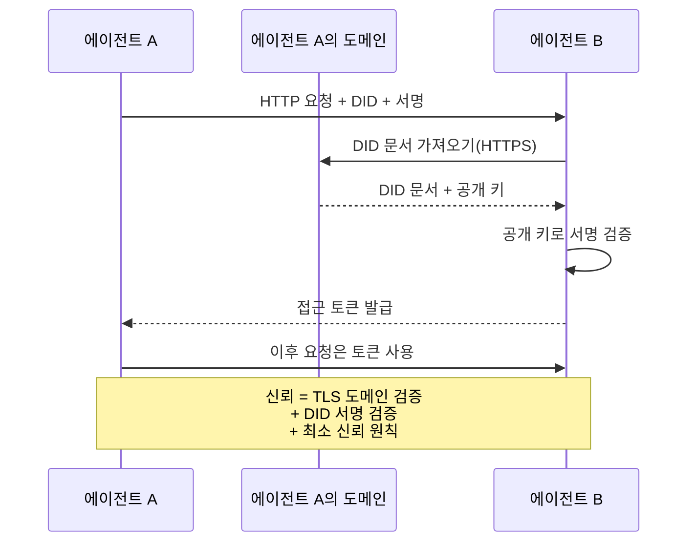

신뢰는 세 곳에서 옵니다:
1. **도메인 수준 TLS**가 DID 문서 호스트를 검증합니다
2. **DID 암호학적 서명**이 에이전트의 신원을 검증합니다
3. **최소 신뢰 원칙**이 최소한의 권한만 부여합니다

평판 기반 신뢰 전파나 PageRank 점수 같은 건 없습니다. 각 에이전트를 DID로 직접 검증합니다.

#### 메타 프로토콜 협상

이것이 ANP의 가장 참신한 기능입니다. 서로 다른 생태계의 두 에이전트가 만났을 때, 사전에 합의된 데이터 포맷이 필요 없습니다. 자연어로 협상합니다:

```json
{
  "action": "protocolNegotiation",
  "sequenceId": 0,
  "candidateProtocols": "I can communicate using:\n1. JSON-RPC with hotel booking schema\n2. REST with OpenAPI 3.1 spec\n3. Natural language over HTTP",
  "modificationSummary": "Initial proposal",
  "status": "negotiating"
}
```

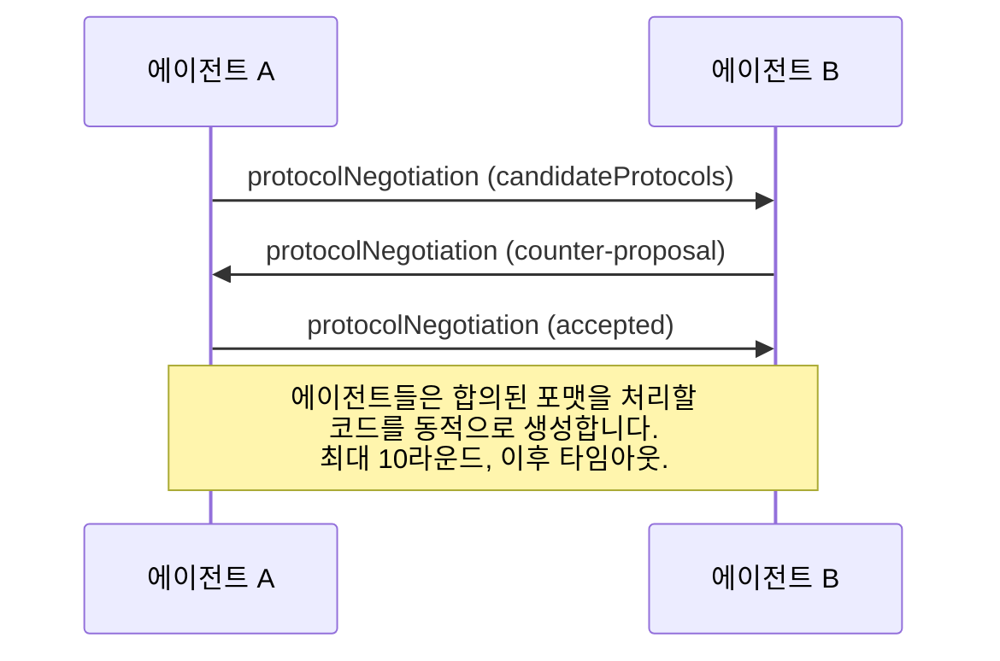

에이전트들은 포맷에 합의할 때까지(최대 10라운드) 주고받은 다음, 그 포맷을 처리할 코드를 동적으로 생성합니다. 상태 값: `negotiating`, `rejected`, `accepted`, `timeout`.

즉, 한 번도 본 적 없는 두 에이전트도 누군가 공유 스키마를 미리 정의해두지 않아도 서로 소통하는 방법을 알아낼 수 있다는 뜻입니다.

### 비교 (교정판)

| | MCP | A2A | ACP | ANP |
|---|---|---|---|---|
| **만든 곳** | Anthropic | Google / Linux Foundation | IBM / BeeAI | 커뮤니티 |
| **스펙 포맷** | JSON-RPC | JSON-RPC / REST / gRPC | OpenAPI 3.1 (REST) | JSON-RPC |
| **주 용도** | 에이전트 → 도구 | 에이전트 → 에이전트 | 에이전트 → 에이전트 | 에이전트 → 에이전트 |
| **발견** | 도구 목록 조회 | `/.well-known/agent-card.json` | `GET /agents`, `/.well-known/agent.yml` | `/.well-known/agent-descriptions`, DID 서비스 엔드포인트 |
| **신원** | 암묵적(로컬) | 보안 스킴(OAuth, mTLS) | 서버 수준 | E2EE를 갖춘 W3C DID(`did:wba`) |
| **감사 기록** | 해당 없음 | 기본(태스크 이력) | TrajectoryMetadata(도구 호출, 추론) | 공식적으로 명시되지 않음 |
| **상태 머신** | 해당 없음 | 태스크 상태 9개 | 런 상태 7개 | 해당 없음 |
| **스트리밍** | 해당 없음 | SSE | SSE | 전송 계층 비종속 |
| **고유 기능** | 도구 스키마 | 에이전트 카드 + 스킬 | 궤적 감사 기록 | 메타 프로토콜 협상 |
| **가장 적합한 곳** | 도구와 데이터 | 동적 협업 | 규제 산업 | 조직 간 신뢰 |
| **상태** | 안정 | 안정(v1.0) | A2A로 통합 중 | 활발한 개발 중 |

### 이들이 함께 동작하는 방식

이 프로토콜들은 서로 배타적이지 않습니다. 현실적인 엔터프라이즈 시스템은 여러 개를 함께 씁니다:

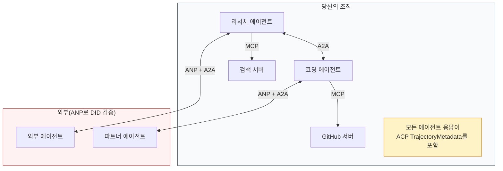

- **MCP**는 각 에이전트를 도구에 연결합니다
- **A2A**는 에이전트 간 협업(내부 및 외부)을 처리합니다
- **ACP**는 감사 가능성을 위해 응답을 궤적 메타데이터로 감쌉니다
- **ANP**는 여러분이 통제하지 않는 에이전트의 신원 검증을 제공합니다

```figure
swarm-message-bus
```

## 만들기

### 단계 1: 핵심 메시지 타입

모든 멀티 에이전트 시스템은 메시지 포맷에서 시작합니다. 실제 프로토콜이 사용하는 것에 대응하는 타입을 정의합니다:

```typescript
import crypto from "node:crypto";

type MessageRole = "user" | "agent";

type MessagePart =
  | { kind: "text"; text: string }
  | { kind: "data"; data: unknown; mediaType: string }
  | { kind: "file"; name: string; url: string; mediaType: string };

type TrajectoryEntry = {
  reasoning: string;
  toolName?: string;
  toolInput?: unknown;
  toolOutput?: unknown;
  timestamp: number;
};

type AgentMessage = {
  id: string;
  role: MessageRole;
  parts: MessagePart[];
  trajectory?: TrajectoryEntry[];
  replyTo?: string;
  timestamp: number;
};

function createMessage(
  role: MessageRole,
  parts: MessagePart[],
  replyTo?: string
): AgentMessage {
  return {
    id: crypto.randomUUID(),
    role,
    parts,
    replyTo,
    timestamp: Date.now(),
  };
}

function textMessage(role: MessageRole, text: string): AgentMessage {
  return createMessage(role, [{ kind: "text", text }]);
}
```

주목할 점: `MessagePart`는 실제 A2A와 ACP 스펙처럼 멀티모달(텍스트, 구조화된 데이터, 파일)입니다. `TrajectoryEntry`는 추론 사슬을 담아서 ACP의 TrajectoryMetadata에 대응합니다.

### 단계 2: A2A 에이전트 카드와 레지스트리

실제 A2A 스펙에 맞는 에이전트 발견을 만듭니다:

```typescript
type Skill = {
  id: string;
  name: string;
  description: string;
  tags: string[];
  inputModes: string[];
  outputModes: string[];
};

type AgentCard = {
  name: string;
  description: string;
  version: string;
  url: string;
  capabilities: {
    streaming: boolean;
    pushNotifications: boolean;
  };
  defaultInputModes: string[];
  defaultOutputModes: string[];
  skills: Skill[];
};

class AgentRegistry {
  private cards: Map<string, AgentCard> = new Map();

  register(card: AgentCard) {
    this.cards.set(card.name, card);
  }

  discoverBySkillTag(tag: string): AgentCard[] {
    return [...this.cards.values()].filter((card) =>
      card.skills.some((skill) => skill.tags.includes(tag))
    );
  }

  discoverByInputMode(mimeType: string): AgentCard[] {
    return [...this.cards.values()].filter(
      (card) =>
        card.defaultInputModes.includes(mimeType) ||
        card.skills.some((skill) => skill.inputModes.includes(mimeType))
    );
  }

  resolve(name: string): AgentCard | undefined {
    return this.cards.get(name);
  }

  listAll(): AgentCard[] {
    return [...this.cards.values()];
  }
}
```

이건 단순한 이름-기능 맵보다 훨씬 풍부합니다. 실제 A2A 스펙이 지원하듯, 스킬 태그로, 입력 MIME 타입으로, 또는 이름으로 에이전트를 발견할 수 있습니다.

### 단계 3: A2A 태스크 수명 주기

전체 태스크 상태 머신을 만듭니다:

```typescript
type TaskState =
  | "submitted"
  | "working"
  | "input-required"
  | "auth-required"
  | "completed"
  | "failed"
  | "canceled"
  | "rejected";

const TERMINAL_STATES: TaskState[] = [
  "completed",
  "failed",
  "canceled",
  "rejected",
];

type TaskStatus = {
  state: TaskState;
  message?: AgentMessage;
  timestamp: number;
};

type Artifact = {
  id: string;
  name: string;
  parts: MessagePart[];
};

type Task = {
  id: string;
  contextId: string;
  status: TaskStatus;
  artifacts: Artifact[];
  history: AgentMessage[];
};

type TaskEvent =
  | { kind: "statusUpdate"; taskId: string; status: TaskStatus }
  | {
      kind: "artifactUpdate";
      taskId: string;
      artifact: Artifact;
      append: boolean;
      lastChunk: boolean;
    };

type TaskHandler = (
  task: Task,
  message: AgentMessage
) => AsyncGenerator<TaskEvent>;

class TaskManager {
  private tasks: Map<string, Task> = new Map();
  private handlers: Map<string, TaskHandler> = new Map();
  private listeners: Map<string, ((event: TaskEvent) => void)[]> = new Map();

  registerHandler(agentName: string, handler: TaskHandler) {
    this.handlers.set(agentName, handler);
  }

  subscribe(taskId: string, listener: (event: TaskEvent) => void) {
    const existing = this.listeners.get(taskId) ?? [];
    existing.push(listener);
    this.listeners.set(taskId, existing);
  }

  async sendMessage(
    agentName: string,
    message: AgentMessage,
    contextId?: string
  ): Promise<Task> {
    const handler = this.handlers.get(agentName);
    if (!handler) {
      const task = this.createTask(contextId);
      task.status = {
        state: "rejected",
        timestamp: Date.now(),
        message: textMessage("agent", `No handler for ${agentName}`),
      };
      return task;
    }

    const task = this.createTask(contextId);
    task.history.push(message);
    task.status = { state: "submitted", timestamp: Date.now() };

    this.processTask(task, handler, message).catch((err) => {
      task.status = {
        state: "failed",
        timestamp: Date.now(),
        message: textMessage("agent", String(err)),
      };
    });
    return task;
  }

  getTask(taskId: string): Task | undefined {
    return this.tasks.get(taskId);
  }

  cancelTask(taskId: string): boolean {
    const task = this.tasks.get(taskId);
    if (!task || TERMINAL_STATES.includes(task.status.state)) return false;
    task.status = { state: "canceled", timestamp: Date.now() };
    this.emit(taskId, {
      kind: "statusUpdate",
      taskId,
      status: task.status,
    });
    return true;
  }

  private createTask(contextId?: string): Task {
    const task: Task = {
      id: crypto.randomUUID(),
      contextId: contextId ?? crypto.randomUUID(),
      status: { state: "submitted", timestamp: Date.now() },
      artifacts: [],
      history: [],
    };
    this.tasks.set(task.id, task);
    return task;
  }

  private async processTask(
    task: Task,
    handler: TaskHandler,
    message: AgentMessage
  ) {
    task.status = { state: "working", timestamp: Date.now() };
    this.emit(task.id, {
      kind: "statusUpdate",
      taskId: task.id,
      status: task.status,
    });

    try {
      for await (const event of handler(task, message)) {
        if (TERMINAL_STATES.includes(task.status.state)) break;

        if (event.kind === "statusUpdate") {
          task.status = event.status;
        }
        if (event.kind === "artifactUpdate") {
          const existing = task.artifacts.find(
            (a) => a.id === event.artifact.id
          );
          if (existing && event.append) {
            existing.parts.push(...event.artifact.parts);
          } else {
            task.artifacts.push(event.artifact);
          }
        }
        this.emit(task.id, event);
      }
    } catch (err) {
      task.status = {
        state: "failed",
        timestamp: Date.now(),
        message: textMessage("agent", String(err)),
      };
      this.emit(task.id, {
        kind: "statusUpdate",
        taskId: task.id,
        status: task.status,
      });
    }
  }

  private emit(taskId: string, event: TaskEvent) {
    for (const listener of this.listeners.get(taskId) ?? []) {
      listener(event);
    }
  }
}
```

이 코드는 실제 A2A 태스크 수명 주기를 구현합니다: submitted, working, input-required, 터미널 상태. 핸들러는 SSE 스트리밍 모델에 맞춰 이벤트(상태 업데이트와 아티팩트 청크)를 내보내는 비동기 제너레이터입니다.

### 단계 4: ACP 스타일 감사 기록

통신을 궤적 추적으로 감쌉니다:

```typescript
type AuditEntry = {
  runId: string;
  agentName: string;
  input: AgentMessage[];
  output: AgentMessage[];
  trajectory: TrajectoryEntry[];
  status: "created" | "in-progress" | "completed" | "failed" | "awaiting";
  startedAt: number;
  completedAt?: number;
  sessionId?: string;
};

class AuditableRunner {
  private log: AuditEntry[] = [];
  private handlers: Map<
    string,
    (input: AgentMessage[]) => Promise<{
      output: AgentMessage[];
      trajectory: TrajectoryEntry[];
    }>
  > = new Map();

  registerAgent(
    name: string,
    handler: (input: AgentMessage[]) => Promise<{
      output: AgentMessage[];
      trajectory: TrajectoryEntry[];
    }>
  ) {
    this.handlers.set(name, handler);
  }

  async run(
    agentName: string,
    input: AgentMessage[],
    sessionId?: string
  ): Promise<AuditEntry> {
    const entry: AuditEntry = {
      runId: crypto.randomUUID(),
      agentName,
      input: structuredClone(input),
      output: [],
      trajectory: [],
      status: "created",
      startedAt: Date.now(),
      sessionId,
    };
    this.log.push(entry);

    const handler = this.handlers.get(agentName);
    if (!handler) {
      entry.status = "failed";
      return entry;
    }

    entry.status = "in-progress";
    try {
      const result = await handler(input);
      entry.output = structuredClone(result.output);
      entry.trajectory = structuredClone(result.trajectory);
      entry.status = "completed";
      entry.completedAt = Date.now();
    } catch (err) {
      entry.status = "failed";
      entry.trajectory.push({
        reasoning: `Error: ${String(err)}`,
        timestamp: Date.now(),
      });
      entry.completedAt = Date.now();
    }
    return entry;
  }

  getFullAuditLog(): AuditEntry[] {
    return structuredClone(this.log);
  }

  getAuditLogForAgent(agentName: string): AuditEntry[] {
    return structuredClone(
      this.log.filter((e) => e.agentName === agentName)
    );
  }

  getAuditLogForSession(sessionId: string): AuditEntry[] {
    return structuredClone(
      this.log.filter((e) => e.sessionId === sessionId)
    );
  }

  getTrajectoryForRun(runId: string): TrajectoryEntry[] {
    const entry = this.log.find((e) => e.runId === runId);
    return entry ? structuredClone(entry.trajectory) : [];
  }
}
```

모든 에이전트 실행은 완전한 감사 엔트리를 남깁니다: 무엇이 들어갔고, 무엇이 나왔고, 그 사이의 도구 호출과 추론 단계의 완전한 궤적. 에이전트별로, 세션별로, 또는 개별 런별로 조회할 수 있습니다.

### 단계 5: ANP 스타일 신원 검증

DID 기반 신원과 검증을 만듭니다:

```typescript
type VerificationMethod = {
  id: string;
  type: string;
  controller: string;
  publicKeyDer: string;
};

type DIDDocument = {
  id: string;
  verificationMethod: VerificationMethod[];
  authentication: string[];
  keyAgreement: string[];
  humanAuthorization: string[];
  service: { id: string; type: string; serviceEndpoint: string }[];
};

type AgentIdentity = {
  did: string;
  document: DIDDocument;
  privateKey: crypto.KeyObject;
  publicKey: crypto.KeyObject;
};

class IdentityRegistry {
  private documents: Map<string, DIDDocument> = new Map();

  publish(doc: DIDDocument) {
    this.documents.set(doc.id, doc);
  }

  resolve(did: string): DIDDocument | undefined {
    return this.documents.get(did);
  }

  verify(did: string, signature: string, payload: string): boolean {
    const doc = this.documents.get(did);
    if (!doc) return false;

    const authKeyIds = doc.authentication;
    const authKeys = doc.verificationMethod.filter((vm) =>
      authKeyIds.includes(vm.id)
    );

    for (const key of authKeys) {
      const publicKey = crypto.createPublicKey({
        key: Buffer.from(key.publicKeyDer, "base64"),
        format: "der",
        type: "spki",
      });
      const isValid = crypto.verify(
        null,
        Buffer.from(payload),
        publicKey,
        Buffer.from(signature, "hex")
      );
      if (isValid) return true;
    }
    return false;
  }

  requiresHumanAuth(did: string, operationKeyId: string): boolean {
    const doc = this.documents.get(did);
    if (!doc) return false;
    return doc.humanAuthorization.includes(operationKeyId);
  }
}

function createIdentity(domain: string, agentName: string): AgentIdentity {
  const did = `did:wba:${domain}:agent:${agentName}`;
  const { publicKey, privateKey } = crypto.generateKeyPairSync("ed25519");

  const publicKeyDer = publicKey
    .export({ format: "der", type: "spki" })
    .toString("base64");

  const keyId = `${did}#key-1`;
  const encKeyId = `${did}#key-x25519-1`;

  const document: DIDDocument = {
    id: did,
    verificationMethod: [
      {
        id: keyId,
        type: "Ed25519VerificationKey2020",
        controller: did,
        publicKeyDer,
      },
      {
        id: encKeyId,
        type: "X25519KeyAgreementKey2019",
        controller: did,
        publicKeyDer,
      },
    ],
    authentication: [keyId],
    keyAgreement: [encKeyId],
    humanAuthorization: [],
    service: [
      {
        id: `${did}#agent-description`,
        type: "AgentDescription",
        serviceEndpoint: `https://${domain}/agents/${agentName}/ad.json`,
      },
    ],
  };

  return { did, document, privateKey, publicKey };
}

function signPayload(identity: AgentIdentity, payload: string): string {
  return crypto
    .sign(null, Buffer.from(payload), identity.privateKey)
    .toString("hex");
}
```

이 코드는 실제 ANP 신원 모델을 반영합니다: 에이전트는 인증 키, 키 합의 키, 사람 승인 키가 분리된 DID 문서를 가집니다. `IdentityRegistry`는 DID 해석을 시뮬레이션합니다(실제 프로덕션(운영 환경)에서는 에이전트의 도메인으로 HTTP 요청을 보내는 방식이 됩니다).

### 단계 6: 프로토콜 게이트웨이

네 프로토콜 모두를 하나의 통합 시스템으로 연결합니다:

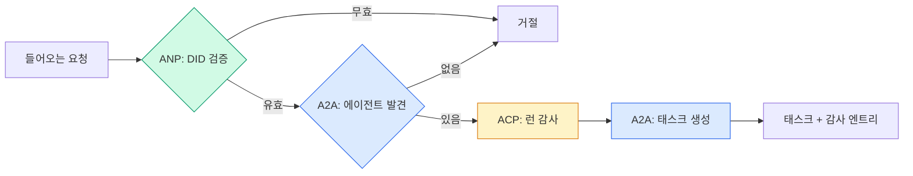

```typescript
class ProtocolGateway {
  private registry: AgentRegistry;
  private taskManager: TaskManager;
  private auditRunner: AuditableRunner;
  private identityRegistry: IdentityRegistry;

  constructor(
    registry: AgentRegistry,
    taskManager: TaskManager,
    auditRunner: AuditableRunner,
    identityRegistry: IdentityRegistry
  ) {
    this.registry = registry;
    this.taskManager = taskManager;
    this.auditRunner = auditRunner;
    this.identityRegistry = identityRegistry;
  }

  async delegateTask(
    fromDid: string,
    signature: string,
    targetAgent: string,
    message: AgentMessage,
    sessionId?: string
  ): Promise<{ task: Task; audit: AuditEntry } | { error: string }> {
    if (!this.identityRegistry.verify(fromDid, signature, message.id)) {
      return { error: "Identity verification failed" };
    }

    const card = this.registry.resolve(targetAgent);
    if (!card) {
      return { error: `Agent ${targetAgent} not found in registry` };
    }

    const audit = await this.auditRunner.run(
      targetAgent,
      [message],
      sessionId
    );
    const task = await this.taskManager.sendMessage(targetAgent, message);

    return { task, audit };
  }

  discoverAndDelegate(
    fromDid: string,
    signature: string,
    skillTag: string,
    message: AgentMessage
  ): Promise<{ task: Task; audit: AuditEntry } | { error: string }> {
    const candidates = this.registry.discoverBySkillTag(skillTag);
    if (candidates.length === 0) {
      return Promise.resolve({
        error: `No agents found with skill tag: ${skillTag}`,
      });
    }
    return this.delegateTask(
      fromDid,
      signature,
      candidates[0].name,
      message
    );
  }
}
```

게이트웨이는 한 번의 호출로 네 가지를 합니다:
1. **ANP**: DID 서명으로 호출자의 신원을 검증합니다
2. **A2A**: 대상 에이전트를 발견하고 기능을 확인합니다
3. **ACP**: 실행을 궤적이 포함된 감사 기록으로 감쌉니다
4. **A2A**: 전체 수명 주기 추적이 되는 태스크를 생성합니다

### 단계 7: 전부 연결하기

```typescript
async function protocolDemo() {
  const registry = new AgentRegistry();
  registry.register({
    name: "researcher",
    description: "Searches and summarizes findings",
    version: "1.0.0",
    url: "https://researcher.local/a2a/v1",
    capabilities: { streaming: true, pushNotifications: false },
    defaultInputModes: ["text/plain"],
    defaultOutputModes: ["text/plain", "application/json"],
    skills: [
      {
        id: "web-research",
        name: "Web Research",
        description: "Searches the web",
        tags: ["research", "search", "summarization"],
        inputModes: ["text/plain"],
        outputModes: ["application/json"],
      },
    ],
  });
  registry.register({
    name: "coder",
    description: "Writes code from specs",
    version: "1.0.0",
    url: "https://coder.local/a2a/v1",
    capabilities: { streaming: false, pushNotifications: false },
    defaultInputModes: ["text/plain", "application/json"],
    defaultOutputModes: ["text/plain"],
    skills: [
      {
        id: "code-gen",
        name: "Code Generation",
        description: "Generates code",
        tags: ["coding", "generation"],
        inputModes: ["text/plain", "application/json"],
        outputModes: ["text/plain"],
      },
    ],
  });

  const taskManager = new TaskManager();
  const auditRunner = new AuditableRunner();

  const researchTrajectory: TrajectoryEntry[] = [];

  taskManager.registerHandler(
    "researcher",
    async function* (task, message) {
      yield {
        kind: "statusUpdate" as const,
        taskId: task.id,
        status: { state: "working" as const, timestamp: Date.now() },
      };

      researchTrajectory.push({
        reasoning: "Searching for React 19 documentation",
        toolName: "web_search",
        toolInput: { query: "React 19 compiler features" },
        toolOutput: {
          results: ["react.dev/blog/react-19", "github.com/react/react"],
        },
        timestamp: Date.now(),
      });

      researchTrajectory.push({
        reasoning: "Extracting key findings from search results",
        toolName: "doc_analysis",
        toolInput: { url: "react.dev/blog/react-19" },
        toolOutput: {
          summary:
            "React 19 compiler auto-memoizes, no manual useMemo needed",
        },
        timestamp: Date.now(),
      });

      yield {
        kind: "artifactUpdate" as const,
        taskId: task.id,
        artifact: {
          id: crypto.randomUUID(),
          name: "research-results",
          parts: [
            {
              kind: "data" as const,
              data: {
                findings: [
                  "React 19 compiler auto-memoizes components",
                  "No more manual useMemo/useCallback needed",
                  "Compiler runs at build time, not runtime",
                ],
                sources: ["react.dev/blog/react-19"],
              },
              mediaType: "application/json",
            },
          ],
        },
        append: false,
        lastChunk: true,
      };

      yield {
        kind: "statusUpdate" as const,
        taskId: task.id,
        status: { state: "completed" as const, timestamp: Date.now() },
      };
    }
  );

  auditRunner.registerAgent("researcher", async () => ({
    output: [
      textMessage("agent", "React 19 compiler auto-memoizes components"),
    ],
    trajectory: researchTrajectory,
  }));

  const identityRegistry = new IdentityRegistry();

  const coderIdentity = createIdentity("coder.local", "coder");
  const researcherIdentity = createIdentity("researcher.local", "researcher");

  identityRegistry.publish(coderIdentity.document);
  identityRegistry.publish(researcherIdentity.document);

  const gateway = new ProtocolGateway(
    registry,
    taskManager,
    auditRunner,
    identityRegistry
  );

  console.log("=== Protocol Demo ===\n");

  console.log("1. Agent Discovery (A2A)");
  const researchAgents = registry.discoverBySkillTag("research");
  console.log(
    `   Found ${researchAgents.length} agent(s):`,
    researchAgents.map((a) => a.name)
  );

  console.log("\n2. Identity Verification (ANP)");
  const message = textMessage("user", "Research React 19 compiler features");
  const signature = signPayload(coderIdentity, message.id);
  const verified = identityRegistry.verify(
    coderIdentity.did,
    signature,
    message.id
  );
  console.log(`   Coder DID: ${coderIdentity.did}`);
  console.log(`   Signature verified: ${verified}`);

  console.log("\n3. Task Delegation (A2A + ACP + ANP)");
  const result = await gateway.delegateTask(
    coderIdentity.did,
    signature,
    "researcher",
    message,
    "session-001"
  );

  if ("error" in result) {
    console.log(`   Error: ${result.error}`);
    return;
  }

  console.log(`   Task ID: ${result.task.id}`);
  console.log(`   Task state: ${result.task.status.state}`);
  console.log(`   Artifacts: ${result.task.artifacts.length}`);

  console.log("\n4. Audit Trail (ACP)");
  console.log(`   Run ID: ${result.audit.runId}`);
  console.log(`   Status: ${result.audit.status}`);
  console.log(`   Trajectory steps: ${result.audit.trajectory.length}`);
  for (const step of result.audit.trajectory) {
    console.log(`     - ${step.reasoning}`);
    if (step.toolName) {
      console.log(`       Tool: ${step.toolName}`);
    }
  }

  console.log("\n5. Full Audit Log");
  const fullLog = auditRunner.getFullAuditLog();
  console.log(`   Total runs: ${fullLog.length}`);
  for (const entry of fullLog) {
    const duration = entry.completedAt
      ? `${entry.completedAt - entry.startedAt}ms`
      : "in-progress";
    console.log(`   ${entry.agentName}: ${entry.status} (${duration})`);
  }
}

protocolDemo().catch((err) => {
  console.error("Protocol demo failed:", err);
  process.exitCode = 1;
});
```

## 무엇이 잘못되나

프로토콜은 문제없는 정상 경로(해피 패스)를 풀어줍니다. 프로덕션에서 깨지는 것들은 다음과 같습니다:

**스키마 드리프트(schema drift).** 에이전트 A가 `application/json` 출력을 내놓는다고 에이전트 카드에 광고합니다. 그런데 버전 사이에 JSON 스키마가 바뀝니다. 에이전트 B는 옛 포맷으로 파싱하다 쓰레기를 얻습니다. 해결책: 스킬과 출력 스키마에 버전을 붙이세요. A2A 스펙이 에이전트 카드에 `version` 필드를 둔 이유가 바로 이것입니다.

**상태 머신 위반.** 에이전트 핸들러가 `completed` 이벤트를 내보낸 뒤 아티팩트를 더 내보내려 합니다. 태스크는 불변입니다. 코드는 업데이트를 조용히 버리거나 예외를 던집니다. 해결책: 이벤트를 내보내기 전에 터미널 상태인지 확인하세요. 위의 `TaskManager`는 터미널 상태 이후 `break`로 이를 강제합니다.

**신뢰 해석 실패.** 에이전트 A가 에이전트 B의 DID를 검증하려는데, B의 도메인이 다운되어 있습니다. DID 문서를 가져올 수 없죠. 이때 실패를 열어둘까요(검증 안 된 에이전트 수용), 닫을까요(전부 거절)? ANP는 최소 신뢰 원칙과 함께 실패 시 닫는 것(fail closed)을 권장합니다.

**궤적 비대화.** ACP 궤적 로깅은 강력하지만 비용이 큽니다. 런당 도구 호출을 200번 하는 복잡한 에이전트는 어마어마한 감사 엔트리를 만듭니다. 해결책: 궤적을 설정 가능한 상세 수준으로 기록하세요. 규제 준수를 위해서는 도구 이름과 입출력을 기록하고, 규제 대상이 아닌 워크로드에서는 추론 단계를 생략합니다.

**발견 썬더링 헤드(thundering herd).** 에이전트 50개가 시작 시점에 `GET /agents`를 동시에 조회합니다. 해결책: TTL이 있는 에이전트 카드 캐시, 발견 간격 분산, 또는 폴링 대신 푸시 기반 등록을 사용하세요.

## 사용하기

### 실제 구현체

**A2A**가 가장 성숙합니다. Google의 [공식 스펙](https://github.com/google/A2A)은 Linux Foundation 아래 오픈소스입니다. Python과 TypeScript용 SDK도 있죠. 에이전트가 동적 발견과 협업을 해야 한다면 여기서 시작하세요.

**ACP**는 A2A로 통합되는 중입니다. IBM의 [BeeAI 프로젝트](https://github.com/i-am-bee/acp)가 REST 우선 대안으로 ACP를 만들었지만, 궤적 메타데이터 개념은 A2A 생태계로 흡수되고 있습니다. 전송 수단으로 A2A를 쓰더라도 ACP 패턴(궤적 로깅, 런 수명 주기)은 쓰세요.

**ANP**가 가장 실험적입니다. [커뮤니티 저장소](https://github.com/agent-network-protocol/AgentNetworkProtocol)에는 Python SDK(AgentConnect)가 있습니다. 메타 프로토콜 협상 개념은 진짜 참신합니다. 조직 간 에이전트 배포가 관심 있다면 지켜볼 가치가 있습니다.

**MCP**는 페이즈 13에서 이미 다뤘습니다. 에이전트가 도구를 쓰게 하고 싶다면 MCP가 표준입니다.

### 올바른 프로토콜 고르기

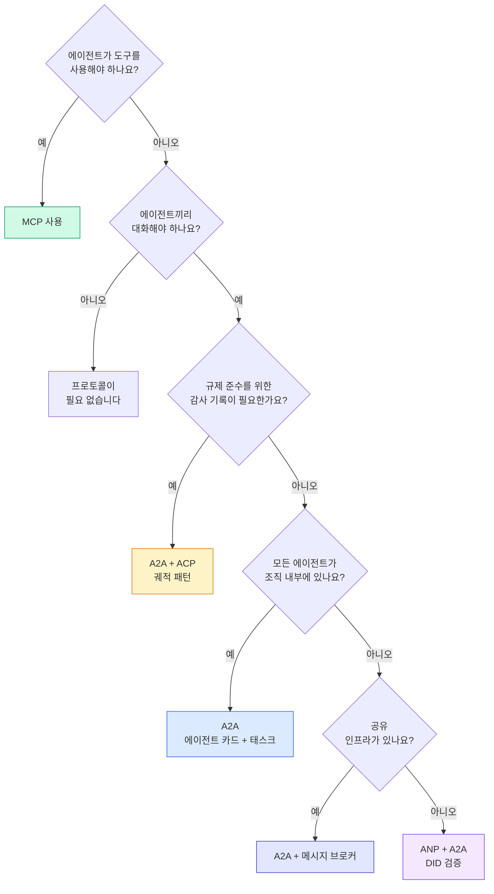

## 출시하기

이 레슨이 만드는 산출물:
- `code/main.ts` -- 네 프로토콜 패턴 모두의 완전한 구현
- `outputs/prompt-protocol-selector.md` -- 시스템에 맞는 프로토콜을 고르도록 돕는 프롬프트

## 연습 문제

1. **멀티홉 태스크 위임.** `TaskManager`를 확장해서 에이전트 핸들러가 다른 에이전트에게 하위 태스크를 위임할 수 있게 만들어 보세요. 리서처가 태스크를 받으면 "검색"과 "요약" 하위 태스크를 두 전문 에이전트에게 위임하고, 둘 다 완료되길 기다린 다음 결과를 자신의 아티팩트로 병합합니다.

2. **스트리밍 감사 기록.** `AuditableRunner`가 스트리밍 모드를 지원하도록 고쳐 보세요. 전체 결과를 기다리는 대신, 궤적 엔트리가 추가되는 대로 `AuditEntry` 업데이트를 실시간으로 내보냅니다. 감사 스냅샷을 만들어 내는 비동기 제너레이터를 사용하세요.

3. **DID 로테이션.** `IdentityRegistry`에 키 로테이션을 추가해 보세요. 에이전트는 키를 갱신한 새 DID 문서를 게시하면서도 `previousDid` 참조를 유지할 수 있어야 합니다. 검증자는 유예 기간 동안 현재 키와 이전 키 양쪽의 서명을 모두 받아들여야 합니다.

4. **프로토콜 협상.** ANP의 메타 프로토콜 개념을 구현해 보세요. 두 에이전트가 후보 포맷을 담은 `protocolNegotiation` 메시지를 주고받습니다(예: "JSON-RPC로 말할 수 있어요" vs "REST를 선호해요"). 최대 3라운드 후에 포맷에 합의하거나 타임아웃됩니다. 합의된 포맷이 어느 `TaskManager`나 `AuditableRunner`를 쓸지 결정합니다.

5. **속도 제한 발견.** 설정 가능한 TTL로 에이전트 카드 조회를 캐시하고, 에이전트별 초당 발견 질의 수를 제한하는 `RateLimitedRegistry` 래퍼를 추가해 보세요. 시작 시점에 서로를 발견하는 에이전트 100개의 썬더링 헤드를 시뮬레이션하고 그 차이를 측정해 보세요.

## 핵심 용어

| 용어 | 사람들이 말하는 것 | 실제 의미 |
|------|----------------|----------------------|
| MCP | "AI 도구용 프로토콜" | 에이전트가 도구를 발견하고 사용하기 위한 클라이언트-서버 프로토콜. 에이전트-도구 간 통신이지 에이전트-에이전트가 아닙니다. |
| A2A | "구글의 에이전트 프로토콜" | Linux Foundation 아래에서 에이전트 협업을 위한 P2P 프로토콜. 에이전트 카드로 발견, 9단계 태스크 수명 주기, SSE 스트리밍. JSON-RPC, REST, gRPC 바인딩 지원. |
| ACP | "엔터프라이즈 에이전트 메시징" | IBM/BeeAI의 에이전트 런용 REST API로, TrajectoryMetadata 제공: 모든 응답이 추론과 도구 호출의 완전한 사슬을 실어 나릅니다. A2A로 통합 중. |
| ANP | "탈중앙화 에이전트 신원" | `did:wba`(DID)로 암호학적 신원을 만들고, HPKE로 E2EE를, 그리고 한 번도 만난 적 없는 에이전트를 위한 AI 기반 메타 프로토콜 협상을 제공하는 커뮤니티 프로토콜. |
| Agent Card | "에이전트의 명함" | `/.well-known/agent-card.json`에 있는 JSON 문서로, 스킬, 지원 MIME 타입, 보안 스킴, 프로토콜 바인딩을 기술합니다. |
| DID | "탈중앙화 ID" | 에이전트 자신의 도메인에 호스팅되는, 암호학적으로 검증 가능한 신원의 W3C 표준. ANP는 `did:wba` 메서드를 사용합니다. |
| TrajectoryMetadata | "감사 영수증" | 추론 단계, 도구 호출, 그 입출력을 모든 에이전트 응답에 붙이는 ACP의 메커니즘. |
| Meta-protocol | "에이전트들이 대화 방식을 협상" | 에이전트가 자연어로 데이터 포맷을 동적으로 합의한 뒤, 그 포맷을 처리할 코드를 생성하는 ANP의 접근법. |
| Task | "작업 단위" | 제출부터 완료까지의 작업을 추적하는 A2A의 상태 저장 객체. 터미널 상태에 도달하면 불변입니다. |

## 더 읽을거리

- [Google A2A 스펙](https://github.com/google/A2A) -- 공식 스펙과 SDK(v1.0.0, Linux Foundation)
- [IBM/BeeAI ACP 스펙](https://github.com/i-am-bee/acp) -- 에이전트 런과 궤적 메타데이터를 위한 OpenAPI 3.1 스펙
- [Agent Network Protocol](https://github.com/agent-network-protocol/AgentNetworkProtocol) -- DID 기반 신원, E2EE, 메타 프로토콜 협상
- [Model Context Protocol 문서](https://modelcontextprotocol.io/) -- Anthropic의 MCP 스펙(페이즈 13에서 다룸)
- [W3C Decentralized Identifiers](https://www.w3.org/TR/did-core/) -- ANP의 기반이 되는 신원 표준
- [RFC 9180 (HPKE)](https://www.rfc-editor.org/rfc/rfc9180) -- ANP가 E2EE에 쓰는 암호화 방식
- [FIPA Agent Communication Language](http://www.fipa.org/specs/fipa00061/SC00061G.html) -- 현대 에이전트 프로토콜의 학술적 선조
