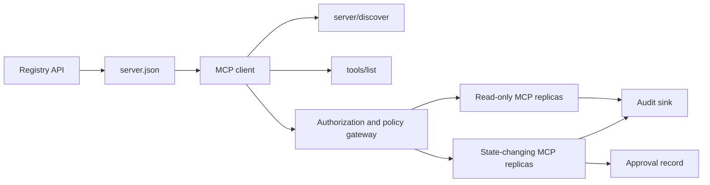

> 🇰🇷 이 문서는 한국어 번역본입니다(ELI5 스타일). 원문: [en.md](en.md)

# 캡스톤 13: 레지스트리와 거버넌스를 갖춘 상태 비저장(stateless) MCP 서버

> 프로덕션(운영 환경) MCP는 서버 프로세스 하나가 아닙니다. 계약의 연쇄입니다: 공개 가능한 메타데이터, 실시간 디스커버리, 상태 비저장 요청 봉투(envelope), 인가(authorization), 정책, 감사, 배포 증거가 그것입니다.

**유형:** 캡스톤
**언어:** Python 및 TypeScript 참조 모델; 프로덕션 언어는 자유
**선수 지식:** 페이즈 11, 페이즈 13, 페이즈 14, 페이즈 17, 페이즈 18
**필수 MCP 심화 레슨:** [레슨 28: 도구 계약](../../../13-tools-and-protocols/28-mcp-tool-contracts-and-content/docs/en.md), [레슨 29: 신뢰성](../../../13-tools-and-protocols/29-mcp-reliability-cancellation-and-flow-control/docs/en.md), [레슨 30: 레지스트리 공급망](../../../13-tools-and-protocols/30-mcp-registry-supply-chain-and-drift/docs/en.md), [레슨 31: 적합성 운영](../../../13-tools-and-protocols/31-mcp-conformance-versioning-and-operations/docs/en.md)
**프로토콜 대상:** MCP `2026-07-28`
**소요 시간:** 약 25시간

## 학습 목표

- 상태 비저장 MCP 요청·결과 봉투를 구현합니다.
- 레지스트리 메타데이터를 실시간 프로토콜 디스커버리와 분리해 유지합니다.
- 결정론적이고 캐시를 인식하는 도구 디스커버리를 만듭니다.
- 모든 도구 호출에 발급자(issuer), 대상(audience), 범위(scope), 승인 정책을 강제합니다.
- 세션 친화성(session affinity) 없이 Streamable HTTP를 배포합니다.
- 회선(wire), 인가, 정책, 레지스트리, 감사 경계에서 동작을 증명합니다.

## 필수 MCP 선수 학습 경로

이 캡스톤을 프로덕션 수준이라 부르기 전에, 링크된 네 개의 페이즈 13 레슨을 순서대로 완료하세요:

1. [레슨 28](../../../13-tools-and-protocols/28-mcp-tool-contracts-and-content/docs/en.md)은 이 서버가 노출해야 하는 도구, 스키마, 콘텐츠, 페이지네이션, 완성(completion), 라우팅, 오류 계약을 정의합니다.
2. [레슨 29](../../../13-tools-and-protocols/29-mcp-reliability-cancellation-and-flow-control/docs/en.md)는 취소 경쟁(race), 기한(deadline), 멱등성, 배압(backpressure), 재시도, 재연결 동작을 정의합니다.
3. [레슨 30](../../../13-tools-and-protocols/30-mcp-registry-supply-chain-and-drift/docs/en.md)은 네임스페이스, 출처(provenance), 어드미션 핀(admission pin), 레지스트리 상태, 드리프트, 원장(ledger), 롤백 증거를 정의합니다.
4. [레슨 31](../../../13-tools-and-protocols/31-mcp-conformance-versioning-and-operations/docs/en.md)은 골든 및 부정(negative) 전사(transcript), 엄격한 버전 시대, SDK 차등 검사, 프록시 증명, 삭제(redaction), 헬스, 릴리스 게이팅을 정의합니다.

캡스톤은 이 산출물들을 통합합니다. 하나의 해피패스 SDK 테스트로 대체하지 않습니다.

## 문제

내부 플랫폼에는 읽기 전용 데이터 도구와 소수의 상태 변경 도구가 필요합니다. 개발자는 서버를 발견(discover)하고, 연결 방법을 이해하고, 실시간 기능(capabilities)을 들여다보고, 자신이 인가받은 연산만 호출할 수 있어야 합니다.

어려운 부분은 함수를 등록하는 게 아닙니다. 어려운 부분은 여섯 가지 서로 다른 진실을 맞춰 놓는 것입니다:

1. `server.json`은 서버를 어디에 설치하거나 도달할 수 있는지 말합니다.
2. `server/discover`는 살아 있는 프로세스가 지금 무엇을 지원하는지 말합니다.
3. 모든 요청은 자신이 쓰는 프로토콜 개정판과 클라이언트 기능을 말합니다.
4. 인가는 호출자를 올바른 발급자, 리소스, 범위에 묶습니다.
5. 정책은 이 특정 작업이 실행될 수 있는지 결정합니다.
6. 감사 증거는 비밀이나 민감한 페이로드를 새지 않고 무엇이 경계를 넘었는지 기록합니다.

이 중 하나라도 어긋나면, 플랫폼은 도달할 수 없는 서버를 목록에 올리거나, 호환되지 않는 클라이언트를 라우팅하거나, 다른 리소스를 위해 발행된 토큰을 받아들이거나, 기대했던 검토 없이 파괴적인 작업을 노출할 수 있습니다.

## 두 개의 디스커버리 레이어

레지스트리와 실시간 MCP 서버는 서로 다른 질문에 답합니다.

| 레이어 | 계약 | 답하는 질문 |
|---|---|---|
| 공개(publication) | `server.json`과 레지스트리 API | 이 서버는 무엇이고, 패키지나 원격 엔드포인트는 어디에 있고, 어떻게 설정하는가? |
| 런타임 | `server/discover` | 이 프로세스는 어떤 프로토콜 버전, 기능, 확장, 서버 신원을 지원하는가? |

공식 레지스트리는 버전이 붙은 `server.json` 스키마를 씁니다. 원격 항목은 Streamable HTTP URL을 이름 지을 수 있습니다:

```json
{
  "$schema": "https://static.modelcontextprotocol.io/schemas/2025-12-11/server.schema.json",
  "name": "com.example/internal-readonly",
  "title": "Internal Read-Only Tools",
  "description": "Read-only incident and data lookup tools.",
  "version": "1.0.0",
  "remotes": [
    {
      "type": "streamable-http",
      "url": "https://mcp.internal.example.com/readonly"
    }
  ]
}
```

레지스트리 스키마 버전과 MCP 프로토콜 개정판은 서로 독립입니다. 한쪽 날짜를 다른 쪽에 맞춰 고쳐 쓰지 마세요. 각 문서는 자기 계약에 맞춰 검증합니다.

스키마가 유효하다고 네임스페이스 소유까지 증명되지는 않습니다. `example.com`으로 검증된 퍼블리셔는 역방향 DNS 네임스페이스 `com.example/*` 또는 그 자식 네임스페이스를 씁니다. 레지스트리 인증 흐름이 그 소유를 증명합니다. 도메인 라벨을 평범한 순서에서 벗어나게 배치하면 전혀 다른 네임스페이스를 가리키게 됩니다.

표준 라이브러리 모델의 `validate_registry_document` 함수는 의도적으로 부분 원격 프로필 검증기입니다. 공식 필수 필드인 `name`, `description`, `version`; 선택 필드인 `title`; 공개 이름과 길이 제약; 구체적(concrete) 버전 형태; 그리고 각 `streamable-http` 또는 `sse` 원격의 HTTP(S) URL 형태를 검사합니다. 추가로 비어 있지 않은 `remotes` 목록을 요구하는데, 이 캡스톤은 항상 원격을 실시간으로 프로브하기 때문입니다. `validate_publisher_namespace`는 별도로 이름을 검증된 퍼블리셔 도메인과 대조하고, `validate_runtime_alignment`은 공개 이름과 버전을 실시간 `serverInfo`와 비교합니다. 공식 스키마는 패키지 전용 레코드와 더 많은 원격 필드도 지원합니다. 공개 전에 핀으로 고정한 공식 JSON Schema나 `mcp-publisher`로 문서 전체를 검증하세요. 이 의존성 없는 부분 집합을 전체 스키마 검증으로 내보이지 마세요.

서버는 `server/discover`를 구현해야 하며, 클라이언트는 다른 메서드보다 먼저 이를 호출할 수 있습니다. 이 캡스톤의 클라이언트는 엔드포인트를 확인한 뒤에 호출하고, 현재 프로토콜 개정판과 실시간 기능을 받습니다:

```json
{
  "resultType": "complete",
  "supportedVersions": ["2026-07-28"],
  "capabilities": {
    "tools": {
      "listChanged": false
    }
  },
  "_meta": {
    "io.modelcontextprotocol/serverInfo": {
      "name": "com.example/internal-readonly",
      "version": "1.0.0"
    }
  },
  "ttlMs": 3600000,
  "cacheScope": "public"
}
```

비공개 카탈로그는 소유권, 검토, 수명 주기 데이터를 추가로 색인할 수 있지만, 그 데이터를 MCP 회선 필드나 `server.json` 루트 필드로 만들어 내면 안 됩니다. 조직 정책은 공개 레코드 옆에 저장하세요. 공개 커스텀 메타데이터가 꼭 필요하면 레지스트리의 `_meta.io.modelcontextprotocol.registry/publisher-provided` 확장을 쓰고 4 KB 한도 안에 머무세요.

## 상태 비저장 MCP 코어

MCP 개정판 `2026-07-28`은 프로토콜 세션과 `initialize` / `notifications/initialized` 핸드셰이크를 제거했습니다. `Mcp-Session-Id`도 제거했습니다.

모든 요청은 `params._meta`에 프로토콜 컨텍스트를 실어 나릅니다:

```json
{
  "io.modelcontextprotocol/protocolVersion": "2026-07-28",
  "io.modelcontextprotocol/clientCapabilities": {},
  "io.modelcontextprotocol/clientInfo": {
    "name": "internal-platform-client",
    "version": "1.0.0"
  }
}
```

버전과 기능은 연결의 속성이 아니라 요청의 속성입니다. 로드 밸런서는 연속된 요청을 서로 다른 정상 복제본에 보낼 수 있습니다. 어느 복제본이든 메시지 자체에서 요청을 검증할 수 있기 때문입니다.

일반 결과는 `resultType: "complete"`를 포함합니다. 서버는 매 결과의 `_meta.io.modelcontextprotocol/serverInfo`에 자기 신원을 넣어야 합니다. 프로토콜 버전이 없거나 문자열이 아니면 잘못된 파라미터 `-32602`입니다. 오류 `-32022`는 제공된 문자열이 지원되지 않을 때만 쓰이며, 데이터로 정확히 `{"supported": ["2026-07-28"], "requested": "..."}`를 담아야 합니다.

### 캐시 가능한 디스커버리

`tools/list`는 같은 유효 도구 집합에 대해 결정론적이어야 합니다. 결과에는 다음이 포함됩니다:

- `ttlMs`, 클라이언트를 위한 신선도 힌트;
- `cacheScope`, `public` 또는 `private`;
- 안정적인 도구 순서, 덕분에 동일한 목록은 프롬프트 캐시를 재사용할 수 있습니다;
- `resultType: "complete"`와 서버 신원 메타데이터.

사용자별 인가는 보통 `cacheScope: "private"`를 만들어 냅니다. 사용자별 도구 가시성을 공유 public 캐시 뒤에 두지 마세요.

## Streamable HTTP

네트워크 서버는 POST를 받아들이는 하나의 MCP 엔드포인트를 노출합니다. 각 JSON-RPC 요청이나 알림(notification)은 자기만의 POST를 받습니다.

요청에 대해 서버는 JSON 객체 하나 또는 그 요청에 한정된 SSE 스트림을 돌려줍니다. 수명이 긴 `subscriptions/listen` 요청은 옵트인한 변경 알림을 실어 나릅니다. 현재 전송 계층에는 독립 GET 스트림, 세션 DELETE, 세션 헤더, `Last-Event-ID` 리플레이가 없습니다.

각 요청은 다음을 포함합니다:

- `MCP-Protocol-Version`, 본문 메타데이터와 일치;
- `Mcp-Method`, JSON-RPC 메서드와 일치;
- `tools/call`, `resources/read`, `prompts/get`을 위한 `Mcp-Name`;
- `Accept: application/json, text/event-stream`.

어긋나는 미러 헤더는 지정된 `-32020` 오류로 거절합니다. `Origin`을 검증하고, 로컬 개발 서버는 루프백에 바인딩하고, 원격 클라이언트를 인증하고, 요청 범위 SSE 응답이 닫히면 취소로 취급하세요.



```figure
cf-mcp-gate
```

## 인가와 정책

전송 메타데이터는 인가가 아닙니다. 모든 호출에서 인가를 검증하세요.

원격 서버의 경우:

1. 보호 리소스(protected-resource) 메타데이터를 발견합니다.
2. 그 리소스를 위한 인가 서버를 고릅니다.
3. 클라이언트 등록은 Client ID Metadata Documents를 우선합니다. 동적 클라이언트 등록(Dynamic Client Registration)은 호환성 지원으로 취급합니다.
4. 인가 중에 리소스 지시자(resource indicator)를 보냅니다.
5. 돌아온 `iss` 값을 이 흐름에 기록된 인가 서버와 대조해 검증합니다.
6. 클라이언트 자격 증명은 발급자별로 키를 만듭니다. 발급자를 넘어 등록 데이터를 재사용하지 마세요.
7. MCP 서버에서 토큰의 발급자, 대상 또는 리소스, 만료, 범위를 검증합니다.
8. 구체적인 도구와 인자에 두 번째 정책 결정을 적용합니다.

`readOnlyHint`와 `destructiveHint` 같은 도구 어노테이션은 클라이언트가 위험을 보여 주는 데 도움됩니다. 하지만 신뢰할 수 있는 인가 통제 장치가 아닙니다.

### 승인은 마법의 범위(scope)가 아니라 기록(record)입니다

상태 변경 호출에는 행위자, 도구, 정규화된 인자 또는 다이제스트, 대상 환경, 만료, 일회용/반복 사용 정책에 묶인 승인 기록이 필요합니다. 채팅 메시지 하나만으로는 승인의 증거가 아닙니다.

Python 모델은 정렬된 키로 정규 JSON(canonical JSON)을 해시한 다음, 그 다이제스트를 토큰 주체(subject), 도구 이름, 서버 URL, 만료와 묶습니다. 인자 하나만 바꿔서 기록을 재생(replay)하면 핸들러가 실행되기 전에 실패합니다. 승인은 별개의 증거이지, 접근 토큰에 덧붙이는 범위가 아닙니다.

폭발 반경(blast radius)을 실질적으로 줄여 준다면 고위험 도구는 별도로 검토 가능한 표면에 두세요. 자격 증명, 정책, 배포 신원, 감사 통제도 함께 분리되어 있을 때만 분리가 의미가 있습니다.

## 직접 만들기

### 1. 공개 메타데이터 모델링

`server.json`을 만들고 스키마 검증합니다. 퍼블리셔가 인증된 네임스페이스 안의 안정적인 이름과 함께, 버전, 설명, 해당하면 공식 `repository` 또는 `packages` 메타데이터, 그리고 remote 또는 stdio 전송을 포함합니다. 비밀은 선언된 환경 변수 입력으로 두고 절대 리터럴 값으로 두지 마세요.

### 2. 실시간 디스커버리 구현

어떤 기능 RPC보다 먼저 `server/discover`를 구현합니다. 지원 프로토콜 버전, 기능, 확장, 서버 신원을 알립니다. `-32022`를 쓰는 버전 거절 케이스를 추가합니다.

### 3. 상태 비저장 봉투 구현

모든 요청에서 프로토콜 버전과 클라이언트 기능을 요구합니다. 모든 결과에서 `resultType`과 서버 신원을 돌려줍니다. 초기화 상태, 연결 범위 기능 캐시, 세션 식별자를 제거합니다.

### 4. 도구 표면 만들기

읽기 전용 도구 두 개와 상태 변경 도구 하나로 시작합니다. 각각에 범위가 한정된 JSON Schema, 정확한 설명, 결정론적 결과 형태, 정직한 어노테이션을 줍니다. 클라이언트가 구조화된 결과에 의존한다면 출력 스키마를 추가합니다.

### 5. 캐시 인식 목록 추가

안정적인 순서로 `ttlMs`와 `cacheScope`와 함께 도구를 돌려줍니다. 캐시 만료 동작과 목록 변경 알림 동작은 따로따로 시험합니다.

### 6. 인가와 정책 추가

발급자, 대상, 만료, 범위를 검증합니다. 모든 도구 호출에 정책 결정을 실행합니다. 승인을 정확한 고위험 작업에 묶습니다. 핸들러를 실행하기 전에 없거나 오래된 승인을 거부합니다.

### 7. 레지스트리 검증과 런타임 검증 분리

정적인 `server.json` 레코드를 검증한 다음, `server/discover`로 원격 엔드포인트를 프로브합니다. 공개된 원격, 신원, 버전, 필수 기능이 살아 있는 프로세스와 어긋나면 드리프트를 보고합니다.

### 8. 감사 증거 추가

행위자, 발급자, 리소스, 도구, 정책 결정, 요청 식별자, 트레이스 컨텍스트, 지연 시간, 결과를 기록합니다. 저장하기 전에 민감한 인자와 결과를 삭제(redact)하거나 다이제스트합니다. 감사 싱크는 모델이 볼 수 있는 컨텍스트 바깥에 둡니다.

### 9. 수평 확장 시험

상태 비저장 복제본 두 개를 로드 밸런서 뒤에 놓습니다. 최소 100개의 동시 요청을 보냅니다. 정확성이 친화성(affinity)에 의존하지 않음을 증명합니다. 도구가 호출 간 상태를 필요로 하면 명시적인 불투명(opaque) 핸들을 발행하고 공유 내구 시스템에 저장합니다.

### 10. 실제 회선 넘기

실제 서버 바이너리를 대상으로 적합성(conformance) 검사를 실행합니다. SDK 객체만이 아니라 요청 헤더와 JSON 본문을 캡처합니다. 잘못된 버전, 헤더 불일치, 누락된 범위, 잘못된 대상, 형식이 틀린 인자, 핸들러 실패, 취소, 캐시 만료를 시험합니다.

## 필수 증거 팩

다섯 증거 클래스가 모두 들어 있기 전까지 제출물은 불완전합니다:

| 증거 | 최소 증명 | 출처 레슨 |
|---|---|---|
| 회선(Wire) | 메타데이터 타입 실패, 헤더 불일치, 미지원 버전, 없거나 알 수 없는 `resultType`, 알림 무응답, 응답 ID 일치를 포함한 골든 및 부정(negative) 케이스의 삭제된(redacted) 원본 헤더와 JSON-RPC 본문 | [레슨 31](../../../13-tools-and-protocols/31-mcp-conformance-versioning-and-operations/docs/en.md) |
| 프록시(Proxy) | 동일한 안정 케이스를 직접 실행과 배포된 중개자 경유 실행으로 수행, 인그레스·오리진·이그레스 상태와 본문 다이제스트 포함; 프로토콜 오류가 포괄적 500 응답으로 뭉개지지 않고 스트리밍이 버퍼링되지 않음을 증명 | [레슨 29](../../../13-tools-and-protocols/29-mcp-reliability-cancellation-and-flow-control/docs/en.md)와 [레슨 31](../../../13-tools-and-protocols/31-mcp-conformance-versioning-and-operations/docs/en.md) |
| 어드미션(Admission) | 검증된 퍼블리셔 네임스페이스, 불변 레지스트리 레코드 다이제스트, 아티팩트 또는 원격 출처(provenance), 실시간 `server/discover` 신원·기능 관찰, 디스크립터 핀, 현재 레지스트리 상태, 어드미션 원장 이벤트 | [레슨 30](../../../13-tools-and-protocols/30-mcp-registry-supply-chain-and-drift/docs/en.md) |
| 재시도(Retry) | 취소 대 완료 경쟁, 명시적 타임아웃, 안전한 읽기 재시도, 변경 작업 멱등성 키, 재연결 재수집, 그리고 요청 취소가 조용히 내구 작업 취소로 변할 수 없음의 증명 | [레슨 29](../../../13-tools-and-protocols/29-mcp-reliability-cancellation-and-flow-control/docs/en.md) |
| 롤백(Rollback) | 정확한 이전 버전, 어드미션·아티팩트 다이제스트, 디스크립터 핀, 활성 레지스트리 상태, 현재 헬스 윈도우, 경로 복원 결과, 삭제된 결정 증거 | [레슨 30](../../../13-tools-and-protocols/30-mcp-registry-supply-chain-and-drift/docs/en.md)와 [레슨 31](../../../13-tools-and-protocols/31-mcp-conformance-versioning-and-operations/docs/en.md) |

삭제된 팩의 다이제스트를 릴리스와 함께 보관하세요. 클래스 중 하나라도 빠지면 릴리스를 보류합니다. 인프로세스 디스패처에서 프록시 동작을 추론하거나, 레지스트리 존재에서 어드미션을 추론하거나, 새 JSON-RPC 아이디에서 재시도 안전성을 추론하거나, "이전 배포"에서 롤백 준비성을 추론하지 마세요.

## 로컬 참조 모델

Python 모델은 네트워크 소켓을 열지 않고도 레지스트리 메타데이터, 역방향 DNS 퍼블리셔 네임스페이스 검증, 공개-런타임 신원 대조, 실시간 디스커버리, 결정론적 도구 목록, 요청별 메타데이터, 신뢰 발급자·대상·만료·범위 검사, 작업에 묶인 승인, 문서화된 부분 레지스트리 검증기, 정책, 감사를 시연합니다:

```bash
cd phases/19-capstone-projects/13-mcp-server-with-registry
python3 code/main.py
python3 -m unittest discover -s code/tests -v
```

TypeScript 프로젝트는 MCP SDK 없이 stdio 위에서 상태 비저장 JSON-RPC 형태를 노출합니다. `tools/call` 경로는 `tools/list`가 알린 것과 같은 범위 한정 입력 스키마를 강제합니다; 알려진 도구에 잘못된 인자가 들어오면 실행기를 부르지 않고 `isError: true`가 담긴 완전한 결과를 돌려줍니다:

```bash
cd phases/19-capstone-projects/13-mcp-server-with-registry/code/ts
npm install
npm run typecheck
npm test
npm run demo
```

이 모델들은 로컬 계약 로직을 증명합니다. HTTP 헤더, OAuth 교환, 레지스트리 공개, OPA 통합, 로드 밸런싱, 컬렉터 접수 증명은 하지 않습니다.

## 회선 예시

```http
POST /mcp HTTP/1.1
Host: mcp.internal.example.com
Content-Type: application/json
Accept: application/json, text/event-stream
MCP-Protocol-Version: 2026-07-28
Mcp-Method: tools/call
Mcp-Name: postgres.readonly
Authorization: Bearer REDACTED

{
  "jsonrpc": "2.0",
  "id": 42,
  "method": "tools/call",
  "params": {
    "name": "postgres.readonly",
    "arguments": {"sql": "SELECT 1"},
    "_meta": {
      "io.modelcontextprotocol/protocolVersion": "2026-07-28",
      "io.modelcontextprotocol/clientCapabilities": {},
      "io.modelcontextprotocol/clientInfo": {
        "name": "internal-platform-client",
        "version": "1.0.0"
      }
    }
  }
}
```

## 출시하기

다음을 담은 저장소를 출시하세요:

- 스키마가 유효한 `server.json`;
- 읽기 전용 및 상태 변경 서버 표면;
- `server/discover`, 결정론적 `tools/list`, 정책 게이트를 거친 `tools/call`;
- 서로 맞바꿀 수 있는 복제본 두 개를 가진 Streamable HTTP 배포;
- 인가와 승인 통합;
- 레지스트리 퍼블리셔 또는 비공개 레지스트리 API 어댑터;
- 정책 정의와 작업에 묶인 승인 기록;
- 삭제된 감사 출력과 트레이스 전파;
- 회선 및 프록시 실패 증거;
- 삭제된 팩의 다이제스트와 함께하는 어드미션, 재시도, 헬스, 롤백 증거.

| 가중치 | 기준 | 증거 |
|---:|---|---|
| 25 | 프로토콜 정확성 | 상태 비저장 요청 메타데이터, 디스커버리, 결과, 헤더, 부정 케이스 |
| 20 | 인가 | 발급자, 대상, 만료, 범위, 작업에 묶인 승인 케이스 |
| 15 | 레지스트리 무결성 | 유효한 `server.json`, 공개 레코드, 실시간 디스커버리 프로브, 드리프트 보고서 |
| 15 | 정책과 안전 | 허용, 거부, 형식 오류, 오래된 승인, 민감 데이터 케이스 |
| 15 | 확장성과 신뢰성 | 복제본 두 개, 친화성 의존 없음, 취소, 타임아웃, 복구 |
| 10 | 감사 가능성 | 삭제된 수신 측 감사와 트레이스 증거 |

## 연습 문제

1. 살아 있는 서버는 그대로 둔 채 공개된 원격 URL을 바꿔 봅니다. 레지스트리 검증이 정확한 드리프트를 보고하게 만듭니다.
2. 동일한 입력으로 `tools/list`를 두 번 보내고 도구 순서가 바이트 수준에서 안정함을 증명합니다. 그다음 `ttlMs`를 만료시키고 갱신합니다.
3. 다른 `MCP-Protocol-Version` 헤더와 함께 유효한 본문을 보냅니다. `-32020`을 돌려주고 정책이나 도구를 부르지 않습니다.
4. 읽기 전용 서버용 토큰을 발행해 상태 변경 서버에 제시합니다. 핸들러가 실행되기 전에 대상 검증이 실패함을 증명합니다.
5. 승인을 하나의 정규화 인자 다이제스트에 묶습니다. 필드 하나를 바꾸고 승인이 재생될 수 없음을 증명합니다.
6. 연속된 호출을 번갈아 복제본으로 라우팅합니다. 워크플로가 영속성을 필요로 하는 곳마다 숨은 프로세스 메모리를 명시적 공유 핸들로 바꿉니다.
7. 요청 범위 SSE 연결을 끊고 새 JSON-RPC 요청 아이디로 재시도합니다. `Last-Event-ID` 복구 경로가 쓰이지 않는지 검증합니다.

## 핵심 용어

| 용어 | 사람들이 말하는 것 | 실제 의미 |
|---|---|---|
| 상태 비저장 MCP | "어디에도 상태가 없음" | 프로토콜 세션이 없음; 호출 간 상태는 명시적이며 서버가 관리 |
| `server.json` | "도구 매니페스트" | 이름 붙이기, 패키징, 설정, 전송을 위한 레지스트리 메타데이터 |
| `server/discover` | "핸드셰이크" | 실시간 버전과 기능을 묻는 평범한 필수 RPC; 세션 초기화기가 아님 |
| 캐시 범위 | "캐시해도 되나?" | 캐시 가능한 결과가 공유 또는 비공개 재사용에 안전한지 여부 |
| 정책 결정 | "토큰이 허용함" | 행위자, 도구, 대상, 인자, 컨텍스트에 대한 별개의 결정 |
| 승인 기록 | "사람이 예를 클릭함" | 만료 정책 아래 하나의 행위자와 결과를 낳는 작업에 묶인 증거 |
| 명시적 핸들 | "세션 아이디" | 서버가 관리하는 이름 붙은 상태를 위한 평범한 애플리케이션 데이터; 프로토콜 연결 상태가 아님 |

## 더 읽을거리

- [MCP 2026-07-28 주요 변경점](https://modelcontextprotocol.io/specification/2026-07-28/changelog)
- [Streamable HTTP](https://modelcontextprotocol.io/specification/2026-07-28/basic/transports/streamable-http)
- [서버 디스커버리](https://modelcontextprotocol.io/specification/2026-07-28/server/discover)
- [MCP 인가](https://modelcontextprotocol.io/specification/2026-07-28/basic/authorization)
- [공식 레지스트리 server.json 요구사항](https://github.com/modelcontextprotocol/registry/blob/main/docs/reference/server-json/official-registry-requirements.md)
- [공식 레지스트리 OpenAPI 계약](https://registry.modelcontextprotocol.io/openapi.yaml)
