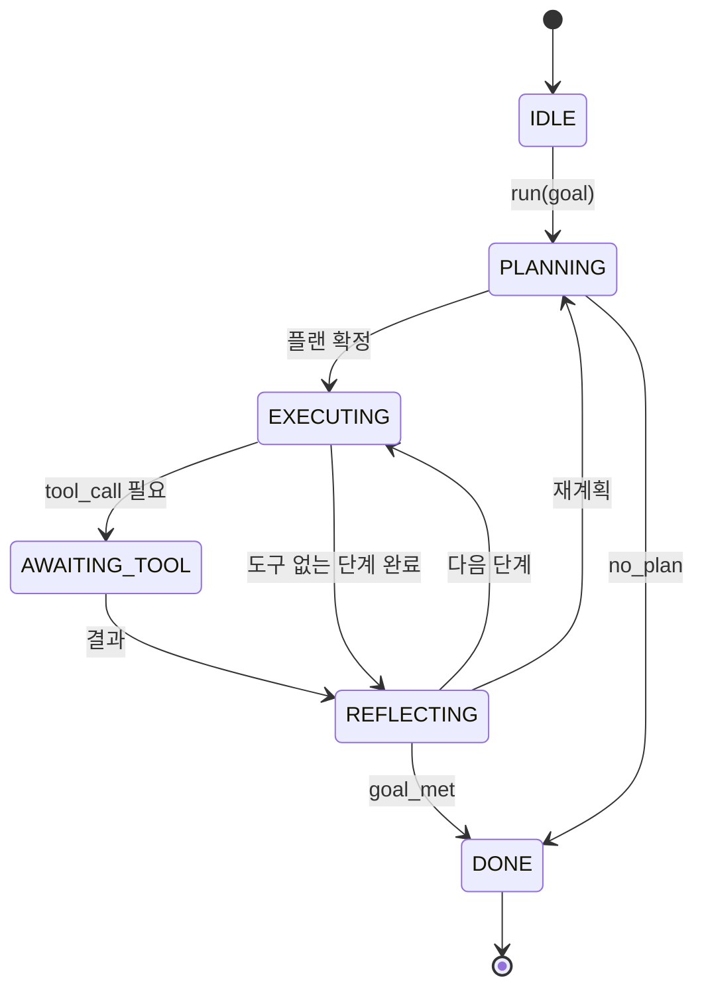

> 🇰🇷 이 문서는 한국어 번역본입니다(ELI5 스타일). 원문: [en.md](en.md)

# 에이전트 하네스 루프 계약

> 하네스(harness)가 곧 에이전트입니다. 모델은 보조 프로세서(코프로세서)일 뿐입니다. 이 레슨은 어떤 모델이든 연결할 수 있는 루프 계약을 확정합니다.

**유형:** 만들기(Build)
**사용 언어:** Python
**선수 지식:** 페이즈 13 레슨 01-07, 페이즈 14 레슨 01
**소요 시간:** 약 90분

## 학습 목표
- 에이전트 하네스 루프를 명시적인 전이를 가진 결정론적 상태 머신으로 정의합니다.
- 운영자가 정책, 텔레메트리, 가드레일을 연결할 수 있는 열 개의 생명주기 훅 주제를 구현합니다.
- 루프가 제어를 호출자에게 돌려주고 새 입력으로 재개하는 두 개의 풀 지점(pull point)을 정의합니다.
- 턴 수, 도구 호출 수, 실제 경과 시간(wall-clock) 같은 세션별 예산을, 초과해도 부분 상태가 새어 나가지 않게 강제합니다.
- 열한 가지 이벤트 타입으로 이루어진 타입화된 스트림을 내보내서, 다운스트림 UI와 트레이서가 루프 안을 직접 들여다보지 않고도 구독할 수 있게 합니다.

```figure
cf-loop-contract
```

## 프레임

40턴 동안 무인으로 도는 코딩 에이전트는 채팅 루프가 아닙니다. 노드는 운영자가 가로챌 수 있고 에지는 운영자가 감사할 수 있는 상태 머신입니다. 계약을 한 번 글로 적어 두면, 모델이나 도구, 정책을 바꾸는 일이 더 이상 리팩터링이 아니게 됩니다. 등록 호출 한 번으로 끝납니다.

이 레슨이 바로 그 계약을 만듭니다. 여섯 개 상태, 열 개 훅 주제, 두 개 풀 지점, 열한 가지 이벤트 타입, 그리고 예산 봉투(budget envelope)에 이름을 붙입니다. 하네스의 나머지 모든 것(도구 레지스트리, JSON-RPC 전송 계층, 디스패처, 플래너)은 이 모양에 끼워 맞춥니다.

## 상태들

루프에는 여섯 개 상태가 있습니다. 다섯은 활성 상태이고 하나는 종료 상태입니다.



`IDLE`만이 합법적인 진입점입니다. `DONE`만이 합법적인 출구입니다. `AWAITING_TOOL`만이 풀 지점을 만드는 상태입니다. 그 외 모든 전이는 내부 전이입니다.

상태 머신은 결정론적입니다. 같은 이벤트 로그가 주어지면 하네스는 같은 상태로 다시 들어갑니다. 바로 이 성질 덕분에 모델을 다시 호출하지 않고도 디버깅용 세션 리플레이가 가능합니다.

## 훅 주제들

훅(hook)은 루프 안으로 들어가는 운영자의 접합부입니다. 하네스는 열 개 주제를 발화(fire)합니다. 각 주제는 임의 개수의 구독자를 받습니다. 구독자는 등록 순서대로 실행됩니다. 구독자는 페이로드를 바꾸거나, 예외를 던져 턴을 중단하거나, 센티넬(sentinel) 값을 반환해 다음 단계를 건너뛸 수 있습니다.

```text
before_plan         after_plan
before_tool_call    after_tool_call
before_step         after_step
on_error
on_pause
on_budget_exceeded
on_complete
```

이 모양은 2025년 중반까지 Claude Code, Cursor, OpenCode가 모두 수렴한 형태를 반영합니다. 이름은 브랜드가 아니라 기능적 이름입니다. `rm -rf`를 막는 훅은 `before_tool_call`에 삽입합니다. OpenTelemetry 스팬을 내보내는 훅은 `after_step`에 삽입합니다. 일시정지된 세션을 재개하는 훅은 `on_pause`에 삽입합니다.

## 풀 지점들

루프는 제어를 두 번 돌려줍니다. 첫째는 도구 결과 없이는 더 진행할 수 없을 때의 `AWAITING_TOOL`입니다. 둘째는 예산이 소진되었거나 훅이 명시적으로 사람의 검토를 요청했을 때의 `on_pause`입니다.

풀 지점은 예외가 아닙니다. 반환(return)입니다. 호출자는 하네스 상태를 살펴보고, 하네스가 요청한 것을 가져와서 `resume(payload)`를 호출합니다. 하네스는 멈췄던 곳에서 이어갑니다. 파이썬 제너레이터와 같은 모양입니다. 풀 지점 위의 전송 방식은 여러분이 고릅니다. TUI에서는 키 입력입니다. MCP에서는 `tools/call`입니다. 큐 위에서는 작업 폴링입니다.

## 이벤트 스트림

루프는 계약의 특정 지점에서 타입화된 스트림에 이벤트를 덧붙입니다. 스트림은 추가 전용(append-only)이며, 구독자는 임의 오프셋부터 리플레이할 수 있습니다. 구현된 열한 가지 이벤트 타입은 다음과 같습니다:

- `session.start` — `run(goal)`이 호출될 때 한 번 발생
- `plan.draft` — 플래너가 초안 플랜을 반환할 때 발생
- `plan.commit` — 초안이 활성 플랜으로 확정된 뒤 발생
- `step.start` — 실행 중인 각 단계의 시작에서 발생
- `step.end` — 실행 중인 각 단계의 끝에서 발생
- `tool.call` — 도구가 필요한 단계가 제어를 호출자에게 넘길 때 발생
- `tool.result` — 도구 결과와 함께 재개될 때 발생
- `tool.error` — 오류와 함께 재개되거나 훅이 호출을 중단할 때 발생
- `budget.warn` — 예산 한도에 도달했을 때 발생
- `session.pause` — 루프가 일시정지로 양보할 때(예산 또는 훅) 발생
- `session.complete` — 루프가 `DONE`에 도달했을 때 한 번 발생

이벤트는 훅 페이로드를 복제하지 않습니다. 훅은 명령형입니다(수정, 중단). 이벤트는 관찰형입니다(기록, 전송). 둘은 서로 독립적인 것으로 다루세요.

## 예산 봉투

세션은 세 가지 한도를 가집니다. 턴 수, 도구 호출 수, 실제 경과 시간(초). 각 턴은 턴 수를 1 늘립니다. 각 도구 호출은 도구 호출 수를 1 늘립니다. 실제 경과 시간은 상태 전이가 있을 때마다 확인됩니다. 한도에 도달하면 루프는 `on_budget_exceeded`를 발화하고, `budget.warn`을 내보낸 뒤, 다음 풀 지점에서 예산 초과 사유와 함께 `IDLE`로 전이합니다.

예산은 킬 스위치가 아니라 양보(yield)입니다. 예산을 늘려 재개할지, 세션을 닫을지는 호출자가 결정합니다.

## 이 레슨이 하지 않는 것

모델을 호출하지 않습니다. 실제 도구를 등록하지 않습니다. 전송 계층을 구현하지 않습니다. 그것들은 다음 네 레슨의 몫입니다. 이 레슨은 계약을 못 박아서, 다음 네 레슨이 재작성 없이 여기에 끼워 들어갈 수 있게 합니다.

`main.py`의 결정론적 플래너는 임시 대역(stub)입니다. 도구 결과가 필요한 단계 둘을 포함한 세 단계짜리 하드코딩 플랜을 반환합니다. 요점은 플랜이 아니라 루프입니다.

## 코드 읽는 법

`HarnessLoop`가 메인 클래스입니다. 상태를 쥐고, 훅을 발화하고, 이벤트를 내보냅니다. `Budget`이 한도를 추적합니다. `Event`는 스트림 위의 타입화된 봉투입니다. `HookRegistry`는 디스패치 테이블입니다. `_transition`이 상태를 바꾸는 유일한 함수라서, 상태 머신 불변식이 한 곳에 모여 있습니다.

`main.py`를 위에서 아래로 읽으세요. 그다음 `code/tests/test_loop.py`를 읽으세요. 테스트가 모든 전이와 모든 훅 발화 순서를 고정합니다.

## 더 나아가기

프로덕션(운영 환경)에서 하네스를 만들 때 가장 어려운 부분은 상태 머신이 아닙니다. 계약을 강제 가능하게 만드는 일입니다. 계약은 플래너의 핫 리로드를 견뎌야 합니다. 잘못된 형식의 JSON을 반환하는 도구를 견뎌야 합니다. 40턴 세션이 3분의 1쯤 진행됐을 때 `before_tool_call`에서 예외를 던지는 훅도 견뎌야 합니다. 이 레슨의 테스트가 그 실패 모드들을 다룹니다. 실행해 보고, 깨뜨려 보고, 케이스를 추가해 보세요.

다음 레슨은 도구 레지스트리를 추가합니다. 그다음이 JSON-RPC 전송 계층입니다. 그다음이 디스패처입니다. 24번 레슨쯤 되면 이 파일의 루프가 실제 예산 강제와 함께 실제 도구를 대상으로 실제 플랜을 돌리고 있을 겁니다.
