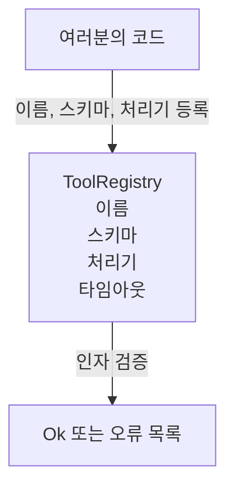

> 🇰🇷 이 문서는 한국어 번역본입니다(ELI5 스타일). 원문: [en.md](en.md)

# 스키마 검증이 있는 도구 레지스트리

> 에이전트가 검증할 수 없는 도구는 에이전트가 호출할 수 없는 도구입니다. 도구를 만들기 전에 레지스트리와 스키마 검사기를 먼저 만드세요.

**유형:** 만들기(Build)
**사용 언어:** Python
**선수 지식:** 페이즈 13 레슨 01-07, 페이즈 14 레슨 01
**소요 시간:** 약 90분

## 학습 목표
- 도구 이름 → 스키마 → 처리기(handler)로 이어지는 타입화된 레지스트리를 만들어서, 디스패처가 한 번만 물어보고 이후로는 믿을 수 있게 합니다.
- 실제 도구 호출의 90퍼센트가 쓰는 키워드를 다루는 JSON Schema 2020-12 부분집합을 구현합니다.
- 정확한 json-pointer 모양의 오류 경로를 반환해서, 모델이 왕복 한 번에 스스로 고칠 수 있게 합니다.
- 명시적인 재정의(override) 없이는 재등록을 거부합니다. 조용한 덮어쓰기가 프로덕션(운영 환경) 도구 카탈로그가 서서히 어긋나는 원인입니다.
- 검증기를 순수하게 유지합니다(I/O 없음, 시간 없음, 전역 상태 없음). 그래야 리플레이 로그 위에서 다시 돌릴 수 있습니다.

```figure
cf-registry-validate
```

## 왜 도구보다 레지스트리가 먼저인가

2026년의 코딩 에이전트는 하나의 컨텍스트 윈도우에 담을 수 있는 것보다 많은 등록된 도구를 가집니다. 제대로 된 하네스는 도구 200개를 등록하고 매 턴 그중 10~40개를 노출합니다. 레지스트리는 "어떤 도구가 존재하는가", "그 인자는 어떤 모양인가", "어떤 처리기를 호출해야 하는가"에 대한 단 하나의 진실원(source of truth)입니다. 이 세 가지 답이 고정되면 하네스의 나머지 부분은 더 이상 추측하지 않아도 됩니다.

우리가 피하려는 실수는 스키마 없이 처리기만 배송하거나, 검증 없이 스키마만 배송하는 것입니다. 둘 다 흔합니다. 둘 다 다음 계층(23번 레슨의 디스패처)을 추측 게임으로 만들고, 유일한 실패 형태가 처리기의 스택 트레이스가 되게 합니다.

## 도구 레코드의 모양

```text
ToolRecord
  name        : str          (고유, 소문자 영숫자와 밑줄로 된 구간을 점으로 구분, 예: snake_case.segment.case)
  description : str          (한 줄, 모델에게 보임)
  schema      : dict         (JSON Schema 2020-12 부분집합)
  handler     : Callable     (async 또는 sync, Any 반환)
  idempotent  : bool         (디스패처가 재시도 판단에 사용)
  timeout_ms  : int          (도구별로 디스패처 기본값을 재정의)
```

스키마만이 검증기가 만지는 필드입니다. 처리기는 검증기에게 불투명합니다. 우리는 일부러 둘을 분리합니다. 스키마는 데이터이고 처리기는 코드입니다. 둘을 섞으면 검증 로직을 처리기 안에 넣고 싶어지는데, 그게 바로 우리가 막으려는 버그입니다.

## JSON Schema 2020-12 부분집합

2020-12 전체 명세는 논문 한 편 분량입니다. 우리는 여덟 개 키워드가 필요합니다.

```text
type           string / number / integer / boolean / object / array / null
properties     속성 이름 -> 스키마 맵
required       필수 속성 이름 목록
enum           허용된 원시 값 목록
minLength      정수, 문자열에 적용
maxLength      정수, 문자열에 적용
pattern        ECMA-262 호환 정규식, 문자열에 적용
items          모든 배열 요소에 적용되는 스키마
```

도구 API가 실제로 필요로 하는 것을 다루기엔 충분합니다. 추가하지 않는 키워드들(oneOf, anyOf, allOf, $ref, 조건부)은 프로덕션 스키마에서 유효하지만, 검증기를 순환 구조가 있는 트리 탐색기로 만들어 버립니다. 우리는 JSON Schema 엔진이 아니라 레지스트리를 만드는 중입니다.

## json pointer 오류 경로

검증이 실패하면 검증기는 오류 목록을 반환합니다. 각 오류는 입력을 가리키는 json-pointer 경로를 가집니다. 포인터는 슬래시로 시작하는, 속성 이름과 배열 인덱스의 나열입니다.

```text
{"a": {"b": [1, 2, "x"]}}
                    ^
                    /a/b/2
```

모델은 문장보다 오류 경로를 더 잘 읽습니다. 스키마가 `args.user.email`을 요구하는데 모델이 정수를 넘겼다면, 오류는 `expected_type: string`과 함께 `/user/email` 형태여야 합니다. 모델은 자연어를 한 라운드 주고받을 필요 없이 다음 호출에서 그것을 고칩니다.

## 등록과 재정의

`register(name, schema, handler, **opts)`는 기본적으로 재등록을 거부합니다. 교체하려면 호출자가 `override=True`를 넘겨야 합니다. 이건 운영 위생입니다. 코드베이스의 두 부분이 조용히 같은 도구 이름을 등록하는 버그는 프로덕션에서 찾는 데 일주일이 걸리는 종류입니다.

레지스트리는 읽기 메서드 세 개를 노출합니다. `get(name)`은 레코드를 반환하거나 예외를 던집니다. `validate(name, args)`는 `Ok` 또는 오류 목록을 반환합니다. `names()`는 등록 순서대로 도구 이름을 반환합니다.

## 검증기가 하는 것과 하지 않는 것

이 검증기는 스키마 트리를 한 번 훑는 재귀 함수입니다. 순수합니다. 처리기를 호출하지 않습니다. 타입을 강제 변환하지 않습니다(문자열 `"42"`는 number 스키마를 통과하지 않습니다). 조용히 잘라내지도 않습니다.

보안 경계는 아닙니다. 악의적인 처리기는 검증이 통과한 뒤에도 잘못 행동할 수 있습니다. 23번 레슨의 디스패처가 타임아웃과 샌드박스 계층을 더합니다. 레지스트리는 모양(shape)을 더합니다.

## 모양



## 코드 읽는 법

`code/main.py`는 `ToolRegistry`, `ToolRecord`, `ValidationError`, 그리고 여덟 개 검증 함수를 정의합니다. 검증기는 `schema["type"]`을 기준으로 분기합니다(또는 `enum`이 있는 스키마는 타입 없는 enum 검사로 다룹니다). 각 타입 검증기는 빈 목록 또는 `ValidationError` 목록을 반환합니다. 최상위 탐색기는 오류를 이어 붙이고, 내려가면서 경로 구간을 앞에 붙입니다.

`code/tests/test_registry.py`는 등록, 재정의, 검증 성공, 경로가 포함된 검증 실패, 그리고 부분집합의 모든 키워드를 다룹니다.

## 더 나아가기

이 레슨이 끝난 뒤 원하게 될 두 가지 확장은 로컬 정의 블록을 대상으로 하는 `$ref` 해석과, 엄격한 모양을 위한 `additionalProperties: false`입니다. 둘 다 작습니다. 둘 다 도구 카탈로그가 50개를 넘어설 때 흔히 추가됩니다. 파일을 한 번에 읽을 수 있는 크기로 유지하려고 이 레슨에서는 뺐습니다.

다음 레슨(22번)은 이 레지스트리를 모델 클라이언트에 노출하는 JSON-RPC stdio 전송 계층을 만듭니다. 그다음 레슨(23번)은 둘을 타임아웃과 재시도가 있는 디스패처 뒤로 감쌉니다.
