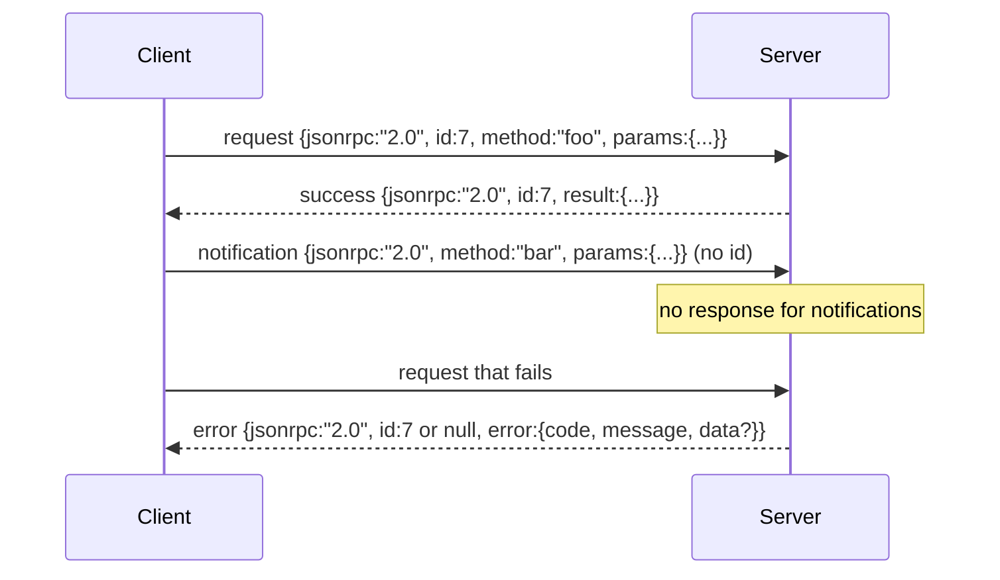

> 🇰🇷 이 문서는 한국어 번역본입니다(ELI5 스타일). 원문: [en.md](en.md)

# 개행으로 구분되는 Stdio 위의 JSON-RPC 2.0

> 모델 클라이언트와 도구 서버 사이의 전송 계층은 stdio 위의 JSON-RPC입니다. 이것을 한 번 직접 만들어 보면 모든 프레이밍 계층이 무슨 비용을 치르고 있는지 알게 됩니다.

**유형:** 만들기(Build)
**사용 언어:** Python
**선수 지식:** 페이즈 13 레슨 01-07, 페이즈 14 레슨 01
**소요 시간:** 약 90분

## 학습 목표
- stdin과 stdout 위에서 개행으로 구분되는 JSON(newline-delimited JSON)으로 프레이밍된 JSON-RPC 2.0을 사용합니다.
- 다섯 가지 표준 오류 코드(-32700, -32600, -32601, -32602, -32603)를 매핑하고 올바른 의미로 노출합니다.
- 새로운 봉투(envelope) 키를 발명하지 않으면서 요청, 응답, 알림(notifications), 배치(batch)를 구분합니다.
- 한 줄당 하나의 파싱 오류를 처리하면서도 스트림 나머지 부분을 오염시키지 않습니다.
- io.BytesIO를 사용하는 스스로 종료되는 데모를 만들어서, 자식 프로세스를 띄우지 않고도 레슨이 실행되게 합니다.

```figure
cf-jsonrpc-frames
```

## 왜 JSON-RPC가 여전히 공용어인가

2026년의 코딩 에이전트는 한 세션에서 열두 개쯤 되는 도구 서버와 통신합니다. 각 서버는 별개의 프로세스이거나 원격 엔드포인트입니다. 전송 형식은 2013년부터 같았습니다. JSON-RPC 2.0은 두 페이지짜리 명세입니다. 이것이 살아남은 이유는 대안들(gRPC, 호출마다 HTTP, 자체 바이너리 형식)이 모두 JSON-RPC에는 없는 트레이드오프를 강요하기 때문입니다: 스트리밍, 배치 처리, 전송 계층 결합 중 하나만 고를 수밖에 없습니다. JSON-RPC는 stdio, 소켓, 웹소켓, HTTP에서 대칭적이며, 양쪽이 명세를 지키면 클라이언트는 한 번도 본 적 없는 서버를 구동할 수 있습니다.

이 레슨은 stdio 변형을 만듭니다. 개행으로 구분되는 JSON입니다. 각 요청은 한 줄입니다. 각 응답은 한 줄입니다. 전송 경계는 `\n`입니다.

## 전송 형태

봉투 모양은 네 가지가 있습니다. 두 가지는 클라이언트가 쓰고, 두 가지는 서버가 씁니다.



알림(notification)에는 `id`가 없습니다. 서버는 알림에 응답해서는 안 됩니다. 서버가 알림에 응답을 반환하면, 클라이언트는 그 응답을 어느 호출 지점에 붙여야 할지 알 방법이 없습니다. 이 한 가지 규칙이 프레이밍 계산을 단순하게 유지합니다.

배치(batch)는 요청이나 알림의 JSON 배열입니다. 서버는 (알림이 아닌 항목 하나당 하나씩) 응답 배열로 답하며, 순서는 어떠해도 됩니다. 배치의 모든 항목이 알림이면 서버는 아무것도 돌려보내지 않습니다.

## 다섯 가지 오류 코드

```text
-32700  Parse error      JSON could not be parsed
-32600  Invalid Request  Envelope shape is wrong
-32601  Method not found
-32602  Invalid params
-32603  Internal error
```

-32000에서 -32099 사이의 코드는 서버 정의 오류용으로 예약되어 있습니다. 그 외 모든 것은 애플리케이션이 정의합니다. 이 레슨은 다섯 가지에 머뭅니다. 처리기가 예외를 던지면 전송 계층은 그것을 -32603으로 감싸고, 예외 클래스 이름을 `data.exception`에 넣습니다.

파싱 오류에는 특별한 규칙이 있습니다. 응답의 `id`는 `null`입니다. 요청이 id를 꺼낼 만큼 파싱되지 못했기 때문입니다.

## 개행 프레이밍과 BytesIO 데모

전송 계층은 한 번에 한 줄씩 읽습니다. 줄이란 `\n`까지를 포함한 바이트입니다. 어떤 줄이 파싱되지 않으면, 전송 계층은 `id: null`인 -32700 응답을 쓰고 계속 진행합니다. 스트림은 오염되지 않습니다. 다음 줄은 새로 파싱됩니다.

이 레슨을 위해 우리는 `io.BytesIO` 쌍을 stdin과 stdout처럼 감쌉니다. 서버는 EOF까지 요청을 읽고, 각각에 대한 응답을 쓰고, 반환합니다. 클라이언트는 응답을 다시 읽습니다. 프로세스 생성도 없고, 타임아웃도 없습니다. Python의 `io` 인터페이스가 같은 `.readline()`과 `.write()` 계약을 제공하기 때문에, 전송 동작은 실제 서브프로세스 파이프와 동일합니다.

## 메서드 디스패치

전송 계층은 어떤 메서드가 존재하는지 모릅니다. 하네스가 공급하는 콜러블 `handler(method, params)`에 넘겨 줍니다. 처리기는 결과를 반환하거나 예외를 던집니다. 세 가지 예외 클래스가 특정 코드로 노출됩니다.

```text
MethodNotFound -> -32601
InvalidParams  -> -32602
Anything else  -> -32603 with exception name in data
```

전송 계층은 도구 레지스트리를 전혀 보지 못합니다. 레지스트리는 처리기 뒤에 있습니다. 우리가 원하는 바로 그 계층 분리입니다. 전송 계층은 JSON-RPC를 말하고, 레지스트리는 도구 모양을 말하고, 디스패처(23번 레슨)가 둘을 이어 줍니다.

## 오류가 있을 때의 스트림 동작

```text
client writes              server reads             server writes
---------------            -----------              -------------
{...valid request...}      parses ok                {...response, id matches...}
{...broken json...         parse fails              {id:null, error: -32700}
{...valid request...}      parses ok                {...response, id matches...}
{...missing method...}     invalid envelope         {id:X, error: -32600}
```

깨진 JSON 한 줄이 루프를 멈추지 않습니다. `method` 필드가 빠져도 루프는 멈추지 않습니다. 처리기 예외도 루프를 멈추지 않습니다. 전송 계층은 EOF까지 계속 읽습니다.

## 알림과 비대칭 흐름

알림은 보내고 잊는(fire-and-forget) 방식입니다. 하네스는 진행 상황 이벤트, 취소 신호, 로그 라인에 알림을 씁니다. 오래 도는 도구가 상태 업데이트 하나하나마다 왕복하지 않고도 스트리밍할 수 있는 통로가 바로 알림입니다.

이 레슨은 발신용 알림 헬퍼 하나, `write_notification`을 구현합니다. 서버는 요청이 처리되는 동안 진행 상황을 내보낼 때 이것을 씁니다. 데모는 이 패턴을 보여 줍니다: 요청이 들어오면, 처리기가 진행 알림 두 개를 내보낸 뒤 최종 응답을 씁니다.

## 코드 읽는 법

`code/main.py`는 `StdioTransport`, 파싱 헬퍼(`parse_request`), 세 개 쓰기 헬퍼(`write_response`, `write_error`, `write_notification`), 그리고 디스패치 루프 `serve`를 정의합니다. 오류 코드 상수는 모듈 스코프에 있습니다.

`code/tests/test_transport.py`는 다섯 가지 오류 코드, 알림(응답이 쓰이지 않음), 배치(배열이 들어와 배열로 나가고 알림은 건너뜀), 깨진 JSON(파싱 오류 후 계속), 그리고 처리기가 호출 도중에 알림을 쓰는 비대칭 흐름을 다룹니다.

## 더 나아가기

이 전송 계층이면 뒤따르는 레슨들에는 충분합니다. 프로덕션 전송 계층은 세 가지를 더합니다. 전달 과정에서 살아남는 상관관계 id(여러분의 `id`가 이미 그 역할이지만, 메시(mesh) 환경에서는 바깥쪽 트레이스 id도 필요합니다). 취소 채널(진행 중인 호출의 id를 담은 `$/cancelRequest` 같은 알림). 그리고 같은 소켓이 JSON-RPC와 Streamable HTTP를 함께 말할 수 있게 하는 콘텐츠 타입 협상 핸드셰이크. 이것들은 전송 형식 자체를 바꾸지 않습니다. 메타데이터를 더할 뿐입니다.
