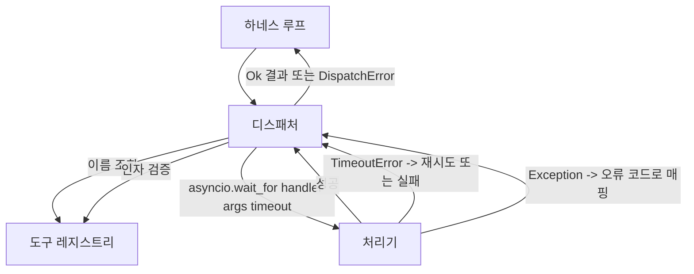
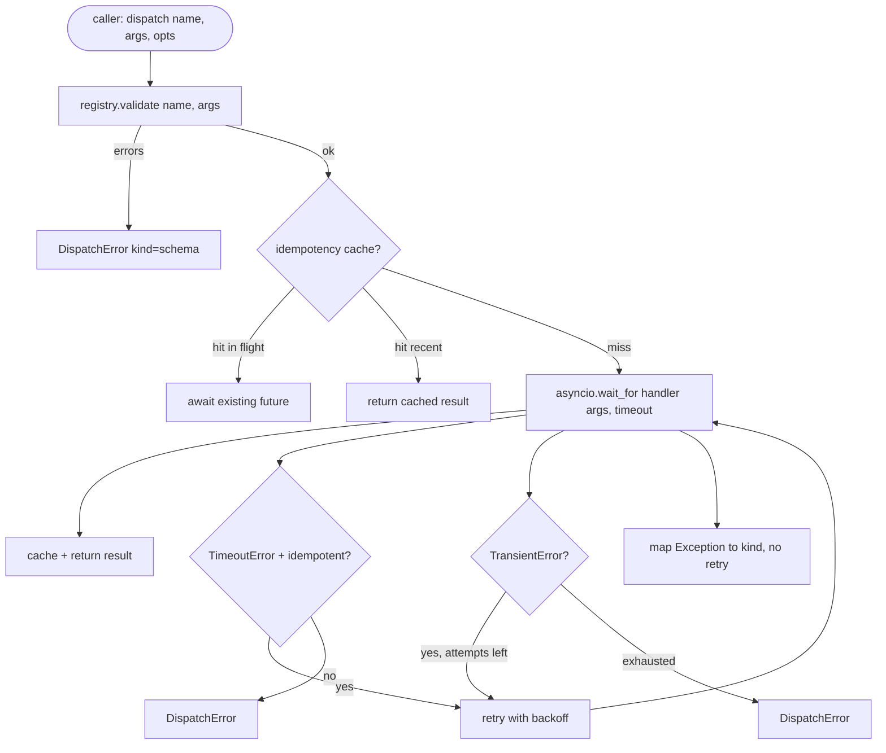

> 🇰🇷 이 문서는 한국어 번역본입니다(ELI5 스타일). 원문: [en.md](en.md)

# 함수 호출 디스패처

> 디스패처는 스키마가 했던 모든 약속의 대가를 치르는 곳입니다. 타임아웃, 재시도, 중복 제거, 오류 매핑. 전부 하나의 접합부 위에서 일어납니다.

**유형:** 만들기(Build)
**사용 언어:** Python
**선수 지식:** 페이즈 13 레슨 01-07, 페이즈 14 레슨 01
**소요 시간:** 약 90분

## 학습 목표
- 도구 처리기를 호출별 타임아웃으로 감싸서, 루프가 멈추는 대신 타입화된 오류를 반환하게 합니다.
- 지터(jitter)와 최대 시도 횟수가 있는 지수 백오프(exponential backoff) 재시도를 적용합니다.
- 멱등성 키(idempotency key)로 재시도를 중복 제거해서, 느린 원래 호출과 경합하는 재시도가 두 번 실행되지 않게 합니다.
- 처리기 예외와 전송 계층 오류를, 하네스 루프가 이미 이해하는 단일 오류 봉투로 매핑합니다.
- 동시성 한도로 병렬 디스패치를 제한해서, 40개 도구 호출의 폭발적 확산(fan-out)이 이벤트 루프를 소진하지 않게 합니다.

```figure
cf-dispatch-retry
```

## 디스패처가 있는 위치

하네스 루프(20번 레슨)와 도구 레지스트리(21번 레슨) 사이입니다. 전송 계층(22번 레슨)이 루프에 먹이를 줍니다. 루프는 도구 호출을 디스패처에 넘깁니다. 디스패처는 레지스트리를 조회하고, 처리기를 실행하고, 결과 또는 JSON-RPC 모양의 오류 봉투를 반환합니다.



타이머, 재시도, 멱등성을 아는 유일한 계층이 디스패처입니다. 루프는 모릅니다. 레지스트리도 모릅니다. 처리기도 모릅니다. 바로 이 격리가 요점입니다.

## 타임아웃

각 도구에는 기본 타임아웃이 있습니다. 레지스트리 레코드가 `timeout_ms`를 가집니다. 하네스가 호출별 재정의를 넘기면 디스패처가 그것으로 덮어씁니다. 우리는 `asyncio.wait_for`를 씁니다. 타임아웃이 발생하면 처리기 작업이 취소되고 디스패처는 `DispatchError(kind="timeout")`를 반환합니다.

타임아웃은 기본적으로 멱등성이 없는 도구에서 재시도 가능한 오류가 아닙니다. 타임아웃된 `db.write`는 커밋되었을 수도, 안 되었을 수도 있습니다. 재시도하면 쓰기가 두 번 일어납니다. 디스패처는 레지스트리 레코드의 `idempotent` 플래그를 존중합니다. 멱등적인 도구는 재시도하고, 멱등적이지 않은 도구는 하지 않습니다.

## 지수 백오프 재시도

재시도 정책은 최대 세 번 시도입니다. 백오프는 지터가 있는 지수 방식입니다.

```text
attempt 1  -> delay 0
attempt 2  -> delay 0.1s * (1 + random[0..0.5])
attempt 3  -> delay 0.4s * (1 + random[0..0.5])
```

`timeout`과 `transient` 오류만 재시도합니다. `schema` 오류, `not_found`, `internal` 오류는 재시도하지 않습니다. 스키마 오류는 결정론적입니다. 재시도해도 결과가 바뀌지 않고 예산만 태웁니다.

재시도 루프는 하네스의 예산을 존중합니다. 호출자의 남은 도구 호출 예산이 0이면, 디스패처는 첫 시도에서 빠르게 실패하고 `kind="budget_exceeded"`를 반환합니다.

## 멱등성 키 중복 제거

원래 호출이 아직 진행 중일 때 재시도가 발사되는 것은 실제 프로덕션 버그입니다. 첫 호출이 4.9초에 걸립니다(타임아웃 바로 아래). 재시도가 5초에 발사됩니다. 이제 두 요청이 같은 백엔드를 두고 경합합니다. 도구가 `payments.charge`라면 결제를 두 번 한 것입니다.

디스패처는 선택적인 `idempotency_key`를 받습니다. 같은 키가 이미 진행 중일 때 호출이 도착하면, 디스패처는 진행 중인 퓨처(future)를 기다리고 그 결과를 반환합니다. 캐시는 늦게 도착하는 재시도를 흡수하기 위해 완료 후 60초 동안 키를 보관합니다.

키는 호출자의 책임입니다. 하네스는 플래너에서 이렇게 유도합니다: `f"{step_id}:{tool_name}:{hash(args)}"`. 디스패처는 키를 만들어 내지 않습니다. 인자만으로 키를 유도하면 의미가 다른 두 호출이 같아 보이기 때문입니다.

## 오류 봉투

실패한 디스패치는 단일 모양을 반환합니다.

```text
DispatchError
  kind        : "timeout" | "transient" | "schema" | "not_found" | "internal" | "budget_exceeded"
  message     : str
  attempts    : int
  jsonrpc_code: int   (one of -32601, -32602, -32603)
```

하네스 루프는 `kind`를 다음 상태로 매핑합니다. `schema`와 `not_found`는 `on_error`로 가고 재계획(replan)을 트리거합니다. `timeout`과 `transient`는 `on_error`로 가고, 시도 횟수에 따라 재계획할 수도 안 할 수도 있습니다. `budget_exceeded`는 `on_budget_exceeded`를 트리거합니다.

## 폭발적 확산의 동시성 한도

`gather(*calls)`는 모든 코루틴을 동시에 실행합니다. 도구 호출이 40개면 열린 소켓 40개 또는 서브프로세스 파이프 40개입니다. 대부분의 백엔드는 클라이언트 하나에서 40개의 병렬 연결을 반기지 않습니다.

디스패처는 `gather`를 세마포어로 감쌉니다. 기본 동시성 한도는 8입니다. 각 호출은 디스패치 전에 세마포어를 얻고 완료 시 반납합니다. 호출자는 `gather` 모양의 출력을 보지만 실제 스케줄링은 한도가 있습니다.

## 호출 하나의 흐름



## 코드 읽는 법

`code/main.py`는 `Dispatcher`, `DispatchError`, `TransientError`를 정의합니다. 디스패처는 생성 시 레지스트리를 받습니다. 비동기 `dispatch(name, args, ...)`가 유일한 진입점입니다. 시도별 타임아웃은 `_run_with_retries` 안에서 `asyncio.wait_for`로 인라인 적용됩니다. `gather_bounded(calls)`는 동시성 한도를 적용해 많은 디스패치를 실행합니다.

`code/tests/test_dispatcher.py`는 타임아웃 발동, transient 재시도, 스키마 오류에서의 재시도 금지, 멱등성 중복 제거(같은 키를 가진 두 동시 호출이 처리기 호출 한 번으로 합쳐짐), 그리고 동시성 제한(세마포어의 실제 동작)을 다룹니다.

테스트는 `asyncio.sleep(0)`과 결정론적인 `Counter` 기반 처리기를 쓰기 때문에 밀리초 안에 끝나고 실제 시간 타이밍에 의존하지 않습니다.

## 더 나아가기

프로덕션 디스패처가 추가하는 두 가지 확장이 있습니다. 첫째, 모든 전이에서의 구조화된 로깅(루프의 이벤트 스트림이 이미 주어주지만, 디스패처도 `dispatch.attempt`와 `dispatch.retry` 이벤트를 내보내야 합니다). 둘째, 서킷 브레이커: 윈도 안에서 N번 실패하면 해당 도구에 쿨다운 기간이 생겨서, 그동안 디스패치가 처리기를 시도하는 대신 즉시 `kind="circuit_open"`으로 반환합니다. 둘 다 계약을 바꾸지 않고 이 디스패처 위에 얹힙니다.

24번 레슨은 디스패처를 플랜-실행(plan-and-execute) 에이전트에 붙여서 네 조각 전부가 움직이는 모습을 보여 줍니다.
