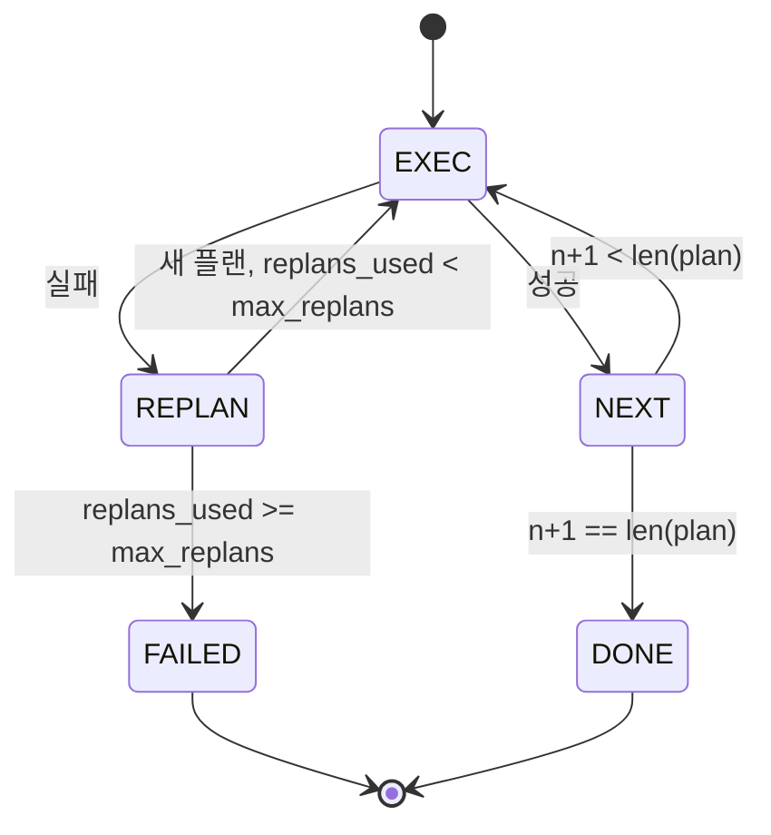

> 🇰🇷 이 문서는 한국어 번역본입니다(ELI5 스타일). 원문: [en.md](en.md)

# 플랜-실행 제어 흐름

> 실패를 견디지 못하는 플랜은 그냥 스크립트입니다. 다시 계획(replan)할 수 있는 스크립트가 에이전트입니다. 재계획기를 먼저 만드세요.

**유형:** 만들기(Build)
**사용 언어:** Python
**선수 지식:** 페이즈 13 레슨 01-07, 페이즈 14 레슨 01
**소요 시간:** 약 90분

## 학습 목표
- 플랜을 타입화된 단계(step)들의 순서 목록으로 표현해서, 실행기가 진행 상황과 결과를 추론할 수 있게 합니다.
- 단계를 순차적으로 실행하고, 실패를 통제된 방식으로 플래너에게 다시 넘깁니다.
- 이전 오류를 컨텍스트에 담아 현재 커서부터 재계획해서, 다음 플랜이 그 정보를 반영하게 합니다.
- 수정(revision)이 있을 때마다 플랜 diff를 내보내서, 다운스트림 트레이서나 UI가 플랜이 왜 바뀌었는지 보여 줄 수 있게 합니다.
- 두 가지 예산을 강제합니다: 하드 단계 상한과 하드 재계획 상한.

```figure
cg-plan-replan
```

## 플랜-실행 방식, 생각의 사슬(chain-of-thought)이 아니다

생각의 사슬(chain-of-thought) 에이전트는 토큰을 내보내고 루프가 도구 호출이 어디서 끝나는지 추측하게 둡니다. 플랜-실행(plan-and-execute) 에이전트는 구조화된 플랜을 먼저 내보내고, 그다음 각 단계를 결정론적으로 실행합니다. 플랜은 하네스가 들여다볼 수 있는 데이터입니다. 실행은 하네스가 그 데이터를 디스패처를 통해 돌리는 것입니다.

두 조각이 있습니다. 플랜을 만들어 내는 플래너. 플랜을 돌리는 실행기. 흥미로운 작업은 실행기가 실패를 만났을 때 일어나는 일입니다. 선택지는 세 가지입니다:

```text
1. Abort         (return failed, surface the error)
2. Skip          (mark step failed, continue with the rest)
3. Replan        (hand the error to the planner, get a new plan from the cursor)
```

스크립트를 에이전트로 바꾸는 것은 Replan입니다.

## Step의 모양

```text
Step
  id              : int           (monotonic within a plan revision)
  tool_name       : str
  args            : dict
  expected_outcome: str           (planner's stated success condition)
  result          : Any | None
  error           : str | None
```

`expected_outcome`은 플래너가 단계와 함께 내보내는 짧은 문장입니다. 실행기가 이것을 강제하지는 않습니다. 용도는 둘입니다: 재계획기가 플랜을 수정할 때 읽습니다; 이벤트 스트림이 이것을 내보내서 트레이서가 "이 단계는 원래 X를 하려 했다"를 보여 줄 수 있습니다.

## 플래너의 모양

```python
def planner(goal: str, history: list[Step], last_error: str | None) -> list[Step]:
    ...
```

순수 함수입니다. `goal`은 사용자 목표입니다. `history`는 이미 실행된 단계들(결과와 오류가 채워진)입니다. `last_error`는 첫 호출에서는 None이고 이후 모든 호출에서는 가장 최근의 실패 메시지입니다. 플래너는 커서부터 시작하는 다음 플랜을 반환합니다.

플래너는 실행기를 모릅니다. 재시도도 모릅니다. 타임아웃도 모릅니다. 플랜을 만들어 낼 뿐입니다. 그게 전부입니다.

## 실행기

실행기는 작은 상태 머신입니다. 각 단계는 디스패처를 통과합니다. 결과는 셋 중 하나입니다: 성공, 재계획 가능한 실패, 치명적인 실패. 재계획 가능한 실패는 플래너에게 돌아갑니다. 치명적인 실패(예산 초과, 재계획 상한 도달)는 `FAILED` 세션 결과를 반환합니다.



## 수정 시점의 플랜 diff

플래너가 실패 뒤에 새 플랜을 반환하면, 실행기는 세 필드를 가진 `plan.diff` 이벤트를 내보냅니다.

```text
removed: list of step ids that were in the old plan and are not in the new
added  : list of step ids in the new plan that were not in the old
revised: list of step ids whose tool_name or args changed
```

트레이서나 UI는 이것을 제거된 단계의 취소선과 추가된 단계의 하이라이트로 그릴 수 있습니다. 요점은 diff 형식이 아닙니다. 요점은 수정이 보이는 이벤트라는 것입니다. 조용한 덮어쓰기가 아니라.

## 두 가지 예산, 둘 다 하드 제한

`max_steps`는 재계획을 포함해 세션 전체에서 실행되는 단계의 총 횟수를 제한합니다. 기본값은 12입니다. 두 번 재계획하면서 매번 세 단계를 추가하는 5단계 선형 플랜은 16번 실행에 도달하고 예산을 초과합니다. 실행기는 그 재계획을 거부하고 FAILED를 반환합니다.

`max_replans`는 첫 플랜 이후 플래너가 호출되는 횟수를 제한합니다. 기본값은 5입니다. 이쪽이 더 중요한 한도입니다. 고장 난 같은 플랜을 다섯 번 연속 반환하는 플래너는, 그렇지 않으면 단계 예산이 잡아낼 때까지 루프를 돕니다. 재계획에 상한을 두면 실패가 더 빨리 오고 이유도 더 명확합니다.

## 이 레슨의 결정론적 플래너

이 레슨에서는 모델을 호출하지 않습니다. 레슨은 `last_error`를 기준으로 플랜을 고르는 결정론적 플래너를 실어 보냅니다.

```text
last_error is None    -> emit a four-step plan
last_error matches X  -> emit a three-step plan that routes around X
last_error matches Y  -> emit a two-step plan that gives up gracefully
otherwise             -> return [] (signals nothing to replan)
```

이 정도면 실행기의 모든 전이 경로 동작을 테스트하기에 충분합니다: 성공, 한 번 재계획, 두 번 재계획, 재계획 소진, 단계 예산 소진.

## 결과 모양

```text
SessionResult
  status      : "completed" | "failed"
  reason      : str     ("goal_met" | "step_budget" | "replan_budget" | "no_plan")
  history     : list[Step]
  revisions   : list[PlanDiff]
  events      : list[Event]
```

20번 레슨의 하네스 루프는 이것을 직접 읽을 수 있습니다. 각 단계를 실행하는 것은 23번 레슨의 디스패처입니다. 각 단계의 인자를 검증하는 것은 21번 레슨의 레지스트리입니다. 22번 레슨의 전송 계층은 이 전체 흐름을 JSON-RPC로 모델 클라이언트에 노출할 수 있습니다.

## 코드 읽는 법

`code/main.py`는 `PlanExecuteAgent`, `Step`, `PlanDiff`, `SessionResult`, 그리고 결정론적 플래너를 정의합니다. 실행기는 `SessionResult`를 반환하는 단일 `run(goal)` 메서드입니다. 플랜 diff는 단계 id와 `(tool_name, args)` 튜플을 비교해 계산됩니다.

`code/tests/test_agent.py`는 선형 성공, 한 번 재계획하는 중반 실패, `failed:replan_budget`을 반환하는 재계획 소진, 단계 예산 소진, 그리고 플랜 diff 이벤트 형식을 다룹니다.

## 더 나아가기

이것을 실제 모델에 연결하면 원하게 될 두 가지 확장이 있습니다. 첫째, 부분 플랜 캐싱: 6단계 플랜의 처음 세 단계가 성공한 뒤 실패했다면, 처음 세 단계를 다시 실행하고 싶지 않을 겁니다. 실행기는 이미 히스토리를 갖고 있습니다. 플래너가 그것을 읽기만 하면 됩니다. 둘째, 병렬 브랜치: 현재 실행기는 엄격히 순차적입니다. 독립적인 브랜치를 내보내는 플래너(`next_step` 대신 `gather_step`)는 두 개의 도구 호출을 디스패처를 통해 동시에 실행할 수 있습니다.

둘 다 진짜 복잡도를 더합니다. 둘 다 선형 실행기가 고정된 뒤에 추가하기가 더 쉽습니다. 이 레슨이 하는 일이 바로 그겁니다.
