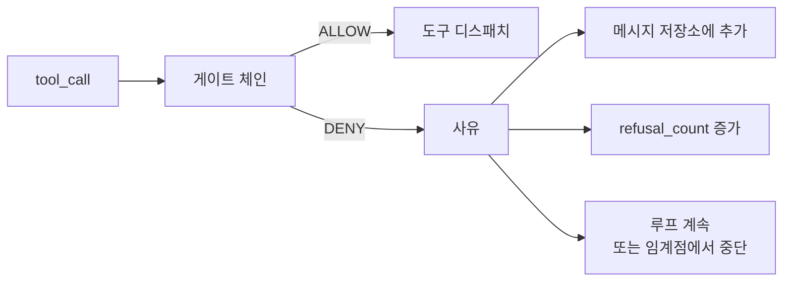
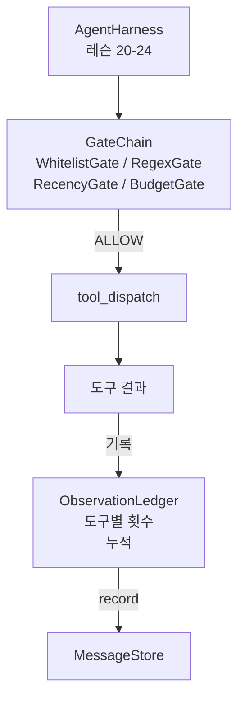

> 🇰🇷 이 문서는 한국어 번역본입니다(ELI5 스타일). 원문: [en.md](en.md)

# 캡스톤 레슨 25: 검증 게이트와 관찰 예산

> 검증 계층이 없는 에이전트 하네스는 코트를 걸친 소원에 불과합니다. 이 레슨은 도구 호출이 발사될 수 있는지, 그 출력의 얼마만큼을 에이전트가 볼 수 있는지, 그리고 에이전트가 너무 많이 읽었을 때 루프가 언제 멈춰야 하는지를 결정하는 결정론적 게이트 체인을 만듭니다. 이 체인은 이름 붙은 작은 게이트들에, 모델에게 보여준 모든 토큰을 추적하는 관찰 장부(ledger)를 더한 함수입니다.

**유형:** 만들기(Build)
**사용 언어:** Python (stdlib)
**선수 지식:** 페이즈 19 · 20-24 (트랙 A1: 에이전트 루프, 도구 레지스트리, 메시지 저장소, 프롬프트 빌더, 모델 라우터), 페이즈 14 · 33 (제약으로서의 지침), 페이즈 14 · 36 (범위 계약), 페이즈 14 · 38 (검증 게이트)
**소요 시간:** 약 90분

## 학습 목표

- 결정론적인 `evaluate(call)` 메서드를 가진 `VerificationGate` 프로토콜을 만듭니다.
- 예산, 최근성(recency), 허용 목록, 정규식 게이트를 단락 평가(short-circuit) 의미로 연결된 체인으로 합성합니다.
- 모든 관찰을 도구와 턴으로 색인되는 `ObservationLedger`를 통해 추적합니다.
- 누적 관찰 예산이 초과될 도구 호출은 거부합니다.
- 다운스트림 관측 도구가 흡수할 수 있는 구조화된 `GateDecision` 레코드를 노출합니다.

## 문제

에이전트 하네스가 모델에게 도구를 마음대로 호출하게 하면, 실사용 첫 시간 안에 세 부류의 버그가 나타납니다.

첫째는 무한정한 관찰입니다. 20만 줄짜리 저장소를 grep하면 50만 토큰의 출력이 다음 턴에 쏟아집니다. 모델은 킬로바이트당 매치 하나를 보고 나머지 컨텍스트는 낭비됩니다. 토큰 청구서는 커지는데 에이전트의 과제 수행 능력은 나아지는 게 아니라 나빠집니다.

둘째는 낡은 최근성입니다. 오래 도는 작업은 도구 호출 50개를 쌓입니다. 모델은 3턴 때의 첫 read_file을 마치 살아 있는 상태인 것처럼 다시 읽습니다. 47턴에 이뤄진 수정은 프롬프트 빌더가 가장 오래된 관찰부터 직렬화했기 때문에 전혀 보이지 않습니다.

셋째는 권한 확대입니다. 조사 과제가 `web_search` 호출로 시작했다가, 모델이 도구 이름을 지어내고 하네스가 허용적으로 기본 동작하면서 어느새 `shell`을 실행하는 데까지 이릅니다. 누군가 트레이스를 읽을 때쯤이면 쓰레기 파일 하나가 /tmp에 놓여 있고 사내 API에 curl이 날아간 뒤입니다.

검증 게이트는 "아니오"라고 말하는 하네스 구성 요소입니다. 모델이 아닙니다. 심판도 아닙니다. `(call, history, ledger)`의 결정론적 함수로서, 이유와 함께 ALLOW 또는 DENY를 반환합니다. 이유는 로그에 남고, 모델에게 알려지고, 루프는 계속하거나 중단합니다.

## 개념



게이트는 `evaluate(call, ctx) -> GateDecision` 메서드를 가진 무엇이든 됩니다. 체인은 순서가 있는 목록입니다. 평가는 첫 번째 DENY에서 단락(short-circuit)됩니다. 순서가 중요합니다. 싼 구조적 게이트가 비싼 토큰 계산 게이트보다 먼저 실행됩니다.

이 레슨은 네 가지 게이트를 실어 보냅니다:

- `WhitelistGate`. 허용된 도구 이름은 명시적인 집합입니다. 그 밖의 모든 것은 거부됩니다. 가장 싼 게이트이며 가장 먼저 실행됩니다.
- `RegexGate`. 도구 인자를 정규식과 대조합니다. `rm -rf`가 들어간 shell 호출이나 내부 IP로 향하는 HTTP 호출을 거부하는 데 유용합니다. 호출 페이로드에 대해서만 동작하는 순수 함수입니다.
- `RecencyGate`. 모델은 최근 N턴의 관찰만 봅니다. 더 오래된 관찰은 마스킹됩니다. 이 게이트는 이미 시효가 지난 관찰 윈도우를 늘리게 될 도구 호출을 거부합니다.
- `BudgetGate`. 세션 전체에서 모델이 읽은 누적 토큰에는 상한이 있습니다. 장부가 상한에 도달했다고 말하면, 이후의 모든 도구 호출은 거부됩니다.

관찰 장부가 장부 관리 담당입니다. 성공한 도구 호출마다 한 줄을 기록합니다: 도구 이름, 턴, 내보낸 토큰, 누적. 장부는 두 가지 질문에 답합니다: 모델이 총 얼마나 봤는가, 그리고 도구 X를 대상으로 얼마나 봤는가. 예산 게이트는 첫 번째를 읽습니다. 도구별 예산 게이트(연습 문제로 직접 쓰게 될)는 두 번째를 읽습니다.

```figure
cg-gate-chain
```

## 아키텍처



하네스가 체인에게 묻습니다. 체인은 고개를 끄덕이거나 거부합니다. 고개를 끄덕이면 도구가 실행되고, 장부가 카운트하고, 결과가 메시지 저장소에 추가됩니다. 거부하면 모델에게 시스템 메시지로 거부 사실이 전달되고, 루프가 재시도할지 중단할지 결정합니다.

## 여러분이 만들 것

구현은 `main.py` 하나와 테스트입니다.

1. `Observation`과 `ToolCall` 데이터클래스가 전송 모양을 정의합니다.
2. `ObservationLedger`가 `(turn, tool, tokens)` 행을 기록하고 `cumulative()`와 `per_tool(name)`에 답합니다.
3. `GateDecision`은 `(allow, reason, gate_name)`을 운반합니다.
4. `VerificationGate`가 프로토콜입니다. 각 게이트는 `evaluate(call, ctx)`를 구현합니다.
5. `GateChain`은 순서가 있는 목록을 감쌉니다. 각 게이트를 호출하고, 첫 번째 거부를 반환하거나, 모든 게이트가 통과하면 허용을 반환합니다.
6. 데모는 작은 합성 에이전트 루프를 돌립니다. 세 턴. 세 번째 턴이 예산 게이트를 걸고, 루프는 0이 아닌 거부 횟수와 함께 깔끔한 거부를 보고합니다.

토큰 카운터는 일부러 `len(text) // 4`라는 단순한 휴리스틱입니다. 이 레슨의 요점은 게이트 배관이지 토크나이저가 아닙니다. 프로덕션에서는 진짜 토크나이저를 끼워 넣으세요.

## 왜 체인 순서가 중요한가

거부는 허용보다 쌉니다. `WhitelistGate`는 O(1) 해시 조회로 실행됩니다. `RegexGate`는 O(pattern * argv)입니다. `RecencyGate`는 메시지 저장소의 작은 슬라이스를 읽습니다. `BudgetGate`는 장부 전체를 읽습니다. 비용이 오르는 순으로 배열하면, 거부된 호출이 비싼 작업을 하기 전에 단락됩니다.

영향 반경(blast radius) 순으로도 배열합니다. 허용 목록이 가장 강한 주장입니다: 이 도구는 계약에 없습니다. 정규식 게이트가 그다음입니다: 이 인자는 계약에 없습니다. 최근성이 그다음입니다: 하네스는 여전히 관심 있지만 호출은 구조적으로 합법입니다. 예산이 마지막인 이유는, 정의상 나머지가 모두 통과했을 때만 발동하기 때문입니다.

## 트랙 A의 나머지와 어떻게 합쳐지는가

이전 레슨들이 루프, 도구 레지스트리, 메시지 저장소, 프롬프트 빌더, 모델 라우터를 주었습니다. 이 레슨은 모델과 도구 사이의 계층을 더합니다. 레슨 26은 게이트 체인이 ALLOW라고 말했을 때 디스패처가 도구 호출을 넘기는 샌드박스를 실어 보냅니다. 레슨 27은 거부 횟수를 품질 신호로 기록하는 평가(eval) 하네스를 실어 보냅니다. 레슨 28은 게이트 결정을 OpenTelemetry 스팬으로 연결합니다. 레슨 29는 그 전부를 하나의 동작하는 코딩 에이전트로 엮습니다.

## 실행 방법

```bash
cd phases/19-capstone-projects/25-verification-gates-observation-budget
python3 code/main.py
python3 -m pytest code/tests/ -v
```

데모는 모든 게이트 결정을 포함한 턴별 트레이스를 출력하고 종료 코드 0으로 끝납니다. 테스트는 장부, 각 게이트의 격리 동작, 체인 단락 평가, 그리고 합성 루프의 엔드투엔드를 다룹니다.
