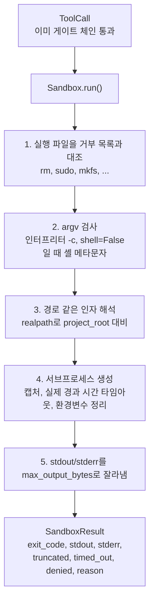
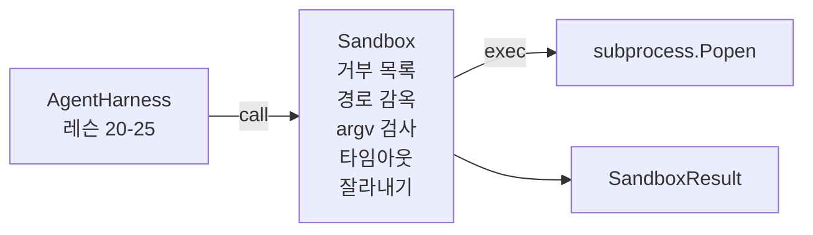

> 🇰🇷 이 문서는 한국어 번역본입니다(ELI5 스타일). 원문: [en.md](en.md)

# 캡스톤 레슨 26: 거부 목록과 경로 감옥이 있는 샌드박스 러너

> 검증 게이트는 도구 호출이 실행되어야 하는지를 결정합니다. 샌드박스는 실행될 때 무슨 일이 일어나는지를 결정합니다. 이 레슨은 위험한 실행 파일을 거부하고, 위험한 argv 모양을 거부하고, 모든 파일 경로를 프로젝트 루트 안에 가두고, 너무 큰 출력을 잘라내고, 실제 경과 시간 타임아웃으로 폭주하는 프로세스를 죽이는 서브프로세스 러너를 실어 보냅니다. 모델과 운영체제 사이에 놓이는 두 계층 중 두 번째입니다.

**유형:** 만들기(Build)
**사용 언어:** Python (stdlib)
**선수 지식:** 페이즈 19 · 25 (검증 게이트와 관찰 예산), 페이즈 14 · 33 (제약으로서의 지침), 페이즈 14 · 38 (검증 게이트)
**소요 시간:** 약 90분

## 학습 목표

- 타임아웃, 캡처, 잘라내기를 갖춘 `subprocess.run`을 감싸는 `Sandbox` 클래스를 만듭니다.
- 이름으로는 거부 목록(denylist)에 대조하고, 구조로는 argv 검사기에 대조해서 명령을 거부합니다.
- 선언된 프로젝트 루트 바깥으로 해석되는 경로 인자는 모두 거부합니다.
- 셸 모드가 꺼져 있을 때 셸 메타문자를 거부합니다.
- 다운스트림 관측 도구와 평가(eval) 하네스가 흡수할 수 있는 구조화된 `SandboxResult`를 반환합니다.

## 문제

셸을 쓸 수 있는 코딩 에이전트는 단 한 턴 안에 백도어를 설치하고, 키를 빼돌리고, 개발자 노트북을 벽돌로 만들고, 클라우드 청구서를 불릴 수 있습니다. 가장 저렴한 방어는 셸을 아예 주지 않는 것입니다. 두 번째로 저렴한 것은 정확한 패턴 목록에 대해 "아니오"라고 말하는 샌드박스입니다.

세 부류의 실패가 에이전트 트레이스에 되풀이됩니다.

첫째는 위험한 실행 파일입니다. 경로 문제를 고치라는 압박을 받은 모델은 `sudo`, `chmod -R 777`, `rm -rf`, `mkfs`, `dd`를 시도합니다. 이것들 중 어느 것도 에이전트 실행에 속하지 않습니다. 거부 목록이 이름과 별칭으로 이것들을 잡아냅니다.

둘째는 argv 트릭입니다. 셸을 금지당한 모델은 인터프리터를 통해 공격을 파이프합니다: `python3 -c "import os; os.system('rm -rf /')"`, `bash -c '...'`, `node -e '...'`, `perl -e '...'`. 샌드박스는 `-c` 비슷한 플래그로 실행되는 인터프리터는 그냥 절차가 하나 더 붙은 셸 호출이라는 것을 알아야 합니다.

셋째는 경로 탈출입니다. 모델에게 `./src/main.py`를 읽으라 했는데 `../../etc/passwd`를 읽습니다. 샌드박스는 모든 경로 인자를 `os.path.realpath`로 해석하고 접두사를 단언(assert)해서 가둡니다.

샌드박스는 운영체제가 말하는 보안 경계가 아닙니다. 코드 실행 권한을 가진 결연한 공격자는 여전히 빠져나올 수 있습니다. 샌드박스는 개발 시점의 가드레일입니다: 흔한 실패 모드를 크게 드러내고, 무능함 때문에 피해를 일으키는 일을 막습니다.

## 개념



샌드박스에는 네 가지 거부 축이 있습니다: 이름, argv, 경로, 구조. 각 축은 호출만의 순수 함수이며, 이 단계에는 서브프로세스가 아직 없습니다. 서브프로세스는 모든 축을 통과한 뒤에만 생성됩니다.

`SandboxResult`의 종료 코드는 관례적인 것들입니다: 0은 성공, 0이 아니면 실패, 그리고 거부(-100), 시간 초과(-101), 잘라냄(진짜 종료 코드에 플래그가 설정됨)을 위한 세 가지 센티넬 코드. 다운스트림 레슨들은 stderr를 파싱하는 대신 이 구조화된 결과를 읽습니다.

```figure
cg-path-jail
```

## 아키텍처



거부 목록은 실행 파일 베이스네임의 frozenset입니다. 별칭들(`/bin/rm`, `/usr/bin/rm`)은 모두 같은 베이스네임으로 해석됩니다. argv 검사기는 인터프리터 모양을 압니다: argv[0]이 인터프리터이고 뒤따르는 인자 하나라도 `-c`나 `-e`로 시작하는 argv는 거부됩니다. 셸 메타문자(`;`, `|`, `&`, `>`, `<`, 백틱, `$()`)는 호출이 명시적으로 셸을 요청하지 않았다면 거부로 이어집니다.

경로 감옥(path jail)이 가장 미묘한 조각입니다. 샌드박스는 생성 시 `project_root`를 받습니다. 경로처럼 보이는 인자(`/`를 포함하거나 실재하는 파일과 일치)는 `os.path.realpath`로 정규화된 뒤, 프로젝트 루트의 realpath와 대조됩니다. 해석된 대상이 루트 아래가 아니면 거부입니다. 심볼릭 링크 탈출 시도(프로젝트 루트 안에 있지만 바깥을 가리키는 심볼릭 링크)는 문자 그대로의 경로가 아니라 realpath를 검사해서 막힙니다.

## 여러분이 만들 것

구현은 `main.py`와 테스트 디렉터리입니다.

1. `SandboxResult` 데이터클래스: exit_code, stdout, stderr, truncated, timed_out, denied, reason, duration_ms.
2. `SandboxConfig` 데이터클래스: project_root, max_output_bytes, timeout_seconds, denylist, interpreter_block.
3. `Sandbox` 클래스: `run(argv, *, shell=False, cwd=None)`이 `SandboxResult`를 반환합니다.
4. 내부 거부 헬퍼들: `_check_executable_denylist`, `_check_argv_interpreter`, `_check_shell_metachars`, `_check_path_jail`.
5. 명확한 `truncated` 플래그와 캡처된 스트림 안의 마커 라인이 있는 출력 잘라내기.
6. 맨 아래의 데모: 합법적인 호출과 공격적인 호출의 나열. 각각의 결과가 함께 표시됩니다.

샌드박스는 기본 `shell=False`와 `capture_output=True`로 `subprocess.run`을 씁니다. 실제 경과 시간 타임아웃은 `timeout` 인자를 사용합니다. `TimeoutExpired`가 발생하면 샌드박스가 프로세스 그룹을 죽이고 SandboxResult를 합성합니다.

## 왜 이것이 진짜 샌드박스가 아닌가

이 레슨의 샌드박스는 네임스페이스, cgroups, seccomp, gVisor, Firecracker 또는 어떤 커널 수준 격리도 쓰지 않습니다. 서브프로세스가 할 수 있는 것은 무엇이든 샌드박스도 할 수 있습니다. 보호는 구조적입니다: 에이전트가 가장 흔한 위험한 호출을 거부당하고, 크게 울리는 거부가 조용히 실행되는 대신 관측 도구로 흘러 들어갑니다.

프로덕션(운영 환경) 에이전트는 그 위에 겹을 쌓습니다: 권한 없는 Docker 컨테이너 안에서 실행, 마이크로VM 안에서 실행, 케이퍼빌리티 제거(drop capabilities), 프로젝트 루트는 읽기 전용으로 스크래치 디렉터리는 읽기-쓰기로 마운트, 메모리와 CPU에 ulimit 설정, 환경변수를 안전한 것으로 알린 허용 목록으로 정리. 레슨 29가 이중 일부를 합니다. 운영체제 수준 격리는 이 레슨 범위 밖입니다.

## 실행 방법

```bash
cd phases/19-capstone-projects/26-sandbox-runner-denylist
python3 code/main.py
python3 -m pytest code/tests/ -v
```

데모는 임시 디렉터리를 만들고, 깨끗한 파일을 하나 넣은 뒤, 호출 묶음을 실행합니다. 합법적인 호출은 성공합니다. 거부된 호출은 `denied=True`와 사유가 담긴 SandboxResult를 반환합니다. 타임아웃은 `timed_out=True`를 반환합니다. 잘라내기는 `truncated=True`를 설정합니다. 데모는 결과의 JSON 표를 출력하고 종료 코드 0으로 끝납니다.

## 트랙 A의 나머지와 어떻게 합쳐지는가

레슨 25는 게이트 체인을 만들었습니다. 레슨 26은 게이트 ALLOW 뒤에 실행되는 실행기입니다. 레슨 27의 평가 하네스는 샌드박스 결과를 과제별 기대 종료 코드와 비교합니다. 레슨 28은 `Sandbox.run` 호출마다 `gen_ai.tool.execution` 스팬을 내보냅니다. 레슨 29의 엔드투엔드 데모는 실제 코딩 에이전트를 두 계층 모두 통과하게 엮습니다.
