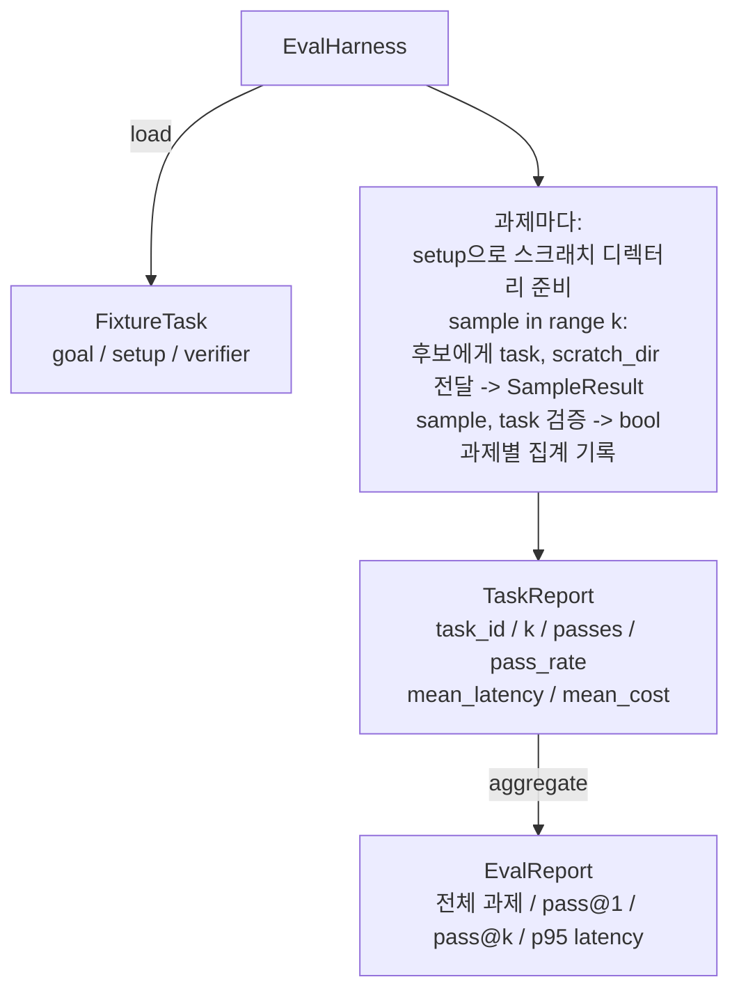

> 🇰🇷 이 문서는 한국어 번역본입니다(ELI5 스타일). 원문: [en.md](en.md)

# 캡스톤 레슨 27: 픽스처 과제가 있는 평가 하네스

> 코딩 에이전트는 여러분이 측정 기준으로 삼는 과제 모음만큼만 좋습니다. 이 레슨은 픽스처 과제 폴더를 받아 각각을 후보 에이전트에 통과시키고, 결정론적 검증기로 합격/불합격을 채점하고, 그 결과를 pass@1, pass@k, 평균 지연 시간, 평균 비용으로 집계하는 평가(eval) 하네스를 만듭니다. 이 하네스가 바로 회귀와 리팩터링을 구별하게 해 주는 단 하나의 진실원입니다.

**유형:** 만들기(Build)
**사용 언어:** Python (stdlib)
**선수 지식:** 페이즈 19 · 25 (검증 게이트), 페이즈 19 · 26 (샌드박스 러너), 페이즈 14 · 30 (평가 주도 에이전트 개발), 페이즈 14 · 19 (SWE-bench와 GAIA 벤치마크)
**소요 시간:** 약 90분

## 학습 목표

- 픽스처 과제를 목표, 셋업, 검증기의 삼중항으로 정의합니다.
- 과제당 여러 샘플 실행을 채점하고 pass@1과 pass@k를 계산합니다.
- 지연 시간과 비용을 평균 및 95백분위수 지표로 집계합니다.
- 결정론적 검증기(파일 diff, 종료 코드, 정규식 매치)를 재사용 가능한 함수로 연결합니다.
- 회귀 추적 스크립트가 흡수할 수 있는 구조화된 JSON 보고서를 내보냅니다.

## 문제

평가 하네스 없이 만든 에이전트 벤치마크를 괴롭히는 세 가지 실패 모드가 있습니다.

첫째는 검증되지 않은 합격입니다. 에이전트가 버그를 고쳤다고 말하고, 사람이 diff를 대충 훑고, 스위트에 초록불이 붙고, 3주 뒤 회귀 테스트가 같은 버그를 들춰냅니다. 에이전트는 아무것도 실제로 고치지 않은 채 그럴듯하게 추론했던 것입니다.

둘째는 감지되지 않은 회귀입니다. 프롬프트 템플릿에 한 가지 변경이 눈에 잘 띄는 과제에서는 에이전트를 4% 좋게 만들고 조용한 과제에서는 14% 나쁘게 만들었습니다. 골드셋(goldset)과 과제별 점수가 없으면, 그 회귀는 main 브랜치로 슬그머니 들어가고 고객이 불평할 때에야 드러납니다.

셋째는 과제별 표류(drift)입니다. 평가가 월요일에는 100개 과제로, 금요일에는 누군가 픽스처 5개의 이름을 바꾼 바람에 그중 95개로 돌았습니다. 통과율은 5% 개선처럼 보입니다. 아닙니다.

하네스는 이 실패들을 사실로 바꾸는 프로그램입니다. 모든 픽스처를, 매번, 재현 가능한 순서로, 결정론적 검사에 대해 참 또는 거짓을 반환하는 검증기를 대상으로 실행합니다.

## 개념

```mermaid
flowchart LR
  F1[fixtures/task_001/<br/>task.json + expected/] --> Harness
  F2[fixtures/task_002/<br/>...] --> Harness
  Harness[Harness<br/>과제마다:<br/>setup / 에이전트 k회 샘플 실행 /<br/>샘플별 검증 /<br/>지연 시간·비용 기록]
  Harness --> Report[EvalReport<br/>pass@1 / pass@k<br/>mean ms / p95 ms<br/>mean cost]
```

`FixtureTask`는 작은 JSON 파일 하나와 선택적인 `expected/` 디렉터리입니다. JSON은 `id`, `goal`(에이전트에 주어지는 프롬프트), `setup` 블록(스크래치 디렉터리에 넣을 파일들), `verifier` 블록을 선언합니다. 검증기 블록은 하네스의 검증기 레지스트리에 있는 함수 이름을 지정하고 그 인자를 공급합니다.

세 가지 검증기 모양이 유용한 과제 대부분을 커버합니다.

첫째는 `file_equals`입니다. 에이전트 실행 뒤에 이름이 지정된 파일을 기대 콘텐츠와 비교합니다. "이 버그를 정확히 이렇게 고쳐라" 유형의 과제를 잡아냅니다.

둘째는 `regex_match`입니다. 지정된 파일의 내용을 정규식과 대조합니다. 허용되는 해법이 많은 "함수가 존재하고 X를 반환해야 한다" 유형의 과제를 잡아냅니다.

셋째는 `shell_exit_zero`입니다. 하네스가 셸 명령을 실행하고(26번 레슨의 샌드박스를 통해) 명령이 종료 코드 0으로 끝나야만 과제를 통과시킵니다. "테스트가 통과해야 한다" 유형의 과제를 잡아냅니다.

하네스는 각 과제를 `k`번 실행합니다. pass@k는 `1 - (1 - p)^k`이며(p는 실측 통과율), 하네스는 변동을 확인할 수 있도록 원시 횟수도 함께 보고합니다. 지연 시간은 샘플당 실제 경과 시간입니다. 비용은 에이전트가 스스로 보고하는 것(토큰 수, 달러, 또는 둘 다)이며, 하네스는 샘플 전체를 합산해 과제별 숫자와 집계 숫자를 제시합니다.

```figure
pass-at-k
```

## 아키텍처



후보는 콜러블입니다: `Callable[[FixtureTask, str], SampleResult]`. 하네스는 `tempfile.mkdtemp()`로 스크래치 디렉터리를 만들고 그 경로를 평범한 문자열로 넘깁니다. 하네스는 후보가 어떻게 동작하는지 신경 쓰지 않습니다. 후보는 결정론적 패치 적용기(하네스 자체 테스트에 유용)일 수도, 진짜 LLM 에이전트일 수도, 퍼저(fuzzer)일 수도 있습니다. 계약은 SampleResult입니다.

## 여러분이 만들 것

`main.py`가 실어 보내는 것:

1. `FixtureTask` 데이터클래스.
2. `SampleResult` 데이터클래스: success_self_reported, latency_ms, cost_units, edits.
3. `to_dict()`가 있는 `TaskReport`, `EvalReport` 데이터클래스.
4. 검증기 이름을 함수로 매핑하는 `VerifierRegistry`. 내장 검증기: file_equals, regex_match, shell_exit_zero.
5. `EvalHarness` 클래스. 과제 디렉터리를 후보에 대해 실행합니다. EvalReport를 반환합니다.
6. `tasks/`에 번들된 다섯 개 픽스처 과제:
   - `fizzbuzz`의 끝값 오류(off-by-one)
   - `factorial`의 빠진 return
   - 오류 메시지의 오타
   - 빈 함수 본문
   - 연결 리스트 순회의 끝값 오류
7. 하네스가 깨끗한 pass@1 = 1.0을 시연하는 데 쓰는 결정론적 참조 후보(`apply_known_fixes`).
8. 데모는 EvalReport JSON을 출력하고 종료 코드 0으로 끝납니다.

픽스처 과제는 `tasks/`의 JSON 파일과 `tasks/<id>/buggy/`, `tasks/<id>/expected/`의 짝을 이루는 소스 파일들로 번들됩니다. 하네스는 buggy를 스크래치 디렉터리로 복사하고, 후보에게 넘기고, expected와 대조해 검증합니다.

## 왜 pass@1만이 아니라 pass@k인가

실제 LLM 에이전트는 확률적입니다. pass@1이 0.6이면 실패처럼 보입니다. pass@5가 0.95라는 것은 에이전트가 대부분의 시점에 정답을 얻지만 초반 샘플에서 잘못 고르고 있다는 뜻입니다. 해법은 샘플링과 랭킹이지, 항상 더 많은 학습이 아닙니다. pass@k가 그것을 보이게 만듭니다.

pass@k는 pass@1과 나란히 보고됩니다. pass@k는 실제 실패를 덮어버릴 수 있기 때문입니다: 모델이 20번 시도에 한 번 정답을 얻는다면 쓸모 있는 에이전트가 아닙니다. 하네스는 둘 다 보여 줍니다.

## 트랙 A의 나머지와 어떻게 합쳐지는가

레슨 25는 게이트 체인을 만들었습니다. 레슨 26은 샌드박스를 만들었습니다. 하네스는 어떤 `shell_exit_zero` 검증기든 샌드박스를 통해 실행합니다. 레슨 28은 각 하네스 실행을 OTel 트레이스로 감쌉니다. 레슨 29는 번들된 픽스처 하나를 대상으로 엔드투엔드 데모를 실행하고 참조 후보의 pass@1 = 1.0을 단언합니다.

## 실행 방법

```bash
cd phases/19-capstone-projects/27-eval-harness-fixture-tasks
python3 code/main.py
python3 -m pytest code/tests/ -v
```

데모는 pass@1, pass@5, 평균 지연 시간, 과제별 세부 내역을 포함한 EvalReport를 JSON으로 출력합니다. 종료 코드는 0입니다. 테스트는 검증기 함수, pass@k 수학, 픽스처 로딩, 그리고 번들된 참조 후보를 대상으로 한 하네스의 엔드투엔드를 다룹니다.
