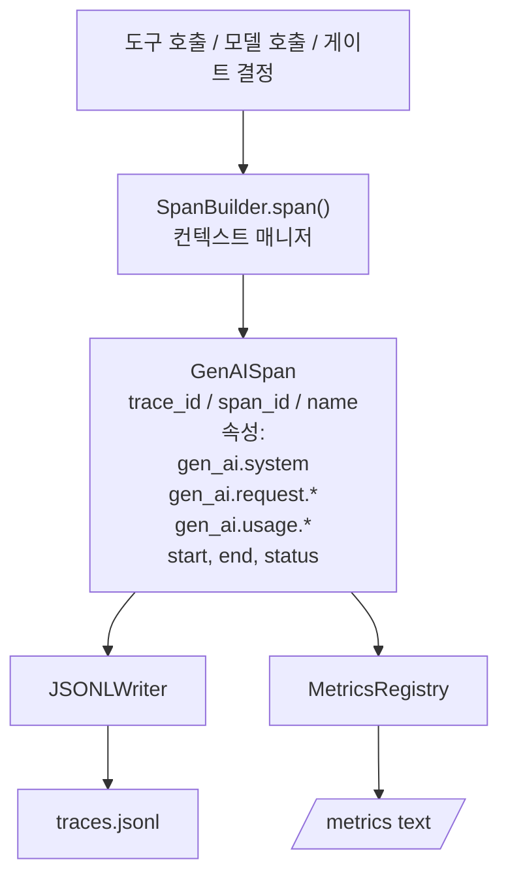
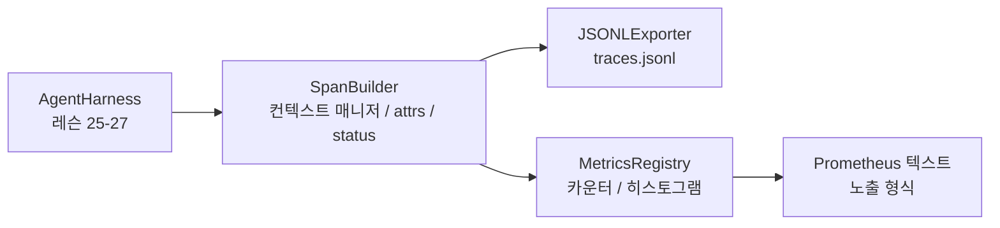

> 🇰🇷 이 문서는 한국어 번역본입니다(ELI5 스타일). 원문: [en.md](en.md)

# 캡스톤 레슨 28: OTel GenAI 스팬과 Prometheus 지표를 통한 관측 가능성

> 관측 가능성(옵저버빌리티)이 없는 에이전트 하네스는 돈만 먹는 블랙박스입니다. 이 레슨은 OpenTelemetry GenAI 시맨틱 컨벤션을 준수하는 레코드를 내보내고, 스팬(span) 하나당 한 줄씩 JSON-Lines 파일에 기록하며, Prometheus 텍스트 형식으로 카운터와 히스토그램을 노출하는 스팬 빌더를 직접 손으로 만듭니다. 전부 stdlib Python이고 오프라인에서 실행됩니다.

**유형:** 만들기(Build)
**사용 언어:** Python (stdlib)
**선수 지식:** 페이즈 19 · 25 (검증 게이트), 페이즈 19 · 26 (샌드박스), 페이즈 19 · 27 (평가 하네스), 페이즈 13 · 20 (OpenTelemetry GenAI), 페이즈 14 · 23 (OTel GenAI 컨벤션)
**소요 시간:** 약 90분

## 학습 목표

- OpenTelemetry GenAI 시맨틱 컨벤션에 맞는 모양의 스팬 데이터 클래스를 만듭니다.
- 자기 완결적인 스팬 하나를 한 줄에 기록하는 JSONL 익스포터(내보내기)를 구현합니다.
- 레이블이 붙은 카운터와 히스토그램, 그리고 Prometheus 텍스트 형식 노출(exposition)을 만듭니다.
- 임의의 콜러블을, 소요 시간·상태·예외를 기록하는 스팬 컨텍스트 매니저로 감쌉니다.
- 내보낸 스팬이 `json.loads` 왕복(round-trip)에도 살아남고 명세의 모양과 일치하는지 검증합니다.

## 문제

프로덕션(운영 환경)의 코딩 에이전트는 매 턴 세 부류의 산출물을 만듭니다: 모델 호출, 도구 실행, 검증 게이트 결정. 구조화된 텔레메트리가 없으면 이 중 어느 것도 쓸모가 없습니다.

첫 번째 실패 모드는 사라진 트레이스입니다. 화요일에 뭔가 잘못됐는데 기록이라고는 500줄짜리 채팅 로그뿐입니다. 어떤 도구가 실행됐는지, 얼마나 걸렸는지, 프롬프트에 토큰이 몇 개 들어갔는지, 게이트가 뭔가를 거부했는지에 대한 기록이 없습니다. 에이전트 작성자는 추측해야 합니다.

두 번째 실패 모드는 파싱 불가능한 트레이스입니다. 하네스는 스팬을 썼지만 자체 임기응변식 필드 이름을 썼습니다. Grafana, Honeycomb, Jaeger, 로컬 CLI 중 어느 것도 그것을 읽을 수 없습니다. 팀 스택에 있는 툴링은 스팬이 비표준이기 때문에 전부 무용지물입니다.

세 번째 실패 모드는 집계되지 않은 지표입니다. 트레이스에서 느린 도구 호출 하나는 볼 수 있지만, "지난 한 시간 동안 read_file 호출의 p95 지연 시간이 얼마인가?"에는 답할 수 없습니다. 지표가 없고 트레이스만 있기 때문입니다.

OpenTelemetry GenAI 시맨틱 컨벤션이 바로 이를 위해 존재합니다. LLM 프레임워크들의 스팬 발신자들이 공유하는 작은 표준 속성 집합을 정의합니다. 여러분의 하네스가 그 속성들을 기록하면, OTel 호환 백엔드는 모두 그것을 읽을 수 있습니다.

## 개념



하네스의 모든 연산은 스팬을 만듭니다. 스팬에는 트레이스 id(에이전트 호출 전체), 스팬 id(이 개별 연산), 이름(예: `gen_ai.chat`, `gen_ai.tool.execution`), GenAI 컨벤션을 따르는 속성, 시작/종료 시각, 상태가 있습니다.

GenAI 컨벤션이 표준화하는 속성 키: `gen_ai.system`(어떤 공급자인지, 예: `anthropic`, `openai`), `gen_ai.request.model`(모델 id), `gen_ai.request.max_tokens`, `gen_ai.usage.input_tokens`, `gen_ai.usage.output_tokens`, `gen_ai.response.model`, `gen_ai.response.id`, `gen_ai.operation.name`, 그리고 도구 전용 키 `gen_ai.tool.name`과 `gen_ai.tool.call.id`.

익스포터는 JSONL을 씁니다. 한 줄에 JSON 객체 하나. 다운스트림 툴링이 스트리밍하고, grep하고, 가져올 수 있는 가장 단순한 형식입니다. 진짜 OTel 익스포터는 OTLP gRPC를 말합니다. 이 레슨의 JSONL 익스포터는 그 오프라인 등가물이며 모든 워크스테이션에서 종료 코드 0으로 끝납니다.

지표는 트레이스 옆에 삽니다. 도구 호출마다 증가하는 카운터: `tools_called_total{tool="read_file"}`. 관찰된 지연 시간을 기록하는 히스토그램: `tool_latency_ms{tool="read_file"}`. 둘 다 풀(pull) 방식 지표의 사실상 표준인 Prometheus 텍스트 노출 형식으로 직렬화됩니다.

```figure
trace-spans
```

## 아키텍처



스팬 빌더는 `span(name, attrs)` 메서드가 컨텍스트 매니저를 반환하는 작은 클래스입니다. 컨텍스트 매니저는 진입 시 시작 시각을, 탈출 시 종료 시각을 기록하고, 예외가 발생했다면 그것을 붙이고, 완성된 스팬을 익스포터로 밀어 넣습니다.

지표 레지스트리는 딕셔너리 두 개입니다. 카운터는 `{(name, frozen_labels): int}`입니다. 히스토그램은 원시 샘플을 목록에 보관하고 노출 시점에 Prometheus 히스토그램 버킷으로 직렬화합니다.

## 여러분이 만들 것

`main.py`가 실어 보내는 것:

1. `GenAISpan` 데이터클래스: trace_id, span_id, parent_span_id, name, attributes, start_unix_nano, end_unix_nano, status, status_message, events.
2. `span(name, attrs, parent=None)` 컨텍스트 매니저를 가진 `SpanBuilder` 클래스.
3. 스팬 하나를 한 줄로 추가하는 `export(span)`가 있는 `JSONLExporter` 클래스.
4. `Counter`와 `Histogram` 클래스, 그리고 `MetricsRegistry`.
5. 텍스트 형식 출력을 만들어 내는 `prometheus_exposition(registry)`.
6. 스팬을 내보내고 지표를 갱신하는 `wrap_tool_call(name)` 데코레이터.
7. 데모: 완전한 에이전트 호출을 합성하고(도구 스팬을 감싸는 gen_ai.chat 스팬), traces.jsonl을 쓰고, Prometheus 노출을 출력하고, 종료 코드 0으로 끝납니다.

스팬 id와 트레이스 id는 `os.urandom`에서 만들어진 16바이트 16진수 문자열입니다. 이것은 OTel의 W3C 트레이스 컨텍스트와 일치합니다. 익스포터는 절대 던지지 않습니다. IO 오류는 노출되지만 하네스는 계속 실행됩니다.

히스토그램은 고정된 버킷 집합을 가집니다(지연 시간 밀리초용 OTel 기본값: 5, 10, 25, 50, 100, 250, 500, 1000, 2500, 5000, 10000, +Inf). 샘플은 목록으로 저장되고, 노출이 요구별 버킷 카운트를 계산합니다.

## 왜 opentelemetry-sdk가 아니라 직접 만들었는가

OTel Python SDK는 진짜 의존성입니다. 수천 줄의 코드, OTLP 익스포터를 위한 여러 프로세스, 그리고 레슨 예산을 집어삼키는 런타임 비용이 있습니다. 직접 만든 버전은 전송 형식을 가르쳐 줍니다. 프로덕션에서는 같은 속성들을 진짜 SDK에 연결해서 OTLP 익스포터, 배치 처리, 리소스 탐지를 공짜로 얻으면 됩니다.

컨벤션은 안정적입니다. 이 레슨이 내보내는 전송 형식은 2030년에도 계속 파싱될 겁니다. OTel은 GenAI 속성 이름을 절대 깨지 않고 새것만 추가하기 때문입니다.

## 트랙 A의 나머지와 어떻게 합쳐지는가

레슨 25는 게이트 체인을 만들었습니다. 레슨 26은 샌드박스를 만들었습니다. 레슨 27은 평가 하네스를 만들었습니다. 레슨 28은 세 가지 모두를 관측 가능하게 만듭니다. 레슨 29는 엔드투엔드 데모의 모든 단계를 스팬으로 감싸고 마지막에 Prometheus 텍스트를 출력합니다.

## 실행 방법

```bash
cd phases/19-capstone-projects/28-observability-otel-traces
python3 code/main.py
python3 -m pytest code/tests/ -v
```

데모는 레슨 작업 디렉터리에 `traces.jsonl`을 내보내고(마지막에 정리됨), 스팬 세 개 샘플을 출력한 뒤, 카운터와 히스토그램의 Prometheus 노출을 출력합니다. 테스트는 스팬이 왕복 직렬화되는지, 표준 GenAI 속성이 존재하는지, 카운터가 올바르게 증가하는지, 히스토그램 노출에 기대한 버킷 카운트가 있는지를 검증합니다.
