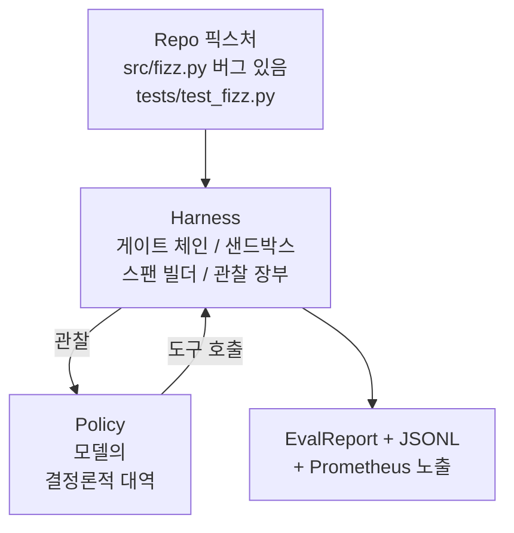
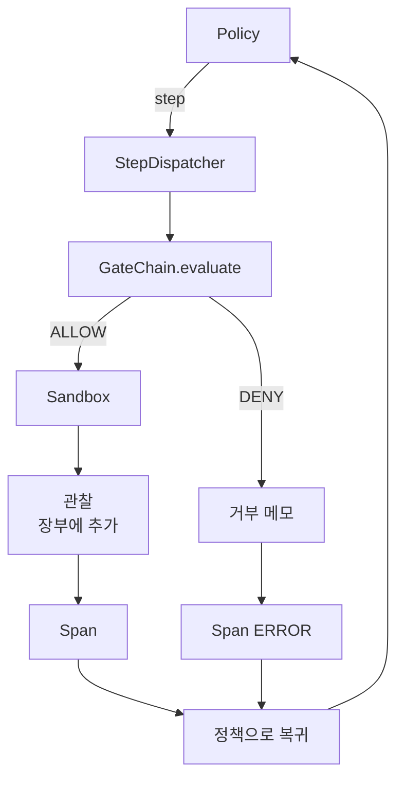

> 🇰🇷 이 문서는 한국어 번역본입니다(ELI5 스타일). 원문: [en.md](en.md)

# 캡스톤 레슨 29: 하네스 위의 엔드투엔드 코딩 에이전트

> 트랙 A의 결실입니다. 이 레슨은 게이트 체인, 샌드박스, 평가 하네스, OTel 스팬을 하나로 엮어, 멀티파일 Python 프로젝트의 실제(작고, 픽스처 규모의) 버그를 고치는 동작하는 코딩 에이전트를 만듭니다. 에이전트는 LLM이 아니라 결정론적 정책입니다. 이 대체 덕분에 레슨이 재현 가능해지고, 하네스가 처음부터 진짜 흥미로운 부분이었다는 것이 드러납니다. 계약은 동일합니다. 진짜 모델이 정책 접합부에 끼워 들어갑니다.

**유형:** 만들기(Build)
**사용 언어:** Python (stdlib)
**선수 지식:** 페이즈 19 · 25 (검증 게이트), 페이즈 19 · 26 (샌드박스), 페이즈 19 · 27 (평가 하네스), 페이즈 19 · 28 (관측 가능성), 페이즈 14 · 38 (검증 게이트), 페이즈 14 · 41 (실제 저장소용 워크벤치), 페이즈 14 · 42 (에이전트 워크벤치 캡스톤)
**소요 시간:** 약 90분

## 학습 목표

- 게이트 체인, 샌드박스, 평가 하네스, 스팬 빌더를 단일 에이전트 루프로 합성합니다.
- read_file, run_tests, write_file을 써서 픽스처 버그를 고치는 결정론적 정책을 구현합니다.
- 엔드투엔드 실행 전체에 전역 단계 예산과 관찰 토큰 예산을 강제합니다.
- 전체 실행에 대해 완전한 OTel GenAI 트레이스와 Prometheus 지표를 내보냅니다.
- 에이전트가 합법적인 도구로 게이트 위반 0회, 12단계 미만으로 픽스처를 해결하는지 검증합니다.

## 문제

대부분의 에이전트 데모는 따로따로는 잘 동작합니다: 샌드박스 혼자서, 평가 하네스 혼자서, 스팬 발신기 혼자서. 문제없어 보입니다. 합성하면 이음새가 드러납니다.

게이트 체인은 ALLOW라고 하는데 샌드박스가 체인이 예상하지 못한 이유로 거부합니다. 평가 하네스는 합격을 기록하는데 OTel 스팬은 에이전트가 사용했다고 주장한 도구가 게이트에서 거부됐다고 말합니다. Prometheus 카운터가 한 번 증가해야 할 곳에서 두 번 증가합니다. 관찰 예산이 초과됐는데 에이전트는 계속 진행합니다. 예산이 체인에서 추적되고 샌드박스는 알지 못했기 때문입니다.

이 레슨은 트랙 전체의 통합 테스트입니다. 에이전트는 네 가지를 순서대로 해야 합니다: 프로젝트를 읽고, 테스트를 실행하고, 테스트 실패에서 버그를 찾아내고, 수정을 쓰고, 테스트를 다시 실행하고, 멈춥니다. 모든 연산은 게이트 체인을 통과합니다. 모든 도구 실행은 샌드박스를 통과합니다. 모든 단계는 스팬으로 감쌉니다. 평가 하네스가 마지막에 전체를 채점합니다.

## 개념



에이전트의 정책은 상태 머신입니다. 다섯 개 상태입니다.

`SURVEY`: 에이전트가 프로젝트 목록을 읽습니다. 다음 상태는 RUN_TESTS입니다.

`RUN_TESTS`: 에이전트가 테스트 명령을 실행합니다. 테스트가 통과하면 상태 머신은 성공으로 멈춥니다. 그렇지 않으면 다음 상태는 INSPECT입니다.

`INSPECT`: 에이전트가 실패하는 소스 파일을 읽습니다. 다음 상태는 FIX입니다.

`FIX`: 에이전트가 수정된 파일을 씁니다. 다음 상태는 VERIFY입니다.

`VERIFY`: 에이전트가 테스트 명령을 다시 실행합니다. 테스트가 통과하면 성공으로 멈춥니다. 그렇지 않으면 실패로 멈춥니다.

각 상태는 도구 호출 하나에 해당합니다. 각 도구 호출은 게이트 체인을 통과합니다. 도구 호출이 거부되면 에이전트는 트레이스에 거부를 기록하고 멈춥니다.

픽스처 버그는 `fizz.py`의 끝값 오류(off-by-one)입니다. 결정론적 정책은 테스트 실패 메시지에서 정규식으로 버그를 감지하고 수정된 파일을 내보냅니다. 정책을 LLM으로 바꿔도 하네스 계약은 변하지 않습니다.

```figure
cg-harness-weave
```

## 아키텍처



이 레슨은 자기완결적입니다. 각 이전 레슨의 원시 요소는 `main.py` 안에 최소 규모로 재구현됩니다(게이트, 샌드박스, 장부, 스팬). 그래야 형제 모듈을 임포트하지 않고도 레슨이 실행됩니다. 이름은 레슨 25-28과 정확히 일치해서 개념적 대응이 모호하지 않습니다.

## 여러분이 만들 것

`main.py`가 실어 보내는 것:

1. 레슨 25-28과 같은 이름으로 복사한 최소 하네스 원시 요소들: `GateChain`, `Sandbox`, `ObservationLedger`, `SpanBuilder`, `MetricsRegistry`.
2. `CodingAgentPolicy` 클래스: 다섯 상태의 상태 머신.
3. `Repo` 헬퍼: 번들된 버그 픽스처로 스크래치 디렉터리를 준비합니다.
4. `AgentRun` 클래스: 정책을 구동하고, 하네스를 통해 디스패치하고, `AgentRunReport`를 반환합니다.
5. 번들된 픽스처(`fixture_repo/`): src/fizz.py, tests/test_fizz.py, 그리고 평가 하네스용 expected/ 트리.
6. 데모: 정책을 엔드투엔드로 실행하고, 단계별 트레이스를 출력하고, 통과를 단언하고, 지표를 출력합니다.

번들된 픽스처는 레슨 27의 과제 구조와 같은 모양입니다: 버그 있는 파일과 테스트 파일. 테스트 실패 메시지에는 결정론적 정책이 수정을 식별하기에 충분한 정보가 들어 있습니다. 진짜 LLM도 같은 일을 할 겁니다. 더 느리고 회수 범위는 넓지만, 하네스의 기대를 바꾸지는 않습니다.

## 왜 정책이 LLM이 아닌가

진짜 LLM은 API 키와 네트워크 호출, 그리고 검증 불가능한 확률성을 요구합니다. 이 레슨이 관심을 두는 부분은 하네스입니다. 결정론적 정책을 대신 넣으면 레슨이 외부 의존성 없이 어떤 개발자 노트북에서도 실행되고, 테스트 스위트가 정확한 단계 수를 단언할 수 있습니다.

이 레슨의 정책은 LLM 에이전트가 하는 일의 엄격한 부분집합입니다. 정책은 저장소를 읽고, 실패하는 테스트를 보고, 줄을 식별하고, 수정을 내보냅니다. LLM은 같은 하네스 계약으로 같은 루프를 통과합니다. 장부 관리는 동일합니다.

## 데모가 단언하는 것

엔드투엔드 데모는 종료 시점에 다섯 가지를 단언하고, 테스트 스위트가 그것들을 프로그램으로 재단언합니다.

정책이 픽스처를 12단계 미만으로 해결했습니다.

관찰 예산이 한 번도 초과되지 않았습니다.

합법적인 도구에서 게이트 거부가 0회 발생했습니다. (에이전트가 거부된 도구 이름을 지어낸 적이 없습니다.)

모든 단계에 traces.jsonl에 대응하는 스팬이 있습니다.

Prometheus 노출에 `tools_called_total{tool="read_file"}` 항목과 `tool_latency_ms` 히스토그램이 있습니다.

## 트랙 A의 나머지와 어떻게 합쳐지는가

이 레슨이 통합입니다. 레슨 25가 게이트 체인을 썼습니다. 레슨 26이 샌드박스를 썼습니다. 레슨 27이 평가 하네스를 썼습니다. 레슨 28이 관측 가능성을 썼습니다. 레슨 29는 그것들이 하나의 시스템으로 동작함을 증명합니다. 진짜 에이전트 하네스는 여기서 확장됩니다: 결정론적 정책을 모델로 바꾸고, 번들 픽스처를 실제 저장소 과제로 바꾸고, JSONL 익스포터를 OTLP로 바꾸세요.

## 실행 방법

```bash
cd phases/19-capstone-projects/29-end-to-end-coding-task-demo
python3 code/main.py
python3 -m pytest code/tests/ -v
```

데모는 단계별 트레이스, 최종 평가 보고서, Prometheus 노출을 출력합니다. 종료 코드는 0입니다. 테스트는 정책 상태 전이, 합성 도구 호출에 대한 게이트 거부, 번들 픽스처에서의 엔드투엔드 실행, 단계 예산 불변식을 다룹니다.
