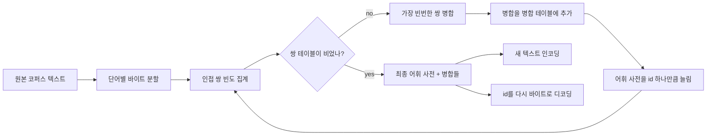
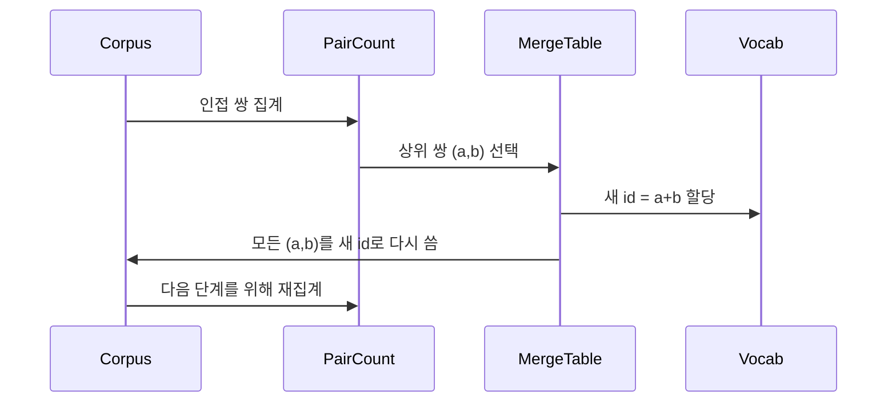

> 🇰🇷 이 문서는 한국어 번역본입니다(ELI5 스타일). 원문: [en.md](en.md)

# 바닥부터 만드는 BPE 토크나이저

> 바이트가 들어가 id가 나오고, id가 다시 같은 바이트로 돌아옵니다. 오늘날 모든 텍스트 모델이 아직도 출발점으로 삼는 토크나이저를 만들어 봅시다.

**유형:** 만들기(Build)
**사용 언어:** Python
**선수 지식:** 페이즈 04 레슨들, 페이즈 07 트랜스포머 레슨들
**소요 시간:** 약 90분

## 학습 목표
- 원시 텍스트 코퍼스에서 가장 빈번한 인접 심볼 쌍을 반복적으로 병합해 Byte-Pair Encoding 어휘 사전(vocabulary)을 학습합니다.
- 결정론적인 병합 테이블을 구현하고 새 텍스트에 적용해 서브워드(subword) id 스트림을 만들어 냅니다.
- 임의의 UTF-8 입력을 정보 손실 없이 id로, 그리고 다시 원래대로 왕복(round-trip)시킵니다.
- 특수 토큰(`<|endoftext|>`, `<|pad|>`)을 예약하고 보호해서 학습과 디코딩 과정에서 살아남게 합니다.
- 왜 바이트 레벨 알파벳이 범용 토크나이저의 올바른 바닥층인지 추론합니다.

```figure
cap-bpe-merge
```

## 프레임

언어 모델은 텍스트를 결코 보지 못합니다. 정수를 봅니다. 문자열을 정수 목록으로, 그리고 다시 문자열로 바꾸는 사상(mapping)이 바로 토크나이저입니다. 이 계층을 잘못 만들면 학습 실행의 모든 손실 곡선이 엉뚱한 것을 측정하고 있는 겁니다.

범용 텍스트 모델을 지배하는 서브워드 토크나이저 계열은 Byte-Pair Encoding입니다. 아이디어는 작습니다. 알려진 알파벳에서 시작합니다. 학습 코퍼스에서 가장 자주 나타나는 인접 심볼 쌍을 찾습니다. 그 쌍을 새 심볼로 병합합니다. 어휘 사전이 목표 크기에 도달할 때까지 반복합니다. 새 텍스트 인코딩은 같은 병합 목록을 같은 순서로 재사용합니다.

우리는 바이트 레벨 변형을 만들 것입니다. 알파벳은 유니코드 코드 포인트가 아니라 256개의 원시 바이트입니다. 이 선택 덕분에 토크나이저가 알 수 없는 토큰으로 후퇴하지 않고도 어떤 UTF-8 입력이든 다룰 수 있습니다.

## 파이프라인



학습 쪽과 추론 쪽은 병합 테이블을 공유합니다. 그 공유가 바로 계약입니다. 추론 때 병합 순서를 바꾸면 다른 id 스트림이 디코딩됩니다.

## 바이트 알파벳

처음 256개 id는 0x00부터 0xFF까지의 원시 바이트용으로 예약됩니다. 덕분에 어떤 입력 문자열이든 병합이 일어나기 전에 어휘 사전으로 표현될 수 있습니다. 바이트 블록 뒤에는 특수 토큰용 작은 범위를 예약합니다. 학습 루프는 그 id들을 병합 대상으로 전혀 제안하지 않는데, 프리토크나이즈된 스트림에서 아예 빼 놓기 때문입니다.

프리토크나이저(pretokenizer)는 학습에 들어가기 전에 코퍼스를 공백과 구두점 경계로 나눕니다. 이 분할이 없으면 BPE 병합 단계가 기꺼이 단어 경계를 넘나드는 병합을 배우고, 어휘 사전이 흔한 구절 통째로 가득 차 버립니다. 분할이 있으면 병합이 단어 안에 머물고 결과가 일반화됩니다.

## 학습 루프

각 학습 단계에서 루프는 세 가지 일을 합니다. 코퍼스의 모든 단어를 훑으며 현재 심볼들의 인접 쌍이 각각 얼마나 자주 나타나는지, 단어 자체의 빈도로 가중해 집계합니다. 가장 높은 개수의 쌍을 고릅니다. 그 쌍이 나타나는 모든 곳을 어휘 사전의 다음 빈 슬롯을 id로 하는 새 심볼 하나로 다시 씁니다. 그리고 병합을 기록합니다.



각 단계의 비용은 심볼 시퀀스 목록으로 표현된 코퍼스 크기에 선형입니다. 백만 단어와 만 개 id 목표 어휘 사전이라면, 병합이 쌓일수록 심볼 시퀀스가 줄어들기 때문에 루프는 몇 초 안에 완주합니다.

## 새 텍스트 인코딩

추론은 병합 카운터를 호출하지 않습니다. 학습된 것과 같은 순서로 병합 테이블을 적용합니다. 새로운 단어에 대해 인코더는 바이트 분할에서 시작합니다. 현재 시퀀스에서 가장 낮은 순위의 병합(적용 가능한 것 중 가장 먼저 학습된 것)을 찾습니다. 그 병합을 수행합니다. 다시 스캔합니다. 테이블의 어떤 병합도 현재 시퀀스에 적용되지 않으면 루프가 끝납니다.

순위 기반 정렬이야말로 인코딩을 결정론적으로 만들고 같은 입력에 대해 학습 동작과 일치시키는 성질입니다. 먼저 학습된 병합이 테이블 상단에 앉아 먼저 적용됩니다. 두 병합이 같은 위치에 적용될 수 있다면 순위가 낮은(먼저 학습된) 쪽이 이깁니다.

## 특수 토큰

특수 토큰은 바이트 스트림이 결코 만들어 낼 수 없는 id입니다. 우리는 손으로 예약합니다. 이 레슨에는 두 개면 충분합니다.

- `<|endoftext|>`는 사전학습 때 문서들을 구분합니다. 모델에게 "여기서 새 문서가 시작된다, 이전 문서의 컨텍스트가 새어 들어가게 하지 마라"고 말해 줍니다.
- `<|pad|>`는 짧은 시퀀스를 채워 배치가 직사각형 텐서가 되게 합니다. 손실 마스크가 학습 중에 이것을 가립니다.

인코더는 입력에 특수 토큰을 허용할지 정하는 플래그를 받습니다. 플래그가 꺼져 있으면 `<|endoftext|>`와 `<|pad|>` 문자열은 그 글자들을 표기하는 바이트들로 토크나이즈됩니다. 플래그가 켜져 있으면 문자 그대로의 문자열들이 예약된 id로 매핑되고 어떤 병합의 대상도 되지 않습니다.

## 왕복 보장

인코딩한 뒤 디코딩하면 입력 바이트가 정확히 반환되어야 합니다. 디코더는 모든 id의 바이트 전개를 순서대로 이어 붙입니다. 모든 id는 원시 바이트이거나 이전에 알려진 두 id의 연결이므로, 재귀적 전개는 항상 원시 바이트에서 끝납니다. 디코딩은 그 바이트들이 표기하는 UTF-8 문자열을 반환합니다.

이 레슨의 테스트 스위트는 보지 못한 문장, 유니코드 이모지가 들어간 문장, 문자 그대로의 `<|endoftext|>` 토큰이 들어간 문장에 대해 이 성질을 검사합니다.

## 이 레슨이 하지 않는 것

가장 큰 프로덕션 토크나이저들 스타일의 정규식 기반 프리토크나이저를 만들지는 않습니다. 이 레슨의 프리토크나이저는 작은 공백·구두점 분할입니다. 작은 학습 코퍼스에서 합리적인 병합을 만들어 내기엔 충분하고, 레슨 체인의 나머지와의 계약도 동일하게 유지됩니다. 다음 레슨은 토크나이저를 블랙박스로 다루고 그 위에 슬라이딩 윈도우 데이터셋을 만듭니다.

쌍 카운터를 병렬화하지는 않습니다. 몇천 단어 코퍼스 위의 Python 루프는 1초도 안에 끝납니다. 더 큰 코퍼스라면 당연한 다음 수는 단어별 쌍 집계를 병렬화하고 리듀스하는 것입니다.

## 코드 읽는 법

`main.py`는 네 가지 객체를 정의합니다. `BPETokenizer`는 어휘 사전, 병합 테이블, 특수 토큰 테이블을 쥡니다. `train`은 학습 루프입니다. `encode`는 추론 경로입니다. `decode`는 바이트 연결입니다. 맨 아래 데모는 내장 코퍼스로 작은 토크나이저를 학습하고, 별도로 보관한 문장을 인코딩하고, id를 다시 디코딩하고, 둘 다 출력합니다. `code/tests/test_bpe.py`의 테스트는 왕복 성질, 특수 토큰 예약, 병합 순서를 고정합니다.

데모를 실행해 보세요. 그다음 데모의 목표 어휘 사전 크기를 300에서 600으로 바꾸고 별도 보관 문장의 인코딩 길이가 줄어드는 걸 보세요. 그 곡선이 바로 BPE 압축 곡선입니다.
