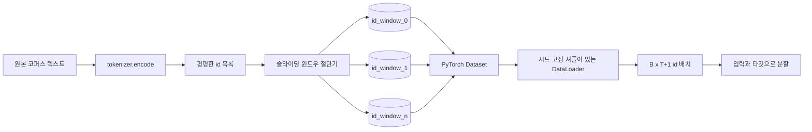
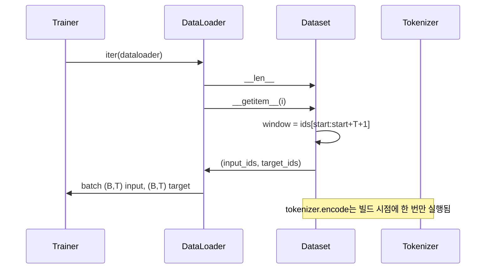

> 🇰🇷 이 문서는 한국어 번역본입니다(ELI5 스타일). 원문: [en.md](en.md)

# 슬라이딩 윈도우가 적용된 토큰화 데이터셋

> 사전학습 실행은 토큰 id를 그래디언트로 바꾸는 함수입니다. 이 레슨은 그 id를 안으로 흘려 보내는 컨베이어 벨트를 만듭니다.

**유형:** 만들기(Build)
**사용 언어:** Python
**선수 지식:** 페이즈 04 레슨들, 페이즈 07 트랜스포머 레슨들, 이 페이즈의 30번 레슨
**소요 시간:** 약 90분

## 학습 목표
- 토크나이저를 한 번 호출해서 원본 코퍼스를 토큰 id 스트림으로 바꿉니다.
- id 스트림을 설정 가능한 겹침 스트라이드(stride)로 고정 길이 윈도우로 자릅니다.
- 다음 토큰 예측용 입력/타깃 텐서를 반환하는 PyTorch Dataset을 만듭니다.
- 에포크마다 시드가 고정된 결정론적 셔플로 데이터셋을 DataLoader로 감쌉니다.
- 스트라이드, 중복도, 유효 데이터셋 크기 사이의 트레이드오프를 추론합니다.

```figure
cap-sliding-window
```

## 프레임

사전학습 실행은 한 번에 배치 하나의 토큰 id를 읽고 모델을 갱신합니다. 각 배치의 모양은 학습 계약이 정합니다. 인과적(causal) 언어 모델의 경우 배치는 `(B, T)` 입력 id와 `(B, T)` 타깃 id를 담으며, 타깃은 입력을 왼쪽으로 하나 민 것입니다. 데이터 파이프라인의 일은 그 계약을, 수 기가바이트의 원본 텍스트 코퍼스로부터, 요구가 있을 때 결정론적이고 재현 가능한 방식으로 만들어 내는 것입니다.

이 레슨은 그 파이프라인을 만듭니다. 이전 레슨의 토크나이저가 텍스트를 길고 평평한 id 목록으로 바꿉니다. 슬라이딩 윈도우가 그 목록을 학습 예제로 자릅니다. 커스텀 Dataset이 예제를 텐서로 노출합니다. DataLoader가 그것들을 배치로 묶고 알려진 시드로 섞습니다.

## 모양 계약

인과적 LM은 `(B, T)` 모양의 id를 소비합니다. `B`는 배치 크기이고 `T`는 컨텍스트 길이입니다. 위치 `t`의 타깃은 위치 `t+1`의 입력입니다. 즉 모든 학습 예제는 `T+1`개의 원시 id를 커버합니다. 윈도우 스트라이드가 연속된 예제 사이의 겹침량을 조절합니다.



절단기는 코퍼스 경계를 넘나들며 겹치지 않습니다. 마지막 윈도우가 `T+1` 위치를 채울 id가 부족하면 절단기는 그것을 버립니다. 꼬리를 `<|pad|>`로 채우는 것도 유효한 선택이지만 손실 마스크가 복잡해집니다. 이 레슨에서는 버립니다.

## 왜 슬라이딩 윈도우인가

사전학습 코퍼스는 한 줄로 이어진 id 스트림입니다. 모델이 겹치지 않는 윈도우만 본다면 모든 학습 예제가 같은 `T` 경계를 가르쳐 줍니다. 스트라이드를 조정하면 그 경계들이 움직여서 모델이 더 다양한 '다음 토큰 예측' 과제를 보게 됩니다.

스트라이드 `T`는 겹치지 않는 윈도우를 만듭니다. 스트라이드 `T // 2`는 50% 겹침을 만들고 유효 데이터셋을 두 배로 늘립니다. 스트라이드 `1`은 최대 겹침을 만들고 데이터셋을 `T`배 늘립니다. 비용은 에포크당 더 많은 연산입니다. 이득은 더 많은 경계 다양성입니다. 대부분의 사전학습 실행은 컨텍스트 길이와 같은 스트라이드를 씁니다. 코퍼스가 이미 모델이 한 에포크에 다 쓰기엔 훨씬 크기 때문에, 경계 다양성 논리의 힘이 약해집니다.

## Dataset 클래스

PyTorch Dataset에는 필수 메서드 두 개가 있습니다. `__len__`은 예제 수를 반환합니다. `__getitem__`은 텐서 쌍 하나의 예제를 반환합니다. 우리의 Dataset은 인코딩된 id 스트림과 스트라이드를 저장합니다. 색인할 때 윈도우 시작점을 즉석에서 계산하므로, 메모리 비용은 스트라이드가 몇 개의 예제를 만들든 id 스트림 사본 한 개입니다.



하나 밀기(shift-by-one)는 `__getitem__` 안에서 일어납니다. Dataset은 `input = window[:-1]`, `target = window[1:]`인 `(input, target)`을 반환합니다. 둘 다 PyTorch long 텐서입니다. 학습 루프는 그것들을 정답(ground truth)으로 다룹니다.

## 결정론적 셔플

`shuffle=True`인 DataLoader는 PyTorch 랜덤 제너레이터에서 읽습니다. 에포크마다 시드가 고정된 명시적 `torch.Generator`를 넘기면, 실행을 다시 시작할 때마다 같은 셔플을 얻습니다. 단일 하이퍼파라미터만 다른 두 실행을 비교하려 할 때 이 성질이 중요합니다. 시드가 없으면 두 실행이 데이터를 다른 순서로 보고, 변경 사항과 무관한 이유로 손실 곡선이 갈라집니다.

이 레슨의 시드 계약은 단순합니다. `epoch_seed = base_seed + epoch_index`. 베이스 시드는 생성 시 넘깁니다. 에포크 인덱스는 트레이너가 각 에포크 시작에서 증가시킵니다. 같은 베이스 시드로 다시 실행하면 모든 에포크에서 항상 같은 순서를 봅니다.

## 배치 샘플러

PyTorch의 기본 샘플러는 복원 없이(non-with-replacement) 균등하게 무작위로 인덱스를 고릅니다. 사전학습에는 바로 그게 원하는 것입니다. 작은 데이터셋 파인튜닝에서도 계약은 같습니다. DataLoader는 `__getitem__`을 `B`번 호출하고 결과를 쌓아 배치를 만듭니다. 모든 예제가 구조적으로 같은 길이이므로 패딩 로직이 필요 없습니다.

이 레슨은 단순함을 위해 `num_workers=0`을 유지합니다. 프로덕션 실행에서는 워커들이 `__getitem__` 호출을 병렬화합니다. 우리 파이프라인에서는 그 일이 메모리 안 텐서의 슬라이스 하나일 뿐이라 사실상 무작동(no-op)이지만, 같은 Dataset API가 워커를 깔끔하게 지원합니다.

## 예제 수 세기

길이 `N`의 id 스트림, 컨텍스트 길이 `T`, 스트라이드 `S`에 대해 예제 수는 `max(0, 1 + (N - (T + 1)) // S)`입니다. 이 레슨은 그 계산을 Dataset의 정적 메서드로 노출해서, 트레이너가 반복 없이 에포크당 총 단계 수를 계산할 수 있게 합니다.

## 이 레슨이 하지 않는 것

디스크에서 스트리밍하지 않습니다. 코퍼스는 메모리에 전부 인코딩되어 단일 텐서로 보관됩니다. 몇백만 개 id 코퍼스라면 100MB도 되지 않고 이 레슨에는 옳은 모양입니다. 디스크 스트리밍은 저장소를 교체하면 끼워 넣을 수 있는 별개의 관심사이며, Dataset 계약은 유지됩니다.

여러 문서를 다루지 않습니다. 코퍼스는 하나의 연속된 id 스트림으로 취급됩니다. 여러 문서로부터 코퍼스를 만들 때는 `<|endoftext|>` id를 삽입해 다음 문서 경계를 인코딩합니다. 모델은 경계 주변을 예측하도록 학습합니다.

## 코드 읽는 법

`main.py`는 두 클래스와 하나의 헬퍼를 정의합니다. `SlidingWindowDataset`은 PyTorch Dataset입니다. `make_dataloader`는 시드 고정 제너레이터가 설정된 DataLoader를 반환합니다. `_encode_corpus_to_ids`는 일회성 토크나이저 호출입니다. 맨 아래 데모는 인프로세스로 작은 토크나이저를 만들고, 내장 코퍼스를 인코딩하고, 데이터셋과 데이터로더를 구성하고, 배치 하나를 출력하고, 모양 계약을 단언합니다. `code/tests/test_dataset.py`의 테스트는 윈도우 수 공식, 하나 밀기 성질, 결정론적 셔플, 스트라이드 트레이드오프를 고정합니다.

데모를 실행해 보세요. 그다음 컨텍스트 길이를 16에서 32로 바꾸고 에포크당 예제 수가 떨어지는 걸 보세요. 그 숫자가 여러분의 에포크당 단계 예산입니다.
