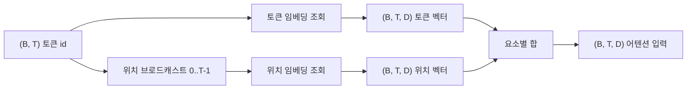
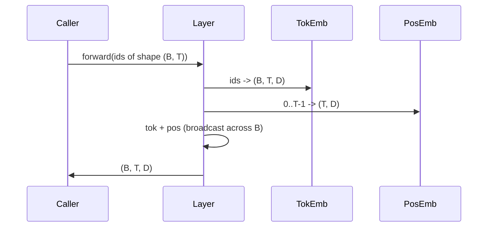

> 🇰🇷 이 문서는 한국어 번역본입니다(ELI5 스타일). 원문: [en.md](en.md)

# 토큰 임베딩과 위치 임베딩

> id는 정수입니다. 모델은 벡터를 원합니다. 둘 사이에 룩업 테이블 두 개가 놓이는데, 위치 쪽 선택이 모델이 배울 수 있는 것의 모양을 결정합니다.

**유형:** 만들기(Build)
**사용 언어:** Python
**선수 지식:** 페이즈 04 레슨들, 페이즈 07 트랜스포머 레슨들, 이 페이즈의 30번과 31번 레슨
**소요 시간:** 약 90분

## 학습 목표
- 어휘 사전 id를 밀집 벡터로 매핑하는 토큰 임베딩 룩업 테이블을 만듭니다.
- 위치로 색인되는 학습된(learned) 위치 임베딩 룩업 테이블을 만듭니다.
- 매개변수 없이 위치로 색인되는 고정된 사인형(sinusoidal) 위치 임베딩을 만듭니다.
- 토큰 임베딩과 위치 임베딩을 트랜스포머 블록의 단일 입력으로 합성합니다.
- 길이 일반화와 매개변수 수 측면에서 학습된 임베딩과 사인형 임베딩을 비교합니다.

```figure
cc-embedding-lookup
```

## 프레임

토큰 id와 모델의 첫 접촉은 토큰 임베딩 행렬에서의 행 조회입니다. 행렬은 어휘 사전 id당 한 행, 모델 차원당 한 열을 가집니다. 조회가 반환한 벡터를 모델의 나머지 부분은 그 id의 의미로 취급합니다. 역전파는 순전파에서 쓰인 행들을 갱신합니다. 학습이 진행되면서 그 행들의 기하 구조가 방향 안에 유사성을 부호화하도록 배웁니다.

토큰 id만으로는 순서가 없습니다. 모델에게는 위치 1과 위치 17이 다르다는 것을 알려 주는 두 번째 신호가 필요합니다. 그 신호의 두 지배적 선택은 학습된 위치 임베딩(위치당 한 행을 가진 두 번째 룩업 테이블)과 고정된 사인형 위치 임베딩(매개변수가 없는 수학 공식)입니다. 선택에는 결과가 따릅니다. 학습된 테이블은 매개변수이며 모델이 학습한 최대 컨텍스트 길이로 한정됩니다. 사인형 테이블은 이론상 매개변수가 없고 공식은 어떤 위치로든 확장되지만, 이 레슨의 `SinusoidalPositionalEmbedding`은 `max_context_length` 크기의 고정 테이블을 미리 계산하고 그 한계를 넘으면 `forward`가 예외를 던집니다. 따라서 두 모듈 모두 여기서는 최대 컨텍스트 길이를 강제합니다. 테이블이 충분히 커서 색인할 수 있더라도 모델은 학습 길이를 넘어서면 여전히 버벅일 수 있습니다.

이 레슨은 둘 다 만들고, 토큰 임베딩과 합성해 다음 레슨의 어텐션 블록 입력을 만듭니다.

## 모양 계약

임베딩 단계의 입력은 `(B, T)` 모양의 토큰 id 배치입니다. 출력은 `(B, T, D)` 텐서이며 `D`는 모델 차원입니다. 모든 배치 요소는 같은 컨텍스트 길이 `T`를 가집니다. 모든 위치는 같은 벡터 차원 `D`를 가집니다.



합성은 연결(concatenation)이 아니라 합입니다. 합을 쓰면 `D`가 네트워크 전체에서 일정하게 유지되고, 모델이 각 계층에서 토큰 의미와 위치 중 어느 쪽이 지배하는지 특성별로 스스로 결정할 수 있습니다.

## 토큰 임베딩 행렬

토큰 임베딩은 `(V, D)` 모양의 매개변수 텐서이며 `V`는 어휘 사전 크기입니다. PyTorch는 이것을 `nn.Embedding(V, D)`로 노출합니다. 초기화 시 항목들은 작은 가우시안에서 뽑히며, 전통적으로 트랜스포머 규모 모델에서는 평균 0, 표준편차 약 `0.02`입니다. 정확한 초기화 값보다 실행 간에 일관되게 유지되는 것이 더 중요합니다.

순전파는 단일 색인 연산입니다. PyTorch는 `(B, T)` int64 id를 행을 모아서(gather) `(B, T, D)` float로 매핑합니다. 역전파는 순전파에서 건드려진 행들에만 그래디언트를 쌓습니다. 배치에 한 번도 나타나지 않은 두 행은 그 단계에서 0 그래디언트를 받습니다.

미묘한 세부 하나. 토큰 임베딩과 모델 끝의 출력 투영은 종종 가중치를 공유합니다(weight tying, 가중치 묶기). 그렇게 되면 모든 역전파가 출력 쪽을 통해 임베딩의 모든 행을 건드립니다. 이 레슨은 둘을 별개 모듈로 노출하지만, 완전한 모델에서는 같은 행렬이 두 역할을 다할 수 있습니다.

## 학습된 위치 임베딩

학습된 위치 임베딩은 `(max_context_length, D)` 모양의 두 번째 `nn.Embedding`입니다. 조회는 위치 id `0, 1, 2, ..., T-1`로 키가 매겨집니다. 순전파는 그 위치 벡터를 배치 차원을 따라 브로드캐스트합니다.

학습된 테이블의 단점은 모델이 위치 `T-1`까지만 학습했다면 위치 `T`에서 질의할 수 없다는 것입니다. 행이 존재하지 않습니다. 이 방식을 쓰는 프로덕션 디코더 전용(decoder-only) 모델들은 최대 컨텍스트 길이를 아키텍처에 박아 넣고 더 긴 입력의 처리를 거부합니다.

## 사인형 위치 임베딩

사인형 위치 임베딩은 위치를 벡터로 바꾸는 함수입니다. 위치 `p`와 특성 `i`는 다음을 만듭니다.

```python
angle = p / (10000 ** (2 * (i // 2) / D))
emb[p, 2k]     = sin(angle)
emb[p, 2k + 1] = cos(angle)
```

이 함수에는 매개변수가 없습니다. 모든 위치가 고유한 벡터를 가집니다. 파장이 특성 차원을 따라 기하급수적으로 변하기 때문에, 낮은 차원은 대략적인 위치를, 높은 차원은 세밀한 위치를 부호화합니다.

`sin`과 `cos`을 함께 선택한 것에서 나오는 성질은, 위치 `p + k`의 벡터가 위치 `p`의 벡터의 선형 함수라는 것입니다. 이는 어텐션 계층에 상대적 위치 오프셋을 학습하기 쉬운 길을 줍니다. 모델이 "다섯 토큰 뒤를 봐라"를 표현하는 데 별도의 매개변수가 필요 없습니다.

이 레슨은 전체 사인형 테이블을 생성 시점에 한 번 계산하고 순전파 시점에 색인합니다.

## 합성

입력 파이프라인은 순서대로 세 가지 일을 합니다. 토큰 id를 읽습니다. 토큰 벡터를 조회합니다. 위치 벡터를 더합니다. 합을 반환합니다.



합 단계의 브로드캐스팅은 `(T, D)` 위치 텐서를 배치 차원을 따라 복제합니다. 위치 텐서가 unsqueeze 후 `(1, T, D)` 모양이 되기 때문에 PyTorch가 자동으로 처리합니다.

## 비교 분석

이 레슨은 두 변형을 같은 입력에 실행하고 두 가지 진단을 출력합니다.

첫째는 매개변수 수입니다. 학습된 변형은 토큰 임베딩 위에 `max_context_length * D`개의 매개변수를 더합니다. 사인형 변형은 0을 더합니다.

둘째는 인접 위치 임베딩 사이의 코사인 유사도입니다. 사인형 변형은 함수가 연속이므로 매끄럽고 예측 가능한 감쇠를 보입니다. 학습된 변형은 초기화 시점에 행들이 독립적으로 뽑히기 때문에 거의 무작위에 가까운 유사도를 가집니다. 학습 후에는 학습된 변형도 전형적으로 비슷한 매끄러운 구조를 발전시키지만, 그 구조를 데이터로부터 발견해야 합니다.

## 이 레슨이 하지 않는 것

회전 위치 인코딩(rotary positional encoding, RoPE)이나 AliBi를 만들지는 않습니다. 이것들이 프로덕션 트랜스포머의 현대적 선택입니다. 둘 다 여기의 임베딩들과 같은 모양 계약을 따르지만(`(B, T, D)` 벡터에 위치 의존 변환 적용) 입력이 아니라 어텐션 투영 단계에서 적용됩니다. 다음 레슨은 어텐션 블록을 만들고, 선택적 확장 중 하나는 거기를 쿼리-키 투영에 회전식을 접어 넣는 것입니다.

임베딩을 학습시키지는 않습니다. 학습에는 손실이 필요하고, 손실에는 모델 출력이 필요하고, 모델 출력에는 어텐션과 LM 헤드가 필요합니다. 그것은 다음 레슨과 그다음 레슨의 몫입니다.

## 코드 읽는 법

`main.py`는 세 모듈을 정의합니다. `TokenEmbedding`은 `nn.Embedding(V, D)`를 감쌉니다. `LearnedPositionalEmbedding`은 `nn.Embedding(L, D)`를 감쌉니다. `SinusoidalPositionalEmbedding`은 테이블을 미리 계산해 버퍼(buffer)로 노출합니다. `EmbeddingComposer`는 토큰 임베딩과 위치 임베딩을 하나로 묶습니다. 맨 아래 데모는 모양, 매개변수 수, 인접 위치 유사도 진단을 출력합니다. `code/tests/test_embeddings.py`의 테스트는 모양, 브로드캐스트 동작, 매개변수 수, 사인형 공식을 고정합니다.

데모를 실행해 보세요. 그다음 모델 차원 `D`를 64에서 32로 바꾸고 사인형 파장 띠가 어떻게 변하는지 보세요.
