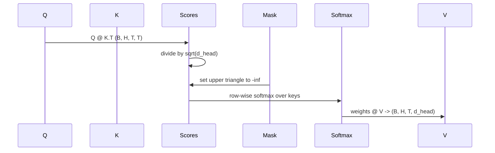

> 🇰🇷 이 문서는 한국어 번역본입니다(ELI5 스타일). 원문: [en.md](en.md)

# 멀티 헤드 셀프 어텐션(Multi-Head Self-Attention)


> 하나의 선형 투영, 세 개의 view, H개의 병렬 헤드, 하나의 마스크. 모델이 실제로 사용하는 방식 그대로의 어텐션 블록입니다.

**유형:** Build
**언어:** Python
**선수 지식:** 페이즈 04 레슨, 페이즈 07 트랜스포머 레슨, 이 페이즈의 30~32번 레슨
**시간:** 약 90분

## 학습 목표
- 쿼리(Query)/키(Key)/값(Value) 투영을 하나의 선형 레이어로 구현한 뒤 H개 헤드로 나누는, 배치 처리된 방식을 구현합니다.
- 올바른 정규화와 dtype 처리를 적용해 스케일드 닷프로덕트 어텐션(scaled dot-product attention)을 계산합니다.
- 어떤 위치가 미래 위치를 참조하지 못하게 막는 인과 마스크(causal mask)를 적용합니다.
- 고정된 입력에 대해 헤드별 어텐션 가중치를 살펴보고, 각 헤드가 무엇을 보고 있는지 추론해 봅니다.
- 장난감 과제에서 작은 어텐션 블록을 학습시키고, 헤드들이 역할을 나누며 손실이 떨어지는 것을 관찰합니다.

```figure
cap-multihead-attention
```

## 프레임 잡기

어텐션은 어떤 토큰의 표현(representation)이 같은 시퀀스 안의 다른 토큰들에서 정보를 끌어올 수 있게 해 주는 함수입니다. 셀프 어텐션은 쿼리, 키, 값을 모두 같은 입력에서 만든다는 뜻입니다. 멀티 헤드는 그 투영을 H개의 병렬 어텐션 문제로 쪼개고, 그 출력들을 이어 붙인 다음 다시 투영한다는 의미입니다.

효율적인 구현 패턴은 이렇습니다. `D`에서 `3 * D`로 투영하는 선형 레이어 하나를 만들고, 그 결과를 세 개의 view로 자른 뒤, 크기 `D // H`짜리 헤드 H개로 재구성(reshape)합니다. 행렬 곱, 소프트맥스, 가중 합은 모두 배치 텐서 연산으로 처리하기 때문에, 가속기(accelerator) 위에서 헤드들이 병렬로 실행됩니다.

이 레슨은 바로 그 블록을 만듭니다. 그리고 인과 마스크도 추가해서, 같은 코드가 디코더 전용(decoder-only) 언어 모델의 어텐션 레이어로 동작하도록 합니다. 다음 레슨에서는 이 블록을 쌓아 완전한 트랜스포머를 만들고, 그다음 레슨에서 학습시킵니다.

## 형상(shape) 계약

입력은 `(B, T, D)`이고 출력도 `(B, T, D)`입니다. 마스크는 `(T, T)`이거나 그 크기로 브로드캐스트 가능해야 합니다. 블록 내부에서 중간 텐서들은 `(B, H, T, d_head)` 형상을 가지며, 여기서 `d_head = D // H`입니다. 제약 조건은 `D % H == 0`입니다.

```mermaid
flowchart LR
    A["(B, T, D) input"] --> B[Linear D -> 3D]
    B --> C["split into Q, K, V"]
    C --> D["reshape to (B, H, T, d_head)"]
    D --> E["scores = Q @ K.T / sqrt(d_head)"]
    E --> F[apply causal mask]
    F --> G[softmax over keys]
    G --> H["context = weights @ V"]
    H --> I["reshape to (B, T, D)"]
    I --> J[output Linear D -> D]
    J --> K["(B, T, D) output"]
```



두 개의 선형 레이어(QKV 투영과 출력 투영)가 이 블록의 유일한 파라미터입니다. 마스크, 소프트맥스, 행렬 곱, 재구성은 모두 파라미터가 없는 연산입니다.

## QKV 분할

순진한 구현은 Q, K, V 각각에 선형 레이어 하나씩, 총 세 개를 사용합니다. 효율적인 구현은 `3 * D`개의 특성(feature)을 출력하는 레이어 하나로 결과를 나눕니다. 둘은 수학적으로 동등합니다. `(D, D)` 가중치 세 개로 행렬 곱을 따로 하는 것은, 그것들을 쌓아 만든 `(3D, D)` 가중치 하나로 행렬 곱을 하는 것과 정확히 같기 때문입니다.

효율적인 버전이 더 빠른 이유는 가속기가 행렬 곱을 세 번이 아니라 한 번만 실행하기 때문입니다. 초기화도 더 쉽습니다. 세 개의 하위 행렬이 같은 파라미터 텐서 안에 함께 살아 있어서 한 번에 초기화할 수 있기 때문입니다.

## 헤드 재구성(head reshape)

분할 후 Q, K, V 각각은 `(B, T, D)`입니다. 이것을 H개의 병렬 어텐션 문제로 바꾸려면 `(B, T, H, d_head)`로 재구성한 다음 `(B, H, T, d_head)`로 전치(transpose)합니다. 이제 헤드 차원이 배치 차원 바로 옆에 붙어 있어서, PyTorch는 헤드별 어텐션을 `B * H`개의 독립적인 인스턴스에 대한 배치 연산으로 취급합니다.

`d_head` 차원은 마지막에 그대로 두어야 점수 행렬 곱 `Q @ K.transpose(-2, -1)`이 그 차원을 정확히 맞춰 축약합니다. 결과는 헤드별 어텐션 점수 `(B, H, T, T)`입니다.

## 스케일링(scaling)

점수는 소프트맥스 전에 `sqrt(d_head)`로 나눕니다. 이 스케일링이 없으면 `d_head`가 커질 때 점곱(dot product) 값도 함께 커져서, 소프트맥스가 한 항목에 거의 모든 확률 질량이 몰리고 나머지는 사실상 0에 가까워지는 상태로 빠집니다. 그 상태에서는 기울기(gradient)가 아주 작아져서 학습이 멈춥니다. `sqrt(d_head)`로 나누면 점수의 분산이 헤드 크기와 관계없이 대략 일정하게 유지됩니다.

## 인과 마스크(causal mask)

디코더 전용 언어 모델은 다음 토큰을 예측할 때 과거 정보만 근거로 삼을 수 있습니다. 마스크가 바로 그걸 강제합니다. 구체적으로는, 소프트맥스 전에 `(T, T)` 점수 행렬의 대각선 위쪽 항목을 모두 음의 무한대로 바꿉니다. 소프트맥스 후에는 그 위치들의 가중치가 0이 됩니다.



마스크는 생성자에서 버퍼(buffer)로 등록합니다. 그러면 모델과 같은 장치(device)에 함께 살면서, 기울기 그래프에는 포함되지 않습니다. 마스크는 이 블록이 볼 수 있는 최대 컨텍스트 길이를 전부 커버하도록 만들어 두고, 순전파 시점에 왼쪽 위 `(T, T)` 부분만 잘라 씁니다.

## 출력 투영(output projection)

헤드별 컨텍스트 벡터 `(B, H, T, d_head)`를 얻은 뒤에는 `(B, T, H, d_head)`로 다시 전치하고, `(B, T, D)`로 재구성한 다음, 마지막으로 `(D, D)` 선형 투영을 적용합니다. 이 출력 투영이 있어야 모델이 헤드들을 섞을 수 있습니다. 이게 없으면 H개 헤드의 결과는 이후 레이어를 통해서만 재결합될 수 있어서, 블록이 인위적으로 제약을 받게 됩니다.

## 어텐션 가중치 들여다보기

이 레슨은 순전파에 `return_weights=True` 플래그를 제공합니다. 이 플래그를 켜면 블록이 출력과 함께 `(B, H, T, T)` 형상의 헤드별 어텐션 가중치를 반환합니다. 데모는 짧은 입력에 대해 한 헤드의 가중치 히트맵(heatmap)을 출력해서, 인과 삼각형 구조와 위치별 집중 지점을 눈으로 확인할 수 있게 해 줍니다.

학습된 모델에서는 헤드마다 서로 다른 패턴을 배웁니다. 어떤 헤드는 바로 앞 토큰만 보고, 어떤 헤드는 시퀀스의 시작을 보고, 어떤 헤드는 어텐션을 거의 고르게 흩뿌립니다. 이 들여다보기 훅(hook)이 바로 그런 해석 가능성(interpretability) 작업의 출발점입니다.

## 학습 데모

`main.py` 아래쪽의 데모는 어텐션 블록을 아주 작은 LM 헤드에 연결해서, 반복(copy) 과제 전체를 학습시킵니다. 입력의 각 행은 하나의 무작위 id를 컨텍스트 길이만큼 반복한 것입니다. 타깃은 입력을 한 칸 밀린(shifted) 것이라서, 모델은 "다음 토큰은 이전 토큰과 같다"는 것을 배워야 합니다. 손실은 크로스 엔트로피입니다. H=4, D=32, T=12, 어휘 크기 64 조건에서, 손실은 무작위 수준(`log(64) ~ 4.16` 근처)에서 시작해 세 에포크 만에 CPU에서도 `1.0`보다 훨씬 아래로 떨어집니다.

데모의 목적은 쓸모 있는 모델을 만드는 게 아닙니다. 블록의 모든 부분으로 기울기가 제대로 흐르는지, 그리고 답이 뻔한 문제에서 헤드들이 뭔가를 배우는지 확인하는 것이 목적입니다.

## 이 레슨이 하지 않는 것

피드포워드(feed-forward) 블록은 추가하지 않습니다. 실제 모델의 트랜스포머 레이어는 어텐션 뒤에 두 층짜리 MLP가 이어지고, 각각 주변에 잔차 연결(residual connection)과 레이어 정규화(layer norm)가 감싸는 구조입니다. 다음 레슨에서 이것들을 추가합니다.

로터리(rotary)나 AliBi 위치 인코딩도 구현하지 않습니다. 둘 다 이 블록의 QKV 투영 단계에서 적용되지만, 별도의 학습 단위입니다. 여기서 만든 블록은 행렬 곱 전에 Q와 K를 변환함으로써 어느 쪽이든 호환됩니다.

추론용 KV 캐시도 구현하지 않습니다. 키와 값을 순전파들 사이에서 캐싱하는 것이 자기회귀(autoregressive) 디코딩을 빠르게 만드는 최적화입니다. 이것은 K와 V 텐서의 형상 계약은 바꾸지만 Q는 바꾸지 않습니다. 추론 레슨에서 다룹니다.

## 코드 읽는 법

`main.py`는 `MultiHeadSelfAttention`을 정의합니다. 이 클래스는 선형 레이어 두 개와 등록된 마스크 버퍼를 가집니다. 순전파는 투영하고, 재구성하고, 점수를 계산하고, 마스크를 적용하고, 소프트맥스를 하고, 가중합하고, 다시 재구성하고, 다시 투영합니다. 아래쪽 데모는 어텐션을 토큰 임베딩과 위치 임베딩, LM 헤드로 감싼 작은 모델을 만들어 복사 과제로 세 에포크 학습시키고, 손실 곡선과 헤드별 어텐션 히트맵을 출력합니다. `code/tests/test_attention.py`의 테스트는 형상 계약, 인과성(causality) 속성, 소프트맥스 속성, 헤드 분할 속성, 기울기 흐름을 고정합니다.

데모를 실행해 보세요. 그다음 `n_heads`를 4에서 8로 늘려 보세요(이때 `d_model=32`를 유지하므로 `d_head=4`가 됩니다). 히트맵이 어떻게 달라지는지 관찰해 보세요.
