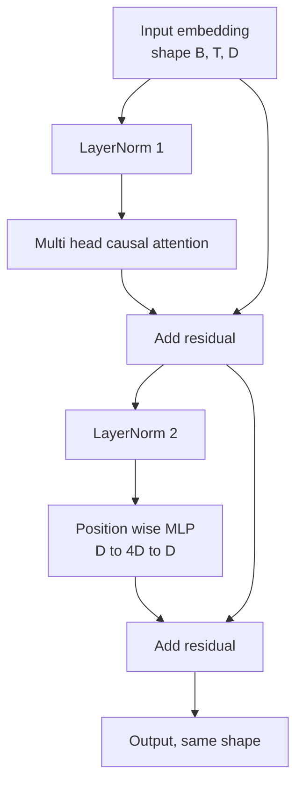
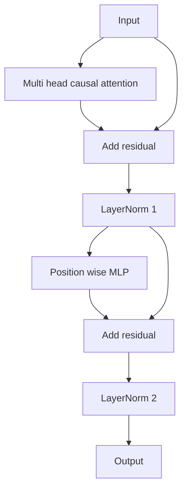

> 🇰🇷 이 문서는 한국어 번역본입니다(ELI5 스타일). 원문: [en.md](en.md)

# 트랜스포머 블록 직접 만들기


> 하나의 블록이 모든 현대 디코더 LLM의 기본 단위입니다. 레이어 정규화, 멀티 헤드 어텐션, 잔차 연결, MLP, 잔차 연결. pre-LN 방식은 워밍업 없이도 안정적으로 학습됩니다. post-LN 방식은 원논문이 출시했던 방식이죠. 이 레슨은 둘을 나란히 만들어 보고, 흔한 학습률에서 12층 스택으로 쌓았을 때 어느 쪽이 버티는지 보여 줍니다.

**유형:** Build
**언어:** Python
**선수 지식:** 페이즈 19의 30~33번 레슨 (토크나이저, 임베딩, 어텐션 수학, 배치 데이터 로더)
**시간:** 약 90분

## 학습 목표

- LayerNorm, 멀티 헤드 인과 어텐션, 잔차 연결(residual connection), 위치별(position-wise) MLP라는 네 가지 부품으로 PyTorch 트랜스포머 블록을 만듭니다.
- LayerNorm을 두 가지 배치(pre-LN과 post-LN)로 놓아 보고, 어느 한쪽이 왜 워밍업 없이도 안정적으로 학습되는지 설명합니다.
- 멀티 헤드 어텐션 안에 인과 마스킹을 구현해서, 토큰 `i`가 토큰 `j > i`를 보지 못하게 만듭니다.
- 12층 스택에서 두 방식을 통과하는 기울기 흐름을 추적하고, 대충 감으로가 아니라 결과를 제대로 읽어 냅니다.
- 다음 레슨에서 1억 2,400만 개 파라미터짜리 GPT를 조립할 때, 이 블록을 그대로 갖다 쓸 수 있는 부품으로 재사용합니다.

## 문제 상황

트랜스포머는 하나의 블록을 반복한 것입니다. 블록을 한 번만 잘못 만들어도 그것을 열두 번 반복하는 순간, 첫 에포크에서 발산하거나 남은 학습 내내 워밍업 편법이 필요한 모델이 완성됩니다. 이 레슨에서 보게 될 두 실패 양상은 특이한 것들이 아닙니다. 초보 학습자가 블록을 순진하게 쌓는 순간 바로 나타나는 문제들입니다. 하나는 어텐션 레이어가 미래를 훔쳐보는 것이고, 다른 하나는 LayerNorm이 깊은 곳에서 잔차 신호를 다스릴 수 없는 위치에 놓이는 것입니다.

일단 원인을 보면 해결책은 기계적입니다. 블록에는 정확히 두 개의 잔차 경로와 정확히 두 개의 정규화 위치가 있습니다. 위치만 올바르게 고르면, 스택의 나머지는 그저 장부 정리(bookkeeping)일 뿐입니다.

## 개념

모든 디코더 전용 트랜스포머 블록은 `(batch, sequence, embedding)` 형상의 텐서를 받아 같은 형상의 텐서를 돌려주는 함수입니다. 내부에서는 두 개의 하위 레이어(sublayer)가 일을 합니다.



이것이 pre-LN 방식입니다. LayerNorm이 잔차 분기 안쪽, 하위 레이어 바로 앞에 놓입니다. 잔차 연결은 정규화되지 않은 신호를 그대로 앞으로 전달합니다.

post-LN 방식은 LayerNorm을 잔차 합산 이후로 옮깁니다.



형상은 동일합니다. 하지만 학습 거동은 다릅니다. post-LN에서는 잔차 경로를 통해 되돌아오는 기울기가 LayerNorm을 통과해야 합니다. 깊이 12, 학습률 `3e-4` 조건에서는 그 기울기가 워밍업 스케줄이 필요할 만큼 빠르게 줄어듭니다. pre-LN은 잔차 경로를 정규화하지 않은 채로 두기 때문에 기울기가 임베딩 레이어까지 깨끗하게 전파됩니다. 그래서 GPT-2 이후로는 pre-LN 구성을 씁니다.

### 인과적 멀티 헤드 어텐션

어텐션 하위 레이어는 입력을 세 가지 방식으로 투영해 쿼리, 키, 값 텐서를 만듭니다. 각 텐서는 `(B, T, D)`에서 `(B, H, T, D/H)`로 재구성됩니다. 여기서 `H`는 헤드 개수입니다. 스케일드 닷프로덕트 어텐션은 헤드별로 `softmax(Q K^T / sqrt(d_k))`를 계산하고, 상단 삼각형을 음의 무한대로 마스킹한 뒤, 그 마스크를 소프트맥스에 반영하고 `V`를 곱합니다. 헤드들은 다시 하나의 `(B, T, D)` 텐서로 이어 붙여지고 한 번 더 투영됩니다. 모델을 인과적으로 만드는 부품은 이 마스크가 유일합니다. 마스크를 빼먹으면 컨닝하는 모델을 학습시키는 셈입니다.

### MLP

위치별 MLP는 같은 두 층짜리 네트워크를 모든 토큰에 독립적으로 적용합니다. 은닉 폭은 임베딩 폭의 4배, 활성화 함수는 GELU이고, 두 번째 선형 레이어 뒤에 드롭아웃이 따라옵니다. MLP 안에서는 토큰들이 서로 대화하지 않습니다. 토큰을 섞는 일은 전부 어텐션에서 일어납니다.

### 잔차 연결이 하는 두 가지 일

잔차 연결은 기울기 경로를 깊이 방향으로 덧셈이 가능하게 만들어, 12층을 통과하는 동안에도 기울기 노름(norm)이 적정 크기를 유지하게 해 줍니다. 또한 각 블록이 실행 중인 표현을 완전히 갈아엎는 대신 덧셈식 업데이트만 학습하게 해 줍니다. 블록이 깊게 쌓을 수 있는 이유는 바로 이 두 효과 때문입니다.

```figure
cc-transformer-block
```

## 만들어 보기

`code/main.py`는 다음을 구현합니다:

- 학습 가능한 스케일과 이동(shift), 편향된 eps를 가지고 토큰 벡터별로 적용되는 `class LayerNorm`
- `num_heads`, `head_dim = d_model // num_heads`, 퓨즈드(fused) QKV 투영, 등록된 인과 마스크, 어텐션 및 잔차 드롭아웃을 갖는 `class MultiHeadAttention`
- 두 개의 선형 레이어, GELU 활성화, 드롭아웃을 갖는 `class FeedForward`
- 두 방식을 전환하는 `pre_ln` 플래그를 갖는 `class TransformerBlock`
- 동일한 입력으로 6층 pre-LN 스택과 6층 post-LN 스택을 만들고, (a) 출력 형상, (b) 한 번의 역전파 후 임베딩에서의 기울기 노름을 출력하는 데모

실행:

```bash
python3 code/main.py
```

출력: 두 스택의 형상 검사와, 나란히 놓인 기울기 노름. 같은 학습률에서 pre-LN 스택의 임베딩 기울기가 post-LN 스택보다 한 자릿수 이상 큽니다. 이것이 pre-LN이 워밍업 없이 학습된다는 경험적 신호입니다.

## 스택

- 텐서 수학, autograd(자동 미분), `nn.Module` 연결을 위한 `torch`
- `transformers` 없음, 사전학습 가중치 없음. 블록은 프리미티브(기본 요소)부터 직접 구현합니다.

## 실전 프로덕션 패턴

세 가지 패턴이 교과서식 블록을 출시 가능한 것으로 바꿔 줍니다.

**퓨즈드 QKV 투영.** 선형 레이어 세 개를 따로 두면 커널 실행 세 번과 행렬 곱 세 번이 필요합니다. 폭 `3 * d_model`짜리 선형 레이어 하나는 같은 일을 한 번의 실행으로 처리한 뒤, 마지막 축을 따라 출력을 자릅니다. 퓨즈드 경로는 모든 가속기에서 더 빠르고, GPT-2, LLaMA, Mistral의 참조 구현들이 모두 쓰는 방식이기도 합니다.

**등록된 인과 마스크 버퍼.** 마스크는 최대 컨텍스트 길이에만 의존합니다. 생성 시점에 `register_buffer`로 한 번 할당하고, 순전파마다 활성 윈도우만 잘라 쓰면, 호출할 때마다 할당하는 낭비를 건너뛸 수 있습니다. 이걸 잊으면 긴 컨텍스트에서 마스크가 메모리 할당 병목 지점이 됩니다.

**드롭아웃은 세 곳이 아니라 두 곳에.** 드롭아웃은 어텐션 소프트맥스 뒤(어텐션 드롭아웃)와 MLP의 두 번째 선형 뒤(잔차 드롭아웃)에 들어갑니다. 잔차 자체에 드롭아웃을 걸면, 깊은 곳까지 기울기를 흘려 보내게 해 주는 덧셈 항등성이 깨집니다. 초기 구현 일부가 이걸 잘못 만들어서 불안정한 학습이라는 대가를 치렀습니다.

## 활용하기

- 이 레슨의 블록은 수정 없이 35번 레슨의 GPT 조립에 바로 꽂힙니다.
- pre-LN 방식이 모든 현대 오픈 웨이트(open weights) LLM이 쓰는 방식입니다. post-LN 방식은 2017년 원본 어텐션 논문이 쓴 방식입니다. 둘 다 알면 앞으로 만나는 어떤 디코더 아키텍처도 읽을 수 있습니다.
- GELU를 SiLU로 바꾸면 LLaMA 계열의 활성화 함수가 되고, LayerNorm을 RMSNorm으로 바꾸면 LLaMA 계열의 정규화가 됩니다. 뼈대는 같습니다.

## 연습 문제

1. 블록 안 모든 선형 레이어에 `bias=False` 플래그를 추가해 보세요. 현대 오픈 웨이트 LLM은 선형 레이어에 편향(bias) 없이 출시합니다. 12층 768차원 모델에서 파라미터가 얼마나 절약되는지 측정해 보세요.
2. `nn.LayerNorm`을 직접 만든 RMSNorm으로 교체하고 출력 형상이 변하지 않는지 확인해 보세요.
3. 첫 번째 헤드의 어텐션 가중치를 `(B, T, T)` 텐서로 반환하는 플래그를 추가해 보세요. 상단 삼각형을 그려서 소프트맥스 후 0인지 확인해 보세요.
4. `(2, 16, 384)` 텐서를 `H=6`으로 두 방식에 통과시켜, 가중치를 동일하게 초기화하고 드롭아웃을 0으로 뒀을 때 순전파 출력이 서로 다른지(예: `not torch.allclose`) 검증하는 정합성 체크를 만들어 보세요.

## 핵심 용어

| 용어 | 사람들이 말하는 것 | 실제 의미 |
|------|-----------------|------------------------|
| Pre-LN | "프리 노름" | LayerNorm이 잔차 분기 안쪽, 각 하위 레이어 앞에 위치. 잔차가 정규화되지 않은 신호를 전달 |
| Post-LN | "포스트 노름" | LayerNorm이 잔차 합산 뒤에 위치. 2017년 논문이 출시했고 워밍업이 필요한 방식 |
| 인과 마스크 | "삼각형 마스크" | 어텐션 로짓(logits)의 상단 삼각형을 음의 무한대로 만들어, 토큰 i가 j > i인 토큰 j를 읽지 못하게 하는 것 |
| 퓨즈드 QKV | "통합 투영" | 폭 D짜리 선형 세 개 대신 폭 3D짜리 선형 하나. 커널 한 번, 행렬 곱 한 번 |
| 잔차 스트림(residual stream) | "스킵 연결(skip connection)" | 모든 블록을 위에서 아래로 흐르는 정규화되지 않은 텐서. 각 블록이 여기에 자신의 결과를 더함 |

## 더 읽을 거리

- 이 블록 아래에 깔린 어텐션 수학은 페이즈 7의 02번 레슨(셀프 어텐션 직접 만들기).
- 같은 뼈대의 인코더-디코더 버전은 페이즈 7의 05번 레슨(완전한 트랜스포머).
- 이 블록이 결합되는 학습 절차는 페이즈 10의 04번 레슨(사전학습 미니 GPT).
- 이 블록 12개를 쌓아 GPT 모델로 만드는 것은 페이즈 19의 35번 레슨(이 트랙).
