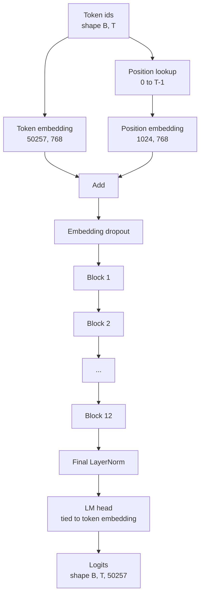
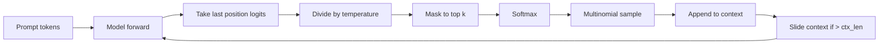

> 🇰🇷 이 문서는 한국어 번역본입니다(ELI5 스타일). 원문: [en.md](en.md)

# GPT 모델 조립


> 블록 12개를 쌓고, 토큰 임베딩과 학습형 위치 임베딩을 더하고, 마지막 LayerNorm을 붙이고, 가중치를 묶은(tied) 언어 모델 헤드를 얹으면 끝입니다. 이것이 1억 2,400만 개 파라미터짜리 GPT 모델의 전부입니다. 이 레슨은 이 조각들을 하나의 동작하는 클래스로 조립하고, 파라미터 수를 세어 참조 124M 형상과 맞는지 확인한 뒤, 다항(multinomial) 샘플링과 온도, top-k로 텍스트를 생성해 봅니다.

**유형:** Build
**언어:** Python
**선수 지식:** 페이즈 19의 30~34번 레슨
**시간:** 약 90분

## 학습 목표

- 34번 레슨의 트랜스포머 블록을 완전한 GPT 모델로 조립합니다: 토큰 임베딩, 위치 임베딩, N개의 블록, 마지막 LayerNorm, 언어 모델 헤드.
- 1억 2,400만 파라미터 구성을 재현합니다: 어휘 50257, 컨텍스트 1024, 임베딩 768, 헤드 12개, 레이어 12개.
- 언어 모델 헤드의 가중치를 토큰 임베딩과 묶고(tie), 이 규모에서 왜 약 3,800만 개 파라미터를 아껴 주는지 설명합니다.
- 다항 샘플링, 온도(temperature) 스케일링, top-k 절단으로 프롬프트에서 텍스트를 생성하고, 슬라이딩 윈도우로 컨텍스트 길이를 유지합니다.
- 124M 목표와 비교해 파라미터 수와 순전파 비용을 측정합니다.

## 문제 상황

트랜스포머 블록만으로는 아무것도 하지 못합니다. 토큰 id를 벡터로 바꾸고, 위치 정보를 섞고, 스택을 통과시키고, 다시 어휘 로짓(logits)으로 투영해야 합니다. 이 네 단계 중 하나라도 빠지면 모델은 순전파에 실패하거나, 위치 정보가 흐려지거나, 말을 하지 못합니다.

모델의 형상도 중요합니다. 참조인 GPT-2 small은 정확히 위의 구성으로 1억 2,400만 파라미터입니다. 이 숫자에는 마법이 없습니다. 어휘 50257 곱하기 임베딩 768이 토큰 테이블이고, 위치 1024 곱하기 768이 위치 테이블입니다. 블록 하나가 대략 700만 파라미터이고 12개면 8,400만입니다. 마지막 헤드는 가중치 묶기(weight tying)로 토큰 테이블을 재사용합니다. 조각들을 더하면 정확히 1억 2,400만에 도달합니다. 파라미터 수가 참조와 맞지 않는다면 어딘가 잘못 연결했다는 신호입니다.

## 개념



토큰 id가 토큰 벡터가 되고, 위치 id가 위치 벡터가 됩니다. 둘을 더해 스택으로 보냅니다. 마지막 LayerNorm은 블록 바깥에 있으면서 모든 현대 변형에도 살아남은 유일한 부품입니다. LM 헤드는 토큰 임베딩 행렬을 재사용하는데, 이것이 바로 가중치 묶기(weight tying)입니다.

### 가중치 묶기(weight tying)

토큰 임베딩의 형상은 `(vocab, d_model)`입니다. 언어 모델 헤드는 `d_model`에서 다시 `vocab`으로 투영해야 합니다. 둘은 서로의 전치(transpose) 관계입니다. 묶는다는 것은 문자 그대로 같은 파라미터 텐서를 두 번 쓴다는 뜻입니다. 어휘 50257, d_model 768에서 이 행렬은 3,800만 파라미터입니다. 묶지 않으면 이 비용을 두 번 치릅니다. 묶으면 한 번만 치르고, 임베딩과 헤드가 함께 업데이트되기 때문에 기울기 신호도 약간 더 깨끗해집니다.

### 위치 임베딩은 학습형, 사인파(sinusoidal)가 아님

GPT-2는 학습형 위치 임베딩을 씁니다. 위치 테이블은 `(1024, 768)` 형상의 파라미터 텐서 하나입니다. 모델은 매 순전파마다 위치 0부터 T-1까지를 찾아 토큰 임베딩에 더합니다. 이것은 위치 처리 방식 중 가장 단순한 것입니다(RoPE, ALiBi, T5 상대 바이어스 등이 대안들입니다) 그리고 124M 참조가 사용하는 방식이기도 합니다.

### 생성: 온도, top-k, 다항 샘플링

생성은 자기회귀적(autoregressive)입니다. 매 단계마다 모델은 모든 위치에 대해 전체 어휘에 걸친 로짓을 반환합니다. 여기서 마지막 위치만 취하고, 온도로 나누고, 선택적으로 상위 k개를 제외한 로짓을 음의 무한대로 마스킹한 뒤, 소프트맥스로 확률을 만들고, 그 분포에서 토큰 하나를 샘플링합니다.



노브(knob, 조절 장치) 세 개가 세 가지 서로 다른 동작을 만듭니다. 온도가 0에 가까우면 탐욕적(greedy) 선택으로 수렴합니다. 온도 1은 모델의 자연 분포를 그대로 따릅니다. top-k를 1로 하면 탐욕적 선택이고, top-k 40이면 긴 꼬리(long tail)를 걸러 냅니다. 조합이 중요합니다. 다음 레슨의 학습에서는 생성을 정성적 평가(eval) 신호로 씁니다.

```figure
cc-gpt-assembly
```

## 만들어 보기

`code/main.py`는 다음을 구현합니다:

- 124M 기본값을 담은 `class GPTConfig` 데이터클래스: `vocab_size=50257`, `context_length=1024`, `d_model=768`, `num_heads=12`, `num_layers=12`, `mlp_expansion=4`, `dropout=0.1`, `use_bias=True`, `weight_tying=True`.
- 토큰 임베딩, 위치 임베딩, 임베딩 드롭아웃, 12개의 `TransformerBlock`, 마지막 LayerNorm, 그리고 플래그가 켜지면 토큰 임베딩과 묶이는 `lm_head`를 갖는 `class GPTModel`.
- 고유 파라미터 수를 반환하는 `count_parameters` 헬퍼(가중치 묶기가 개수에 정확히 반영됨).
- 온도, top-k, 다항 샘플링, 슬라이딩 윈도우 컨텍스트를 처리하는 `generate` 함수.
- 모델을 만들어 파라미터 수를 참조 124M 옆에 출력하고, 고정된 프롬프트에서 짧은 시퀀스를 생성해 파이프라인이 끝까지 동작함을 보여 주는 데모.

실행:

```bash
python3 code/main.py
```

출력: 124M 참조와 나란히 놓인 파라미터 수, 무작위 프롬프트에서 생성된 토큰 id, 그리고 묶기가 켜졌을 때 LM 헤드와 토큰 임베딩이 저장 공간을 공유한다는 확인 메시지.

데모를 빠르게 유지하기 위해, 스크립트는 아주 작은 구성(`d_model=64`, `num_layers=2`)도 끝까지 실행하며 생성된 토큰 시퀀스를 그 자리에서 출력합니다. 124M 구성은 만들어 두지만 파라미터 수 세기와 순전파 한 번만 수행합니다.

## 스택

- 텐서 수학, autograd(자동 미분), 모듈 연결을 위한 `torch`.
- `code/main.py`는 34번 레슨과 같은 블록 패턴을 로컬에서 다시 구현합니다.

## 실전 프로덕션 패턴

세 가지 패턴이 "돌아가기만 하는 모델"과 "출시되는 모델"의 차이를 만듭니다.

**잔차 투영은 작게 초기화합니다.** 어텐션의 출력 투영과 MLP의 두 번째 선형은 잔차 합산으로 곧장 들어갑니다. 이 둘을 다른 선형과 같은 표준편차로 초기화하면, 잔차 스트림(residual stream)이 깊이와 함께 커져서 마지막 LayerNorm을 과열 상태로 몰아넣습니다. 이 두 투영의 표준편차를 `1 / sqrt(2 * num_layers)`로 곱해 줄이세요. 그러면 잔차 스트림이 12층을 통과하는 동안에도 정상 범위에 머뭅니다.

**위치 id 텐서는 캐싱하고 다시 계산하지 않습니다.** `torch.arange(T)`는 순전파마다 새 메모리를 할당합니다. `__init__`에서 최대 컨텍스트 크기로 한 번 할당하고, 호출마다 앞의 T개만 잘라 쓰면 메모리 할당자를 왕복하는 낭비를 없앨 수 있습니다.

**가중치는 파라미터 수준에서 묶습니다. 복사가 아니라.** `lm_head.weight = token_embedding.weight`로 설정하면 텐서를 공유합니다. 복사는 공유가 아닙니다. 옵티마이저는 파라미터 하나를 업데이트해야 하고, autograd 그래프는 누적(accumulate) 하나만 필요합니다. 복사해 버리면 헤드가 임베딩에서 멀어져서, 가중치 묶기의 이점이 사라집니다.

## 활용하기

- 이 레슨의 모델 클래스는 다음 레슨에서 학습시키는 모델과 같은 형상입니다.
- 학습형 위치 임베딩을 RoPE로 바꾸면, 블록이나 헤드를 건드리지 않고도 LLaMA 계열이 됩니다.
- GELU를 SiLU로, LayerNorm을 RMSNorm으로 바꾸면 LLaMA 계열의 나머지 변경 사항이 완성됩니다.
- 생성 함수는 이 모델뿐 아니라 어떤 로짓 소스와도 동작합니다. 37번 레슨에서 사전학습된 GPT-2 파일에서 로짓을 끌어와 같은 생성 루프를 재사용할 수 있습니다.

## 연습 문제

1. LM 헤드를 토큰 임베딩에서 분리(un-tie)하고 파라미터를 다시 세어 보세요. 증가분이 50257 곱하기 768 = 3,800만인지 확인하세요.
2. 학습형 위치 임베딩을 생성 시점에 계산한 사인파(sinusoidal) 테이블로 교체해 보세요. 모델이 여전히 순전파되고 파라미터 수가 786,432만큼 줄어드는지 확인하세요.
3. 생성에 샘플링을 건너뛰고 argmax를 고르는 `greedy=True` 플래그를 추가해 보세요. 실행마다 시퀀스가 동일하게 나오는지 확인하세요.
4. 프롬프트나 생성 이력에 있는 토큰의 로짓을 소프트맥스 전에 상수로 나누는 `repetition_penalty` 노브를 추가해 보세요. 고정된 프롬프트에서 1보다 큰 값이 출력의 반복 횟수를 줄이는지 보여 주세요.
5. `top_k` 옆에 `top_p`(nucleus) 샘플링을 추가해 보세요. 남긴 토큰들의 확률 합이 `top_p`를 넘는지 확인하는 두 줄짜리 검증을 작성해 보세요.

## 핵심 용어

| 용어 | 사람들이 말하는 것 | 실제 의미 |
|------|-----------------|------------------------|
| 가중치 묶기(weight tying) | "타이드 임베딩(tied embeddings)" | LM 헤드와 토큰 임베딩이 같은 파라미터 텐서를 공유하는 것. 어휘 곱하기 d_model만큼 파라미터를 아끼고 GPT-2 참조와도 일치 |
| 위치 임베딩 | "학습된 위치" | (컨텍스트 길이, d_model) 형상의 별도 테이블로 토큰 벡터에 더해짐. 끝까지(end-to-end) 학습됨 |
| 슬라이딩 윈도우 컨텍스트 | "컨텍스트 한도" | 프롬프트에 생성 토큰을 더한 것이 컨텍스트 길이를 넘으면 가장 오래된 토큰을 버려 활성 윈도우가 들어맞게 하는 것 |
| Top-k 샘플링 | "K 절단" | 가장 값이 큰 K개 로짓을 남기고 나머지를 음의 무한대로 마스킹한 뒤 남은 것들로 소프트맥스 |
| 온도(temperature) | "샘플링 온도" | 소프트맥스 전에 로짓을 T로 나누는 것. T<1이면 날카로워지고, T=1이면 자연 분포를 유지하며, T>1이면 평평해짐 |

## 더 읽을 거리

- 이 모델이 쌓는 블록은 페이즈 19의 34번 레슨.
- 이 모델을 크로스 엔트로피 손실로 학습시키는 루프는 페이즈 19의 36번 레슨.
- 이 정확한 아키텍처에 사전학습된 GPT-2 가중치를 불러오는 것은 페이즈 19의 37번 레슨.
- 다음 토큰 예측의 수학은 페이즈 7의 07번 레슨(GPT 인과적 언어 모델링).
- 같은 아키텍처에 대한 최초의 학습 절차는 페이즈 10의 04번 레슨(사전학습 미니 GPT).
