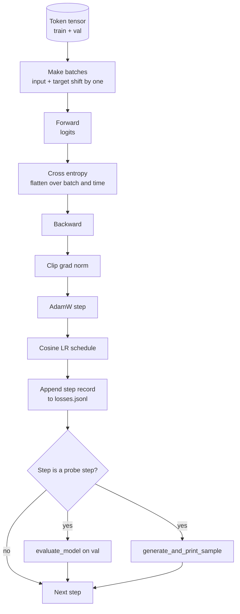

> 🇰🇷 이 문서는 한국어 번역본입니다(ELI5 스타일). 원문: [en.md](en.md)

# 학습 루프와 평가


> 측정하지 않는 루프는 거짓말을 하는 루프입니다. 이 레슨은 GPT 모델을 구동하는 학습 루프를 만듭니다: 가중치 감쇠(weight decay) 분리를 적용한 AdamW, 워밍업 + 코사인 학습률 스케줄, `calc_loss_batch` 헬퍼, 홀드아웃(held out) 데이터에 대한 `evaluate_model` 패스, K 스텝마다 돌리는 `generate_and_print_sample` 정성적 점검, 그리고 나중에 그래프로 그릴 수 있는 손실 JSONL 로그까지요. 이 뼈대 하나로 여러분이 앞으로 만들 모든 디코더 LLM을 학습시킬 수 있습니다.

**유형:** Build
**언어:** Python
**선수 지식:** 페이즈 19의 30~35번 레슨
**시간:** 약 90분

## 학습 목표

- 다음 토큰 예측을 위해 입력과 타깃을 올바르게 정렬해 크로스 엔트로피 손실을 계산하는 학습 루프를 만듭니다.
- 가중치 텐서에만 가중치 감쇠를 적용하고 LayerNorm이나 편향(bias) 텐서에는 적용하지 않도록 AdamW를 설정합니다.
- 선형 워밍업과 코사인 감쇠로 이루어진 학습률 스케줄을 구현하고, 시간에 따른 학습률 변화를 읽어 냅니다.
- `evaluate_model`로 홀드아웃 분할에서 평가해서, eval 손실이 실행마다 비교 가능하도록 만듭니다.
- K 스텝마다 `generate_and_print_sample`로 정성적 샘플을 생성해, 손실 곡선보다 먼저 발산을 잡아 냅니다.
- 스텝별 손실을 JSONL로 저장해서, 나중에 다시 불러오고 그래프를 그리고 산출물로 넘길 수 있는 학습 로그를 만듭니다.

## 문제 상황

손실만 출력하고 다른 일을 하지 않는 학습 스크립트는 세 가지 방식으로 실패합니다. 손실이 옳은 이유로 줄어드는지 알려 주지 못합니다(모델이 학습 세트에만 과적합하고 아무것도 배우지 않을 수 있습니다). 발산이 시작되는지 알려 주지 못합니다(손실이 한 스텝 급등 후 복구될 수도, 한 스텝에 폭락할 수도 있습니다). 모델이 무엇을 배웠는지 알려 주지 못합니다(손실은 스칼라 하나지만, 생성된 샘플은 한 문단입니다). 이 세 가지 실패는 루프가 측정하지 않으면 모두 감춰집니다.

이 레슨의 루프는 세 가지 방식으로 측정합니다. 매 스텝 학습 배치의 손실. K 스텝마다 홀드아웃 배치의 손실. K 스텝마다 고정된 프롬프트에서 생성한 이어쓰기. 학습 로그는 JSONL로 남아서, 그 기록이 곧 루프의 증언이 됩니다.

## 개념



직관적이지 않은 두 조각은 손실 정렬(loss alignment)과 AdamW 감쇠 분리입니다.

### 손실 정렬(loss alignment)

모델은 모든 위치에서 다음 토큰을 예측합니다. 입력 배치가 토큰 `[t0, t1, t2, t3]`이라면 타깃 배치는 `[t1, t2, t3, t4]`여야 합니다. 크로스 엔트로피는 평탄화한 형상 `(batch * seq, vocab)`을 평탄화한 타깃 `(batch * seq,)`에 대해 계산합니다. 이 밀기를 잊으면 모델이 자기 자신을 예측하도록 학습됩니다. 그러면 손실은 0으로 수렴하면서 정작 아무 유용한 것도 배우지 못합니다.

### AdamW 감쇠 분리

가중치 감쇠는 가중치 텐서에는 정규화 효과를 주지만, 정규화 스케일이나 편향에는 적용하면 안 됩니다. LayerNorm 스케일에 감쇠를 걸면 스케일이 서서히 0으로 밀려 정규화가 망가집니다. 편향에 감쇠를 거는 것은 수학적으로 해롭지는 않지만 연산 낭비입니다. 표준 분리 방식은 이렇습니다. 행렬 형태의 텐서(선형 가중치, 임베딩 테이블)에는 감쇠를 걸고, 스케일이나 이동(shift)처럼 생긴 것에는 걸지 않습니다.

### 워밍업 + 코사인 스케줄

워밍업은 몇백 스텝에 걸쳐 학습률을 0에서 목표값까지 올립니다. 그래야 옵티마이저 상태가 채워질 시간을 벌 수 있습니다. 코사인 감쇠는 남은 스텝에 걸쳐 학습률을 다시 0 쪽으로 낮춰서, 마지막 구간에서 작은 보폭으로 가중치를 파인튜닝하듯 다듬습니다. 이 조합은 오픈 웨이트 LLM 학습에서 가장 흔한 스케줄입니다. 첫 천 스텝과 마지막 천 스텝의 불안정한 순간들을 대부분 없애 주기 때문입니다.

### 홀드아웃 평가

`evaluate_model`은 검증 분할에서 정해진 개수의 배치를 돌리고, 손실을 누적한 뒤 배치 수로 나눠 반환합니다. 기울기 없음. 드롭아웃 없음. 같은 시드와 같은 분할이면 이 숫자는 실행마다 재현됩니다. 학습 손실 옆에 홀드아웃 손실을 함께 보고하는 것이 과적합을 발견하는 방법입니다.

### 조기 신호로서의 정성적 샘플링

학습 손실은 잘 떨어지는데 생성된 샘플이 전부 같은 토큰이라면 그 모델은 고장 난 것입니다. 손실 곡선은 평평해 보이는데 생성 샘플이 점점 말이 되는 단어로 다듬어진다면 배우고 있는 것입니다. 정성적 점검(probe)은 곡선 전체를 읽는 것보다 빠르고, 스칼라가 놓치는 양상을 잡아 냅니다.

```figure
cap-training-loop
```

## 만들어 보기

`code/main.py`는 다음을 구현합니다:

- 긴 토큰 텐서를 입력/타깃 쌍으로 자르는 `make_batches(token_ids, batch_size, context_length)`
- 순전파 후 평탄화해 스칼라 크로스 엔트로피를 반환하는 `calc_loss_batch(model, inputs, targets)`
- 정해진 개수의 검증 배치를 no grad로 돌리고 평균 손실을 반환하는 `evaluate_model(model, val_loader, max_batches)`
- 고정된 프롬프트로 35번 레슨의 생성 함수를 실행해 결과를 출력하는 `generate_and_print_sample(model, prompt, max_new_tokens)`
- 두 그룹짜리 AdamW 파라미터 목록을 만드는 `build_param_groups(model, weight_decay)`
- 주어진 스텝의 학습률을 반환하는 `cosine_with_warmup(step, warmup_steps, total_steps, max_lr, min_lr)`
- 루프를 실행하고 `outputs/losses.jsonl`을 저장하며, `eval_every` 스텝마다 eval 손실과 샘플을 출력하는 `train(...)`
- 합성 데이터로 작은 모델을 몇 스텝 학습시키고, JSONL 로그를 쓰고, 점검 지점마다 eval 손실과 샘플을 출력하는 데모. 데모는 CPU에서도 1분 안에 끝납니다.

실행:

```bash
python3 code/main.py
```

출력: 스텝별 손실 줄, 점검 스텝마다의 eval 손실, 점검 스텝마다의 생성 샘플, 그리고 한 줄씩 `json.loads`로 읽을 수 있는 최종 `outputs/losses.jsonl`.

## 스택

- autograd, 옵티마이저, 모듈을 위한 `torch`.
- `main.py`는 35번 레슨의 `GPTModel`과 보조 모듈을 로컬에서 다시 구현합니다.

## 실전 프로덕션 패턴

세 가지 패턴이 교과서식 루프를 밤새 돌려도 안심할 수 있는 것으로 바꿔 줍니다.

**기울기 노름 클리핑은 타협 불가입니다.** 나쁜 배치 하나(이상 데이터, 학습률 급등, 수치 경계 사례)가 몇 시간 치 학습을 날려 버리는 거대한 기울기를 만들 수 있습니다. `backward` 후 `step` 전에 `torch.nn.utils.clip_grad_norm_(params, max_norm=1.0)`을 걸면 옵티마이저가 안전 범위 안에 머뭅니다. 클리핑 값은 자유 파라미터이지만, 1이면 대부분의 환경에서 버티는 기본값입니다.

**피클(pickle) 상태가 아니라 재개 가능한 JSONL 로깅.** 스텝별 손실을 `{"step": int, "train_loss": float, "lr": float}` 형태의 JSONL 줄로 기록하면 튼튼합니다. 크래시가 나도 읽을 수 있는 기록이 남고, grep할 수 있고, 30줄 정도의 파이썬으로 그래프를 그릴 수 있고, 마지막 스텝을 읽어 학습을 재개할 수도 있습니다. 피클 상태는 그 파일을 만든 모듈 배치에 정확히 묶이기 때문에 리팩터링에 취약합니다.

**평가 배치는 고정 슬라이스에서 뽑습니다.** 검증 토큰은 스크립트 시작 시점에 배치로 잘아 둡니다. 실행 도중 그때그때 자르는 게 아니라요. 재현성은 평가 배치가 실행마다 동일해야 성립합니다. 그렇지 않으면 두 실행 사이의 eval 손실 비교가 모델만큼 배치 셔플도 함께 측정하게 됩니다.

## 활용하기

- 이 레슨의 루프는 실제 데이터로 124M 모델을 학습시키는 것과 같은 뼈대입니다. 합성 토큰 텐서를 `datasets` 스타일 로더로 바꿔도 루프는 그대로 돌아갑니다.
- JSONL 로그는 학습 실행을 증거로 바꿔 주는 산출물입니다. 다음 레슨에서는 이 로그로 새로 학습한 체크포인트와 사전학습 모델을 비교합니다.
- 정성적 샘플 점검은 스칼라 손실이 대체할 수 없는 만능 안전망입니다.

## 연습 문제

1. 스케일과 편향 파라미터가 감쇠 없음(no decay) 그룹에, 선형·임베딩 가중치가 감쇠 그룹에 들어가는지 확인하는 `weight_decay_groups()` 단위 테스트를 추가해 보세요.
2. 합성 무작위 토큰을 작은 텍스트 파일의 바이트로 바꿔서, 데모가 읽을 수 있는 대상으로 학습되게 해 보세요. 생성 샘플이 파일에 있는 문자들만 쓰는지 확인하세요.
3. 코사인 스케줄에 `max_lr`의 10%인 `min_lr` 바닥값을 추가하고 그래프를 다시 그려 보세요.
4. JSONL 로그 외에 `eval_every` 스텝마다 체크포인트를 저장해 보세요. 모델 상태와 옵티마이저 상태를 다시 불러오는 `resume_from` 플래그도 추가해 보세요.
5. 손실 옆에 스텝별 처리량(초당 토큰 수)을 기록하고, 일정한 범위 안에 머무는지 확인해 보세요.

## 핵심 용어

| 용어 | 사람들이 말하는 것 | 실제 의미 |
|------|-----------------|------------------------|
| 손실 정렬(loss alignment) | "한 칸 밀기(shift by one)" | 입력 토큰은 0..T-1 위치, 타깃 토큰은 1..T 위치. 크로스 엔트로피는 평탄화한 형상으로 계산 |
| 감쇠 분리(decay split) | "두 그룹" | AdamW에 행렬 형태 텐서는 가중치 감쇠를 걸어 넘기고, 스케일·편향 텐서는 감쇠 없이 넘기는 것 |
| 워밍업(warmup) | "램프(ramp)" | 옵티마이저 상태가 채워질 시간을 주려고 학습률을 정해진 스텝 동안 0에서 목표까지 올리는 것 |
| 평가 배치 | "홀드아웃 배치" | 검증 토큰 텐서의 고정 슬라이스로, 스크립트 시작 시 한 번 잘아 두고 매 점검마다 동일하게 사용 |
| 정성적 점검(qualitative probe) | "샘플 출력" | K 스텝마다 고정된 프롬프트에서 짧게 생성해 출력하는 것. 손실만으로는 보이지 않는 실패 양상을 잡기 위함 |

## 더 읽을 거리

- 이 루프가 구동하는 모델은 페이즈 19의 35번 레슨.
- 같은 모델에 사전학습 가중치를 불러오는 것은 페이즈 19의 37번 레슨.
- 실제 데이터에서의 절차는 페이즈 10의 04번 레슨(사전학습 미니 GPT).
- 크로스 엔트로피 손실을 넘어선 더 넓은 평가 영역은 페이즈 10의 10번 레슨(평가).
