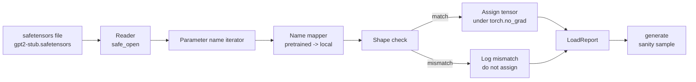

> 🇰🇷 이 문서는 한국어 번역본입니다(ELI5 스타일). 원문: [en.md](en.md)

# 사전학습 가중치 불러오기


> 1억 2,400만 파라미터 모델을 처음부터 학습하는 것은 예산 결정 사안이지만, 공개된 체크포인트를 불러오는 것은 그냥 평범한 화요일입니다. 이 레슨은 사전학습된 GPT-2 스타일 가중치를 safetensors 파일에서 35번 레슨의 정확한 아키텍처로 불러오고, 파라미터 이름 매핑을 하나하나 짚어 가며, 마지막에 이어쓰기를 한 번 생성해서 불러오기가 성공했음을 확인합니다. 네트워크도, 서드파티 로더도, 불투명한 마법도 없습니다.

**유형:** Build
**언어:** Python
**선수 지식:** 페이즈 19의 30~36번 레슨
**시간:** 약 90분

## 학습 목표

- `safetensors` 파이썬 라이브러리로 safetensors 파일을 읽고 텐서 이름과 형상을 들여다봅니다.
- 사전학습 파라미터 이름 각각을 35번 레슨 GPT 모델 안의 파라미터에 대응시킵니다.
- 공개된 GPT-2 가중치와 이 트랙의 모델 사이에 서로 다른 두 이름 관례, 즉 `wte/wpe/h.N.attn.c_attn/c_proj`, `mlp.c_fc/c_proj` vs. 로컬 이름 `tok_embed/pos_embed/blocks.N.attn.qkv/out_proj`, `mlp.fc1/fc2`를 다룹니다.
- 형상 불일치를 감지하면 가중치를 하나라도 할당하기 전에 명확한 오류로 거부합니다.
- 불러온 가중치로 짧은 이어쓰기를 생성해, 토큰이 무작위 초기화 분포가 아니라 불러온 분포에서 나오는지 확인합니다.

## 문제 상황

공개된 가중치는 여러분의 아키텍처에 맞춰 포장되어 있지 않습니다. 원래 구현이 쓰던 이름을 그대로 달고 있습니다. 사전학습 파일에는 형상 `(2304, 768)`짜리 `transformer.h.0.attn.c_attn.weight`가 있고, 여러분의 모델은 같은 형상의 `blocks.0.attn.qkv.weight`를 기대합니다(다른 배치 관례로 담긴 같은 행렬이죠). 아니면 모델이 `nn.Linear`를 써서 행렬이 전치된 상태로 저장될 수도 있습니다. 같은 파라미터가 세 가지 미묘하게 다른 정체(이름, 형상, 바이트 배치)로 나타나고, 로더는 이 세 가지를 모두 맞춰야 합니다.

무작정 복사하는 로더는 올바른 텐서를 잘못된 자리에 넣어서, 아무 말도 하지 않는(nonsense) 텍스트를 생성하는 모델을 만들어 냅니다. 형상이 다를 때 복사를 거부하면서도 아무것도 기록하지 않는 로더는 어느 텐서가 제자리에 못 들어갔는지 추측만 하게 만듭니다. 이 레슨의 로더는 명시적입니다. 모든 할당이 기록되고, 모든 형상이 검사되며, `LoadReport`가 성공, 누락, 형상 불일치를 요약해서 무슨 일이 있었는지 읽을 수 있습니다.

## 개념



이름 매퍼는 문자열을 문자열로 바꾸는 함수일 뿐입니다. 형상 검사는 if 하나입니다. 할당은 `torch.no_grad()` 안에서 일어나므로 autograd가 불러오기를 추적하지 않습니다. 리포트는 모든 이름의 처리 결과를 담습니다.

### GPT-2 이름 관례

공개된 GPT-2 가중치는 다음과 같은 이름 아래 살아 있습니다:

| 사전학습 이름 | 형상 | 의미 |
|-----------------|-------|---------|
| `wte.weight` | (50257, 768) | 토큰 임베딩 |
| `wpe.weight` | (1024, 768) | 위치 임베딩 |
| `h.N.ln_1.weight` | (768,) | 블록 N의 LayerNorm 1 스케일 |
| `h.N.ln_1.bias` | (768,) | 블록 N의 LayerNorm 1 이동(shift) |
| `h.N.attn.c_attn.weight` | (768, 2304) | 퓨즈드 QKV 선형 가중치 |
| `h.N.attn.c_attn.bias` | (2304,) | 퓨즈드 QKV 선형 편향 |
| `h.N.attn.c_proj.weight` | (768, 768) | 어텐션 출력 투영 |
| `h.N.attn.c_proj.bias` | (768,) | 어텐션 출력 투영 편향 |
| `h.N.ln_2.weight` | (768,) | LayerNorm 2 스케일 |
| `h.N.ln_2.bias` | (768,) | LayerNorm 2 이동 |
| `h.N.mlp.c_fc.weight` | (768, 3072) | MLP fc1 가중치 |
| `h.N.mlp.c_fc.bias` | (3072,) | MLP fc1 편향 |
| `h.N.mlp.c_proj.weight` | (3072, 768) | MLP fc2 가중치 |
| `h.N.mlp.c_proj.bias` | (768,) | MLP fc2 편향 |
| `ln_f.weight` | (768,) | 마지막 LayerNorm 스케일 |
| `ln_f.bias` | (768,) | 마지막 LayerNorm 이동 |

미리 알아 둬야 할 두 가지 반전이 있습니다. 첫째, `c_attn`, `c_proj`, `c_fc` 선형들은 `nn.Linear.weight`가 기대하는 것과 비교해 행렬이 전치된 상태로 저장됩니다. 로더가 할당 시점에 전치합니다. 둘째, LM 헤드는 파일 안에 아예 없습니다. 모델이 `wte`와의 가중치 묶기에 의존하기 때문에, `wte`가 자리 잡은 뒤 헤드는 별칭(aliasing)으로 설정됩니다.

### 로컬 이름 관례

이 트랙의 모델은 서술적인 이름을 씁니다:

| 로컬 이름 | 의미 |
|------------|---------|
| `tok_embed.weight` | 토큰 임베딩 |
| `pos_embed.weight` | 위치 임베딩 |
| `blocks.N.ln1.scale` | 블록 N의 LayerNorm 1 스케일 |
| `blocks.N.ln1.shift` | LayerNorm 1 이동 |
| `blocks.N.attn.qkv.weight` | 퓨즈드 QKV |
| `blocks.N.attn.qkv.bias` | 퓨즈드 QKV 편향 |
| `blocks.N.attn.out_proj.weight` | 어텐션 출력 투영 |
| `blocks.N.attn.out_proj.bias` | 출력 투영 편향 |
| `blocks.N.ln2.scale` | LayerNorm 2 스케일 |
| `blocks.N.ln2.shift` | LayerNorm 2 이동 |
| `blocks.N.mlp.fc1.weight` | MLP fc1 |
| `blocks.N.mlp.fc1.bias` | MLP fc1 편향 |
| `blocks.N.mlp.fc2.weight` | MLP fc2 |
| `blocks.N.mlp.fc2.bias` | MLP fc2 편향 |
| `final_ln.scale` | 마지막 LayerNorm 스케일 |
| `final_ln.shift` | 마지막 LayerNorm 이동 |

매핑은 고정된 함수입니다. 이 레슨은 그것을 딕셔너리로 제공하고, 로더가 그것을 순회합니다.

### 스텁(stub) 픽스처(fixture)

진짜 GPT-2 가중치는 0.5GB입니다. 데모는 그것을 내려받지 않고, 첫 실행 때 작은 safetensors 픽스처를 생성합니다. 정확한 GPT-2 이름 관례를 쓰되, 형상은 d_model이 768 대신 192인 12블록 모델에 맞춰져 있습니다. 픽스처는 로더의 모든 코드 경로를 통과시키기에 충분한 구조를 갖습니다. 픽스처를 진짜 파일로 바꿔도 로더는 수정 없이 동작합니다.

```figure
cc-weight-remap
```

## 만들어 보기

`code/main.py`는 다음을 구현합니다:

- 이 레슨이 자기 완결적이도록 만든 35번 레슨 `GPTModel`의 축소 복제본.
- 레이어별 항목을 레이어 수만큼 펼치는 `make_pretrained_to_local(num_layers)`
- 이름을 순회하고, 매핑하고, 형상을 검사하고, conv1d 스타일 가중치를 전치하고, `torch.no_grad()` 아래에서 할당하는 `load_safetensors(model, path)`. `LoadReport`를 반환합니다.
- 정확한 사전학습 이름 관례로 픽스처 파일을 생성하는 `make_stub_safetensors(path, cfg)`
- 첫 실행 때 `outputs/gpt2-stub.safetensors`를 만들고, 새 모델을 만들고, 무작위 초기화 상태에서 이어쓰기를 하나 얻어 두고, 스텁을 불러온 뒤 또 하나의 이어쓰기를 얻고, 둘을 출력하고, 둘이 다른지 확인하는(불러오기가 실제로 모델을 바꿨는지) 데모.

실행:

```bash
python3 code/main.py
```

출력: 픽스처 경로, 이름별 불러오기 로그, `LoadReport` 요약, 불러오기 전 이어쓰기, 불러오기 후 이어쓰기, 그리고 실패 경로까지 통과시키기 위해 픽스처에 일부러 넣어 둔 나쁜 텐서 하나에 대한 형상 불일치.

## 스택

- 디스크 형식과 스트리밍 리더를 위한 `safetensors`
- 모델과 할당 수학을 위한 `torch`
- `transformers` 없음, `huggingface_hub` 없음, 네트워크 호출 없음.

## 실전 프로덕션 패턴

세 가지 패턴이 로더를, 여러분이 만들지 않은 가중치와의 실전 접촉에서도 살아남게 만듭니다.

**어떤 할당이든 그 전에 항상 파일을 검증합니다.** 파일을 열고, 모든 텐서 이름을 dtype과 형상과 함께 나열하고, 형상 검사를 포함한 전체 매핑을 돌려 보고, 성공했을 때만 할당을 시작합니다. 절반만 불러온 모델은 조용히 실패하는 기계입니다.

**모든 할당을 출발지 이름과 도착지 이름과 함께 기록합니다.** 뭔가 이상해 보이면 로그가 어느 텐서가 어디에 들어갔는지 알려 줍니다. 그 대안은 헥스덤프(hexdump)를 직접 읽는 것입니다. 이 레슨의 `LoadReport` 데이터클래스는 `loaded`, `missing`, `unexpected`, `shape_mismatch` 목록을 추적하고 마지막에 요약을 출력합니다.

**LM 헤드는 별도의 복사본이 아니라 가중치 묶기 별칭입니다.** `tok_embed`를 불러온 뒤 `model.lm_head.weight = model.tok_embed.weight`로 설정하는 것이 정석 패턴입니다. 임베딩 행렬을 새로운 `lm_head.weight` 파라미터에 복사해 버리면 묶기가 깨지고, 파라미터 수가 조용히 두 배가 됩니다.

## 활용하기

- 이 로더는 사전학습 이름 관례를 쓰는 어떤 safetensors 파일에도 동작합니다. 진짜 GPT-2 파일들(small / medium / large / xl)도 코드 변경 없이 동작합니다. 달라지는 것은 모델 구성뿐입니다.
- 같은 패턴은 이름 맵만 업데이트하면 LLaMA, Mistral, Qwen 가중치로도 확장됩니다. 형상 검사와 리포트는 그대로입니다.
- 불러오기 후의 정합성 생성은 빠른 관문입니다. 불러온 뒤의 샘플이 불러오기 전과 똑같다면, 불러오기가 모델을 바꾸지 못한 것이고, 매핑이 모든 텐서를 조용히 놓쳤다는 뜻입니다.

## 연습 문제

1. 로더에 `dtype` 인수를 추가해서, 할당 시점에 각 텐서를 목표 dtype(`bfloat16`, `float16`, `float32`)으로 캐스팅해 보세요. `float32` 모델을 `bfloat16`으로 내려 캐스팅해도 여전히 생성할 수 있는지 확인하세요.
2. 체크포인트의 `h.N` 인덱스가 모델의 `num_layers`와 맞지 않으면 불러오기를 거부하는 `expected_layers` 인수를 추가해 보세요.
3. 로더를 35번 레슨의 생성 함수에 연결해 나란히 놓인 두 샘플을 만들어 보세요. 하나는 무작위 초기화에서, 하나는 불러온 픽스처에서.
4. 내보내기(export) 경로를 추가해 보세요. 현재 모델 상태를 사전학습 이름 관례로 새 safetensors 파일에 쓰는 것입니다. 로더로 왕복(라운드트립)해 보고 리포트에 형상 불일치가 0인지 확인하세요.
5. `NAME_MAP`을 LLaMA 이름 관례(편향 없음, RMSNorm, 퓨즈드 qkv 배치)를 다루도록 확장하고, 직접 생성한 스텁 LLaMA 픽스처로 로더를 다시 실행해 보세요.

## 핵심 용어

| 용어 | 사람들이 말하는 것 | 실제 의미 |
|------|-----------------|------------------------|
| 이름 맵(name map) | "키 리매핑(key remapping)" | 사전학습 텐서 이름을 로컬 파라미터 이름으로 바꾸는 함수. 보통 레이어 인덱스별 항목 하나를 루프로 펼친 리터럴 딕셔너리 |
| 형상 불일치(shape mismatch) | "잘못된 형상" | 매핑된 이름 아래 사전학습 텐서가 존재하지만 그 차원이 로컬 파라미터와 맞지 않는 것. 로더는 할당을 거부하고 그 쌍을 기록 |
| 불러오기 시 전치(transpose-on-load) | "Conv1d 배치" | 공개된 GPT-2는 어텐션과 MLP 투영을 nn.Linear가 기대하는 것의 전치로 저장. 로더가 할당 중에 전치 |
| 가중치 묶기 별칭 | "공유 LM 헤드" | `model.lm_head.weight = model.tok_embed.weight`로 설정해 헤드와 임베딩이 저장 공간을 공유하게 하는 것. 이 때문에 파일에 헤드가 없음 |
| 불러오기 리포트(load report) | "커버리지 요약" | loaded, missing, unexpected, shape_mismatch 목록을 추적하는 작은 데이터클래스. 이걸 출력해야 불러오기가 성공했는지 알 수 있음 |

## 더 읽을 거리

- 가중치를 받는 아키텍처는 페이즈 19의 35번 레슨.
- 같은 형상의 체크포인트를 만들어 내는 학습 루프는 페이즈 19의 36번 레슨.
- 메모리가 빠듯할 때 불러온 가중치를 어떻게 할지는 페이즈 10의 11번 레슨(양자화).
- 불러오기와 추론을 둘러싼 전체 수명 주기는 페이즈 10의 13번 레슨(완전한 LLM 파이프라인 만들기).
