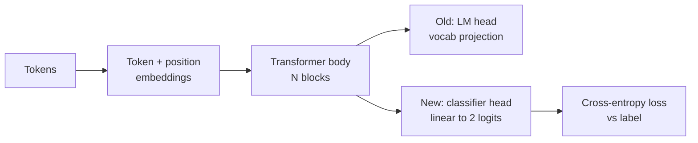
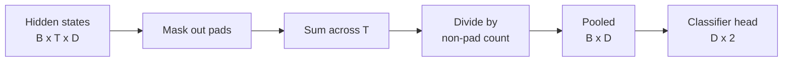
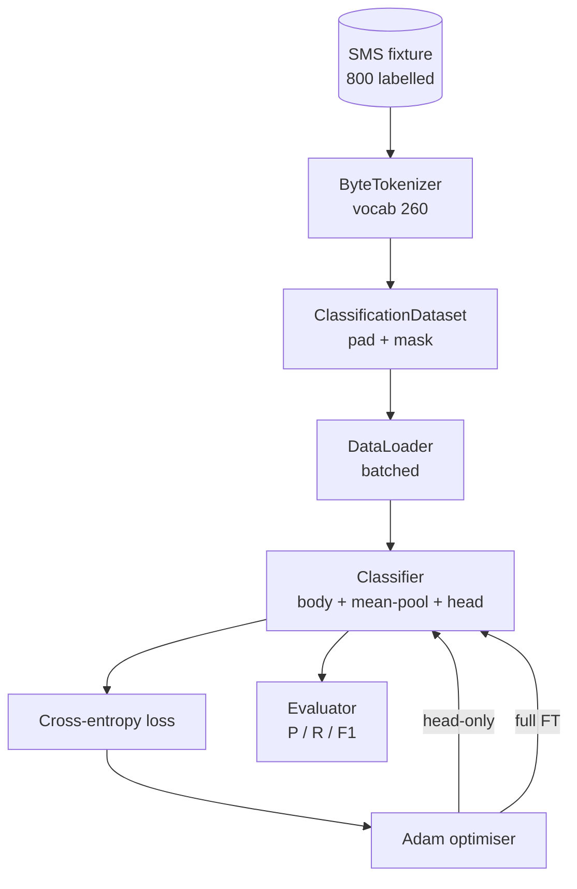

> 🇰🇷 이 문서는 한국어 번역본입니다(ELI5 스타일). 원문: [en.md](en.md)

# 캡스톤 레슨 38: 헤드 교체 방식의 분류기 파인튜닝


> 트랙 B의 첫 캡스톤입니다. 사전학습된 언어 모델은 셀프 어텐션 블록들 위에 토큰 예측 헤드가 얹힌 구조입니다. 스팸/햄(spam vs ham) 분류가 필요할 때, 헤드는 틀렸지만 몸통은 대체로 옳습니다. 이 레슨은 헤드를 떼어 내고, 풀링된 표현 위에 2클래스 선형 레이어를 붙인 다음, 분류기를 두 가지 방식으로 학습시킵니다: 마지막 레이어만 학습하는 방식과 전체 파인튜닝입니다. 평가는 홀드아웃 분할에서의 정밀도, 재현율, F1입니다. 각 전략이 무엇을 얻어 주고 무엇을 대가로 치르게 하는지 배웁니다.

**유형:** Build
**언어:** Python (torch, numpy)
**선수 지식:** 페이즈 19의 30~37번 레슨 (NLP LLM 트랙: 토크나이저, 임베딩 테이블, 어텐션 블록, 트랜스포머 몸통, 사전학습 루프, 체크포인팅, 생성, 퍼플렉시티(perplexity))
**시간:** 약 90분

## 학습 목표

- 몸통을 다시 초기화하지 않고 언어 모델 헤드를 분류 헤드로 교체합니다.
- 몸통을 동결한 상태(헤드 전용)와 전체 파인튜닝이라는 두 학습 방식을, 하나의 학습 루프를 공유하며 구현합니다.
- 패딩을 하고, 패딩을 마스킹하고, 어텐션 출력을 풀링하는 토크나이저 인식형 데이터 파이프라인을 만듭니다.
- 원시 로짓(logits)으로부터 정밀도, 재현율, F1, 오차 행렬(confusion matrix)을 계산합니다.
- 파라미터 수, 학습 시간, 성장 여유(head-room) 사이의 트레이드오프를 추론합니다.

## 문제 상황

범용 코퍼스로 작은 트랜스포머를 사전학습했다고 합시다. 출력 헤드는 마지막 은닉 상태를 1,000개 어휘로 투영합니다. 이제 스팸/햄 레이블이 붙은 SMS 메시지 800개가 있고, 이진 분류기가 필요합니다. 선택지는 세 가지입니다.

잘못된 선택은 800개 사례만으로 분류기를 처음부터 새로 학습하는 것입니다. 사전학습 모델의 몸통에는 이미 유용한 구조가 인코딩되어 있습니다. 단어의 정체성, 위치, 단순한 공기(co-occurrence) 같은 것들이요. 그것을 버리면, 그것을 만드는 데 쓴 연산 낭비가 됩니다.

올바른 두 선택은 몸통을 동결한 채 헤드를 교체하는 것과, 몸통까지 학습 가능하게 둔 채 헤드를 교체하는 것입니다. 헤드 전용 학습은 빠르고, 메모리 측면에서 거의 공짜이며, 이렇게 적은 데이터에서는 거의 과적합되지 않습니다. 전체 파인튜닝은 더 느리고 작은 데이터에서 과적합될 수 있지만, 다운스트림 도메인이 사전학습 코퍼스에서 멀어졌을 때는 더 높은 정확도에 도달합니다.

이 레슨은 둘 다 만들어서, 같은 픽스처(fixture) 위에서 비교할 수 있게 해 줍니다.

## 개념



모델은 함수 `f_theta(tokens) -> hidden_states`입니다. 헤드는 함수 `g_phi(hidden) -> logits`입니다. 헤드를 교체한다는 것은 `theta`는 그대로 두고 `g_phi`를 갈아 끼우는 것입니다. 몸통의 파라미터가 비싼 부분입니다. 헤드는 선형 레이어 하나입니다.

중요한 학습 가능 파라미터 집합은 둘입니다:

- `theta`(몸통): 어텐션 블록마다 수만 개의 가중치.
- `phi`(헤드): `hidden_dim * num_classes`개의 가중치에 편향 하나.

헤드 전용 학습에서는 `phi`에 대해서만 기울기를 계산하고 `theta`에 대해서는 0으로 둡니다. PyTorch에서는 몸통 파라미터에 `requires_grad=False`를 설정하면 됩니다. 그러면 옵티마이저는 헤드만 보고, 몸통은 얼어 있습니다.

전체 파인튜닝에서는 기울기가 스택 전체로 되돌아오게 둡니다. 몸통의 가중치가 분류 목표에 맞춰 흘러갑니다. 위험은 작은 데이터에서의 파국적 망각(catastrophic forgetting)입니다. 몸통의 사전학습 내용이 과적합 노이즈에 씻겨 나가는 것이죠.

## 풀링 문제

분류기는 토큰별 벡터가 아니라 시퀀스별 벡터 하나가 필요합니다. 흔한 선택은 세 가지입니다:

- **평균 풀링(mean pool)**: 시퀀스 전체의 은닉 상태를, 어텐션 마스크로 가중치를 주어 평균 냅니다.
- **CLS 풀링**: 특별한 토큰을 앞에 붙이고 그 출력만 씁니다. BERT가 하는 방식입니다.
- **마지막 토큰 풀링**: 패딩이 아닌 마지막 토큰을 씁니다. GPT 계열 분류기가 하는 방식입니다.

이 레슨은 명시적인 어텐션 마스크 가중치를 곁들인 평균 풀링을 씁니다. 가장 단순하고, 시퀀스 길이가 달라져도 안정적인 신호를 주며, CLS 토큰을 사전학습할 필요가 없기 때문입니다.



## 데이터

SMS 메시지 800개(스팸 400, 햄 400으로 균형 잡힘)는 `code/main.py` 안에서 결정론적으로 생성됩니다. 생성기는 고정 시드를 쓰고, 템플릿을 골라 슬롯을 채워 넣으며, 길이 5~25토큰 사이의 메시지를 만들어 냅니다. 진짜 데이터셋에는 있는 노이즈가 이 픽스처에는 없습니다. 픽스처의 요점은 재현성입니다.

데이터는 80/20으로 나뉩니다. 학습 640개, 테스트 160개입니다. 분할은 층화(stratified)되어 있어서 테스트 세트도 50/50 균형을 유지합니다. 균형이 알려진 홀드아웃 세트여야 정밀도와 재현율을 정직한 숫자로 읽을 수 있습니다.

## 지표

클래스 1을 양성(스팸)으로 하는 이진 분류입니다. 개수는 다음과 같습니다:

- `TP`: 스팸이라고 예측했고 실제로 스팸이었음.
- `FP`: 스팸이라고 예측했지만 실제로는 햄이었음.
- `FN`: 햄이라고 예측했지만 실제로는 스팸이었음.
- `TN`: 햄이라고 예측했고 실제로도 햄이었음.

세 가지 대표 지표:

- `precision = TP / (TP + FP)`. 스팸으로 표시된 메시지 중 실제 스팸의 비율은?
- `recall = TP / (TP + FN)`. 실제 스팸 중 모델이 표시한 비율은?
- `F1 = 2 * P * R / (P + R)`. 둘의 조화 평균.

오차 행렬은 네 개의 개수를 2x2 격자로 출력합니다. 데모는 이것을 두 학습 방식 각각에 대해 표준 출력으로 내보냅니다.

```figure
cap-classifier-head-swap
```

## 아키텍처



몸통은 의도적으로 아주 작은 트랜스포머입니다: 어휘 260, 은닉 64, 헤드 4개, 블록 2개, 최대 시퀀스 32. CPU에서 90초 안에 두 방식 모두 수렴할 만큼 작습니다. 이 레슨에서 사전학습되지는 않으며, 대신 `pretrain_quick` 헬퍼가 같은 픽스처의 텍스트로 5 에포크의 LM 학습을 돌려 몸통에 만만치 않은 출발점을 만들어 줍니다. 이렇게 레슨을 자기 완결적으로 유지합니다.

## 만들게 될 것

구현은 `main.py` 하나와 테스트 모듈 하나(`code/tests/test_main.py`)입니다.

1. `ByteTokenizer`: 바이트를 id로 매핑하고, 패딩용 pad id를 예약합니다.
2. `Block`: 멀티 헤드 어텐션과 피드포워드 레이어를 갖춘 트랜스포머 블록. Pre-norm 방식입니다.
3. `LMBody`: 토큰 임베딩 + 위치 임베딩 + 블록 스택. 은닉 상태를 반환합니다.
4. `MeanPool`: 시퀀스 축을 따라 마스크 가중 평균을 냅니다.
5. `Classifier`: 몸통, 풀링, 선형 헤드. 몸통은 두 방식에서 같은 인스턴스입니다.
6. `freeze_body`와 `unfreeze_body`: 몸통 파라미터의 `requires_grad`를 켜고 끕니다.
7. `train_classifier`: 공유 루프 하나. 학습 가능한 파라미터 그룹에 맞춰 설정된 모델과 옵티마이저를 받습니다.
8. `evaluate`: 테스트 세트를 실행하고 `Metrics(precision, recall, f1, confusion)`을 반환합니다.
9. `run_demo`: 몸통을 짧게 사전학습한 뒤, 헤드 전용 방식을 학습·평가하고, 전체 방식도 학습·평가하고, 두 리포트를 출력한 뒤 종료 코드 0으로 끝납니다.

## 비교가 중요한 이유

헤드 전용 방식은 보통 더 빨리 학습되고, 과소적합도 더 우아하게 받아들입니다. 이 픽스처에서는 헤드 전용 학습 20 에포크 후 정밀도 약 0.9, 재현율 약 0.85를 보는 것이 일반적입니다. 전체 파인튜닝은 약 3배 더 걸리고 결과는 무작위 시드에 따라 어느 쪽이든 몇 점 안팎의 차이로 도달합니다.

이 레슨은 승자를 뽑아 주지 않습니다. 숫자와 비용을 읽는 법을 가르칩니다. 800개 사례와 작은 몸통에서는 헤드 전용이 옳은 선택입니다. 8만 개 사례와 더 큰 몸통에서는 전체 파인튜닝이 빛을 내기 시작합니다. 이 레슨에서 가져가야 할 계약은 API입니다. 같은 `train_classifier` 함수가 둘 다 처리하고, 전환은 호출 한 번입니다.

## 확장 목표

- 마지막 블록만 해제하는 세 번째 방식을 추가해 보세요. 흔히 부분 파인튜닝(partial fine-tuning)이라 불립니다. 전체 FT보다 싸고, 헤드 전용보다 더 많이 배웁니다.
- 학습률 스케줄러를 추가해 보세요. 헤드에는 코사인 스케줄, 몸통에는 더 작은 고정 학습률을 쓰는 것이 흔한 프로덕션 설정입니다.
- 평균 풀링을 학습형 어텐션 풀로 바꿔 보세요. 학습된 쿼리 하나를 가진 작은 어텐션 레이어입니다. 긴 시퀀스에서는 평균 풀링을 이기는 경우가 많습니다.

구현이 훅(hook)을 제공합니다. 테스트가 계약을 고정합니다. 숫자를 밀어 올리는 것은 여러분의 몫입니다.
