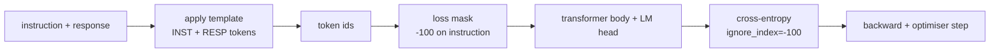
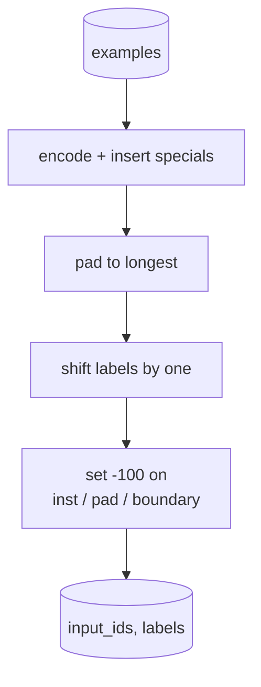
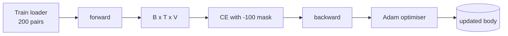

> 🇰🇷 이 문서는 한국어 번역본입니다(ELI5 스타일). 원문: [en.md](en.md)

# 캡스톤 레슨 39: 지도 파인튜닝(SFT) 방식의 인스트럭션 튜닝


> 사전학습된 베이스 모델은 시퀀스를 이어 쓸 수는 있지만 인스트럭션(지시문)을 따를 줄은 모릅니다. 지도 파인튜닝(supervised fine-tuning, SFT)은 이걸 고치는 가장 작은 변경입니다. 인스트럭션과 원하는 응답이 짝지어진 예시를 모델에 주고, 응답 토큰을 예측하도록 몸통을 학습시키는 것이죠. 요령은 손실이 응답만 세고 인스트럭션은 세지 않게 하는 것입니다. 이 레슨은 `ignore_index=-100`으로 인스트럭션 토큰을 마스킹하는 커스텀 collate 함수를 갖춘 Alpaca 스타일 SFT 루프를 만들고, 인스트럭션-응답 쌍 200개로 학습한 뒤, 홀드아웃 분할에서 완전 일치(exact-match)로 평가합니다.

**유형:** Build
**언어:** Python (torch, numpy)
**선수 지식:** 페이즈 19의 30~37번 레슨 (NLP LLM 트랙: 토크나이저, 임베딩 테이블, 어텐션 블록, 트랜스포머 몸통, 사전학습 루프, 체크포인팅, 생성, 퍼플렉시티(perplexity))
**시간:** 약 90분

## 학습 목표

- 짝지어진 인스트럭션-응답 데이터를, 경계 토큰을 명시해 넣은 하나의 인과적(causal) 시퀀스로 포맷합니다.
- 인스트럭션 토큰을 마스킹해 크로스 엔트로피가 응답 토큰만 세도록 하는 collate 함수를 만듭니다.
- 작은 트랜스포머 몸통을 SFT 목표로 학습시키고, eval 지표가 움직이는 것을 관찰합니다.
- 응답 시작 경계를 지키는, 탐욕적(greedy) 디코딩과 온도 샘플링 디코딩을 구현합니다.
- 생성된 완성문에 대해 홀드아웃 완전 일치(exact-match)를 계산합니다.

## 문제 상황

다음 토큰 예측으로 학습된 베이스 모델은 인스트럭션이 무엇인지 모릅니다. `"What is the capital of France?"`라는 문자열을 보여 주면, 질문을 이어 쓰거나 새 문장을 지어냅니다. 모델에는 언어가 있지만 형식 계약(format contract)이 없는 것입니다.

SFT의 계약은 문자열 템플릿입니다. 모든 학습 예시가 세 개의 영역을 가진 하나의 시퀀스가 됩니다:

```text
<INST> What is the capital of France? <RESP> The capital of France is Paris.
```

경계 토큰은 학습 시점에 예약해 두는 특수 토큰입니다. 모델은 `<RESP>` 뒤의 모든 것이 응답이고, 응답이 채점 대상이라는 것을 배웁니다. 베이스 모델의 다음 토큰 목표는 그대로 적용됩니다. 모든 예시가 이 모양을 갖춘 코퍼스로 학습될 뿐입니다.

그런데 함정이 하나 있습니다. 시퀀스 전체를 순진한 크로스 엔트로피 손실에 넣으면, 모델이 인스트럭션 토큰까지 예측하도록 학습됩니다. 인스트럭션은 주어진 것입니다. 그 위치에는 기울기가 0이기를 원합니다. 해결책은 마스크입니다.

## 개념



`ignore_index`는 `torch.nn.functional.cross_entropy`의 기능입니다. `ignore_index`와 같은 타깃 위치는 손실 0, 기울기 0으로 취급됩니다. PyTorch의 관례값은 `-100`입니다. collate 함수는 예시마다 두 개의 텐서를 만듭니다. `input_ids`(전체 시퀀스)와 `labels`(`input_ids`의 복사본에서 인스트럭션 위치를 `-100`으로 덮어쓴 것)입니다.

모델은 순전파 동안 시퀀스 전체를 봅니다. 어텐션은 인스트럭션을 볼 수 있습니다. 그러나 손실은 응답 토큰만 셉니다. 원하는 것이 정확히 이것입니다. 인스트럭션을 조건으로 삼고 응답을 예측하는 것.

## 데이터

인스트럭션-응답 쌍 200개가 `main.py`에서 결정론적으로 생성됩니다. 여섯 가지 과제 유형을 다룹니다:

- 사실 기반 단발 질문(X의 수도)
- 산술
- 목록 추출
- 한 문장 요약
- 코드(print, sort)
- 정의

각 과제에는 템플릿화된 인스트럭션과 결정론적 응답이 있습니다. 일부러 단순하게 만든 것입니다. 완전 일치(exact-match)는 까다로운 지표라서, 이 레슨은 정답이 특정 문자열 하나로 정해지는 픽스처를 씁니다. 진짜 SFT 데이터셋에는 퍼지(fuzzy) 지표가 필요하지만, 원리는 동일합니다.

분할은 학습 160, 테스트 40입니다. 테스트 세트는 여섯 과제 유형을 모두 포함해서 카테고리별 완전 일치를 보고할 수 있습니다.

## 토큰화와 패딩

토크나이저는 바이트 단위이며 특수 토큰 세 개를 예약합니다:

- `INST_ID = 256`: 인스트럭션 영역의 시작을 표시.
- `RESP_ID = 257`: 인스트럭션과 응답 사이 경계를 표시.
- `PAD_ID = 258`: 길이가 제각각인 배치를 위한 패딩.

시퀀스는 `[INST] inst_bytes [RESP] resp_bytes [PAD]*`입니다. collate 함수는:

1. 각 예시를 토큰화합니다.
2. 배치의 모든 예시를 배치 내 가장 긴 시퀀스에 맞춰 패딩합니다.
3. `labels` = `input_ids`를 한 칸 민 것(인과적 LM 타깃)을 만들되:
   - 인스트럭션 영역을 `-100`으로 교체합니다.
   - 패딩 영역을 `-100`으로 교체합니다.
   - `RESP_ID` 경계 위치 자체도 `-100`으로 교체합니다(모델에게 경계 토큰을 예측하게 하지 않고, 그 뒤에 오는 것을 예측하게 합니다).



밀기(shift)는 표준적인 인과적 트릭입니다. `input_ids`의 위치 `i`가 위치 `i+1`을 예측하므로 `labels[i] = input_ids[i+1]`입니다(입력에서는 마지막 위치를 버리고, 타깃에서는 첫 위치를 버립니다). 마스크는 밀기 이후에 적용해 올바른 위치에 정확히 놓이게 합니다.

## 학습



루프는 표준 PyTorch SFT 루프입니다. Adam, 학습률 대략 3e-4~1e-3, 이 픽스처에서 10~20 에포크, 스케줄러 없음. 모델은(은닉 96, 블록 2개, 최대 길이 64) CPU에서 2분 안에 수렴할 만큼 작습니다.

다섯 에포크마다 루프가 홀드아웃 세트에서 작은 eval 패스를 돌리고 완전 일치를 출력합니다. 완전 일치가 1 에포째 0.0에서 15 에포째쯤 0.85로 올라가는 것을 지켜보는 것이 이 레슨의 보상입니다. 모델이 형식과 정답을 동시에 배우는 것이 눈으로 보입니다.

## 생성

평가 시점에 모델은 인스트럭션 접두사 `[INST] inst_bytes [RESP]`를 받고 다음 중 하나가 될 때까지 토큰을 생성합니다:

- 시퀀스가 `max_len`에 도달하거나,
- 모델이 특별한 정지 휴리스틱을 만족합니다. 문장 끝 바이트(`.`, `!`, `?`)가 두 개 연속으로 나오는 경우.

이 레슨은 탐욕적 디코딩과 선택적 온도 샘플러를 제공합니다. 완전 일치에는 탐욕적 디코딩을 씁니다. 온도를 쓰면 지표가 확률적으로 변하기 때문입니다. 진짜 시스템은 흔히 샘플링한 뒤 퍼지하게 판정하는데, 그 파이프라인은 41번 레슨입니다.

## 완전 일치 평가(exact-match)

완전 일치는 가장 엄격한 텍스트 지표입니다. 예측된 응답 문자열을 정규화하고(소문자화, 공백 제거, 이중 공백 압축), 같은 방식으로 정규화한 참조 응답과 비교합니다. 예시당 지표는 1 또는 0이고, 전체 집계는 평균입니다.

진짜 SFT 파이프라인은 완전 일치를 토큰 수준 F1(41번 레슨)과 판정 모델(judge)로 보완합니다. 그래도 완전 일치는 모호하지 않아서 여전히 유용합니다. 0.7이라고 하면 테스트 인스트럭션의 정확히 70%가 글자 하나까지 같은 정답을 냈다는 뜻입니다.

```figure
cc-sft-loss-mask
```

## 만들게 될 것

구현은 `main.py` 하나와 테스트들입니다.

1. `InstructionTokenizer`: 특수 토큰을 예약한 바이트 단위 인코더. 인스트럭션 접두사 또는 전체 쌍을 인코딩합니다.
2. `make_dataset`: 고정 시드로 여섯 과제 유형에 걸쳐 쌍 200개를 생성합니다.
3. `SFTDataset`: 예시마다 `(input_ids, labels)`을 반환하며, 마스크가 이미 준비되어 있습니다.
4. `sft_collate`: 동적 패딩, 배치 텐서 생성, 인스트럭션과 패드 위치에 `-100` 설정.
5. `TinyGPT`: 트랜스포머 몸통 + 묶이거나 묶이지 않은 LM 헤드.
6. `train_sft`: 에포크별 eval 훅이 있는 SFT 루프.
7. `generate`: 접두사에서 인과적으로 디코딩. 탐욕적 또는 샘플링, 정지 휴리스틱 포함.
8. `exact_match`: 정규화된 문자열 비교, `[0, 1]` 범위의 float 반환.
9. `run_demo`: 데이터를 만들고, 20 에포크 학습하고, 평가하고, 카테고리별 세부 결과를 출력하고, 성공하면 종료 코드 0으로 끝납니다.

## 마스크가 중요한 이유

마스크가 없으면 손실이 인스트럭션 토큰을 타깃으로 취급합니다. 모델은 인스트럭션을 예측하도록 배웁니다. 이것은 다른 목표이고, 두 가지 면에서 더 나쁜 모델을 만듭니다. 첫째, 모델 용량이 사용자가 항상 제공하는 입력을 다시 재구성하는 데 낭비됩니다. 둘째, 대부분의 배치에서 인스트럭션 토큰 수가 응답 토큰 수를 넘기 때문에, 기울기 합에서 응답 손실의 비중이 작아집니다. 즉 여러분이 정작 신경 쓰는 부분에 대한 옵티마이저의 실효 학습률이 의도보다 낮아집니다. 마스크는 다듬기가 아니라 목표 그 자체입니다.

## 확장 목표

- 학습률 워밍업에 이어 코사인 감쇠를 붙여 보세요. SFT는 사전학습보다 학습률에 민감합니다.
- 토큰별 손실 로깅을 추가하고 학습에 따른 손실 곡선을 그려 보세요. 초반 에포크는 템플릿 토큰(`<RESP>`, 공통 접두사)이 지배하고, 후반 에포크는 실제 정답 토큰이 지배한다는 것을 알게 됩니다.
- eval을 BLEU-1이나 chrF로 확장해 보세요. 완전 일치는 같은 정답을 다른 표현으로 내는 모델을 과소평가합니다.
- 멀티 턴 포맷을 갖춘 챗 템플릿을 추가하고, 후속 질문까지 포함된 픽스처로 학습해 보세요.

구현이 형식 계약과 마스크와 루프를 제공합니다. 베이스 모델에서 인스트럭션 따르는 모델로의 목표 전환은 collate 함수 하나로 끝납니다.
