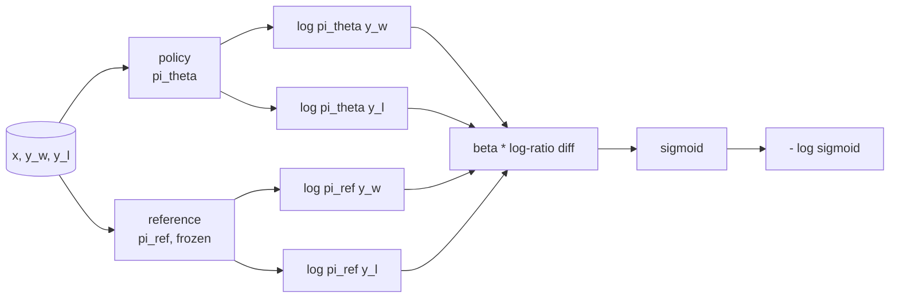
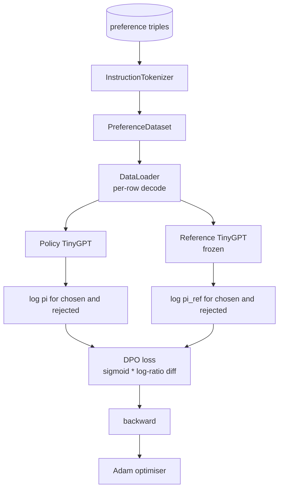

> 🇰🇷 이 문서는 한국어 번역본입니다(ELI5 스타일). 원문: [en.md](en.md)

# 캡스톤 레슨 40: DPO(직접 선호 최적화) 직접 만들기


> 보상 모델과 PPO가 전통적인 RLHF 스택입니다. DPO(Direct Preference Optimization)는 그 스택을, 선호 쌍에 정책(policy)을 직접 맞추는 단 하나의 지도 학습 손실로 압축합니다. 이 레슨은 보상 차이 항등식에서 DPO 손실을 유도하고, 동작하는 참조(reference) 모델과 정책 모델 쌍을 제공하며, 토큰별 로그 확률을 계산하고, 선택(chosen) 완성문과 기각(rejected) 완성문으로 이루어진 선호 픽스처에서 작은 트랜스포머를 학습시킵니다. 테스트가 손실 수학과 기울기 방향을 고정해서, 구현이 논문과 일치한다는 것을 확신할 수 있게 해 줍니다.

**유형:** Build
**언어:** Python (torch, numpy)
**선수 지식:** 페이즈 19의 30~37번 레슨 (NLP LLM 트랙: 토크나이저, 임베딩 테이블, 어텐션 블록, 트랜스포머 몸통, 사전학습 루프, 체크포인팅, 생성, 퍼플렉시티(perplexity))
**시간:** 약 90분

## 학습 목표

- DPO 손실을 스케일된 로그 비율 차이에 대한 시그모이드로 유도하고, 암묵적 보상(implicit reward)과 연결합니다.
- 동결된 참조 모델과 학습 가능한 정책 모델 쌍을 만듭니다.
- 프롬프트 토큰을 마스킹하면서 두 모델 아래에서 시퀀스 수준 로그 확률을 계산합니다.
- `(prompt, chosen, rejected)` 삼중항으로 정책을 학습시키고, chosen의 로그 확률이 rejected에 비해 올라가는 것을 관찰합니다.
- 손실 수학, 기울기 부호, 참조 불변성(reference invariance)에 대한 테스트로 동작을 고정합니다.

## 문제 상황

SFT 모델이 있다고 합시다. 인스트럭션은 따르지만 출력 품질이 고르지 않습니다. 어떤 완성문은 명확하고, 어떤 것은 장황하거나 틀립니다. 그리고 선호 쌍 데이터셋 조금이 있습니다. 같은 프롬프트에 대해 사람이 한 완성문은 chosen(선택됨), 다른 하나는 rejected(기각됨)로 표시해 둔 것이죠.

전통적인 RLHF 답은 2단계 파이프라인입니다. 선호 데이터로 보상 모델을 학습합니다. 그 보상을 향해 PPO로 정책을 최적화합니다. 동작하지만 비쌉니다. PPO 동안 메모리에 모델 두 개가 필요하고, 정책을 참조 근처에 묶어 두려는 KL 제어가 필요하고, 보상 모델이 취약하면 보상 해킹(reward hacking)이 일어납니다.

DPO는 이 두 단계를 하나의 지도 학습 손실로 바꿉니다. 보상 모델은 명시적으로 존재하지 않습니다. 정책은 SFT 참조를 향한 명시적 KL 페널티와 함께 선호 쌍에 직접 학습됩니다. Bradley-Terry 선호 모델 아래에서 최적해는 같고, 코드는 훨씬 적습니다.

## 개념

Bradley-Terry 모델에서 출발합니다. 프롬프트 `x`와 두 완성문 `y_w`(chosen)와 `y_l`(rejected)이 주어졌을 때, 사람이 `y_w`를 선호할 확률은

```text
P(y_w > y_l | x) = sigmoid( r(x, y_w) - r(x, y_l) )
```

여기서 `r`은 어떤 잠재(latent) 보상 함수입니다. RLHF는 먼저 선호 데이터로 `r`을 맞춘 다음, KL 앵커를 두고 보상 `r`을 최대화하도록 정책 `pi`를 학습합니다:

```text
max_pi   E_{x, y~pi} [ r(x, y) ] - beta * KL(pi || pi_ref)
```

DPO의 유도는 이 목표 아래에서 최적 정책 `pi*`가 `r`에 대한 닫힌 형태(closed form)를 가진다는 관찰에서 출발합니다:

```text
pi*(y | x) = (1/Z(x)) * pi_ref(y | x) * exp( r(x, y) / beta )
```

`r`에 대해 정리하면:

```text
r(x, y) = beta * ( log pi*(y | x) - log pi_ref(y | x) ) + beta * log Z(x)
```

`log Z(x)` 항은 `y_w`와 `y_l` 양쪽에서 같습니다(`x`에 의존하고 `y`에는 의존하지 않음). 그래서 선호 차이를 계산할 때 상쇄됩니다:

```text
r(x, y_w) - r(x, y_l) = beta * ( log pi_theta(y_w|x) - log pi_ref(y_w|x)
                                - log pi_theta(y_l|x) + log pi_ref(y_l|x) )
```

이것을 Bradley-Terry 시그모이드에 대입하고, 선호 쌍에 대해 음의 로그 우도(negative log likelihood)를 취하면:

```text
L_DPO(theta) = - E_{(x, y_w, y_l)} [
  log sigmoid( beta * ( log pi_theta(y_w|x) - log pi_ref(y_w|x)
                       - log pi_theta(y_l|x) + log pi_ref(y_l|x) ) )
]
```

이것이 손실입니다. 예시마다 네 개의 로그 확률로 계산한 스칼라 하나에 대한 시그모이드입니다. 별도의 보상 모델 없음. PPO 없음. 손실에 KL 항도 없습니다. KL 제약은 닫힌 형태 유도에 이미 구워져 있습니다.



## 기울기의 부호

학습을 돌리기 전에 해 볼 만한 유용한 정합성 검사입니다. `log pi_theta(y_w | x)`에 대한 기울기를 구하면:

```text
d L_DPO / d log pi_theta(y_w | x) = - beta * (1 - sigmoid(z))
```

여기서 `z`는 시그모이드의 입력값입니다. 이것은 모든 `z`에 대해 음수입니다. 즉, chosen 완성문의 정책 로그 확률을 올리면 손실이 내려간다는 뜻입니다. 대칭으로, `log pi_theta(y_l | x)`에 대한 기울기는 양수입니다. rejected의 로그 확률을 올리면 손실이 올라갑니다. 학습은 chosen을 끌어올리고 rejected를 끌어내립니다. 참조는 동결되어 있어서 움직이지 않습니다.

## 데이터

선호 삼중항 12개가 레슨과 함께 제공됩니다. 각각은 `(prompt, chosen, rejected)`입니다. chosen 완성문은 짧고 정확합니다. rejected는 장황하거나, 주제에서 벗어나거나, 틀립니다. 쌍들은 39번 레슨과 같은 과제 계열(수도, 산술, 목록)을 다루므로, SFT 베이스에서 출발한 정책이 합리적인 출발점을 갖습니다.

픽스처는 일부러 작습니다. 프로덕션에서 DPO는 수만 개의 쌍 위에서 동작합니다. 여기서 요점은 손실 수학과 루프가 작은 데이터셋에서 끝까지 돌아가고, chosen과 rejected의 로그 확률 격차가 눈에 띄게 벌어진다는 것입니다.

## 참조 불변성(reference invariance)

DPO 구현은 참조 모델을 조심스럽게 다뤄야 합니다. 참조는 그 자리에 동결된 SFT 모델입니다. 세 가지 성질이 성립해야 합니다:

- 참조 파라미터는 기울기를 절대 받지 않습니다.
- 참조 로그 확률은 에포크 사이에 절대 변하지 않습니다.
- 정책은 참조와 같은 가중치에서 출발합니다. (최적 `theta`는 참조에 학습된 업데이트를 더한 것이므로, 정책을 참조의 복사본으로 초기화하는 것이 잘 정의된 시작점입니다.)

구현은 다음과 같이 이것들을 강제합니다:

- 순전파 동안 참조를 `torch.no_grad()`로 감쌉니다.
- 모든 참조 파라미터에 `requires_grad=False`를 설정합니다.
- 참조를 만든 뒤 `policy.load_state_dict(reference.state_dict())`로 정책을 만듭니다.

```figure
cap-dpo-preference
```

## 아키텍처



모델은 39번 레슨에서 쓴 것과 같은 TinyGPT입니다(디코더 전용, 인과적, 바이트 토크나이저). 참조와 정책은 아키텍처를 공유합니다. 학습을 거치며 정책의 가중치가 참조에서 흘러가고, 참조는 고정된 채 머뭅니다.

## 만들게 될 것

구현은 `main.py` 하나와 테스트들입니다.

1. `InstructionTokenizer`: `INST`와 `RESP` 특수 토큰을 갖춘 바이트 토크나이저. 39번 레슨과 같은 모양입니다.
2. `TinyGPT`: 디코더 전용 트랜스포머. 39번 레슨과 같은 모양이라, 39를 건너뛰었더라도 이 레슨은 자기 완결적입니다.
3. `make_preferences`: `(prompt, chosen, rejected)` 삼중항 12개를 반환합니다.
4. `sequence_log_prob`: 모델, 프롬프트 접두사, 완성문이 주어지면 완성문 구간의 다음 토큰 로그 확률 합을 반환합니다(프롬프트 위치는 기여하지 않음).
5. `dpo_loss`: 네 개의 로그 확률과 `beta`를 받아, 예시별 손실 텐서와 로깅용 암묵적 보상 델타를 반환합니다.
6. `train_dpo`: 정책과 참조 아래에서 chosen/rejected 로그 확률을 계산하고, 손실을 적용하고, Adam 스텝을 밟는 에포크별 루프.
7. `evaluate_margins`: 어느 시점이든 정책 아래에서의 평균 chosen-rejected 로그 확률 마진을 반환합니다.
8. `run_demo`: 작은 워밍업 사전학습으로 참조와 정책을 만들고, 가중치를 복사하고, 30 스텝 학습하고, 스텝별 손실과 마진을 출력하고, 성공하면 종료 코드 0으로 끝납니다.

## DPO가 동작하는 이유

DPO는 보상의 매개변수화(parameterization) 차이를 제외하면 Bradley-Terry 선호 모델 아래에서 RLHF와 수학적으로 동등합니다. 암묵적 보상 `r(x, y) = beta * (log pi(y|x) - log pi_ref(y|x))`는 `x`의 함수만큼의 여유를 두고 선호 데이터에서 식별 가능하며, 그 함수는 차이에서 상쇄됩니다. 닫힌 형태의 정책 덕분에 명시적인 보상 모델을 건너뛸 수 있습니다. KL 제약은 구조적으로 강제됩니다. `pi`가 `pi_ref`에서 벗어날수록 로그 비율이 커지고 시그모이드가 포화되면서, 정책이 너무 멀리 움직였을 때 기울기가 눌려 줍니다. 참조가 여러분의 안전망입니다.

## 확장 목표

- 로그 확률 합에 길이 정규화를 추가해 보세요. 완성문 길이로 나누는 것입니다. 길이 편향은 잘 알려진 DPO 실패 양상인데, 절대적으로 로그 확률이 더 큰 짧은 완성문을 모델이 선호하게 되는 현상입니다.
- IPO 변형 손실을 추가해 보세요. 시그모이드 + 로그를 `(z - 1)^2`으로 바꾸는 것입니다. 픽스처 위에서 수렴을 비교해 보세요.
- 엄격한 chosen-rejected 레이블과 균등 0.5 사이를 보간하는 레이블 스무딩(label smoothing) 파라미터를 추가해 보세요.
- 참조를 더 작고 저렴한 모델로 바꿔 보세요(지식 증류(distillation) 풍미).

구현이 손실과 참조 불변성과 학습 루프를 제공합니다. 수학이 곧 레슨이고, 코드가 그 수학을 구체적으로 만듭니다.
