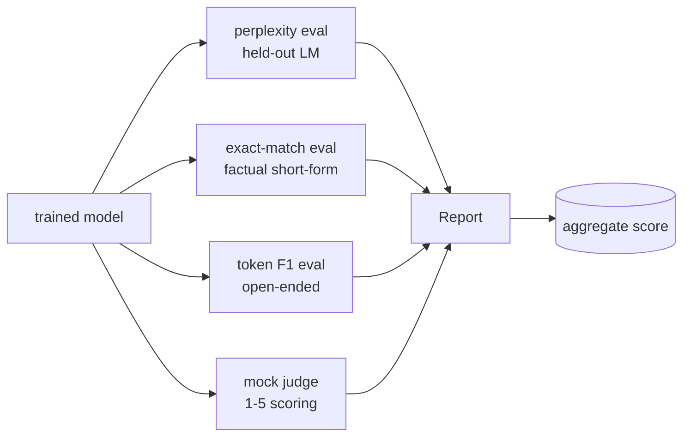
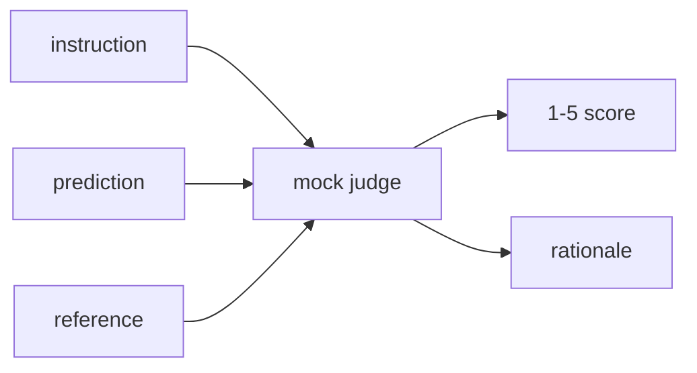
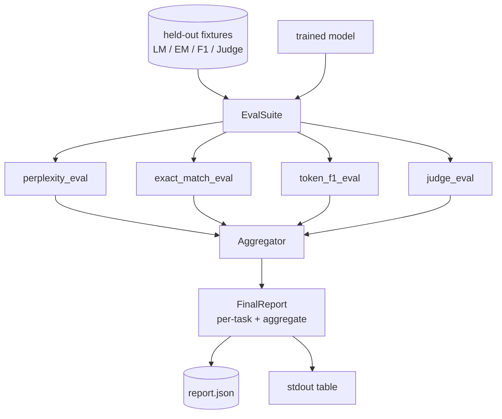

> 🇰🇷 이 문서는 한국어 번역본입니다(ELI5 스타일). 원문: [en.md](en.md)

# 캡스톤 레슨 41: 완전한 평가 파이프라인


> 학습은 손실 곡선으로 지켜볼 수 있는 부분입니다. 평가는 여러분이 직접 설계해야 하는 부분입니다. 이 레슨은 학습된 언어 모델이라면 무엇이든 받아 네 가지 이질적인 eval을 돌리고, 결과를 과제별 리포트로 집계하며, 네트워크 없이도 루프가 돌아가도록 로컬 목업(mock) LLM-as-judge까지 제공하는 통합 평가 파이프라인을 만듭니다. 네 가지 eval은 출시되는 모든 모델이 필요로 하는 차원을 커버합니다. 언어 모델링(퍼플렉시티), 단답형 정답률(완전 일치), 개방형 유사도(토큰 F1), 정성 채점(판정 모델/judge).

**유형:** Build
**언어:** Python (torch, numpy)
**선수 지식:** 페이즈 19의 30~37번 레슨 (NLP LLM 트랙: 토크나이저, 임베딩 테이블, 어텐션 블록, 트랜스포머 몸통, 사전학습 루프, 체크포인팅, 생성, 퍼플렉시티(perplexity))
**시간:** 약 90분

## 학습 목표

- 작은 트랜스포머에서 마스크된 토큰 계산법을 적용해 홀드아웃 퍼플렉시티를 계산합니다.
- 단답형 사실 프롬프트에 대해 완전 일치(exact-match) eval을 실행합니다.
- 정규화를 적용해 예측 문자열과 참조 문자열 사이의 토큰 수준 F1을 계산합니다.
- 모델 출력을 1~5점 척도로 채점하는 로컬 목업 LLM-as-judge를 만듭니다.
- 네 가지 eval을 과제별 세부 내역과 함께 하나의 가중 리포트로 집계합니다.

## 문제 상황

어떤 단일 지표도 언어 모델을 설명해 주지 못합니다. 퍼플렉시티는 모델이 언어 분포에 얼마나 잘 맞는지 말해 주지만, 질문에 답하는지는 아무것도 말해 주지 않습니다. 완전 일치는 모델이 정답 문자열을 냈는지 말해 주지만, 올바른 바꿔 표현(paraphrase)까지 벌점을 줍니다. 토큰 F1은 바꿔 표현을 용서해 주지만, 틀린 내용끼리 겹치는 단어에 속아 넘어갑니다. LLM-as-judge는 정성적 차원을 잡아 주지만 비싸고 확률적입니다.

여러분이 정말 원하는 파이프라인은 넷을 모두 갖춘 것입니다. 각 eval은 다른 eval이 놓치는 차원을 커버합니다. 각 eval은 그 지표에 맞게 준비된 홀드아웃 데이터의 서로 다른 부분집합에서 돌아갑니다. 최종 리포트는 과제별 숫자를 나란히 보여 주고 집계 점수까지 내어 주므로, 리뷰어는 모델이 어떤 트레이드오프를 하고 있는지 한눈에 볼 수 있습니다.

이 레슨은 바로 그 파이프라인을 파일 하나로 끝까지 만듭니다.

## 개념



각 eval은 `(model, dataset) -> EvalResult` 함수입니다. 결과에는 지표 값, 들여다보기용 예시별 세부 내역, 집계용 이름이 담깁니다. 파이프라인은 어떤 eval을 실행할지, 어떻게 가중치를 둘지 정한 설정(config)으로 이들을 조립합니다.

## 제대로 세는 퍼플렉시티

퍼플렉시티는 `exp(토큰당 평균 음의 로그 우도)`입니다. 구현에는 함정이 두 개 있습니다:

- 평균은 batch * sequence가 아니라 실제 토큰 위치에 대해 내야 합니다. 패딩 토큰은 분모에서 빼야 합니다. 그렇지 않으면 퍼플렉시티가 실제보다 좋아 보입니다.
- 모델은 다음 토큰을 예측하므로, 위치 `i`의 로짓은 위치 `i+1`의 토큰을 예측합니다. 여기서 한 칸(off-by-one) 실수는 조용히 지나갑니다. 손실은 여전히 줄어들지만 지표는 무의미해집니다.

이 eval은 배치별로 패드가 아닌 위치에 대한 `-log p(token)` 합과 토큰 수를 계산해 두고, 마지막에 나눕니다. 배치별 퍼플렉시티를 평균 내는 방식(짧은 시퀀스를 과소 가중하는 문제가 있음)보다 수치적으로 안전하고 교과서적 정의와도 일치합니다.

## 정규화를 곁들인 완전 일치

하니스(harness)는 비교 전에 예측과 참조 양쪽을 정규화합니다:

- 소문자로 바꿉니다.
- 앞뒤 공백을 제거합니다.
- 내부의 연속된 공백을 공백 하나로 압축합니다.
- 양쪽이 문장부호(`.`, `!`, `?`)만 다르다면, 끝의 종결 문장부호를 떼어 냅니다.

정규화 덕분에 완전 일치가 실전에서 쓸 만해집니다. `"Paris"`라고 한 모델은 정답이고, `"Paris."`라고 한 모델도 정답이며, `"  paris  "`라고 한 모델도 정답입니다. 그래도 지표는 정규화 후 문자열이 같아야 정답으로 셉니다.

## 올바른 토큰 F1

토큰 F1은 토큰의 가방(bag-of-tokens) 위에서 계산한 정밀도와 재현율의 조화 평균입니다. 절차:

1. 예측과 참조를 정규화합니다(완전 일치와 같은 규칙).
2. 각각을 토큰 목록으로 쪼갭니다(공백 토큰화).
3. 중복 집합(multiset) 교집합을 셉니다.
4. 정밀도 = `intersection_count / len(pred_tokens)`. 재현율 = `intersection_count / len(ref_tokens)`. F1 = 조화 평균.

예측과 참조가 둘 다 비어 있으면 F1은 1입니다(공허한 일치). 둘 중 하나만 비어 있으면 F1은 0입니다. 이 패턴은 SQuAD 평가 참조 구현과 일치하며, 바꿔 표현이 달라져도 안정적인 숫자를 냅니다.

## 로컬 목업 LLM-as-Judge

진짜 판정 모델(judge)은 API 너머의 프론티어 모델입니다. 이 레슨에서는 판정 모델이 오프라인으로 돌아야 합니다. 목업 판정 모델은 인스트럭션과 모델의 예측, 참조를 받아 `{1, 2, 3, 4, 5}` 범위의 점수와 한 줄 근거(rationale)를 돌려주는 결정론적 채점기입니다. 채점 규칙은 명시적입니다:

- 정규화된 예측이 정규화된 참조와 같으면 5.
- 예측과 참조 사이 토큰 F1이 0.8 이상이면 4.
- 토큰 F1이 `[0.5, 0.8)` 구간이면 3.
- 토큰 F1이 `[0.2, 0.5)` 구간이면 2.
- 그 외에는 1.

진짜 판정 모델은 아니지만 올바른 인터페이스를 갖추고 있습니다. 나중에 함수 하나만 바꿔 진짜 모델로 갈아끼울 수 있습니다. 파이프라인은 개의치 않습니다.



## 집계

집계 점수는 정규화된 eval 점수들의 가중 평균입니다. 각 eval은 `[0, 1]` 범위의 자기 숫자를 보고합니다:

- 퍼플렉시티: `1 / (1 + log(perplexity))`로 정규화. 퍼플렉시티 1은 1로, 무한대는 0으로 대응됩니다.
- 완전 일치: 이미 `[0, 1]` 안에 있습니다.
- 토큰 F1: 이미 `[0, 1]` 안에 있습니다.
- 판정 모델: 5로 나눕니다.

가중치는 설정 가능합니다. 기본 조합은 퍼플렉시티 0.2, 완전 일치 0.3, 토큰 F1 0.3, 판정 0.2입니다. 가중치 선택은 제품(product) 결정입니다. 레슨은 실험해 볼 수 있게 노브를 노출해 둡니다.

```figure
cg-eval-quadrant
```

## 아키텍처



`EvalSuite`는 얇은 오케스트레이터입니다. 개별 eval은 `(model, tokenizer, dataset, config)`를 받아 `EvalResult`를 반환하는 자유 함수입니다. `Aggregator`가 결과를 모아 최종 리포트를 만듭니다. 데모는 표를 출력하고, 하류(downstream) CI가 흡수할 수 있게 JSON 사본을 작성합니다.

## 만들게 될 것

구현은 `main.py` 하나와 테스트들입니다.

1. `TinyGPT`: 38~40번 레슨에서 쓴 것과 같은 디코더 전용 아키텍처. 레슨이 독립적으로 서도록 포함했습니다.
2. `InstructionTokenizer`: INST / RESP / PAD 특수 토큰을 갖춘 바이트 토크나이저.
3. 네 개의 픽스처: LM 코퍼스, EM 세트, F1 세트, 판정 세트. 각 20예시, 결정론적입니다.
4. `perplexity_eval`: 퍼플렉시티 값과 토큰별 손실 히스토그램이 담긴 `EvalResult`를 반환합니다.
5. `exact_match_eval`: 평균 EM과 예시별 기록을 반환합니다.
6. `token_f1_eval`: 평균 토큰 F1과 예시별 기록을 반환합니다.
7. `mock_judge`와 `judge_eval`: 예시별 점수와 근거, 세트 전체 평균 점수.
8. `Aggregator.normalise`: eval별 정규화 규칙.
9. `Aggregator.aggregate`: 가중 평균과 조립된 리포트.
10. `run_demo`: 작은 모델을 짧게 학습하고, 네 eval을 모두 실행하고, 리포트 표를 출력하고 JSON을 작성하고, 성공하면 종료 코드 0으로 끝납니다.

## 리포트 읽는 법

리포트는 세 층입니다. 맨 위는 집계 점수입니다. 그 아래 네 개의 eval별 숫자가 있습니다. 그 아래에는 진단용 예시별 세부 내역이 있습니다. 실패하는 CI 실행은 보통 집계 점수만 원하지만, 회귀(regression)를 쫓는 리뷰어는 모델이 어떤 입력을 틀렸는지 보려고 예시별 세부 내역을 원합니다.

JSON 덤프는 안정적인 키를 쓰기 때문에 CI 대시보드가 버전 간 추세선을 그릴 수 있습니다. 예쁘게 인쇄된 표는 학습을 마치고 터미널을 응시하는 사람을 위한 것입니다.

## 확장 목표

- 보정(calibration) eval을 추가해 보세요: 모델의 소프트맥스 확률이 정확도와 들어맞나요? 예측을 신뢰도별로 버킷에 나누고 버킷별 실측 정확도를 보고하세요.
- 강건성(robustness) eval을 추가해 보세요: 각 예시에 섭동(perturbation; 오타, 바꿔 표현, 방해 요소) 태그를 달고 섭동별 지표 하락을 보고하세요.
- 목업 판정 모델을 HTTP 호출 뒤의 진짜 모델로 교체해 보세요. 함수 시그니처는 바뀌지 않습니다.
- 과제별 가중치 학습을 추가해 보세요: 고정 가중치 대신, 모델들에 대한 목표 선호 순서에 맞게 가중치를 피팅합니다.

구현이 네 가지 eval과 집계기( aggregator)와 리포트를 제공합니다. 진짜 평가 파이프라인은 그 위에 훨씬 많은 차원을 겹쳐 쌓습니다. 하지만 패턴은 같습니다. eval마다 함수 하나, 집계기 하나, 리포트 하나.
