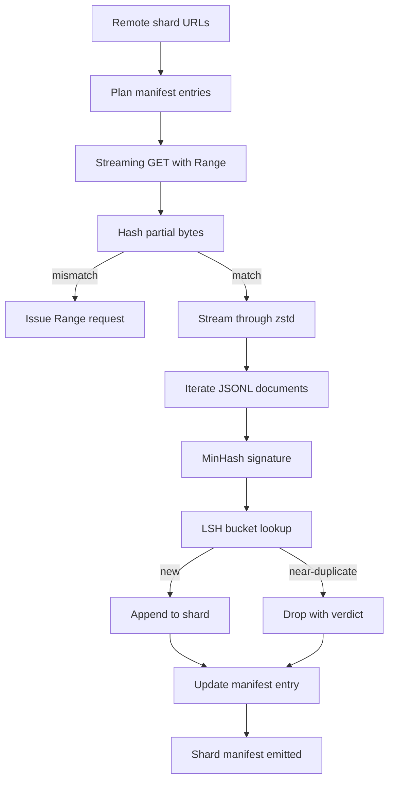

> 🇰🇷 이 문서는 한국어 번역본입니다(ELI5 스타일). 원문: [en.md](en.md)

# 대형 코퍼스 다운로더


> 언어 모델 학습은 첫 순전파 훨씬 전에 시작됩니다. 코퍼스가 디스크에 내려앉고, 압축이 풀리고, 중복이 제거되고, 주소로 접근 가능해야 합니다. 그리고 네트워크가 4% 지점에서 끊어지기 전에 이미 이어받기 전략이 마련되어 있어야 하죠. 이 레슨은 압축된 샤드를 스트리밍으로 받아오고, Zstandard로 실시간 압축을 풀고, MinHash와 지역 민감 해싱(locality-sensitive hashing, LSH)으로 근접 중복을 지문처럼 걸러 내고, 파이프라인의 나머지가 신뢰할 수 있는 샤드 매니페스트를 작성하는 스트리밍 다운로더를 만듭니다.

**유형:** Build
**언어:** Python
**선수 지식:** 페이즈 19의 30~37번 레슨
**시간:** 약 90분

## 학습 목표

- `urllib`로 원격 샤드를 스트리밍하고, 파일 전체를 메모리에 담지 않고 `zstandard`로 압축을 풉니다.
- 검증된 바이트 오프셋을 기준으로 HTTP `Range` 요청을 보내 부분 다운로드를 이어받습니다.
- 문서마다 MinHash 시그니처를 만들고 LSH로 버킷에 넣어, 근접 중복끼리 충돌하게 만듭니다.
- 콘텐츠 해시, 바이트 크기, 문서 수, 중복 제거 판정을 담은 샤드 매니페스트를 만들어 냅니다.

## 문제 상황

처음 200GB 코퍼스로 학습을 돌리면 네트워크가 41%에서 끊기고 스크립트가 `urllib` 예외로 종료됩니다. 두 번째는 78%에서 끊깁니다. 99% 지점에는 루프를 세 번이나 다시 짜게 됩니다. 첫날부터 설계해야 하는 두 실패는 부분 다운로드 이어받기와 중복 문서 제거입니다. 둘 다 잘 알려진 해법이 있지만, 파이프라인이 이빨이 돋은 한 줄짜리 `requests.get` 호출로 시작하다 보면 습관적으로 건너뛰어집니다.

이어받기(resume)는 HTTP 문제입니다. 서버는 `Range`를 지켜야 하고, 클라이언트는 검증된 오프셋을 디스크 기록과 대조해 추적해야 하며, 그 검증된 오프셋은 프로세스가 죽어도 살아남아야 합니다. 오프셋과 파일이 단 1바이트만 어긋나도 이어받은 다운로드는 쓰레기를 쓰고, 코퍼스는 토큰화 단계에서야 드러나는 방식으로 오염됩니다.

중복 제거는 지문(signature) 문제입니다. 정확한 해시 기반 중복 제거는 근접 중복을 놓칩니다. 같은 위키백과 문서가 세 가지 다른 상용구 푸터를 달고 나오고, 같은 코드 파일이 다른 라이선스 헤더를 달고 나오고, 같은 블로그 글이 모든 링크에 추적 파라미터를 달고 나오는 식입니다. MinHash와 LSH는 이것들을 준선형(sub-linear) 비용으로 잡습니다. 비용은 문서당 시그니처 하나, 시그니처당 버킷 조회 한 번입니다.

## 개념



### `urllib`으로 스트리밍하기

표준 라이브러리의 `urllib.request.urlopen`은 파일류(file-like) 객체를 반환합니다. 그것을 `zstandard.ZstdDecompressor().stream_reader`로 감싸면, 바이트가 네트워크에서 압축 해제기를 거쳐 문서 반복자로 흘러갑니다. 압축된 샤드도 압축 푼 샤드도 메모리에 통째로 올릴 필요가 없습니다. 메모리 비용은 라인 버퍼, 현재 문서의 MinHash 시그니처, LSH 인덱스뿐입니다.

### `Range`로 이어받기

다운로더는 샤드마다 두 개의 파일을 씁니다. 샤드 자신과 `.partial.json` 체크포인트입니다. 체크포인트는 `verified_bytes`, `expected_size`, `sha256_prefix`(처음 `verified_bytes`만큼에 대해 계산), 출처 URL을 기록합니다. 시작할 때 다운로더는 체크포인트를 읽고, 디스크의 바이트들로 `sha256_prefix`를 다시 계산하고, 재계산한 해시가 일치할 때만 이어받습니다. 해시가 틀리면 부분 파일은 버려지고 다운로드는 0바이트부터 다시 시작됩니다. 검증된 바이트는 가정이 아니라 검사 대상이므로, 조용한 오염(silent corruption)은 불가능합니다.

### MinHash와 LSH

MinHash는 두 집합의 자카드(Jaccard) 유사도를 고정된 공간에서 추정합니다. 문서의 경우 집합은 텍스트의 싱글(shingle; 겹치는 n-그램)들입니다. 시그니처는 `k`개의 최소 해시값이며, 독립적인 해시 함수마다 하나씩입니다. 자카드 유사도가 `s`인 두 문서는 시그니처의 임의 한 성분이 일치할 확률이 `s`입니다.

LSH는 이어서 `k`개 성분을 `r`행씩 `b`개의 밴드(band)로 묶습니다. 이때 `k = b * r`입니다. 두 문서가 적어도 하나의 밴드에서 충돌할 확률은 `1 - (1 - s^r)^b`로, 여러분이 `(b, r)`을 조정해 노리는 `s` 값 근처에서 급격한 임계점을 이룹니다. 전형적인 코퍼스 중복 제거의 임계값은 `s = 0.8`이며, LSH 연구 문헌은 이것을 `k = 128`, `b = 32`, `r = 4`로 달성합니다.

### 계약으로서의 샤드 매니페스트

다운로더의 유일한 영속적 산출물은 매니페스트입니다. 매니페스트는 샤드별로 URL, 압축 푼 바이트 수, 문서 수, 중복 제거 후 고유 문서 수, 최종 샤드 파일의 sha256을 담습니다. 하류의 토큰화는 디렉터리 목록이 아니라 매니페스트를 읽습니다. 샤드가 없거나 sha256이 틀리면, 매니페스트가 다음 단계에게 시작을 거부하라고 말해 줍니다. 매니페스트는 "데이터가 다운로드됨"과 "데이터가 다운로드되고 검증 가능함" 사이를 가르는 결정적 경계입니다.

```figure
cap-corpus-downloader
```

## 만들어 보기

`code/main.py`는 다음을 구현합니다:

- `ShardPlanner` - 샤드 URL 목록을 읽어 예정된 매니페스트 항목을 만듭니다.
- `StreamingDownloader` - 선택적 `Range`와 함께 `urllib` 스트림을 열고, 임시 파일에 쓰고, 청크마다 `.partial.json` 체크포인트를 갱신하고, 이어받을 때 sha256 접두사를 검증합니다.
- `ZstdDocIterator` - 파일류 스트림을 `zstandard.ZstdDecompressor`로 감싸 한 줄당 문서 하나를 내보냅니다.
- `MinHasher` - 고정된 해시 시드 계열을 사용해 문자열의 `k`성분 시그니처를 만듭니다.
- `LSHIndex` - 시그니처를 밴드별로 버킷에 담고 충돌을 보고합니다.
- `Dedup` - 해셔와 인덱스를 결합해 각 문서에 `keep` 또는 `near_duplicate` 레이블과 일치한 샤드 id를 붙입니다.
- `ManifestWriter` - 샤드별 통계를 모아 `manifest.json`을 씁니다.

파일 아래쪽의 데모는 디스크에 작은 합성 코퍼스를 만들고, `zstandard`로 압축하고, `file://` URL로 다운로드하고, 중복을 제거하고, 매니페스트를 출력합니다.

실행:

```bash
python3 code/main.py
```

스크립트는 종료 코드 0으로 끝나며 매니페스트 요약을 출력합니다.

## 프로덕션 패턴

네 가지 패턴이 이 레슨을 진짜 코퍼스 규모로 확장합니다.

**쓰기 전에 체크포인트.** `.partial.json`은 바이트를 샤드에 추가하기 전에 `fsync`되어야 합니다. 그렇지 않으면 전원 손실이 순서를 뒤집습니다. 샤드 바이트는 디스크에 있는데 체크포인트는 그것을 모르는 상태가 되고, 다음 이어받기는 실제보다 적은 검증 바이트를 믿게 되며, 중복된 접미 바이트가 파일을 오염시킵니다. 체크포인트가 먼저, 쓰기가 나중. 쓰기 전 로그(write-ahead log)와 같은 규율입니다.

**샤딩된 LSH 인덱스.** 200GB 규모에서 코퍼스 전체를 덮는 단일 LSH 인덱스는 RAM에 들어가지 않습니다. LSH 인덱스를 첫 밴드 해시로 분할하고, 파티션을 디스크에 저장하고, 새 시그니처가 닿을 파티션만 참조하세요. 비용은 문서당 디스크 읽기 한 번입니다. 이득은 LSH 인덱스가 더 이상 하드 메모리 상한이 아니게 된다는 것입니다.

**삭제가 아니라 묘비(tombstone).** 기각된 중복은 매니페스트에 `near_duplicate` 판정과 함께, 충돌 상대 문서의 샤드 id와 함께 기록됩니다. 그냥 지워 버리면 중복과 보존본 사이의 연결이 사라집니다. 묘비 처리는 감사 기록을 보존하고, 하류 패스가 나중에 임계값을 바꿔 생각할 여지를 남깁니다.

**매니페스트에 샤드별 sha256, 그리고 매니페스트 자체의 sha256까지.** 매니페스트 자체도 콘텐츠 해시를 받습니다. 하류 단계는 샤드별 항목을 신뢰하기 전에 매니페스트 해시를 검증합니다. 이게 없으면 매니페스트가 조용한 공격 표면입니다. 파일 하나만 편집할 수 있는 공격자가 파이프라인 전체를 오염시킬 수 있습니다.

## 활용하기

프로덕션 패턴들:

- **모든 CI 실행에서 이어받기.** CI 러너는 수명이 짧습니다. 다운로더는 매 실행마다 새 디스크를 가정하고 캐시나 원격에서 복구해야 합니다. `--cache-dir`은 일급(first-class) 플래그입니다.
- **토큰화 전에 중복 제거.** 토큰화는 비쌉니다. 같은 문서에 두 번 돌리면 같은 손실 곡선에 비용만 두 배입니다. 중복 제거는 토큰화의 상류에 있어야 합니다. 하류가 아닙니다.
- **병합 게이트로서의 매니페스트.** 학습 실행은 핀(pin)된 커밋에서 매니페스트 sha256을 읽습니다. 새 데이터셋 버전은 새 매니페스트 커밋을 요구합니다. 코드와 데이터의 연결은 전설이 아니라 git입니다.

## 출시하기

`outputs/skill-corpus-downloader.md`는 진짜 프로젝트에서라면, 어떤 URL이 다운로더에 공급되는지, 체크포인트 디렉터리가 어떻게 구성되는지, 중복 제거가 어떤 싱글 폭과 `(k, b, r)` 삼중항을 쓰는지, 매니페스트가 버전 관리의 어디에 사는지를 기술합니다. 이 레슨은 그 엔진을 출시합니다.

## 연습 문제

1. `--shingle-width` 플래그를 추가하고 폭 3, 5, 9에서 중복 제거 판정이 어떻게 달라지는지 측정해 보세요. 선택한 기본값을 방어해 보세요.
2. 매직 바이트를 훔쳐보는 방식으로 zstd 옆에 gzip 지원을 추가해 보세요. 다운로더가 호출자에게 코덱을 명시하도록 요구해서는 안 됩니다.
3. 체크포인트가 없으면 새 다운로드를 시작하는 것을 거부하는 `--resume-only` 모드를 추가해 보세요. CI에서 한 실행이 실수로 200GB를 다시 받는 일을 막는 데 유용합니다.
4. LSH 인덱스를 shelf나 sqlite 파일로 옮기고, 인메모리 방식 대비 처리량을 측정해 보세요.
5. 시작 시 매니페스트 sha256 검사를 추가해 보세요. 디스크의 매니페스트가 `manifest.lock`의 매니페스트 해시와 어긋나면 다운로더는 안전하게 멈춰야(fail closed) 합니다.

## 핵심 용어

| 용어 | 사람들이 말하는 것 | 실제 의미 |
|------|-----------------|------------------------|
| 샤드(shard) | "파일 하나" | 자체 sha256을 가진 자기 완결적인 코퍼스 조각. 이어받기와 중복 제거의 단위 |
| MinHash 시그니처 | "지문(fingerprint)" | 집합의 `k`성분 스케치. 각 성분은 집합 위 독립 해시 하나의 최소값 |
| LSH 밴드(band) | "버킷" | 충돌 탐지를 위한 단일 버킷 키로 쓰이는 `r`개 시그니처 성분의 묶음 |
| 검증된 바이트(verified bytes) | "이어받기 오프셋" | sha256 접두사가 체크포인트와 일치하는 디스크 바이트. 이어받을 수 있는 유일하게 안전한 오프셋 |
| 매니페스트(manifest) | "그 인덱스" | 다운로더가 무엇을 만들었는지에 대한 유일한 영속 기록. 콘텐츠 해시 포함 |

## 더 읽을 거리

- [RFC 7233](https://datatracker.ietf.org/doc/html/rfc7233) - HTTP Range 요청, 이어받기 프로토콜
- [Zstandard 형식 명세](https://datatracker.ietf.org/doc/html/rfc8478) - 스트리밍 압축 해제를 안전하게 만드는 프레임 형식
- [MinHash](https://en.wikipedia.org/wiki/MinHash) - 이 레슨이 쓰는 시그니처 계열
- [지역 민감 해싱(Locality-sensitive hashing)](https://en.wikipedia.org/wiki/Locality-sensitive_hashing) - 중복 제거 임계값 뒤에 있는 밴딩(banding) 방식
- 페이즈 19 · 43 - 다운로더가 공급하는 HDF5 토큰화 코퍼스
- 페이즈 19 · 44 - 코퍼스 위에서 학습하는 코사인 스케줄
- 페이즈 19 · 45 - 그 스케줄을 소비하는 AMP 루프
