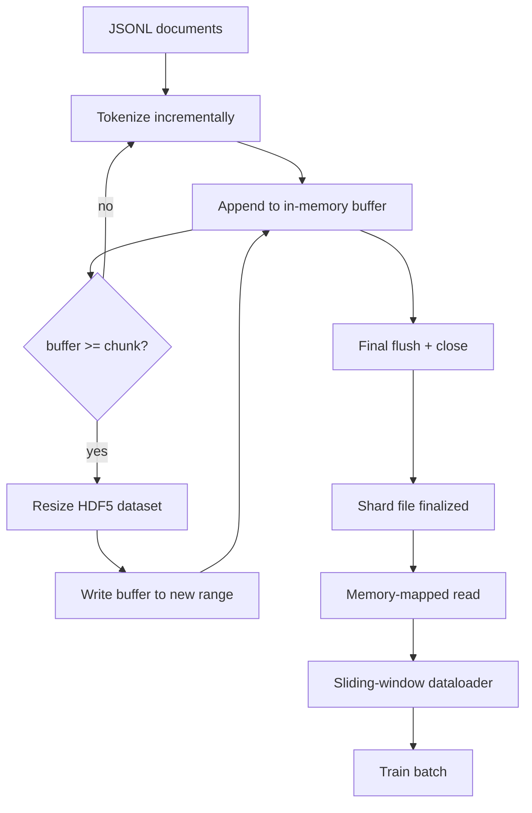

> 🇰🇷 이 문서는 한국어 번역본입니다(ELI5 스타일). 원문: [en.md](en.md)

# HDF5 토큰화 코퍼스


> 다운로드한 코퍼스는 트레이너가 전광석화 속도로 스트리밍할 수 있는 배치로 자리 잡아야 합니다. 디스크 위 JSONL은 16명짜리 데이터로더 워커를 버티지 못합니다. 크기 조절 가능하고 청크로 나뉜 정수 데이터셋을 갖춘 HDF5는 버팁니다. 이 레슨은 스트리밍 토큰화를 크기 조절 가능한 HDF5 데이터셋에 넣고, 여러 파일에 걸친 샤드 쓰기를 하고, 학습 시점에 메모리 매핑 읽기를 하고, 올바른 패킹 규칙으로 고정 길이 시퀀스를 만들어 내는 슬라이딩 윈도우 데이터로더를 구축합니다.

**유형:** Build
**언어:** Python
**선수 지식:** 페이즈 19의 30~37번 레슨
**시간:** 약 90분

## 학습 목표

- 문서를 결정론적 청킹(chunking)으로 크기 조절 가능한 HDF5 정수 데이터셋에 스트리밍합니다.
- 쓰기를 여러 HDF5 파일에 샤딩해서 실패 범위를 한정하고 병렬화를 가능하게 만듭니다.
- HDF5의 페이지 캐시 기반 청크 배치를 통해 토큰을 다시 읽어서, 데이터로더가 배치 시점에만 배치 버퍼로 복사하도록 만듭니다.
- 명시적인 패킹 규칙으로 고정 길이 학습 시퀀스를 만들어 내는 슬라이딩 윈도우 데이터로더를 구현합니다.

## 문제 상황

현대 언어 모델 학습은 수십 개의 워커가 초당 수십만 샘플 속도로 토큰을 읽습니다. 디스크 위 JSONL은 첫 콜드 캐시 페이지 폴트에서 죽습니다. JSON 파서는 느리고, 문서 경계는 주소로 접근할 수 없으며, "4,217,884번째 샘플"로 이동하려면 파일 전체를 훑어야 합니다. 압축이 잘 되는 Parquet조차 적합하지 않습니다. 트레이너는 컬럼을 원하지 않습니다. O(1) 무작위 접근이 가능한 평평한 토큰 스트림을 원합니다.

HDF5가 맞는 이유는, 읽기 시점에 페이지 캐시와 친한 청크 단위로 크기를 조절할 수 있는 정수 전용 데이터셋을 제공하기 때문입니다. 트레이너가 `tokens[3,200,000 : 3,200,8192]` 조각을 요청하면 HDF5는 요청된 하이퍼슬랩(hyperslab)을 페이지 캐시에서 새로 할당한 NumPy 배열로 복사합니다. 비용은 파일 핸들 하나와 워커당 청크 하나 크기의 페이지 캐시 점유인데, JSONL 디코딩 비용에 비하면 무시할 수준입니다.

구현의 관건은 쓰기 쪽을 정직하게 만드는 것입니다. 크기 조절 가능한 데이터셋은 잘못 쓰기 쉽습니다. 문서를 하나씩 쓰면 HDF5 파일이 쓸모없을 정도로 파편화됩니다. 모든 문서를 한 번의 resize로 쓰면 프로세스가 죽을 때 샤드 전체를 잃습니다. 올바른 규율은 버퍼 후 확장(buffer-then-extend)입니다. 청크 크기와 맞춘 버퍼 크기를 쓰고, 쓰기를 파일들로 샤딩해서 크래시가 최대 샤드 하나만 잃게 만드는 것입니다.

## 개념



### 올바르게 하는 크기 조절 가능 HDF5

토큰 데이터셋은 `maxshape=(None,)`과 고정된 `chunks=(chunk_size,)`로 만듭니다. 쓰기는 길이 `chunk_size`짜리 NumPy 배열에 토큰을 버퍼링하는 방식으로 진행됩니다. 버퍼가 차면 데이터셋을 정확히 `chunk_size`만큼 늘리고 버퍼를 새 범위에 씁니다. 샤드의 끝에서는 남은 버퍼를 마지막 부분 범위에 씁니다. 모든 쓰기는 마지막 것만 빼면 연속적이고 청크 정렬되어 있으며, 마지막 것은 샤드의 HDF5 속성에 기록된 `token_count`에서 잘라내라고 읽는 쪽에 알려 둡니다.

### 샤드 쓰기

HDF5 파일 하나는 단일 장애점입니다. 파이프라인은 샤드를 병렬로 씁니다. 페이즈 19의 42번 레슨의 입력 샤드마다 HDF5 출력 샤드 하나가 나옵니다. `shards.json` 인덱스는 샤드마다 파일 경로, 토큰 수, 문서 수, 토큰에 대한 sha256을 기록합니다. 트레이너는 `shards.json`을 읽어 전역 오프셋을 계산하고 코퍼스를 검증합니다.

### 메모리 매핑 읽기

학습 시점에 각 워커는 자기 몫의 HDF5 파일을 `swmr=True` 모드로 열고 `tokens[start:stop]`을 요청합니다. HDF5의 청크 배치 덕분에 청크가 뜨거워지면(hot) 이것은 페이지 캐시 기반 읽기가 됩니다. 워커는 파일 전체를 통째로 올리지 않습니다. 슬라이스는 데이터로더의 배치 버퍼로 복사되고, 데이터로더는 배치 시점에 그것을 고정 메모리(pinned memory) 학습 텐서로 복사합니다. 핫 경로의 비용은 청크 경계마다 시스템 콜 한 번이고, 그 외에는 전부 RAM 접근입니다.

### 슬라이딩 윈도우 데이터로더

데이터로더는 학습 시퀀스 길이를 아는 유일한 단계입니다. 전역 토큰 스트림에서 무작위 시작 인덱스를 고르고, `window_size + 1`개의 토큰을 읽고, `(input, target) = (tokens[:-1], tokens[1:])`을 반환합니다. 문서 경계는 강제하지 않습니다. 윈도우는 두 문서에 걸칠 수 있으며, 그 사이에 명시적인 `boundary_token_id`가 있어서 모델이 구분자를 사용하는 법을 배웁니다. 이것이 표준 패킹 규칙입니다. 동시에 초보자가 잊어버리는 규칙이기도 합니다. 이걸 빼먹으면 코퍼스의 8%는 경계 토큰 학습, 92%는 자연 텍스트라는 불균형이 생깁니다.

```figure
cc-hdf5-corpus
```

## 만들어 보기

`code/main.py`는 다음을 구현합니다:

- `Tokenizer` - 데모에는 충분한 바이트 단위 결정론적 토크나이저. 인터페이스는 `encode(text) -> list[int]`와 `vocab_size`입니다.
- `HDF5ShardWriter` - 크기 조절 가능한 정수 데이터셋을 열고, 토큰을 청크 크기까지 버퍼링하고, 고정 크기 스트라이드(stride)로 resize와 쓰기를 하고, 닫을 때 `token_count`와 `sha256`을 HDF5 속성으로 기록합니다.
- `ShardedTokenizationPipeline` - 입력 문서를 순회하고, 쓰기기(writer)로 라우팅하고, `shards.json` 인덱스를 만들어 냅니다.
- `MmapTokenStore` - 샤드 파일을 메모리 매핑 읽기로 열고, 전역 오프셋을 계산하고, `get_slice(start, stop)` API 하나를 노출합니다.
- `SlidingWindowDataloader` - 전역 스트림에서 무작위 윈도우를 골라 `(input_ids, target_ids)` NumPy 배열을 내보냅니다.

파일 아래쪽의 데모는 작은 인메모리 코퍼스를 만들고, 두 샤드로 토큰화하고, 메모리 매핑으로 열고, 데이터로더를 10 배치 돌리고, 배치별 형상과 체크섬을 출력합니다.

실행:

```bash
python3 code/main.py
```

스크립트는 종료 코드 0으로 끝나며 배치 체크섬을 출력합니다.

## 프로덕션 패턴

네 가지 패턴이 이 레슨을 진짜 학습 실행 규모로 확장합니다.

**청크 크기는 전형적인 읽기와 같게.** 트레이너는 샘플당 `window_size + 1`개의 토큰을 읽습니다. HDF5 청크를 `window_size`의 배수로 잡으면 읽기가 페이지 캐시 정렬됩니다. 어긋난 청크는 처리량을 절반으로 만듭니다. 모든 샘플이 두 청크에 걸치기 때문입니다.

**토큰 수는 데이터셋이 아니라 속성에.** 청크 크기가 문서 경계를 나누지 못하면 데이터셋의 끝 부분은 반쯤 찰 수 있습니다. 실제 `token_count`를 데이터셋의 HDF5 속성으로 저장하고, 읽는 쪽은 그 값에서 잘라내도록 하세요. 이게 없으면 읽는 쪽이 끝을 넘어 0으로 채워진 토큰을 걸어 들어가고, 모델은 0을 예측하는 법을 배웁니다.

**샤드별 sha256과 병렬 검증.** 각 샤드는 토큰 바이트에 대한 자체 sha256을 갖습니다. 트레이너는 학습 시작 전에 모든 샤드를 병렬로 검증할 수 있습니다. 잘못된 sha256은 16시간 학습한 뒤 세 번째 에포크에서가 아니라, 실행 초반에 실패로 이어집니다.

**양쪽 모두 `swmr=True`, 쓰기 쪽은 `libver="latest"`.** SWMR(Single-Writer-Multiple-Reader) 모드는 쓰기기가 `libver="latest"`로 열고, 모든 데이터셋을 미리 만들고, `file.swmr_mode = True`로 설정할 것을 요구합니다. 그다음 쓰기기는 resize 후마다 `dataset.flush()`를 호출해야 `swmr=True`로 연 워커들이 일관된 데이터를 봅니다. `libver="latest"`를 빼먹거나 구조 변경 후에 SWMR을 켜는 것이 "file is locked" 실패의 흔한 원인입니다.

## 활용하기

프로덕션 패턴들:

- **소스 샤드 하나당 HDF5 하나.** 다운로더(42번 레슨)는 URL당 샤드 하나를 내보냅니다. 토큰화(이 레슨)는 소스 샤드당 HDF5 하나를 내보냅니다. 1:1 대응 덕분에 이어받기와 부분 실패 복구가 간단해집니다.
- **경계 토큰 id.** 경계 토큰은 토크나이저 어휘의 일부이며, 데이터로더가 주입하는 유일한 토큰입니다. 모델이 무시해야 한다면 학습 손실이 경계 토큰을 마스킹합니다. 그렇지 않으면 모델은 그것을 시퀀스 구분자로 쓰는 법을 배웁니다.
- **진실의 원천으로서의 `shards.json`.** 새 샤드를 추가한다는 것은 HDF5를 쓰고, sha256을 계산하고, 항목을 추가하는 것입니다. 트레이너는 시작할 때 이 파일을 한 번 읽고 디렉터리 목록은 건드리지 않습니다.

## 출시하기

`outputs/skill-hdf5-tokenized-corpus.md`는 진짜 프로젝트에서라면, 어떤 토크나이저가 파이프라인에 공급되는지, 트레이너 윈도우에 맞는 청크 크기가 무엇인지, `shards.json`이 버전 관리의 어디에 사는지, 데이터로더 워커가 파일들에 어떻게 샤딩되는지를 기술합니다. 이 레슨은 그 엔진을 출시합니다.

## 연습 문제

1. HDF5 쓰기기에 `--compression gzip` 플래그를 추가하고 데모 코퍼스에서 처리량 비용을 측정해 보세요. 선택한 기본값을 방어해 보세요.
2. 슬라이딩 윈도우 데이터로더에 결정론적 시드를 추가하고, 같은 시드의 두 실행이 동일한 배치를 만드는지 확인해 보세요.
3. 모든 샤드를 읽고 토큰에 대한 sha256을 다시 계산해 `shards.json`과 비교하는 `--validate` 모드를 추가해 보세요. CI는 학습이 시작되기 전에 이것을 돌려야 합니다.
4. 청크 크기를 윈도우 크기와 같게, 절반으로, 두 배로 하면서 데이터로더 처리량을 비교해 보세요. 페이지 캐시 효과를 보고하세요.
5. 매우 긴 문서를 쓰기 시점에 자르는 `--max-document-tokens` 플래그를 추가해 보세요. 읽기 시점에 결정하는 방식과 비교해 트레이드오프를 방어해 보세요.

## 핵심 용어

| 용어 | 사람들이 말하는 것 | 실제 의미 |
|------|-----------------|------------------------|
| 크기 조절 가능 데이터셋 | "추가 전용(append-only)" | `maxshape=(None,)`을 가진 HDF5 데이터셋으로, 청크 크기 스트라이드의 `resize` 호출로 커짐 |
| 청크 배치(chunked layout) | "HDF5 저장 방식" | 커널이 메모리 매핑할 수 있고 데이터로더가 연속으로 읽을 수 있는 고정 크기 디스크 페이지 |
| `swmr` 모드 | "쓰면서 읽기" | 데이터로더 워커들이 파일을 안전하게 공유하게 해 주는 SWMR(Single-Writer-Multiple-Reader) 모드 |
| 샤드 인덱스 | "shards.json" | 오프셋과 콘텐츠 해시를 포함한 모든 토큰 샤드의 영속 인덱스 |
| 슬라이딩 윈도우 | "학습 샘플" | 전역 토큰 스트림의 고정 길이 조각으로, 트레이너가 한 칸 민 타깃과 짝지음 |

## 더 읽을 거리

- [HDF5 청킹 문서](https://support.hdfgroup.org/documentation/hdf5/latest/hdf5_chunking.html) - 이 레슨이 쓰는 청크 단위 크기 조절 가능 데이터셋 배치
- [h5py 사용자 가이드](https://docs.h5py.org/en/stable/) - HDF5의 파이썬 바인딩
- [NumPy 메모리 매핑](https://numpy.org/doc/stable/reference/generated/numpy.memmap.html) - h5py를 통해 노출되는 읽기 쪽 프리미티브
- 페이즈 19 · 42 - 이 레슨이 토큰화하는 다운로더 출력
- 페이즈 19 · 44 - 이 데이터로더를 소비하는 코사인 스케줄
- 페이즈 19 · 45 - 학습 스텝을 감싸는 AMP 루프
