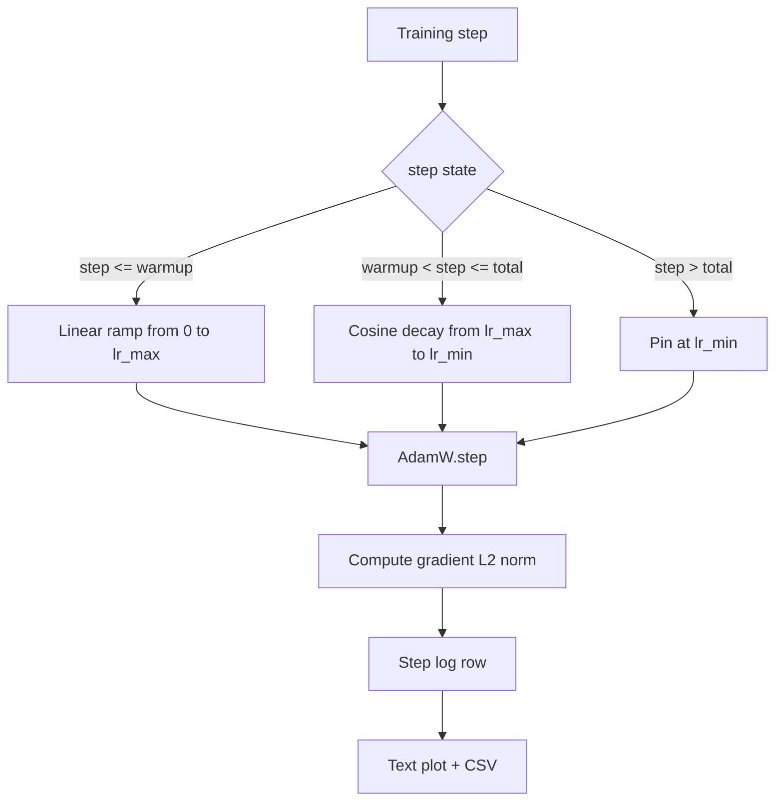

> 🇰🇷 이 문서는 한국어 번역본입니다(ELI5 스타일). 원문: [en.md](en.md)

# 선형 워밍업을 곁들인 코사인 학습률 스케줄


> 학습률 스케줄은 손실 함수 다음으로 중요한 결정입니다. 코사인 감쇠와 선형 워밍업을 곁들인 AdamW는 언어 모델 학습의 현대적 기본값입니다. 불안정한 첫 천 번의 업데이트 동안 모델이 작은 실효 보폭을 쓰게 해 주고, 설정된 피크까지 올려 준 다음, 0 쪽으로 부드럽게 낮춰 주기 때문입니다. 이 레슨은 그 스케줄을 만들고, 학습 스텝에 걸친 곡선을 그리고, 스케줄 옆에 기울기 노름을 기록하고, 스케줄이 워밍업, 피크, 감쇠 경계를 정확히 지키는지 증명합니다.

**유형:** Build
**언어:** Python
**선수 지식:** 페이즈 19의 30~37번 레슨
**시간:** 약 90분

## 학습 목표

- 선형 워밍업이 붙은 코사인 학습률 스케줄에 연결된 AdamW 옵티마이저를 구현합니다.
- 실행 간 부동소수점 오차 없이, 임의 스텝에서 스케줄의 정확한 값을 계산합니다.
- 학습 상태를 관측 가능하게 만들기 위해 기울기 L2 노름을 학습률과 나란히 기록합니다.
- 눈으로 읽을 수 있는 텍스트 플롯과 어떤 도구든 소비할 수 있는 CSV로 스케줄을 렌더링합니다.

## 문제 상황

첫 천 번의 학습 업데이트가 가장 시끄러운 시기입니다. 모델의 가중치는 아직 초기화 근처에 있고, 옵티마이저의 이동평균 2차 모먼트 추정치는 아직 안정화되지 않았으며, 기울기 노름은 크고 시끄럽습니다. 이 업데이트들 동안 학습률이 피크에 있다면 모델은 완전히 발산하거나, 평생 빠져나가지 못하는 손실 고원에 정착합니다. 잘 알려진 두 해법은 기울기 클리핑(페이즈 19의 45번 레슨 주제입니다)과, 작게 시작해서 서서히 올리는 학습률 스케줄입니다.

코사인 + 워밍업 스케줄에는 세 개의 영역이 있습니다. 스텝 0부터 `warmup_steps`까지는 학습률이 0에서 설정된 피크 `lr_max`까지 선형으로 커집니다. `warmup_steps`부터 `total_steps`까지는 학습률이 코사인 곡선의 윗반을 따라 `lr_max`에서 `lr_min`으로 감쇠합니다. `total_steps` 이후에는 학습률이 `lr_min`에 고정되어, 설정을 잘못해 초과 실행한 트레이너가 스케줄을 조용히 벗어나는 일이 없습니다.

구현 문제는 스케줄이 한 칸(off-by-one) 실수를 저지르기 쉽다는 점입니다. 이 실수는 학습 시작 6시간쯤 뒤에, 모델이 과적합을 시작하는 시점의 학습률이 1% 높거나 낮은 형태로 드러납니다. 스케줄을 경계마다 철저히 테스트하지 않으면 눈에 보이지 않습니다.

## 개념



### 워밍업 공식

`warmup_steps > 0`이고 `step`이 `[0, warmup_steps]`에 있을 때, 학습률은 `lr_max * step / warmup_steps`입니다. 퇴화한 경우인 `warmup_steps = 0`은 "워밍업 없음"으로 취급합니다. 스케줄은 스텝 0에서 바로 `lr_max`에서 시작해 곧바로 코사인 감쇠로 들어갑니다. 어떤 테스트 하니스는 스케줄이 여전히 쓸 만한 곡선을 만드는지 확인하려고 `warmup_steps = 0`을 넣기도 합니다.

### 코사인 공식

`step`이 `(warmup_steps, total_steps]`에 있을 때 학습률은 `lr_min + 0.5 * (lr_max - lr_min) * (1 + cos(pi * progress))`입니다. 여기서 `progress = (step - warmup_steps) / max(1, total_steps - warmup_steps)`입니다. `step = warmup_steps`에서 코사인은 `cos(0) = 1`이 되어 `lr_max`를 주며, 워밍업 끝점과 정확히 맞물립니다. `step = total_steps`에서는 `cos(pi) = -1`이 되어 `lr_min`을 주며, 감쇠 끝점과 정확히 맞물립니다.

양 끝점에서의 연속성은 우연이 아닙니다. 스케줄을 세 개의 다른 함수를 이어 붙인 것이 아니라 `step`에 대한 단일 함수로 구현하는 이유입니다. 이어 붙인 스케줄은 `lr_max`만 바뀌어도 경계 하나를 잃어버립니다.

### 전체 스텝 이후의 바닥값(floor)

`step > total_steps`이면 학습률은 `lr_min`에 머뭅니다. 계약은 명시적입니다. 스케줄은 오류를 내지도, 외삽(extrapolate)하지도 않습니다. 바닥값에 고정하고 트레이너가 경고를 기록하게 둡니다. 학습을 늘려야 하는 트레이너는 루프가 아니라 스케줄의 `total_steps`를 바꿉니다.

### 학습률 옆에 기울기 노름 기록하기

스케줄이 학습 건강의 절반이라면 기울기 노름이 나머지 절반입니다. 학습 루프는 스텝마다 둘 다 기록합니다. 발산하는 학습은 손실보다 먼저 기울기 노름이 치솟습니다. 잘 맞춘 워밍업은 노름이 학습률과 함께 선형으로 오르게 유지합니다. 지나치게 공격적인 피크는 워밍업 이후에도 노름이 높게 머무는 모습으로 드러납니다. 디스크의 데이터셋은 `step, lr, grad_l2_norm, loss`입니다. 이 CSV가 유일한 영속 기록입니다.

```figure
cap-cosine-warmup
```

## 만들어 보기

`code/main.py`는 다음을 구현합니다:

- `CosineWithWarmup` - 설정된 스케줄 위의 상태 없는(stateless) 함수 `lr(step) -> float`.
- `TrainState` - 모델, `AdamW` 옵티마이저, 스케줄을 하나의 스텝 함수로 묶습니다.
- `TrainState.step` - 순전파 한 번, 역전파 한 번을 실행하고, 기울기 L2 노름을 기록하고, 옵티마이저에 `lr(step)`을 적용합니다.
- `plot_schedule_ascii` - 스케줄을 눈으로 읽을 수 있는 텍스트 플롯으로 렌더링합니다.
- `write_schedule_csv` - 스텝마다 학습률과 함께 한 행씩 내보냅니다.

파일 아래쪽의 데모는 작은 `nn.Linear` 모델을 만들어 고정 입력 배치로 20 스텝 학습시키고, 스텝별 학습률, 기울기 노름, 손실을 출력합니다. 스케줄은 시각적 정합성 확인을 위해 텍스트 플롯으로도 렌더링됩니다.

실행:

```bash
python3 code/main.py
```

스크립트는 종료 코드 0으로 끝나며 스텝별 학습 로그와 스케줄 플롯을 출력합니다.

## 프로덕션 패턴

네 가지 패턴이 스케줄을 프로덕션 산출물로 끌어올립니다.

**스케줄은 코드가 아니라 설정(config)에.** 트레이너는 git에 커밋된 YAML이나 JSON 설정에서 `warmup_steps`, `total_steps`, `lr_max`, `lr_min`을 읽습니다. 설정이 콘텐츠 주소화(content-addressed)되어 있으니 스케줄은 재현 가능하고, 설정이 PR diff의 일부이니 스케줄은 감사 가능합니다.

**스텝 카운터는 단조적이고 에포크와 분리됩니다.** 데이터셋이 샤딩되거나 데이터로더가 재시작하면 일부 프레임워크는 스텝과 에포크를 헷갈립니다. 스케줄은 로컬 카운터가 아니라 트레이너 체크포인트의 `global_step`을 읽습니다. 스텝 카운터가 영속적인 축이므로, 재개한 실행이 올바른 스케줄 위치에서 계속됩니다.

**실행 디렉터리에 스케줄 플롯.** 모든 학습 실행은 자기 실행 디렉터리에 `outputs/lr_schedule.png`(이 레슨에서는 텍스트 플롯)를 씁니다. 디렉터리를 훑어보는 리뷰어는 아무것도 다시 실행하지 않고도 스케줄의 정합성을 확인할 수 있습니다. 잘못 설정된 스케줄 부류의 버그를 PR 시점에 잡아 줍니다.

**로그 행 스키마는 고정.** `step, lr, grad_l2_norm, loss`, 이 순서 그대로입니다. 하류의 노트북이나 대시보드가 이 스키마를 읽습니다. 버전을 올리지 않고 컬럼 이름을 바꾸면 기존 대시보드 전부가 무효화됩니다.

## 활용하기

프로덕션 패턴들:

- **무엇보다 먼저 피크를 스윕(sweep)하세요.** `lr_max`가 가장 민감한 노브입니다. 작은 모델로 먼저 스윕하세요. 최적 `lr_max`는 모델 크기에 따라 약하게만 변하므로, 작은 모델의 스윕이 강력한 사전 지식이 됩니다.
- **워밍업은 절대 개수가 아니라 전체 스텝의 비율로.** 2억 스텝짜리 실행이 워밍업 2,000 스텝이면 거의 즉시 피크에 닿고, 같은 개수로 2만 스텝짜리 실행은 10% 동안 워밍업합니다. 워밍업을 비율로 설정하세요(전형적으로 1~3%) 그래야 스케줄이 학습 기간에 비례합니다.
- **`lr_min`은 의도적으로 0이 아닙니다.** `lr_max`의 10%짜리 바닥값은 긴 꼬리 동안 옵티마이저가 학습을 계속하게 만듭니다. `lr_min = 0` 스케줄은 플롯에서는 멋져 보이는 학습 곡선과, 정작 학습이 끝나지 않은 모델을 낳습니다.

## 출시하기

`outputs/skill-cosine-warmup.md`는 진짜 프로젝트에서라면, 어떤 설정이 스케줄을 담는지, 전역 카운터를 어느 트레이너 스텝에서 읽는지, 어떤 `lr_max` 스윕이 배포된 값을 만들었는지를 기술합니다. 이 레슨은 그 엔진을 출시합니다.

## 연습 문제

1. 스케줄의 역제곱근(inverse-square-root) 변형을 추가하고 200 스텝짜리 장난감 학습에서 비교해 보세요. 어느 곡선이 더 낮은 최종 손실을 냅니까?
2. `total_steps / 2` 지점에 두 번째 워밍업을 추가하는 `--restart` 플래그를 추가해 보세요. 워밍 재시작이 장난감 실행에서 이롭습니까, 해롭습니까? 근거를 들어 방어해 보세요.
3. 스케줄이 연속적이라는 단위 테스트를 추가해 보세요: `[0, total_steps]`의 모든 스텝에 대해 `|lr(step+1) - lr(step)|`의 차이가 `lr_max / warmup_steps` 이하인지 검사합니다.
4. 스케줄을 `torch.optim.lr_scheduler.LambdaLR`에 연결해 프레임워크 코드와 조합되게 해 보세요. 레슨은 평범한 스텝 함수를 씁니다. 래퍼(wrapper)는 무엇을 바꿉니까?
5. `matplotlib`으로 진짜 플롯을 쓰는 `--plot-png` 플래그를 추가해 보세요. CI 실행에는 레슨의 텍스트 플롯과 PNG 중 어느 쪽이 나은 기본값인지 방어해 보세요.

## 핵심 용어

| 용어 | 사람들이 말하는 것 | 실제 의미 |
|------|-----------------|------------------------|
| 워밍업(warmup) | "느린 출발" | 첫 `warmup_steps`번의 업데이트 동안 0에서 `lr_max`까지 선형으로 오르는 것 |
| 코사인 감쇠 | "부드러운 하강" | 남은 스텝 동안 `lr_max`에서 `lr_min`까지 윗반 코사인 곡선을 따라 내려가는 것 |
| 바닥값(floor) | "학습 이후" | `total_steps`를 넘은 뒤 스케줄이 고정되는 값 `lr_min` |
| 기울기 노름 | "grad의 L2" | 연결된 기울기 벡터의 유클리드 노름. 스텝마다 기록됨 |
| 전역 스텝(global step) | "스케줄 축" | 재시작을 넘어 살아남고 스케줄을 구동하는 단조 증가 스텝 카운터 |

## 더 읽을 거리

- [Loshchilov and Hutter, SGDR: Stochastic Gradient Descent with Warm Restarts (arXiv 1608.03983)](https://arxiv.org/abs/1608.03983) - 코사인 스케줄의 참조 논문
- [Loshchilov and Hutter, Decoupled Weight Decay Regularization (arXiv 1711.05101)](https://arxiv.org/abs/1711.05101) - AdamW의 참조 논문
- [PyTorch torch.optim.lr_scheduler](https://docs.pytorch.org/docs/stable/optim.html#how-to-adjust-learning-rate) - 스텝 함수가 프레임워크 스케줄러와 조합되는 방식
- 페이즈 19 · 42 - 이 스케줄이 소비하는 코퍼스를 만드는 다운로더
- 페이즈 19 · 43 - 이 스케줄과 함께 진화하는 데이터로더
- 페이즈 19 · 45 - 루프의 다음 층인 기울기 클리핑과 AMP
