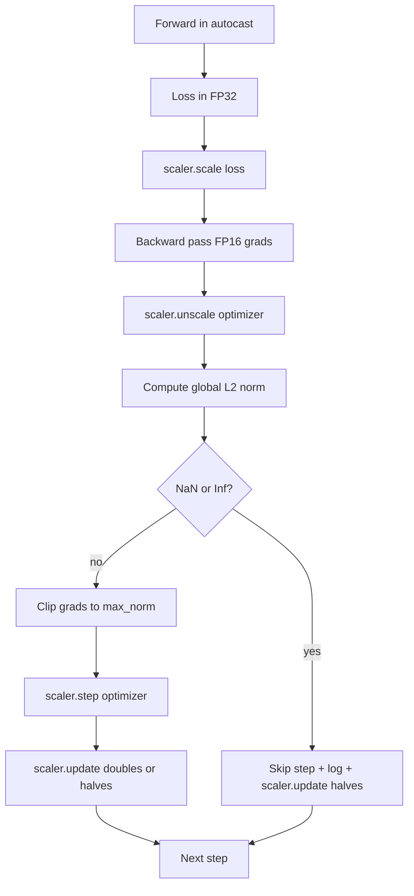

> 🇰🇷 이 문서는 한국어 번역본입니다(ELI5 스타일). 원문: [en.md](en.md)

# 기울기 클리핑과 혼합 정밀도(Mixed Precision)


> 이전 레슨의 옵티마이저와 스케줄은 기울기가 정상이라고 가정합니다. 하지만 보통은 그렇지 않습니다. 나쁜 배치 하나가 기울기 노름을 세 자릿수나 뛰어 올릴 수 있습니다. 혼합 정밀도 학습은 여기에 손실 쪽 FP16 오버플로까지 더합니다. 이 레슨은 프로덕션 학습이 없이는 출시할 수 없는 두 개의 안전벨트를 만듭니다. 설정된 전역 L2 노름으로 기울기를 잘라내는 클리핑, 그리고 NaN과 Inf를 감지해 스텝을 깔끔하게 건너뛰고 포렌식(forensics)용으로 스케일링 계수까지 기록하는 autocast와 GradScaler를 갖춘 혼합 정밀도 루프입니다.

**유형:** Build
**언어:** Python
**선수 지식:** 페이즈 19의 30~37번 레슨
**시간:** 약 90분

## 학습 목표

- 모든 파라미터 기울기에 대한 전역 L2 노름을 계산하고, 설정된 임계값을 넘으면 제자리에서 클리핑합니다.
- 학습 스텝을 autocast와 GradScaler로 감싸서 FP16 순전파와 역전파가 오버플로를 견디게 만듭니다.
- 손실이나 기울기의 NaN과 Inf를 감지하고, 옵티마이저 스텝을 건너뛰고, 그 건너뜀을 기록합니다.
- GradScaler의 스케일링 계수를 매 스텝 보고해서, 긴 건너뜀 연속이 즉시 보이게 만듭니다.

## 문제 상황

어제까지 멀쩡히 돌던 학습이 8,217 스텝에서 수직으로 솟는 손실 곡선을 만들어 냅니다. 범인은 기울기 노름이 4,200인 배치 하나, 직전 피크의 20배입니다. 클리핑이 없으면 옵티마이저가 그 스텝을 밟아 모델이 지난 한 시간 동안 쌓은 학습 전부를 리셋합니다. 노름 1.0의 전역 L2 클립이 있으면 같은 배치가 단위 노름(unit-norm) 업데이트 하나로 기여하고, 손실은 추세선에 그대로 머물며, 학습은 살아남습니다.

혼합 정밀도 학습은 순전파와 역전파 대부분을 FP16으로 계산해 처리량을 2~3배로 밀어 올립니다. 대가는 FP16의 지수 범위가 좁다는 것입니다. FP16에서 오버플로하는 전형적인 기울기는 Inf가 되고, 그것은 이후 레이어들을 통해 NaN으로 전파되어, 다음 옵티마이저 스텝에서 모든 가중치를 NaN으로 바꿔 버립니다. PyTorch의 GradScaler는 이 문제를 역전파 전에 손실에 큰 스케일링 계수를 곱하고, 옵티마이저 스텝 전에 기울기를 같은 계수로 나눠서 해결합니다. unscale 시점에 어떤 기울기라도 Inf나 NaN이면 스케일러는 스텝을 건너뛰고 계수를 절반으로 줄입니다. 이전 N 스텝이 깨끗했으면 계수를 두 배로 올립니다. 학습이 진행되는 동안 계수는 FP16 범위가 허용하는 최고값에 스스로 도달합니다.

구현 문제는 둘을 올바르게 연결하는 것입니다. unscale 전에 클립하면 임계값이 스케일된 기울기에 적용됩니다. unscale 후에 클립하면 GradScaler의 연산 순서가 중요해집니다. 올바른 순서는 `scaler.scale(loss).backward()`, 그다음 `scaler.unscale_(optimizer)`, 그다음 `clip_grad_norm_`, 그다음 `scaler.step(optimizer)`, 마지막 `scaler.update()`입니다. 다른 순서는 조용히 망가진 루프를 만듭니다.

## 개념



### 전역 L2 노름

전역 L2 노름은 파라미터별 노름이 아니라 연결된 기울기 벡터 전체의 유클리드 노름입니다. PyTorch는 이것을 `torch.nn.utils.clip_grad_norm_(parameters, max_norm)`으로 구현합니다. 이 함수는 클립 전 노름을 반환하므로, 레슨은 자연값과 클립된 값을 둘 다 기록할 수 있습니다. "매 스텝 클리핑 중입니다"라는 진단에는 둘 다 필요합니다.

### autocast와 GradScaler

`torch.amp.autocast(device_type)`은 자격이 되는 연산들(대부분의 행렬 곱류 연산)을 골라 FP16으로 실행하는 컨텍스트 매니저입니다. `torch.amp.GradScaler(device_type)`은 역전파 전에 손실을 스케일하고 옵티마이저 스텝 전에 기울기를 역스케일하는 헬퍼입니다. 둘은 함께 설계되었고, 하나만 쓰는 것은 테스트가 잡아야 할 설정 오류입니다.

이 레슨은 CI에서 돌아가는 CPU autocast를 씁니다. 같은 패턴은 `device_type="cpu"`를 `device_type="cuda"`로 바꾸는 것만으로 CUDA에 그대로 옮겨 갑니다. CPU의 GradScaler는 스텁(stub)입니다(CPU autocast는 기본적으로 BF16으로 동작하며 손실 스케일링이 필요 없습니다). 하지만 레슨은 호출 지점까지 포함해서, 배선이 GPU 루프와 동일하게 보이도록 합니다.

### NaN과 Inf 감지

감지는 두 곳에서 일어납니다. 첫째, 손실 자체는 역전파 전에 `torch.isfinite`로 검사합니다. Inf나 NaN 손실은 유용한 기울기를 만들지 않으므로, 옵티마이저에 들어가기 전에 건너뜁니다. 둘째, `scaler.unscale_(optimizer)` 이후 레슨은 `has_non_finite_grad(...)`로 unscale된 기울기를 훑어 Inf나 NaN을 건너뜀(skip)으로 취급합니다. 두 검사를 합치면 순전파와 역전파의 실패 양상을 모두 커버합니다.

### 스케일링 계수 진단

스케일링 계수는 GradScaler의 내부 상태입니다. 레슨은 매 스텝 `scaler.get_scale()`을 읽어 학습률과 기울기 노름 옆에 기록합니다. 건강한 학습은 스케일링 계수가 2의 거듭제곱으로 올라가다 `2^17`이나 `2^18` 근처에서 포화되는 모습을 보입니다. 문제 있는 학습은 계수가 높은 값과 낮은 값 사이를 오가는데, 모델의 기울기가 어느 때는 범위 안에 있고 어느 때는 벗어난다는 신호입니다. 기록하지 않으면 이 진단은 보이지 않습니다.

```figure
grad-clip-monitor
```

## 만들어 보기

`code/main.py`는 다음을 구현합니다:

- `clip_global_l2_norm` - `torch.nn.utils.clip_grad_norm_`을 감싸 클립 전/후 노름을 모두 반환하는 래퍼.
- `has_non_finite_grad` - 기울기에서 NaN과 Inf를 찾아내는 헬퍼.
- `AmpTrainState` - 모델, `AdamW` 옵티마이저, GradScaler, autocast 장치를 묶습니다. 클리핑, 스케일링, NaN 시 건너뜀 파이프라인 전체를 실행하는 `step(inputs, targets)`를 노출합니다.
- `StepLog`와 `SkipLog` - 구조화된 스텝별 기록.
- 20 스텝 동안 작은 `nn.Linear` 모델을 학습시키고, 5 스텝에서 건너뜀 경로를 통과시키려고 기울기에 Inf를 주입하고, 그 결과 로그를 출력하는 데모.

실행:

```bash
python3 code/main.py
```

스크립트는 종료 코드 0으로 끝나며, 각 행이 `STEP` 또는 `SKIP`으로 태그된 스텝별 로그를 출력합니다. 적어도 하나의 행은 `SKIP`입니다.

## 프로덕션 패턴

네 가지 패턴이 이 루프를 프로덕션 학습 스텝으로 끌어올립니다.

**건너뜀 카운터는 로그 줄이 아니라 알림으로.** 학습당 몇 번의 건너뜀은 건강합니다. 에포크당 수백 번의 건너뜀은 강한 경보입니다. 모델이 FP16이 버티지 못하는 상태에 있고, 루프가 조용히 실패하고 있다는 뜻입니다. 레슨은 1,000 스텝 롤링 건너뜀률을 추적하고, 프로덕션에서는 그 비율이 5%를 넘으면 호출(on-call)이 울리게 할 것입니다.

**클립 임계값은 설정(config)에.** `max_norm = 1.0`은 언어 모델 학습의 현대적 기본값입니다. 작은 모델로 먼저 스윕하세요. 큰 임계값은 정말 어려운 배치에서 모델이 회복하게 해 주고, 작은 임계값은 더 시끄러운 손실 곡선이라는 대가로 최악의 상황을 묶어 줍니다. 임계값은 44번 레슨의 스케줄과 같은 YAML이나 JSON 설정에 있어야 합니다.

**노름 로그는 스케줄과 함께 하나의 CSV에.** CSV 컬럼은 `step, lr, grad_l2_pre_clip, grad_l2_post_clip, loss, skipped, skip_reason, scaler_scale`입니다. 파일을 열어 본 리뷰어는 한 행에서 스케줄과, 기울기 이야기와, 스케일링 계수와, 건너뜀 결과(이유 포함)를 모두 봅니다. 컬럼을 여러 파일로 쪼개면 분석이 어긋나는 재앙이 됩니다.

**`scaler.update()`는 건너뜀 때도 매 스텝 실행.** 깨끗한 스텝에서는 스케일러가 no-inf 카운터를 읽고, 늘리고, 계수를 두 배로 올릴 수도 있습니다. 건너뛴 스텝에서는 스케일러가 계수를 절반으로 줄이고 카운터를 리셋합니다. 건너뜀 경로에서 `update()`를 빼먹는 것이 바로 "스케일링 계수가 끝까지 안 바뀌었다"는 버그를 만듭니다.

## 활용하기

프로덕션 패턴들:

- **autocast 장치는 옵티마이저 장치와 맞춥니다.** GPU 학습은 `torch.amp.autocast(device_type="cuda")`, CPU는 `torch.amp.autocast(device_type="cpu")`. 장치를 섞으면 조용한 타입 오류가 생기고, 손실 곡선은 멀쩡해 보이는데 모델은 배우지 않는 증상으로 드러납니다.
- **역전파 전에 손실 검사.** `torch.isfinite(loss).all()`은 텐서 축소 연산 하나입니다. 비용은 무시할 수준이고, NaN 손실에서 아껴 주는 것은 학습 스텝 통째입니다. 항상 돌리세요.
- **`zero_grad`에 `set_to_none=True`.** 기울기를 0 대신 `None`으로 설정해서, 옵티마이저가 영향받지 않은 파라미터 그룹의 연산을 건너뛰게 합니다. 이 설정은 공짜 처리량 개선이자 버그 표면의 미세한 축소입니다.

## 출시하기

`outputs/skill-clip-amp.md`는 진짜 프로젝트에서라면, 학습 스텝이 어떤 클립 임계값과 autocast 장치를 쓰는지, 스텝별 CSV가 버전 관리의 어디에 사는지, 프로덕션 건너뜀률 경보 임계값이 얼마인지를 기술합니다. 이 레슨은 그 엔진을 출시합니다.

## 연습 문제

1. 인위적인 Inf 주입을 진짜 손실 급등으로 교체해 보세요(한 배치의 타깃에 1e8을 곱하기). 건너뜀 경로가 발동하는지 확인하세요.
2. autocast를 FP16 대신 BF16으로 전환하는 `--bf16` 모드를 추가해 보세요. BF16은 FP16보다 지수 범위가 넓어 손실 스케일링이 거의 필요 없습니다. 같은 데모에서 건너뜀률이 0으로 떨어지는지 확인하세요.
3. 클리핑이 일어나지 않을 때 기울기 클립 래퍼가 클립 전/후 노름을 올바르게 반환하는지 검사하는 단위 테스트를 추가해 보세요.
4. 롤링 윈도우 건너뜀률 계산을 추가하고, 그 비율이 설정된 임계값을 100 연속 스텝 동안 넘으면 실행을 실패 처리하는 CLI 플래그를 추가해 보세요.
5. 루프를 표준 CSV(`step, lr, grad_l2_pre_clip, grad_l2_post_clip, loss, skipped, skip_reason, scaler_scale`) 쓰기에 연결하고, 행마다 플러시해서 Ctrl-C 이후에도 파일이 살아남는지 확인하세요.

## 핵심 용어

| 용어 | 사람들이 말하는 것 | 실제 의미 |
|------|-----------------|------------------------|
| 전역 L2 노름 | "클립 목표" | 학습 가능한 모든 파라미터에 걸친 연결 기울기 벡터의 유클리드 노름 |
| autocast | "혼합 정밀도" | `with` 블록 안에서 자격이 되는 연산만 골라 FP16(또는 BF16)으로 실행하는 것 |
| GradScaler | "손실 스케일러" | 역전파 전에 손실을 곱하고 옵티마이저 스텝 전에 기울기를 역스케일하는 헬퍼 |
| 건너뜀(skip) | "나쁜 스텝" | 기울기나 손실이 유한하지 않아 거부된 옵티마이저 스텝. 스케일러가 계수를 절반으로 줄임 |
| 스케일링 계수 | "스케일러 상태" | GradScaler의 현재 곱수. 깨끗한 구간 뒤에는 두 배가 되고 건너뜀마다 절반이 됨 |

## 더 읽을 거리

- [Micikevicius et al., Mixed Precision Training (arXiv 1710.03740)](https://arxiv.org/abs/1710.03740) - 최초의 손실 스케일링 제안
- [Pascanu, Mikolov, Bengio, On the difficulty of training recurrent neural networks (arXiv 1211.5063)](https://arxiv.org/abs/1211.5063) - 기울기 클리핑 참조 논문
- [PyTorch torch.amp.GradScaler](https://docs.pytorch.org/docs/stable/amp.html) - 이 레슨이 감싸는 스케일러 API
- [PyTorch torch.nn.utils.clip_grad_norm_](https://docs.pytorch.org/docs/stable/generated/torch.nn.utils.clip_grad_norm_.html) - 이 레슨이 쓰는 클리핑 프리미티브
- 페이즈 19 · 42 - 이 루프에 코퍼스를 공급하는 다운로더
- 페이즈 19 · 43 - 이 루프가 소비하는 데이터로더
- 페이즈 19 · 44 - 이 루프가 조합하는 스케줄
