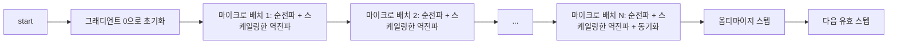
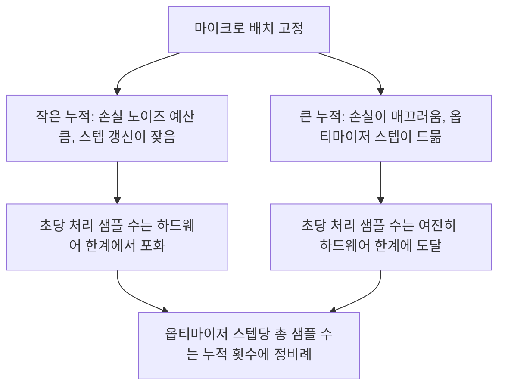

> 🇰🇷 이 문서는 한국어 번역본입니다(ELI5 스타일). 원문: [en.md](en.md)

# 그래디언트 누적(Gradient Accumulation)

> 감당할 수 없는 크기의 유효 배치(effective batch)로 학습하는 방법 — 한 번에 마이크로 배치 하나씩. 손실을 스케일링하고, 옵티마이저 스텝은 잠시 미뤄 두고, 그래디언트가 쌓이도록 내버려 두세요.

**유형:** Build
**언어:** Python
**선수 지식:** 페이즈 19 레슨 42~45
**시간:** 약 90분

## 학습 목표

- 유효 배치 등식을 유도한다: `effective_batch = micro_batch * accum_steps`.
- 마이크로 배치별 손실 스케일링을 구현해서, 누적된 그래디언트가 풀 배치 역전파 한 번과 정확히 같아지도록 만든다.
- 마지막 마이크로 배치가 올 때까지 옵티마이저 동기화를 건너뛴다(sync-on-last-step).
- 처리량 대비 유효 배치 곡선을 읽고, 왜 효과가 점점 줄어드는지(수확 체감) 설명한다.

## 문제 상황

유효 배치 512로 학습하고 싶습니다. 그렇게 하면 손실 곡선이 훨씬 매끄럽고, 그 규모에서 옵티마이저 스텝이 훨씬 의미 있게 작동하기 때문입니다. 그런데 책상 위의 가속기는 예제 32개를 담으면 메모리가 바닥납니다. 배치를 두 배로 늘리는 것도 불가능하고, 모델을 반으로 줄이는 것도 불가능합니다. 이 업계가 2017년에 찾아낸 뒤 지금까지 놓지 못하고 있는 트릭이 바로 이것입니다 — 역전파를 16번 돌리고, 그래디언트가 파라미터 버퍼 안에 쌓이게 두고, 개수가 목표에 도달했을 때만 옵티마이저를 스텝시키는 것.

위험은 이것입니다. 손실 숫자가 더 큰 배치에서의 그것과 더 이상 같지 않다는 점입니다. 미니 배치 16개의 크로스 엔트로피를 아무 생각 없이 더하면, 풀 배치 하나의 손실의 16배가 됩니다. 스케일링 없이는 그래디언트의 방향은 맞지만 크기가 틀리고, 옵티마이저 스텝은 16배나 과하게 커집니다. 해결책은 나눗셈 하나입니다. 그리고 그 나눗셈 하나를 잊기가 아주 쉽습니다.

## 개념



계약 조건은 짧습니다:

- 각 마이크로 배치의 손실은 `backward()`를 호출하기 전에 `accum_steps`로 나눕니다. PyTorch는 기본적으로 그래디언트를 `param.grad`에 계속 더하는데, 이 나눗셈이 달려 가는 합계를 올바른 크기로 되돌려 놓습니다.
- 옵티마이저 스텝은 유효 배치당 한 번, 마지막 마이크로 배치의 역전파가 끝난 뒤에 실행됩니다. 누적 도중에 스텝을 밟아 버리면 이후 실행 전체가 의존하는 모든 파라미터가 어긋나 버립니다.
- 옵티마이저의 상태(모멘텀 버퍼, Adam의 모멘트)도 유효 스텝당 한 번씩, 마이크로 배치당 한 번씩이 아니라 전진합니다. 그렇지 않으면 지수 이동 평균들이 잘못된 주파수를 보고 스케줄을 순식간에 태워 버립니다.
- 단일 디바이스에서는 이게 그냥 장부 기록(bookkeeping)입니다. 하지만 멀티 랭크 클러스터에서는 같은 패턴이 마지막이 아닌 마이크로 배치들을 `no_sync` 컨텍스트로 감싸서 그래디언트 all-reduce를 건너뛰게 합니다. 그러면 마지막 마이크로 배치가 누적된 그래디언트 전체를 한 번에 리듀스합니다. 네트워크 비용을 N번 내는 대신 한 번만 내는 셈이죠.

### 코드로 보는 등가성 증명

```python
loss = criterion(model(x_full), y_full)
loss.backward()
opt.step()
```

는 다음과 같습니다.

```python
for x, y in chunks(x_full, y_full, n):
    scaled = criterion(model(x), y) / n
    scaled.backward()
opt.step()
```

부동소수점 덧셈 순서만 다를 뿐, 수학적으로는 같습니다. 루프가 끝난 시점의 누적 그래디언트 버퍼는 풀 배치 역전파 한 번이 만들어 낼 텐서와 동일합니다. 이 레슨 코드는 `equivalence_check`에서 최대 절대 오차(max-abs diff)가 1e-4 미만이라는 조건으로 이를 검증합니다.

### 비용은 어디로 가나

마이크로 배치 하나는 순전파 한 번과 역전파 한 번의 비용이 듭니다. 누적(accumulation)을 쓰면 메모리를 시간과 맞바꾸는 셈입니다. `outputs/accum-curve.json`의 처리량 곡선은 마이크로 배치를 고정한 채 유효 배치가 커질 때 무슨 일이 일어나는지 보여 줍니다:



공짜 점심은 없습니다. `accum_steps`를 두 배로 늘리면 옵티마이저 스텝당 실제 소요 시간도 두 배가 됩니다. 달라지는 것은 그래디언트 추정치의 분산입니다. 같은 시간 예산에서 옵티마이저 스텝 횟수는 줄지만, 각 스텝은 더 많은 샘플을 평균해서 얻은 것입니다. 문헌에서는 큰 배치와 작은 배치를 서로 다른 최적화 문제로 다룹니다. 다만 이 레슨에서 다루는 것은 통계가 아니라 기계적인 부분입니다.

```figure
cc-grad-accumulation
```

## 직접 만들기

`code/main.py`가 실행 가능한 산출물입니다. 이 스크립트는 세 가지 일을 합니다.

### 단계 1: 등가성 검사

`equivalence_check()`는 같은 시드로 동일한 네트워크 두 개를 만듭니다. 하나는 16샘플 배치를 순전파 한 번에 통째로 넣고, 다른 하나는 4샘플짜리 청크 4개에 손실을 4로 나눠서 넣습니다. 이 함수는 옵티마이저 스텝 전의 그래디언트 버퍼와 스텝 후의 파라미터를 비교합니다. 단언문은 `max_abs_diff < 1e-4`입니다.

### 단계 2: 마지막 스텝에만 동기화하는 패턴

`train_one_optimizer_step`은 마이크로 배치들을 차례로 훑습니다. 마지막을 제외한 모든 마이크로 배치에 대해 `no_sync_context(model)`에 들어갑니다. 단일 프로세스에서 이 컨텍스트는 아무 일도 하지 않는 no-op이지만, DDP에서는 바로 이 지점에서 그래디언트 all-reduce를 건너뛰게 됩니다. 장부 기록은 어느 쪽이든 똑같습니다. `sync_counter`는 no_sync 범위를 벗어난 횟수를 기록하는데, 마이크로 배치가 N개일 때 이 값은 유효 스텝당 N이 아니라 1이어야 합니다.

### 단계 3: 처리량 곡선

`sweep_effective_batches`는 같은 모델을 마이크로 배치를 고정한 채 누적 단계 수 목록을 바꿔 가며 실행합니다. 각 설정마다 다음을 기록합니다:

- `samples_per_sec`: 본 샘플 총수를 실제 경과 시간(wall time)으로 나눈 값
- `median_step_ms`: 유효 스텝당 50백분위 수
- `sync_calls`: 실제로 수행된 집합 통신 지점 수
- `avg_loss`: 스윕의 옵티마이저 스텝들에 대한 평균 손실

결과는 `outputs/accum-curve.json`에 저장되며 노트북에서 재사용할 수 있습니다.

실행 방법:

```bash
python3 code/main.py
```

스크립트는 등가성 오차를 출력하고, 그다음 스윕 표, 그다음 JSON 경로를 출력합니다. 종료 코드는 0입니다.

## 활용하기

프로덕션(운영 환경) 학습에서 그래디언트 누적은 하나의 노브(조절 장치) 뒤에 숨어 있습니다. PyTorch의 패턴은 `accumulation_steps = effective_batch // (micro_batch * world_size)`입니다. 여기서는 쓸 수 없는 프레임워크들도 같은 루프를 감싸고 있을 뿐, 단계는 같습니다. 손실을 스케일링하고, 마지막이 아닌 마이크로 배치에서는 동기화를 건너뛰고, 누적하고, 한 번만 스텝합니다.

실무에서 쓰이는 세 가지 패턴:

- 마이크로 배치 크기는 디바이스 메모리를 꽉 채우도록 고릅니다. 그보다 작으면 가속기 사이클을 낭비하고, 크면 크래시가 납니다.
- 유효 배치는 학습률 스케줄에서 고릅니다. 큰 유효 배치에는 그에 맞게 스케일링한 학습률과 워밍업이 필요합니다. 이것이 2017년부터 회자된 선형 스케일링 규칙(linear scaling rule)입니다.
- 누적 횟수는 이 둘을 잇는 다리이자, 데이터 로더를 다시 짜지 않고도 런타임에 자유롭게 조정할 수 있는 유일한 노브입니다.

## 출시하기

`outputs/skill-gradient-accumulation.md`에 레시피를 담아 두면 동료가 새 저장소에 바로 가져다 쓸 수 있습니다. 손실을 `accum_steps`로 나눈다, 마지막이 아닌 마이크로 배치에서는 옵티마이저 동기화를 건너뛴다, 유효 배치당 옵티마이저를 한 번만 스텝한다, 처리량 대비 유효 배치를 JSON으로 기록해 트레이드오프가 보이게 한다 — 이 네 가지입니다.

## 연습 문제

1. `--num-steps 100`으로 스윕을 다시 실행하고 초당 처리 샘플 수를 유효 배치에 대해 그래프로 그려 보세요. 곡선이 어디서 평평해지나요?
2. 잘못된 스케일링 변형(나눗셈 없음)을 추가하고, 1스텝 시점의 파라미터 차이를 기준값과 비교해 보세요.
3. SGD를 AdamW로 바꾸고, 옵티마이저 상태가 마이크로 배치당 한 번이 아니라 유효 스텝당 한 번 전진하는지 확인해 보세요.
4. 실제 `DistributedDataParallel` 래퍼를 도입하고 `no_sync_context`를 그 메서드로 연결해 보세요. 유효 배치당 sync_calls가 N-1만큼 줄어드는지 확인하세요.
5. 등가성 검사를 서로 다른 두 마이크로 분할(2×8 대 4×4) 비교로 바꾸고, 어떤 허용 오차를 완화해야 하는지 설명해 보세요.

## 핵심 용어

| 용어 | 사람들이 말하는 것 | 실제 의미 |
|------|-----------------|------------------------|
| 마이크로 배치 | 순전파에 넣는 배치 | 한 번의 순전파에 메모리에 들어가는 조각 |
| 누적 단계(accum steps) | 스텝당 역전파 횟수 | 옵티마이저 스텝 한 번 전에 합산되는 역전파 횟수 |
| 유효 배치 | "그 배치" | 마이크로 배치 × 누적 단계 × 데이터 병렬 월드 크기 |
| 손실 스케일링 | N으로 나누기 | 마이크로 배치마다 나눠서 합산 그래디언트가 풀 배치와 일치하게 만드는 것 |
| 마지막에만 동기화 | 나머지는 건너뛰기 | 윈도우 안의 마지막 역전파에서만 그래디언트 집합 통신을 실행하는 것 |

## 더 읽을거리

- PyTorch 문서의 `DistributedDataParallel.no_sync` — sync-on-last-step 트릭의 프로덕션 버전.
- Goyal et al., 2017 — 대규모 배치 학습을 위한 선형 스케일링. 유효 배치에 신경 써야 하는 정통 이유.
- PyTorch 이슈 트래커 — 그래디언트 누적과 혼합 정밀도 언스케일링(mixed precision unscaling)의 상호작용.
- 페이즈 19 레슨 42~45는 이 레슨이 전제하는 모델, 데이터 로더, 옵티마이저, 트레이너 골격을 다룹니다.
- 페이즈 19 레슨 47은 체크포인트와 재개를 다룹니다. 긴 누적 실행이 시간 제한을 넘어 살아남으려면 이것이 필요합니다.
