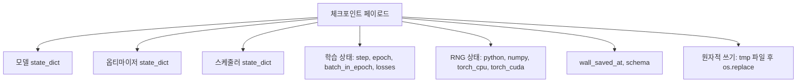
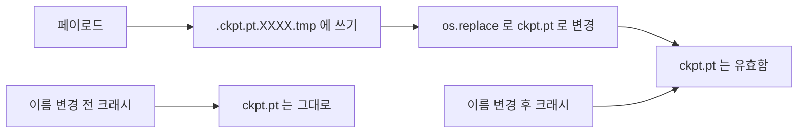
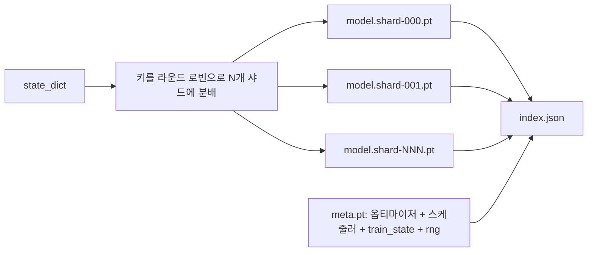

> 🇰🇷 이 문서는 한국어 번역본입니다(ELI5 스타일). 원문: [en.md](en.md)

# 체크포인트 저장과 재개(Checkpoint Save and Resume)

> 학습 도중 발생하는 강제 종료는 실행 자체를 죽입니다. 체크포인트가 있으면 이어서 갈 수 있습니다. 모델, 옵티마이저, 스케줄러, 손실 기록, 스텝 카운터, RNG 상태를 원자적으로(atomic) 저장하세요. 그러면 어느 시점에 죽어도 디스크에는 항상 유효한 파일이 남습니다.

**유형:** Build
**언어:** Python
**선수 지식:** 페이즈 19 레슨 42~45
**시간:** 약 90분

## 학습 목표

- 전체 학습 상태를 하나의 페이로드에 담아, 완전히 새로운 프로세스에 다시 불러올 수 있게 만든다.
- 임시 파일에 쓴 뒤 이름을 바꾸는(쓰기-임시-후-이름-변경) 방식으로 원자적 저장을 구현해서, 크래시가 발생해도 절반만 쓰인 파일이 남지 않게 한다.
- Python, NumPy, PyTorch의 RNG 상태를 복원해서, 재개 이후의 손실이 중단 없이 이어진 베이스라인과 일치하도록 만든다.
- 단일 파일에 더 이상 담기지 않는 모델을 위한 샤딩된 체크포인트 레이아웃을, 해시 검증을 거치는 샤드와 JSON 인덱스와 함께 구축한다.

## 문제 상황

학습 작업을 18시간 잡았습니다. 그런데 시스템 시간 제한(wallclock cap)은 4시간입니다. 그리고 당신 급여보다 높은 분이 커널 업그레이드를 승인하는 바람에 클러스터가 11시째에 재부팅됩니다. 체크포인트가 없으면 처음부터 다시 시작합니다. 재개(resume) 기능이 없으면 첫 11시간 동안 학습한 옵티마이저 상태까지 잃습니다. 모델 가중치가 살아 남았더라도 AdamW의 모멘트는 사라졌고, 다음 스텝은 학습 궤적이 이미 지나쳐 버린 방향으로 휘청거립니다.

올바른 산출물은 이어서 진행하는 데 필요한 모든 것을 담은 단일 파일입니다. 모델 파라미터, 옵티마이저 상태, 스케줄러 상태, 그래프용 손실 기록, 현재 스텝과 에포크 그리고 에포크 내 배치 위치 카운터, 그리고 모든 무작위성 원천에 대한 RNG 상태까지요. RNG 상태가 없으면 재개된 손실 곡선은 전혀 다른 곡선이 됩니다. 같은 모델, 같은 데이터인데 셔플이 다르고, 드롭아웃 마스크가 다르고, 대시보드의 숫자도 달라집니다.

원자적 저장은 이 계약의 나머지 절반입니다. 최종 파일명에 곧바로 쓰면 쓰기 도중 크래시가 났을 때 손상된 파일이 남고, 재개 과정은 쓰레기를 읽게 됩니다. 같은 디렉터리의 임시 파일에 쓴 다음 이름을 바꾸면, 쓰기 도중 크래시가 나도 이전의 정상 파일은 그대로입니다. POSIX 파일 시스템에서 이름 바꾸기(rename)는 원자적으로 이뤄집니다.

## 개념



### 다섯 개의 상태 바구니

| 바구니 | 왜 중요한가 |
|--------|----------------|
| 모델 | 가중치와 버퍼. 모델이 '무엇인지'를 정의합니다. |
| 옵티마이저 | 모멘텀과 적응형 모멘트. 이게 없으면 다음 스텝은 전혀 다른 최적화 문제가 됩니다. |
| 스케줄러 | 학습률이 곡선의 어느 지점에 있는지. 특히 코사인 스케줄은 이것에 민감합니다. |
| 학습 카운터 | 스텝, 에포크, 에포크 내 배치 위치, 그리고 대시보드를 그려 주는 손실 기록. |
| RNG 상태 | 드롭아웃, 데이터 셔플, 모델 내부의 모든 샘플링에 대한 결정성(determinism). |

### 원자적 저장



규칙은 두 가지입니다. 첫째, 임시 파일은 대상과 같은 디렉터리에 둡니다. 그래야 이름 바꾸기가 같은 파일 시스템 안에서 일어납니다. 디바이스를 넘나드는 rename은 원자적이지 않습니다. 둘째, 임시 이름은 시도마다 고유해야 합니다. 두 명의 작성자가 서로를 덮어쓰는 일을 막기 위해서입니다.

### 샤딩된 체크포인트

모델이 커지면 단일 파일 페이로드는 너무 커서 빠르게 불러올 수도, 들여다볼 수도 없고, 네트워크 공유 스토리지가 읽기 도중 버벅일 때는 고통 그 자체가 됩니다. 해결책은 파라미터 상태를 샤드로 쪼개고, 이들을 묶어 주는 작은 인덱스를 함께 쓰는 것입니다.



인덱스는 샤드 개수, 샤드별 sha256, 메타 파일의 sha256을 기록합니다. 로더는 해시가 하나라도 맞지 않으면 큰 소리로 실패합니다. 샤드는 서로 다른 물리 디스크에 둘 수 있고, 메타는 작아서 가장 먼저 읽습니다.

### 에포크 중간에서 이어서 재개하기

다음 에포크 시작 지점으로 퉁 치고 재개하면 몇 분에서 길게는 하루를 낭비합니다. 해결책은 `(epoch, batch_in_epoch)`과 RNG 상태를 함께 저장하는 것입니다. 불러온 뒤 학습 루프는 현재 에포크에서 이미 소비한 배치들을 건너뛰도록 난수 생성기를 빨리 감고, `batch_in_epoch`부터 이어서 진행합니다. 이 레슨 코드가 정확히 그렇게 합니다. 단언 조건은 재개 이후의 손실 궤적이 중단 없는 베이스라인과 1e-4 이내로 일치한다는 것입니다.

```figure
cc-atomic-checkpoint
```

## 직접 만들기

`code/main.py`는 네 가지 프리미티브와 데모 드라이버를 제공합니다.

### 단계 1: RNG 상태 캡처와 복원

`capture_rng_state`는 Python의 `random.getstate`, NumPy의 `np.random.get_state`, 그리고 PyTorch CPU와 CUDA RNG 바이트를 담은 딕셔너리를 반환합니다. 모든 조각은 평범한 Python 숫자, 튜플, 리스트로 저장됩니다(NumPy의 핵심 배열은 `tolist()`를 거칩니다). 그래서 단계 3의 로더가 임의의 객체를 언피클(unpickle)하지 않고도 읽어 들일 수 있습니다. `restore_rng_state`는 이 과정을 되돌립니다. CPU 텐서는 uint8 바이트 버퍼이며, PyTorch의 RNG가 소비하는 방법을 알고 있습니다.

### 단계 2: 원자적 저장

`atomic_save`는 페이로드를 대상 디렉터리의 임시 파일에 쓴 다음, `os.replace`로 최종 이름으로 교체합니다. `atomic_write_json`은 샤딩 인덱스에 대해 같은 일을 합니다.

### 단계 3: 체크포인트 전체 왕복

`save_checkpoint`는 모델, 옵티마이저, 스케줄러, 학습 상태, RNG를 하나의 딕셔너리로 묶습니다. `load_checkpoint`는 이를 되돌리고 `TrainState`를 반환합니다. 스키마 필드는 업그레이드 훅입니다. 앞으로 형식이 바뀌면 버전 문자열을 올리고 로더가 분기하면 됩니다.

`load_checkpoint`는 `torch.load(..., weights_only=True)`를 호출합니다. `.pt` 파일은 피클(pickle)이고, `weights_only=False`로 신뢰할 수 없는 파일을 언피클하면 그 파일이 지목하는 코드가 무엇이든 실행됩니다. weights-only 로더는 텐서와 기본형 컨테이너만 받아들이고 나머지는 전부 거부합니다. 그래서 단계 1에서 RNG 상태를 평범한 리스트로 유지하는 것입니다. 무결성 검사는 `assert` 대신 `ValueError`를 발생시킵니다. `python -O`는 assert를 제거해 버리기 때문입니다. torch 2.6 이상을 쓰세요. 그 이전 릴리스에서는 `weights_only=True`에 알려진 우회 경로가 있었습니다(CVE-2025-32434). 이 레슨이 의존하는 보장은 2.6부터만 성립합니다.

### 단계 4: 샤딩 변형

`save_sharded_checkpoint`는 파라미터 키를 N개 샤드에 라운드 로빈으로 분배하고, 각 샤드를 자체 원자적 저장으로 쓰고, 옵티마이저·스케줄러·학습 상태를 담은 메타 파일을 쓰고, 샤드별 sha256을 넣은 JSON 인덱스를 씁니다. `load_sharded_checkpoint`는 병합 전에 모든 샤드를 검증하고, 체크포인트 디렉터리 밖으로 해석되는 샤드 경로는 거부합니다.

### 단계 5: 재개 데모

`run_resume_demo`은 작은 모델을 `total_steps`만큼 학습하다가 `interrupt_at` 지점에서 체크포인트를 저장한 뒤, 다시 이어서 진행합니다. 두 번째 프로세스가 체크포인트를 복원하고 남은 스텝을 실행합니다. 이 함수는 중단 지점 이후 두 손실 궤적 사이의 최대 절대 차이를 반환합니다. RNG가 복원되었다면 그 차이는 0이거나 부동소수점 노이즈 수준입니다.

실행 방법:

```bash
python3 code/main.py
```

단일 파일 데모와 샤딩 데모 모두 최대 차이가 1e-4 미만이라고 단언합니다. 요약 결과는 `outputs/resume-demo.json`에 저장됩니다.

## 활용하기

프로덕션(운영 환경) 학습 스택은 체크포인팅을 트레이너의 일부로 출시합니다. 형태는 같습니다. 모델 + 옵티마이저 + 스케줄러 + 카운터 + RNG를 원자적으로 쓰고, 스텝 번호로 이름을 붙여 최신 체크포인트를 쉽게 찾게 합니다. 샤딩 레이아웃은 병렬 읽기로 대형 모델을 불러오는 일을 떠받칩니다. 그걸 가능하게 하는 것이 바로 index.json입니다.

강제해야 할 네 가지 패턴:

- **`weights_only=True`로 불러옵니다.** 공유 드라이브나 다운로드로 받은 체크포인트는 신뢰할 수 없는 입력입니다. weights-only 로더는 악성 파일이 재개를 수행하는 머신에서 코드를 실행하는 것을 막아 줍니다.
- **스키마는 페이로드 안의 문자열로 둡니다.** 마이그레이션은 이 문자열을 기준으로 분기합니다. 이게 없으면 이전 실행을 깨뜨리지 않고는 형식을 진화시킬 수 없습니다.
- **모든 샤드에 sha256을 적용합니다.** 조용히 잘려 버린 다운로드는 최악의 종류의 버그입니다. 로더가 빨리 실패하든 늦게 실패하든, 어쨌든 실패하게 만들어야 합니다.
- **체크포인트 주기를 정직하게 유지합니다.** N 스텝마다, 그리고 실제 경과 시간 기준 몇 분마다 저장하되 둘 중 짧은 주기를 따릅니다. 그렇지 않으면 크래시가 난 긴 스텝이 윈도우 전체의 작업을 날려 버립니다.

## 출시하기

`outputs/skill-checkpoint-save-resume.md`는 어떤 새 학습 스크립트에도 적용할 수 있는 레시피입니다. 페이로드 구조, 원자적 쓰기, RNG 캡처, 샤딩 인덱스가 담겨 있습니다. 이 스킬을 저장소에 넣고, 주기적 저장 지점에 `save_checkpoint`를, 시작 지점에 `load_checkpoint`를 연결하면 실행은 강제 종료를 견뎌 냅니다.

## 연습 문제

1. 라운드 로빈 샤딩을 파라미터 그룹 기준 샤딩으로 바꿔 보세요(`.weight`로 끝나는 레이어 vs `.bias`). 각 레이아웃은 언제 더 나은가요?
2. 저장 루프를 확장해 마지막 K개의 체크포인트만 유지하고 오래된 것은 정리하세요. 디스크가 작을 때 적절한 K는 얼마인가요?
3. 스텝 수가 아니라 실제 경과 시간 간격으로 저장을 트리거하는 `--ckpt-every-seconds` 플래그를 추가해 보세요.
4. 시작 시점에 실행되어 디렉터리의 모든 체크포인트를 검사하고 손상된 것을 보고해 주는 체크섬 검증 경로를 추가해 보세요.
5. 페이로드에 새 필드를 추가하고 스키마 문자열을 올리는 `migrate_v1_to_v2` 함수를 구현해 보세요. 로더가 두 버전을 모두 처리하도록 만드세요.

## 핵심 용어

| 용어 | 사람들이 말하는 것 | 실제 의미 |
|------|-----------------|------------------------|
| 원자적 저장 | "쓰고 기도하기" | 같은 디렉터리의 임시 파일에 쓴 다음 os.replace로 대상 이름으로 교체 |
| state dict | "가중치" | 파라미터 이름을 키로 하는 모델 파라미터와 버퍼 |
| 샤딩된 체크포인트 | "큰 모델 파일" | 샤드당 파일 하나씩, 여기에 메타 파일과 sha256이 담긴 JSON 인덱스까지 |
| RNG 상태 | "랜덤 시드" | python random, numpy, torch CPU, torch CUDA의 캡처된 상태. 시드만이 아님 |
| 에포크 중간 재개 | "재시작" | RNG를 빨리 감아 같은 에포크의 다음 배치부터 이어서 진행 |

## 더 읽을거리

- POSIX `rename` 의미론 — `os.replace`가 의존하는 원자성 주장의 근거.
- PyTorch 문서의 `torch.save`와 `torch.load` — 디바이스 간 복원을 위한 `map_location`과 신뢰할 수 없는 파일 로딩을 위한 `weights_only` 포함.
- 페이즈 19 레슨 46은 이 레슨의 체크포인트 페이로드가 함께 버텨 주는 그래디언트 누적을 다룹니다.
- 페이즈 19 레슨 48은 이 체계가 수용하는 state dict 형식을 가진 분산 래퍼들을 다룹니다.
- 리눅스 커널 `fsync` 문서 — 원자적 rename 뒤에 있는 내구성(durability) 보장.
