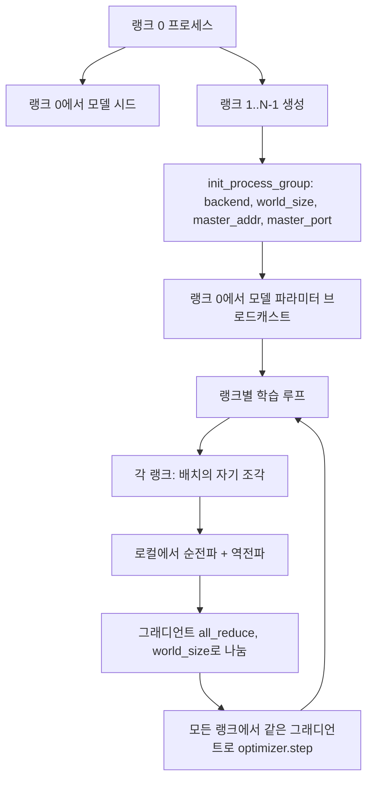
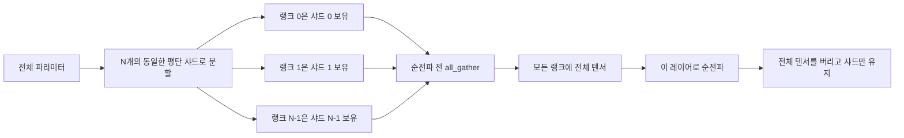

> 🇰🇷 이 문서는 한국어 번역본입니다(ELI5 스타일). 원문: [en.md](en.md)

# 밑바닥부터 만드는 분산 데이터 병렬(Distributed Data Parallel)과 FSDP

> 멀티 랭크 학습은 집합 통신 두 개와 규칙 하나로 요약됩니다. 시작할 때 파라미터를 브로드캐스트하고, 역전파 뒤에 그래디언트를 평균하고, 어느 랭크도 지금 몇 스텝인지에 대해 다른 랭크와 의견이 어긋나게 두지 않는 것.

**유형:** Build
**언어:** Python
**선수 지식:** 페이즈 19 레슨 42~45
**시간:** 약 90분

## 학습 목표

- 특별한 하드웨어 없이 `gloo` 백엔드로 N개 랭크에 걸친 프로세스 그룹을 구성한다.
- 생성 시점에 파라미터를 브로드캐스트하고 역전파 뒤에 그래디언트를 all-reduce하는 최소 DDP 래퍼를 구현한다.
- 랭크별 그래디언트의 all-reduce가, 이어 붙인 입력을 대상으로 하는 단일 프로세스 그래디언트와 일치함을 증명한다.
- FSDP 파라미터 샤딩의 개요를 그린다. 각 랭크는 조각을 보유하고, 순전파 때 전체 텐서를 모아(gather) 사용한 뒤 버린다.

## 문제 상황

모델은 디바이스 하나에 들어갑니다. 하지만 데이터셋은 들어가지 않습니다. 최적화 예산은 실제 시간당 N배의 예제를 보고 싶다고 말합니다. 첫 번째 레버는 데이터 병렬(data parallel)입니다. 각 랭크가 배치의 서로 다른 조각에서 같은 모델을 돌리고, 옵티마이저 스텝 전에 그래디언트를 평균합니다. 두 번째 레버는 FSDP입니다. 모델도 디바이스 하나에 안 들어가니, 각 랭크가 모든 파라미터의 일부를 보유하고 순전파 중에 레이어별로 전체 텐서를 재조립합니다.

고통은 장부 기록(bookkeeping)입니다. 파라미터가 랭크 사이에서 어긋나면 실행은 조용히 망가집니다. 그래디언트는 평균하면서 손실은 평균하지 않으면 대시보드가 거짓말을 합니다. 집합 통신 백엔드가 토폴로지에 대해 합의하지 못하면 실행은 영원히 멈춥니다. 해결책은 집합 통신을 직접 한 번 손으로 써 보고, 재현할 수 없는 래퍼는 절대 믿지 않는 것입니다.

이 레슨은 CPU에서 실행됩니다. CUDA는 전제하지 않습니다. `gloo` 백엔드는 모든 PyTorch 빌드에 포함되어 있고 `torch.multiprocessing` 워커를 받아들입니다. 같은 코드가 구조를 바꾸지 않고도 멀티 GPU 노드에서는 `nccl`로 전환됩니다.

## 개념



### 중요한 집합 통신 두 가지

| 집합 통신 | 하는 일 | 시점 |
|------------|--------------|------|
| `broadcast` | 한 랭크의 텐서를 모든 랭크에 복사 | 파라미터 초기화, 스케줄러 상태, 모든 일대다 동기화 |
| `all_reduce` | 모든 랭크에 걸쳐 텐서를 합산(또는 평균, 최댓값), 모든 랭크가 결과를 받음 | 역전파 뒤 그래디언트 평균 |
| `all_gather` | 각 랭크가 텐서를 내놓고, 모든 랭크가 이어 붙인 결과를 받음 | 로짓 수집, FSDP 파라미터 unshard |

DDP 계약은 생성 시점의 `broadcast`와 역전파 뒤의 `all_reduce`입니다. FSDP 개요에는 각 레이어의 순전파 전에 `all_gather`가 추가됩니다.

### 그래디언트 평균은 단일 프로세스 그래디언트와 같다

N개 랭크에 걸쳐 B개 예제 배치로 학습하는 모델은, N*B 배치로 학습하는 단일 프로세스와 같은 그래디언트를 만들어야 합니다. 트릭은 이것입니다. 랭크별 그래디언트를 합하고 N으로 나누면 평균 손실의 그래디언트가 되는데, 이는 평균(mean) 리덕션을 쓰는 크로스 엔트로피가 풀 배치에서 만들 것과 같습니다. 이 레슨 코드는 손으로 만든 all-reduce 그래디언트와 기준이 되는 단일 프로세스 그래디언트 사이의 `max-abs-diff < 1e-3`을 단언합니다.

### FSDP 개요



메모리 절감은 정확히 계산됩니다. 파라미터에 쓰이는 랭크별 메모리가 1/N으로 떨어집니다. 비용은 gather인데, 순전파 때마다 치러야 합니다. 프로덕션(운영 환경) FSDP는 gather를 이전 레이어의 연산과 겹쳐서(overlap), 실제 시간 비용이 순진한 계산이 예측하는 것보다 훨씬 작습니다. 이 레슨은 모든 파라미터에 대해 왕복(round-trip)을 수행하고 재조립 결과가 원본과 비트 단위로 같다고 단언합니다.

### CPU와 gloo 백엔드

CUDA가 프로덕션 목표지만, 같은 코드 경로가 CPU에도 존재합니다. `gloo`는 CPU 집합 통신 백엔드입니다. GPU에서는 `nccl`보다 수십 배 느리지만 API 표면은 동일합니다. 이 레슨의 프로세스 그룹은 `backend="gloo"`로 초기화하고, 랭크는 `torchrun`이 아니라 `torch.multiprocessing`으로 생성합니다. 둘 다 결국 같은 `torch.distributed` 호출에 도달합니다. 멀티 GPU 노드에서 바뀌는 것은 `backend="nccl"`, 디바이스 텐서, 그리고 실행 방법으로서의 `torchrun`뿐입니다.

```figure
cg-allreduce-ring
```

## 직접 만들기

`code/main.py`가 실행 가능한 산출물입니다.

### 단계 1: 프로세스 그룹 띄우기

```python
os.environ["MASTER_ADDR"] = "127.0.0.1"
os.environ["MASTER_PORT"] = str(port)
dist.init_process_group(backend="gloo", rank=rank, world_size=world_size)
```

`MASTER_ADDR`과 `MASTER_PORT`는 랑데부(rendezvous) 지점입니다. 모든 랭크가 같은 호스트의 같은 포트로 전화를 겁니다. 이 레슨은 여러 실행이 한 머신을 공유할 때 충돌을 피하려고 바인드했다 닫는 트릭으로 빈 포트를 고릅니다.

### 단계 2: 생성 시점에 브로드캐스트

`MinimalDDP.__init__`은 모든 파라미터와 버퍼를 훑으며 `dist.broadcast(tensor, src=0)`를 호출합니다. 랭크 0의 값이 정준(canonical) 초기값이 됩니다. 이게 없으면 각 랭크가 자기 시드로 초기화되고, 랭크들은 첫 스텝부터 갈라집니다.

### 단계 3: 역전파 뒤 그래디언트 all-reduce

```python
def all_reduce_grads_(module, world_size):
    for p in module.parameters():
        if p.grad is None:
            p.grad = torch.zeros_like(p.data)
        dist.all_reduce(p.grad.data, op=dist.ReduceOp.SUM)
        p.grad.data.div_(world_size)
```

모든 랭크가 같은 평균 그래디언트로 끝납니다. 이제 옵티마이저 스텝은 모든 랭크에서 같은 입력의 함수이고, 그래서 파라미터가 실행 내내 동기화된 상태를 유지하는 것입니다.

### 단계 4: 등가성 증명

`manual_all_reduce_matches_single_process`는 랭크 0에서 같은 모델을 만들고, all-reduce 이후의 그래디언트를 단일 프로세스가 이어 붙인 입력에서 계산했을 그래디언트와 비교합니다. 최대 절대 차이는 약 1e-8입니다.

### 단계 5: FSDP 왕복

`fsdp_round_trip_sketch`는 각 파라미터를 평탄화하고, `world_size`의 배수로 패딩하고, 슬라이스하고, all-gather하고, 패딩을 제거합니다. 모든 랭크의 재조립 결과는 원본과 같습니다. 이것이 unshard 단계이고, 그 역(순전파 뒤 재샤딩)은 모아진 텐서에서 자기 조각 하나를 떼어 내는 것입니다.

실행 방법:

```bash
python3 code/main.py
```

기본 월드 크기는 2입니다. 두 개의 CPU 프로세스가 생성되어 `gloo`를 통해 대화하고, 종료 코드 0으로 끝납니다. 출력 파일 `outputs/ddp-demo.json`에는 랭크별 파라미터 합계, all-reduce 이후 그래디언트 노름, FSDP 왕복 결과, 손으로 만든 그래디언트와 기준 그래디언트의 차이가 기록됩니다.

## 활용하기

프로덕션(운영 환경) 학습 스택도 같은 프리미티브를 호출합니다. PyTorch의 `DistributedDataParallel`은 다음을 추가합니다. 역전파 뒤에 실행되는 그래디언트 훅(all-reduce를 역전파와 겹치게 함), 여러 작은 그래디언트를 하나의 집합 통신으로 묶는 버킷화된 all-reduce, 그리고 레슨 46이 사용한 `no_sync` 컨텍스트.

PyTorch의 FSDP는 다음을 추가합니다. 각 랭크가 연속된 버퍼 하나를 보유하게 하는 레이어별 평탄 파라미터 뷰, 현재 레이어 연산과 다음 레이어 unshard를 겹치는 처리, 그리고 선택적인 샤드의 CPU 오프로드.

형태는 그대로입니다. 시작할 때 브로드캐스트하고, 역전파 뒤 리듀스하고, 더 이상 들어가지 않으면 파라미터를 샤딩합니다.

## 출시하기

`outputs/skill-distributed-fsdp-ddp.md`는 새 학습 스크립트를 위한 레시피입니다. CPU에는 `gloo`, GPU에는 `nccl`로 프로세스 그룹을 띄우고, 생성 시점에 브로드캐스트하고 역전파 뒤에 리듀스하는 DDP 껍데기로 모델을 감싸고, 필요하면 FSDP 개요의 all_gather 패턴으로 파라미터를 샤딩합니다.

## 연습 문제

1. `--world-size 4`로 실행하고 실행 내내 파라미터 편차가 1e-3 미만으로 유지되는지 확인해 보세요.
2. 손으로 하는 평균을 `dist.all_reduce(op=dist.ReduceOp.AVG)`로 바꾸고 시간 차이를 측정해 보세요.
3. DDP 래퍼에 역전파 뒤 훅을 추가해서 all-reduce가 역전파의 나머지 부분과 겹치게 해 보세요. 실제 시간이 얼마나 개선되는지 측정하세요.
4. FSDP 재샤딩 단계를 구현해 보세요. 순전파 이후 전체 텐서를 다시 로컬 샤드로 교체합니다. 랭크별 메모리가 줄어드는지 확인하세요.
5. CUDA 머신에서 백엔드를 `nccl`로 바꿔 보세요. 어떤 환경 변수가 바뀌고 어떤 것이 그대로인지 기록하세요.

## 핵심 용어

| 용어 | 사람들이 말하는 것 | 실제 의미 |
|------|-----------------|------------------------|
| 백엔드 | "gloo 아니면 nccl" | 집합 통신 연산을 구현하는 라이브러리. gloo는 CPU, nccl은 GPU |
| 월드 크기 | "전체 랭크 수" | 그룹 안의 프로세스 수. 그룹은 집합 통신이 작동하는 단위 |
| 랭크 | "워커 id" | 그룹 안에서의 프로세스 식별자. 0부터 시작 |
| all-reduce | "그래디언트 합산" | 모든 랭크에 걸쳐 텐서를 합산하고, 모든 랭크가 같은 결과로 끝남 |
| unshard | "파라미터 모으기" | all_gather로 랭크별 조각에서 전체 텐서를 재조립 |

## 더 읽을거리

- PyTorch `torch.distributed` 문서 — 이 레슨이 의존하는 집합 통신 의미론.
- `gloo` 라이브러리의 집합 통신 목록 — CUDA 기반 `nccl` 프리미티브와 형태가 동일.
- 페이즈 19 레슨 46 — DDP all-reduce를 `no_sync`로 감싸는 그래디언트 누적 패턴.
- 페이즈 19 레슨 47 — DDP와 FSDP 실행을 견뎌 내는 체크포인트 레이아웃.
- PyTorch FSDP 문서 — 여기서 개요를 그린 파라미터 샤딩의 프로덕션 구현.
