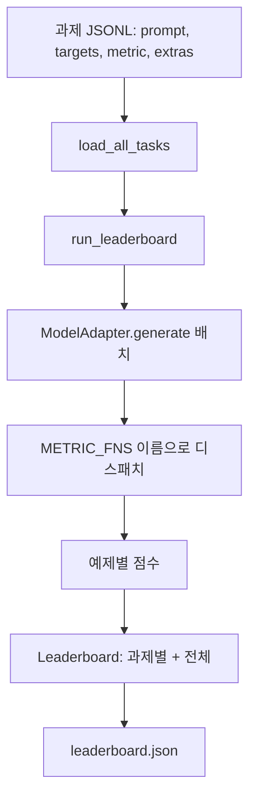

> 🇰🇷 이 문서는 한국어 번역본입니다(ELI5 스타일). 원문: [en.md](en.md)

# 언어 모델 평가 하네스(Language Model Evaluation Harness)

> 정의할 수 없는 과제에서 잘하는 모델은, 우연히 잘하는 모델입니다. 하네스는 과제 정의, 지표, 러너, 리더보드를 하나의 짧고 교체 가능한 형태로 묶은 것입니다.

**유형:** Build
**언어:** Python
**선수 지식:** 페이즈 19 레슨 42~45
**시간:** 약 90분

## 학습 목표

- 과제를 JSONL 파일로 정의한다. 예제마다 `prompt`, `targets`, `metric`, 선택적 `extras`를 담는다.
- 다섯 가지 지표를 구현한다: 정확 일치(exact match), rouge-l F1, 실행 검사, 객관식, 부분 문자열 포함.
- 과제별로 예제를 배치 처리하고 교체 가능한 모델 어댑터에 전달하는 러너를 만든다.
- 과제별 점수, 지연 시간, 재현 가능한 전체 평균을 담은 리더보드 JSON을 출력한다.

## 문제 상황

새 언어 모델이 매주 등장합니다. 마케팅 주장은 "잘한다"입니다. 정직한 질문은 이것입니다. 무엇에서 잘한다는 말인가? 정직한 답은 당신이 직접 쓴 리더보드입니다. 벤더의 리더보드는 벤더가 튜닝해 온 리더보드이기 때문입니다.

저장소에 하네스가 없으면 두 모델을 느낌으로 비교합니다. 하네스가 있으면 고정된 과제 세트와 고정된 지표로, diff할 수 있는 JSON 결과물 위에서 비교합니다. 하네스는 어제의 실행과 오늘의 실행 사이의 계약입니다. 이게 없으면 성능 하락(regression)이 그대로 출시됩니다.

함정은 하네스를 단일 모델에 과적합시키는 것입니다. 해결책은 그 함정을 거꾸로 쓰는 것입니다. 하네스는 15분 안에 읽을 수 있을 만큼 작고, 과제는 저장소에 담아 출시할 수 있을 만큼 작으며, 지표는 밑바닥부터 써서 동료가 감사할 수 있어야 하고, 어댑터만이 모델 고유 코드가 사는 유일한 장소여야 합니다. 어댑터를 바꾸면 리더보드가 움직이고, 과제를 바꾸면 리더보드가 움직입니다. 그 외의 것은 움직여서는 안 됩니다.

## 개념



### 과제 명세

모든 예제는 JSONL 한 줄입니다:

```json
{"id": "arith-00", "prompt": "compute: 2 + 2", "targets": ["4"], "metric": "exact_match"}
```

점수 계산에 보조 데이터가 필요한 지표를 위해서는 `extras`가 부가 페이로드를 운반합니다:

```json
{
  "id": "code-00",
  "prompt": "python: write a function f that doubles its input",
  "targets": ["ok"],
  "metric": "code_exec",
  "extras": {"io_pairs": [[1, 2], [3, 6]]}
}
```

과제는 `outputs/tasks/` 아래의 `.jsonl` 파일입니다. 파일 이름이 곧 과제 이름입니다. 한 파일 안의 모든 예제는 같은 지표를 공유합니다.

### 다섯 개의 고정 과제(fixture tasks)

| 과제 | 지표 | 검사하는 것 |
|------|--------|---------------|
| arithmetic | exact_match | 결정론적 정답에 대한 토큰 수준 정확성 |
| summary | rouge_l | 한 줄 참조 요약에 대한 최장 공통 부분 수열 F1 |
| code-exec | code_exec | 실행 검사: 예측된 함수가 입력-출력 쌍 목록을 만족해야 함 |
| multiple-choice | multiple_choice | 예측의 첫 글자가 허용된 글자와 일치해야 함 |
| generation | substring_contains | 자유 형식 텍스트가 최소한 하나의 대상 부분 문자열을 포함해야 함 |

### 지표 계약

모든 지표는 `(prediction, targets, extras) -> [0.0, 1.0] 범위의 float` 함수입니다. 하네스는 예제별 점수를 평균해 과제 점수를 얻고, 과제 점수를 평균해 전체 점수를 얻습니다. 지표 함수들은 아주 작습니다:

- `exact_match`: 소문자로 바꾸고, 공백을 정리하고, 같은지 비교.
- `substring_contains`: 같은 정규화를 거친 뒤 부분 문자열 검사.
- `multiple_choice`: 첫 문자를 대문자로.
- `rouge_l`: LCS 길이를 예측과 참조의 길이로 나누고, 정밀도와 재현율의 F1 계산.
- `code_exec`: 제한된 네임스페이스에서 예측을 실행하고, 모든 입력-출력 쌍에 `f(x)`를 호출해 일치 개수를 셈.

code_exec 지표는 stripped builtins 네임스페이스에서 예측을 실행합니다. 이 레슨의 테스트는 `import os`가 실패하는 것을 단언합니다. 네임스페이스에 `os`가 없기 때문입니다. 즉 코드 예측에서 파일 시스템에 접근할 방법이 없습니다.

### 모델 어댑터

```python
class ModelAdapter(Protocol):
    def generate(self, prompts: Sequence[str]) -> List[str]: ...
    @property
    def name(self) -> str: ...
```

어댑터가 바로 봉합선(seam)입니다. 이 레슨은 `ToyAdapter`를 제공합니다. 다섯 개 고정 과제의 모든 프롬프트에 대해 정답을 돌려주는 결정론적 패턴 매처입니다. 실제 어댑터는 모델을 호출하고 그 출력을 반환합니다. 하네스는 어느 쪽인지 신경 쓰지 않습니다.

### 러너

`run_task`는 `batch_size`개씩 프롬프트를 배치 처리해 지표 함수로 보냅니다. `run_leaderboard`는 모든 과제를 훑고 평균을 냅니다. `write_leaderboard`는 스키마 문자열을 넣은 JSON을 출력하므로, 앞으로 형식이 바뀌어도 대시보드가 조용히 깨지지 않습니다.


```figure
eval-harness-matrix
```

## 직접 만들기

`code/main.py`가 실행 가능한 산출물입니다.

### 단계 1: 고정 과제 시딩

`seed_fixture_tasks(target_dir)`는 다섯 개의 `.jsonl` 파일을 씁니다. `main.py`의 첫 실행은 디렉터리가 비어 있을 때 이들을 시딩합니다.

### 단계 2: 과제 불러오기

`load_all_tasks(task_dir)`는 모든 `.jsonl`을 읽고 과제 이름에서 `Example` 레코드 목록으로 가는 딕셔너리를 반환합니다. `#`으로 시작하는 주석 줄과 빈 줄은 건너뛰므로 기여자가 파일에 주석을 달 수 있습니다.

### 단계 3: 지표 구현

각 지표는 단위 테스트가 붙은 작은 함수입니다. 이 레슨의 테스트 스위트는 정규화, 부분 일치, 코드 실행, 안전하지 않은 코드 거부를 다루는 13개 케이스를 포함합니다.

### 단계 4: 러너 작성

`run_task`는 배치를 순회하며 점수, 정답 개수, 전체 개수, 지연 시간을 담은 `TaskResult`를 만듭니다. `run_leaderboard`는 모든 과제를 훑고 전체 평균을 담은 `Leaderboard`를 만듭니다.

### 단계 5: JSON 출력

`write_leaderboard`는 보드를 직렬화합니다. `--include-per-example` 플래그는 예제별 레코드를 덤프하므로, 점수가 움직였을 때 예측을 이전 실행과 diff할 수 있습니다.

실행 방법:

```bash
python3 code/main.py
```

스크립트는 첫 실행에서 고정 과제를 시딩하고, 토이 어댑터로 채점하며(모든 고정 과제를 맞힙니다), `outputs/leaderboard.json`을 씁니다. 토이 어댑터에서는 전체 점수가 1.0입니다. `test_main.py`의 스텁 어댑터 테스트는 같은 하네스가 어댑터가 답을 못할 때 0.0을 만들어 냄을 보여 줍니다.

## 활용하기

실제 모델을 연결하려면 어댑터를 쓰면 됩니다. 형태는 다음과 같습니다:

```python
class HttpAdapter:
    name = "vendor.v1"

    def __init__(self, endpoint, api_key):
        self.endpoint = endpoint
        self.api_key = api_key

    def generate(self, prompts):
        out = []
        for prompt in prompts:
            response = http_post(self.endpoint, prompt, self.api_key)
            out.append(response["text"])
        return out
```

`main()` 상단에서 `ToyAdapter`를 `HttpAdapter`로 바꾸세요. 하네스, 과제, 지표, 리더보드는 그대로입니다.

실제 프로젝트에서 하네스를 출시할 때 강제해야 할 세 가지 패턴:

- **과제 파일을 고정(pin)합니다.** leaderboard.json은 해시로 고정된 과제 내용을 담거나 JSONL을 함께 운반해야 합니다. 그렇지 않으면 과제 파일이 바뀔 때 점수가 함께 움직이고, 어느 쪽 때문인지 알 수 없습니다.
- **점수뿐 아니라 예측을 diff합니다.** `--include-per-example` 플래그 덕분에 점수가 떨어진 날 모델이 무엇이라고 했는지 볼 수 있습니다.
- **배치 크기에 상한을 둡니다.** 실제 어댑터에는 요청 제한(rate limit)이 있습니다. 작은 배치 크기는 하네스가 여러 벤더에서 호환되게 유지해 줍니다.

## 출시하기

`outputs/skill-lm-eval-harness.md`에 레시피가 담겨 있습니다. JSONL 과제 명세, 다섯 가지 지표, 교체 가능한 어댑터, 배치 처리 러너, 스키마 문자열이 들어간 리더보드 JSON입니다. `outputs/tasks/`의 과제 파일들이 고정 과제입니다. 실제 프로젝트의 시작점으로 복사해 가세요.

## 연습 문제

1. 밑바닥부터 직접 쓴 커스텀 지표로 여섯 번째 과제를 추가해 보세요(BLEU류 겹침, BLEURT류 참조 채점 등 계약이 명확한 것이면 무엇이든).
2. `code_exec`을 확장해 stdout을 캡처하고, 기대 stdout 목록을 targets로 받아들이게 만들어 보세요.
3. 리더보드 diff 명령을 추가해 보세요. 두 `leaderboard.json` 파일을 받아 어떤 과제가 얼마나 움직였는지 출력합니다.
4. 예제당 지연 시간에 상한을 두세요. 어댑터 호출을 타임아웃으로 감싸고, 리더보드에 별도의 `timeouts` 열을 드러내세요.
5. 리더보드에 sha256으로 과제 내용을 고정해서, 미래의 독자가 같은 과제를 채점했는지 검증할 수 있게 하세요.

## 핵심 용어

| 용어 | 사람들이 말하는 것 | 실제 의미 |
|------|-----------------|------------------------|
| 과제 명세 | "평가 형식" | 예제마다 prompt, targets, metric, 선택적 extras를 담은 JSONL 파일 |
| 지표 | "채점 방법" | (prediction, targets, extras)를 [0, 1] 범위의 float로 바꾸는 함수 |
| 어댑터 | "모델 클라이언트" | generate(prompts) -> list[str] 메서드를 가진 객체. 유일한 모델 고유 코드 |
| 리더보드 | "점수판" | 과제별 점수, 전체 개수, 지연 시간, 전체 평균을 담은 JSON |
| 코드 실행 지표 | "실행해서 확인" | 제한된 네임스페이스에서 예측을 실행하고 입력-출력 쌍과 비교 |

## 더 읽을거리

- 원조 lm-evaluation-harness — 프로덕션 참조 구현. 훨씬 크지만 형태는 같습니다.
- HuggingFace의 lighteval — 같은 계약의 대안 구현.
- 페이즈 19 레슨 46 — 하네스가 채점하는 학습 스택에서 쓰이는 그래디언트 누적 패턴.
- 페이즈 19 레슨 47 — 채점 대상인 체크포인트 형식. 리더보드에 체크포인트 해시를 고정하세요.
- 페이즈 19 레슨 48 — 테스트 대상 모델을 만들어 낸 분산 학습 스택.
