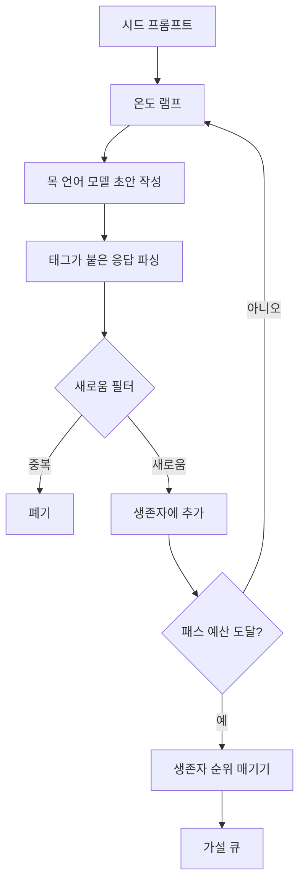

> 🇰🇷 이 문서는 한국어 번역본입니다(ELI5 스타일). 원문: [en.md](en.md)

# 가설 생성기(Hypothesis Generator)

> 같은 질문을 두 번 던지는 리서치 에이전트는 토큰을 낭비하는 것입니다. 트릭은 각 초안이 반드시 새로운 곳에 도착하게 만드는 것입니다.

**유형:** Build
**언어:** Python
**선수 지식:** 페이즈 19 트랙 A 레슨 20-29
**시간:** 약 90분

## 학습 목표
- 시드 프롬프트로 샘플러를 구동하고, 그 출력을 형식화된(typed) 가설 레코드로 바꾼다.
- 패스마다 샘플러 온도를 점점 올려서, 다음 초안이 이전 초안에서 멀어지도록 만든다.
- 작은 임베딩 모델과 코사인 거리 임계값으로 거의 같은 중복 후보를 걸러 낸다.
- 남은 후보를 새로움, 구체성, 검증 가능성을 섞은 점수 함수로 순위를 매긴다.
- 모든 단계를 결정론적으로 유지해서, 같은 시드가 항상 같은 큐를 만들게 한다.

## 왜 생성한 다음 걸러내는가

한 모델에게 딱 한 번 질문하는 플래너는 가설 하나를 얻습니다. 예제 하나 풀어 보기엔 충분하지만, 리서치 루프에는 잘못된 형태입니다. 루프가 원하는 것은 깊이가 있는 순위 큐입니다. 그래야 첫 가설이 실패했을 때 러너가 다음 가설을 바로 꺼낼 수 있고, 또 전체 샘플링 패스 한 번을 비용 치르지 않아도 됩니다.

그 큐를 만드는 두 가지 아이디어가 결합됩니다. 첫째는 온도 램핑(temperature ramping)입니다. 샘플러를 통과하는 패스마다 온도를 한 단계 올려서, 뒤의 초안들이 더 멀리 헤매도록 유도합니다. 둘째는 새로움 필터(novelty filtering)입니다. 초안이 나올 때마다 생성기는 이전에 통과한 모든 가설과의 임베딩 거리를 재고, 그 무리 안에 들어오는 것은 거부합니다.

이 레슨은 고정된 프롬프트에 대해 대본화된 토큰 시퀀스를 돌려주는 목(mock) 언어 모델을 함께 제공합니다. 목만으로도 전체 경로를 운전해 볼 수 있습니다. 시드 프롬프트가 들어가고, 온도 램프가 적용되고, 후보가 파싱되고, 새로움 필터가 돌고, 순위 매겨진 큐가 나옵니다.

## Hypothesis 형태

```text
Hypothesis
  id             : int           (실행 내에서 단조 증가)
  text           : str           (주장)
  variables      : list[str]     (조건 사이에서 무엇이 바뀌는가)
  metric         : str           (러너가 무엇을 측정할 것인가)
  baseline_ref   : str | None    (비교가 인용하는 논문 또는 실행)
  draft_pass     : int           (어느 샘플러 패스가 이것을 만들었는가)
  temperature    : float         (초안 작성 시점의 샘플러 설정)
  novelty_score  : float         (이전 생존자들과의 거리, 0..1)
  rank_score     : float         (순위 매기기에 쓰이는 가중 합)
```

`variables`와 `metric`은 자유 텍스트가 아닙니다. 파서가 태그가 붙은 응답에서 이 값들을 뽑아 냅니다. 레슨 52의 러너는 실험 설정을 만들 때 이 필드들을 곧바로 읽습니다.

`baseline_ref`는 선택 사항이지만 권장됩니다. 레슨 53의 평가자(evaluator)는 비교할 베이스라인이 필요합니다. 가설에 베이스라인이 없으면 평가자는 같은 지표의 이전 실행으로 대체합니다.

```figure
cg-novelty-ramp
```

## 아키텍처



루프는 단순합니다. 흥미로운 부분은 각 상자마다 엄격한 계약이 있다는 점입니다.

## 온도 램프

`t_min`에서 시작해 `t_max`에서 끝나고, 증분은 `(t_max - t_min) / (n_passes - 1)`입니다. 각 패스는 현재 온도로 샘플러를 호출하며, `GeneratorConfig.schedule()`은 `n_passes`개의 균등하게 간격을 둔 값을 만들어 냅니다. 목 모델은 `(prompt, temp_bucket)`을 키로 하는 작은 대본 응답 집합을 전환하는 방식으로 온도를 반영합니다. 버킷은 열린 구간이라 온도가 조금만 바뀌어도 다른 버킷이 선택되고 다른 초안이 나옵니다. 프로덕션(운영 환경)에서는 샘플러가 실제 모델이고 `temperature=t`가 그대로 전달될 것입니다.

기본 스케줄은 `0.2`에서 `1.2`까지 여섯 번의 패스입니다. 여섯이면 새로움 필터가 어차피 거부할 샘플에 비용을 쓰지 않고도 큐를 채우기에 충분합니다. `0.2` 아래에서는 모델이 시드를 그대로 앵무새처럼 따라 하고, `1.2` 위에서는 응답이 주제를 벗어나 파서를 통과하지 못하는 경향이 있습니다.

## 새로움 필터

초안이 파싱될 때마다 생성기는 그 텍스트를 임베딩하고, 받아들인 모든 가설과 비교합니다. 임베딩은 단어 토큰의 작은 해시드 bag-of-words로, 단위 길이로 정규화됩니다. 두 단위 벡터 사이의 코사인 거리는 `1 - dot(a, b)`입니다. 초안이 이전 생존자들에 대한 최소 거리가 `novelty_threshold`보다 크면 통과합니다. 기본값은 `0.25`입니다.

해시드 임베딩은 화려하지 않습니다. 결정론적이고, 의존성이 전혀 없으며, 뻔한 경우를 잡기에 충분합니다. 즉 대부분의 명사를 공유하는 두 초안 같은 경우죠. 실제 배포에서는 작은 문장 모델로 바꿔 끼우면 됩니다. 인터페이스는 그대로입니다.

## 순위 점수

```text
rank_score = w_novelty * novelty_score
           + w_specificity * specificity_score
           + w_testability * testability_score
```

하위 점수가 셋입니다. `novelty_score`는 이전 생존자들과의 최소 임베딩 거리입니다. `specificity_score`는 가설이 명시한 구체적 변수 개수를 목표 개수로 나눈 값입니다. `testability_score`는 지표와 베이스라인을 모두 명시하면 1, 지표만 있으면 0.5, 그 외에는 0입니다.

기본 가중치는 `0.4`, `0.3`, `0.3`입니다. 가중치는 생성기 설정에 있으므로, 뒤의 레슨이 코드를 포크하지 않고도 조정할 수 있습니다.

## 목 언어 모델

```python
class MockLLM:
    def sample(self, prompt: str, temperature: float, seed: int) -> str:
        ...
```

샘플러는 `(prompt, temperature, seed)` 삼중이 주어지면 결정론적입니다. 목은 `(prompt_signature, temperature_bucket)`을 키로 하는 대본 응답 테이블을 유지합니다. 테이블에 그 키의 항목이 없으면 샘플러는 파서를 통과하지 못하는 폴백 응답을 반환합니다. 폴백 경로는 테스트 중 하나가 운용합니다.

시드는 응답에 섞여 들어가므로, 같은 `(prompt, temperature)` 쌍이라도 시드가 다르면 다른 초안이 나옵니다. 테스트에서는 결과 재현을 위해 시드를 고정합니다. 실제 배포에서는 시드가 시스템 시계나 카운터에서 옵니다.

## 출력 큐

출력은 `rank_score` 내림차순으로 정렬된 `Hypothesis` 레코드 목록입니다. 레슨 52의 러너는 머리(맨 앞)를 꺼내 실험을 돌리고, 레슨 53의 평가자가 판정(verdict)을 되돌려 씁니다. 판정이 가설이 틀렸다고 하면 러너는 다음 항목을 꺼냅니다.

큐는 유한합니다. 큐가 비면 오케스트레이터는 시드 프롬프트를 넓혀 생성기를 다시 돌리거나, 멈추고 예산 소진을 보고할 수 있습니다.

## 코드 읽는 법

`code/main.py`는 `Hypothesis`, `MockLLM`, `HypothesisGenerator`, 그리고 결정론적 데모를 정의합니다. 생성기는 정렬된 큐를 반환하는 단일 `run(seed_prompt)` 메서드를 노출합니다. 패스 수는 인자로 전달되지 않고 `GeneratorConfig.n_passes`에서 읽습니다. 임베딩은 해시드 토큰 bag입니다. 새로움 필터는 함수 하나입니다. 순위 점수도 함수 하나입니다. `numpy`에 의존하는 것은 없습니다. 임베딩 수학은 순수 stdlib라 레슨이 이식성을 유지합니다.

`code/tests/test_generator.py`는 순조로운 경로, 중복 거부 경로, 파서 실패 경로, 온도 램프 경계값, 순위 정렬을 다룹니다.

## 이 레슨이 끼는 자리

레슨 50이 큐를 만듭니다. 레슨 51은 큐의 머리를 받아 문헌 검색을 돌려 확인하거나 반박합니다. 레슨 52는 같은 머리를 받아 실제 실험을 돌립니다. 레슨 53은 두 출력을 읽고 판정을 씁니다. 네 레슨이 사람 없는 리서치 루프로 조합되지만, 사람은 어떤 경계에서든 끼어들 수 있습니다.
