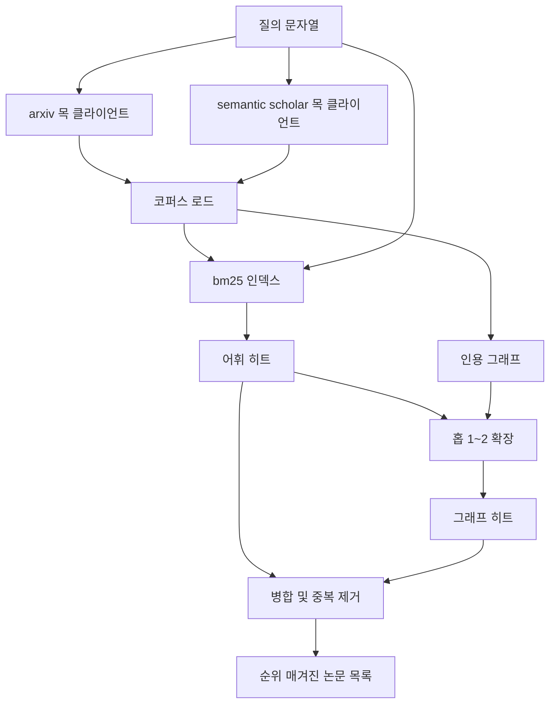

> 🇰🇷 이 문서는 한국어 번역본입니다(ELI5 스타일). 원문: [en.md](en.md)

# 문헌 검색(Literature Retrieval)

> 가설은 값쌉니다. 그런데 이미 누군가가 그것을 증명했는지 아는 일이 비싼 부분입니다. 러너가 샌드박스를 가동하기 전에 그 질문에 답하는 검색 레이어를 만들어 보세요.

**유형:** Build
**언어:** Python
**선수 지식:** 페이즈 19 트랙 A 레슨 20-29
**시간:** 약 90분

## 학습 목표
- 루프의 다운스트림이 읽을 필드를 갖춘 작은 논문 레코드를 모델링한다.
- stdlib 자료구조만으로 초록(abstract) 위의 BM25 인덱스를 구축한다.
- 인용 그래프를 탐색해서 어휘 검색이 놓친 논문을 끌어 올린다.
- 안정적인 논문 id로 어휘 패스와 그래프 패스의 결과 중복을 제거한다.
- 두 개의 목(mock) 외부 API를 하나의 클라이언트 뒤로 감싸서, 실제 엔드포인트가 들어와도 업스트림 호출 지점이 그대로 남게 만든다.

## 왜 검색 패스가 두 개인가

초록 위의 키워드 검색은 질의와 어휘를 공유하는 논문을 돌려줍니다. 대부분의 표면을 커버하지만 두 가지 경우를 놓칩니다. 첫째는 기초가 되는 논문이 다른 어휘를 쓸 때입니다. 예를 들어 "sparse attention"을 질의하면 "block selection in transformer routing"이라는 제목의 논문을 놓칩니다. 둘째는 관련 논문이 알려진 앵커를 인용하는 후속 논문일 때입니다. 초록 풀을 무식하게 뒤지는 것보다 앵커를 찾아 앞뒤로 걸어가는 편이 효율적입니다.

이 레슨은 두 패스를 모두 만듭니다. 초록 위의 BM25가 어휘 히트를 잡습니다. 인용 그래프 탐색은 시드 집합을 한두 홉(hop) 앞뒤로 확장합니다. 합집합은 논문 id로 중복을 제거하고 작은 결합 점수로 순위를 매깁니다.

## Paper 형태

```text
Paper
  id          : str           (안정적인 식별자, 목 코퍼스에서는 "p001")
  title       : str
  abstract    : str
  year        : int
  authors     : list[str]
  references  : list[str]     (이 논문이 인용하는 논문 id)
  citations   : list[str]     (이 논문을 인용하는 논문 id)
  source      : str           (어느 목 api가 제공했는가, "arxiv" 또는 "s2")
```

references와 citations 필드가 방향 있는 인용 그래프를 이룹니다. 두 목 API는 겹치지만 동일하지 않은 필드를 돌려주므로, 코퍼스 로더는 `id`를 기준으로 합칩니다.

```figure
cg-citation-hops
```

## 아키텍처



검색 클라이언트는 두 패스와 병합을 모두 소유합니다. 호출자는 질의를 넘기고, 각 항목이 논문별 점수 필드(`bm25_score`, `graph_distance`, `recency_score`, `final_score`)를 담아 순위를 설명해 주는 목록을 받습니다.

## 밑바닥부터 만드는 BM25

구현은 표준 Okapi BM25이며 기본 파라미터는 `k1=1.5`, `b=0.75`입니다. 인덱스는 딕셔너리 두 개입니다. `term -> doc_frequency`와 `term -> (doc_id, term_count) 목록`입니다. 문서 길이는 초록의 토큰 수입니다. 평균 문서 길이는 인덱스 구축 시점에 한 번 계산합니다. 질의 채점은 질의 용어들에 대해 `idf * tf_norm`을 더하는 것인데, `tf_norm`은 표준 BM25의 길이 정규화된 용어 빈도입니다.

토크나이저는 소문자 변환 후 비알파벳 문자로 나누는 것입니다. 어간 추출(stemming)은 하지 않습니다. 실제 시스템에서는 작은 스테머로 바꿔 끼우면 됩니다. 인터페이스는 그대로입니다.

```text
idf(t)      = log((N - df + 0.5) / (df + 0.5) + 1.0)
tf_norm(t)  = (f * (k1 + 1)) / (f + k1 * (1 - b + b * dl / avgdl))
score(d, q) = q의 각 t에 대해 idf(t) * tf_norm(t)의 합
```

## 인용 그래프 탐색

그래프는 코퍼스에서 한 번 만듭니다. 순방향 간선은 논문에서 그것이 인용하는 논문으로, 역방향 간선은 논문에서 그것을 인용하는 논문으로 향합니다. 탐색은 상위 BM25 히트를 시드로 하는 너비 우선 탐색이며, 두 홉에서 잘라 냅니다.

두 홉은 의도적인 천장입니다. 한 홉은 너무 얕습니다. 에이전트는 흔히 바로 이전 또는 다음 세대의 논문을 원합니다. 세 홉은 연결된 그래프에서 결과 크기를 폭발시키고 주제를 벗어나는 경향이 있습니다. 이 레슨은 홉 한도를 설정 노브로 노출하므로, 다운스트림 루프가 더 타이트하게 조일 수 있습니다.

## 중복 제거와 순위

두 패스는 겹치는 집합을 돌려줍니다. 병합은 논문 id를 키로 합니다. 각 논문의 최종 점수는 가중 블렌드입니다.

```text
final_score = w_bm25 * bm25_score_norm
            + w_graph * graph_score
            + w_recency * recency_score
```

`bm25_score_norm`은 BM25 점수를 병합 집합의 최대 BM25 점수로 나눈 값입니다(그래야 이 필드가 0에서 1 사이에 머뭅니다). `graph_score`는 직접 어휘 히트면 1, 한 홉이면 `0.6`, 두 홉이면 `0.3`, 그 외에는 0입니다. `recency_score`는 코퍼스 최소 연도에서 0, 최대 연도에서 1까지의 선형 램프입니다.

기본 가중치는 `0.5`, `0.3`, `0.2`입니다. 가중치는 설정값입니다. 주제가 낡았으면 recency를 낮추고, 빠르게 움직이는 주제면 올리는 식으로 조정합니다.

## 목 코퍼스

코퍼스는 `build_corpus()`가 만든 100개의 논문입니다. 각 논문은 다섯 주제 중 하나에 대해 손으로 쓴 제목과 초록을 갖습니다. 주제는 어텐션 희소성, 검색 증강, 저랭크 어댑터, 데이터셋 증류, 평가 하네스입니다. 참조와 인용은 각 주제가 몇 개의 주제 간 간선을 가진 연결된 부분 그래프가 되도록 연결되어 있습니다.

두 목 API 클라이언트(`ArxivMockClient`, `SemanticScholarMockClient`)는 같은 코퍼스를 읽지만 다른 필드를 노출합니다. Arxiv는 제목, 초록, 연도, 저자를 돌려줍니다. Semantic Scholar는 여기에 참조와 인용을 더합니다. 검색 클라이언트는 id 기준으로 합치고, 클라이언트 간 필드 불일치 처리는 후속 레슨으로 미룹니다.

## 레슨 52와 53이 읽는 것

레슨 52의 러너는 실험의 맥락으로 `paper.id`, `paper.title`, 초록의 처음 세 문장을 읽습니다. 레슨 53의 평가자는 베이스라인을 특정 논문에 귀속시키려고 `paper.year`와 `paper.references`를 읽습니다.

검색 클라이언트는 순위 목록과 질의별 지표를 함께 담은 `RetrievalResult`를 반환합니다. 지표는 히트 수, 평균 점수, 최고 점수, 총 실제 소요 시간입니다. 러너가 이 값들을 기록하므로, 다운스트림 관측 패스가 시간에 따른 품질을 그래프로 그릴 수 있습니다.

## 코드 읽는 법

`code/main.py`는 `Paper`, `ArxivMockClient`, `SemanticScholarMockClient`, `BM25Index`, `CitationGraph`, `RetrievalClient`, 그리고 결정론적 데모를 정의합니다. 목 클라이언트와 코퍼스는 같은 파일에 있어 레슨이 이식성을 유지합니다. BM25 구현은 클래스 하나, 60줄입니다. 그래프 탐색은 메서드 하나입니다.

`code/tests/test_retrieval.py`는 어휘 경로, 그래프 경로, 병합, 중복 제거, 빈 질의를 다룹니다.

## 이 레슨이 끼는 자리

레슨 50이 가설을 만듭니다. 레슨 51은 그 가설이 이미 정리된 문제인지 알아보려고 문헌을 검색합니다. 레슨 52는 정리되지 않았다면 실험을 돌립니다. 레슨 53은 검색 결과와 실험 지표를 모두 읽어 판정을 씁니다. 검색 클라이언트는 네 단계 중 가장 싸고, 오케스트레이터에서 가장 먼저 실행됩니다.
