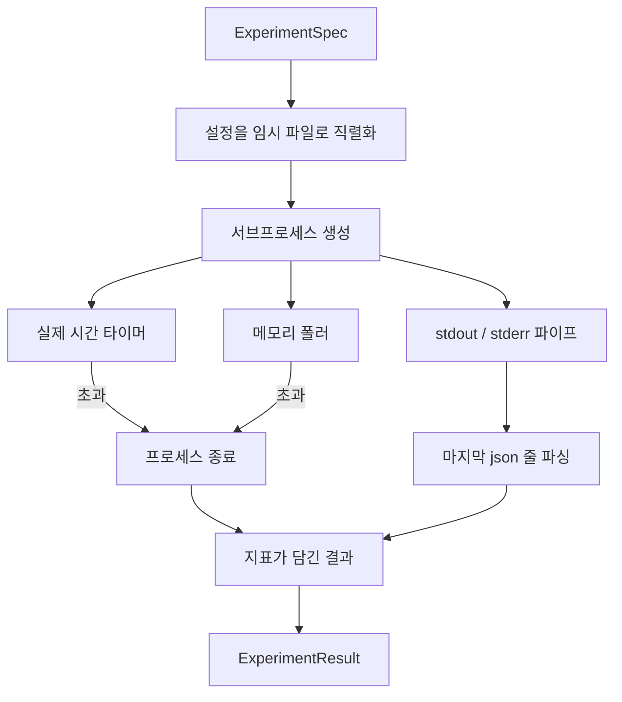

> 🇰🇷 이 문서는 한국어 번역본입니다(ELI5 스타일). 원문: [en.md](en.md)

# 실험 러너(Experiment Runner)

> 루프의 정직함은 측정만큼 좋아집니다. 명세를 받아 샌드박스 처리된 서브프로세스에서 실행하고, 평가자가 신뢰할 수 있는 json 지표 덩어리를 출력하는 러너를 만들어 보세요.

**유형:** Build
**언어:** Python
**선수 지식:** 페이즈 19 트랙 A 레슨 20-29
**시간:** 약 90분

## 학습 목표
- 실험을 러너가 서브프로세스로 직렬화할 수 있는 형식화된(typed) 명세로 표현한다.
- 엄격한 실제 시간(wall clock) 타임아웃과 부드러운 메모리 상한을 걸어 서브프로세스를 실행하고, 둘 다를 종료 조건으로 드러낸다.
- stdout, stderr, 구조화된 지표 덩어리를 하나의 결과 레코드로 담는다.
- 고정된 기본 명세 위에서 설정 노브를 한 번에 하나씩 스윕하는 소거(ablation) 표를 만든다.
- 모든 결과가 시드가 주어지면 결정론적이도록 유지해서, 평가자가 실행마다 같은 숫자를 보게 만든다.

## 왜 서브프로세스인가

리서치 루프는 신뢰할 수 없는 코드를 실행합니다. 가설은 샘플러에서 나왔고, 실험 스크립트도 같은 경로에서 나왔습니다. 어느 쪽이든 안전하다고 치고 프로세스 안에서 돌리는 것은 오케스트레이터까지 끌고 가는 크래시를 스스로 부르는 일입니다. 서브프로세스는 언어가 기본 제공하는 가장 단순한 격리입니다. 별도의 프로세스, 독립된 주소 공간, 부모 쪽의 시그널 처리가 그것입니다.

여기서 만드는 러너는 완전한 샌드박싱을 구현하지는 않습니다. cgroup도, seccomp 필터도, 네임스페이스 재매핑도 없습니다. 실제 시간 타임아웃, 메모리 증가를 감시하는 폴링 루프, 어느 한도든 넘으면 프로세스를 종료하는 킬 경로가 있을 뿐입니다. 이것이 모든 정교한 샌드박스가 확장하는 기본 런타임 계약입니다. 이 레슨은 그 계약을 한 번에 읽을 수 있을 만큼 작게 유지합니다.

## ExperimentSpec 형태

```text
ExperimentSpec
  spec_id        : str            (안정적인 id, "exp_001")
  hypothesis_id  : int            (레슨 50의 큐로 거슬러 올라가는 링크)
  script_path    : str            (실행할 python 스크립트 경로)
  config         : dict           (json 인자 하나로 스크립트에 전달)
  seed           : int            (실험의 결정론적 시드)
  wall_timeout_s : float          (엄격한 타임아웃, 초과 시 종료)
  memory_cap_mb  : int            (부드러운 상한, 폴링; 초과 시 종료)
  metric_keys    : list[str]      (평가자가 읽을 필드)
```

스크립트는 디스크에 있고, 러너는 설정을 스크립트가 읽을 임시 파일 경로에 씁니다. 스크립트는 stdout에 단일 json 줄을 출력해야 하며, 그 키는 `metric_keys`의 상위 집합이어야 합니다. stdout의 다른 내용은 캡처되지만 지표 파서는 무시합니다.

```figure
cg-runner-limits
```

## 아키텍처



러너는 메인 메서드 하나를 가진 클래스 하나입니다. 폴러는 폴링 간격마다 한 번 깨어나 서브프로세스의 `psutil` 대응물을 proc 파일 시스템에서 읽는 작은 스레드이고, 플랫폼이 노출하지 않으면 no-op으로 폴백합니다.

## 왜 부드러운 메모리 상한인가

엄격한 메모리 상한은 `resource.setrlimit`가 필요하고 POSIX에서만 작동합니다. 이 레슨은 이식 가능한 접근을 제공합니다. 플랫폼에서 상주 메모리 크기를 폴링하다가 상한을 넘으면 서브프로세스를 종료합니다. 상한이 부드러운 이유는 폴러의 간격이 0이 아니기 때문입니다. 프로세스는 폴링 사이에 상한 위로 튀었다가 다시 내려올 수 있습니다. 러너는 관측된 최대 RSS를 기록하므로 평가자는 이 실행이 한도에 얼마나 근접했는지 볼 수 있습니다.

프로세스 조사 기능이 없는 시스템에서는 폴러가 한 번 경고를 기록하고 자신을 비활성화합니다. 실제 시간 타임아웃은 여전히 적용됩니다. 이 레슨의 테스트는 두 경로를 모두 다룹니다.

## stdout과 stderr 캡처

러너는 두 파이프를 완료 시점에 끝까지 읽습니다. stdout은 줄 단위로 훑고, 필요한 `metric_keys`를 모두 갖춘 json으로 파싱되는 마지막 줄을 지표 덩어리로 삼습니다. 그 이전의 json 줄은 `intermediate_metrics`로 결과에 남고, 평가자가 학습 곡선에 쓸 수 있습니다.

stderr는 그대로 결과에 캡처됩니다. 러너는 0이 아닌 종료 코드에서 예외를 던지지 않고, 코드를 결과에 기록합니다. 스크립트가 지표를 출력했더라도 0이 아닌 종료는 `"crash"`로 표시되므로, 평가자는 부분 실행을 기본적으로 실패로 취급합니다.

## 소거(ablation) 표

```python
def ablate(base: ExperimentSpec, knob: str, values: list[Any]) -> list[ExperimentSpec]:
    ...
```

기본 명세와 노브 이름이 주어지면 이 헬퍼는 값마다 `config[knob]`을 덮어쓴 명세를 하나씩 돌려줍니다. 각 명세는 파생된 `spec_id`를 받습니다(`f"{base.spec_id}_{knob}_{value}"`). 러너는 이들을 순서대로 실행하고 노브 값으로 keyed된 `AblationTable`을 반환하는 `AblationRunner`를 함께 제공합니다.

왜 한 번에 노브 하나인가. 완전 요인 스윕은 지수적으로 폭발하고 평가자가 해석할 수 없는 결과를 만듭니다. 한 번에 하나의 노브는 평가자가 그릴 수 있는 깨끗한 축을 만듭니다. 이 레슨은 멀티 노브 스윕을 반복된 단일 노브 소거로만 지원하며, 조합은 호출자가 합니다.

## 결정론

모든 명세는 시드를 운반합니다. 러너는 시드를 설정 딕셔너리를 통해 스크립트로 전달합니다(`config["__seed"] = spec.seed`). `code/experiments/`의 목 실험 스크립트들은 시드를 존중하며 실행마다 동일한 지표를 만듭니다. 레슨 53의 평가자가 이것에 의존합니다. 결정론이 없으면 "성능 하락(regression)"이 사실은 다른 무작위 초기화일 수 있습니다.

## 목 실험 스크립트

이 레슨은 실험 스크립트 하나를 제공합니다. `code/experiments/sparsity_experiment.py`입니다. 설정 파일을 읽고, numpy 무작위 패스로 작은 학습 실행을 시뮬레이션하고, json 지표 덩어리를 출력하는 실제 스크립트입니다. 이 스크립트는 타임아웃 테스트용 `sleep_s` 노브와 메모리 폴러 테스트용 `allocate_mb` 노브를 존중합니다.

시뮬레이션은 실제로 무언가를 학습하지 않습니다. 학습 루프의 형태를 흉내 내는 수치 계산입니다. 손실 곡선, 최종 퍼플렉시티, 소요 시간이 그것입니다. 이 레슨의 요점은 시뮬레이션이 아니라 러너입니다. 실제 실험 스크립트는 모델을 임포트할 것입니다.

## 결과 형태

```text
ExperimentResult
  spec_id              : str
  hypothesis_id        : int
  exit_code            : int
  terminal             : "ok" | "timeout" | "oom" | "crash"
  wall_time_s          : float
  peak_rss_mb          : float | None
  metrics              : dict
  intermediate_metrics : list[dict]
  stdout_tail          : str
  stderr_tail          : str
```

평가자는 `metrics`와 `terminal`을 먼저 읽습니다. terminal이 `"ok"` 이외의 무엇이든 그 실험은 실패한 실행으로 간주되고 평가자의 판정은 자동입니다. 그 외의 경우 지표는 유의성 검정을 통과합니다.

## 코드 읽는 법

`code/main.py`는 `ExperimentSpec`, `ExperimentResult`, `ExperimentRunner`, `AblationRunner`, 그리고 결정론적 데모를 정의합니다. 서브프로세스 관리는 클래스 하나입니다. 메모리 폴러는 작은 스레드입니다. 소거 헬퍼는 함수 하나입니다.

`code/experiments/sparsity_experiment.py`는 테스트에 쓰이는 목 실험입니다. argv에서 설정 파일 경로를 읽고, 완료 시 단일 json 지표 줄을 출력합니다.

`code/tests/test_runner.py`는 성공 경로, 타임아웃 경로, 크래시 경로, 소거 표, 두 실행에 걸친 결정론 검사를 다룹니다.

## 이 레슨이 끼는 자리

레슨 50이 가설을 만듭니다. 레슨 51은 문헌이 이미 정리한 것을 걸러 냅니다. 레슨 52는 남은 것에 대한 실험을 돌립니다. 레슨 53은 결과를 읽고 유의성 검정을 돌려, 오케스트레이터가 가설 id에 대응해 저장하는 판정을 씁니다.
