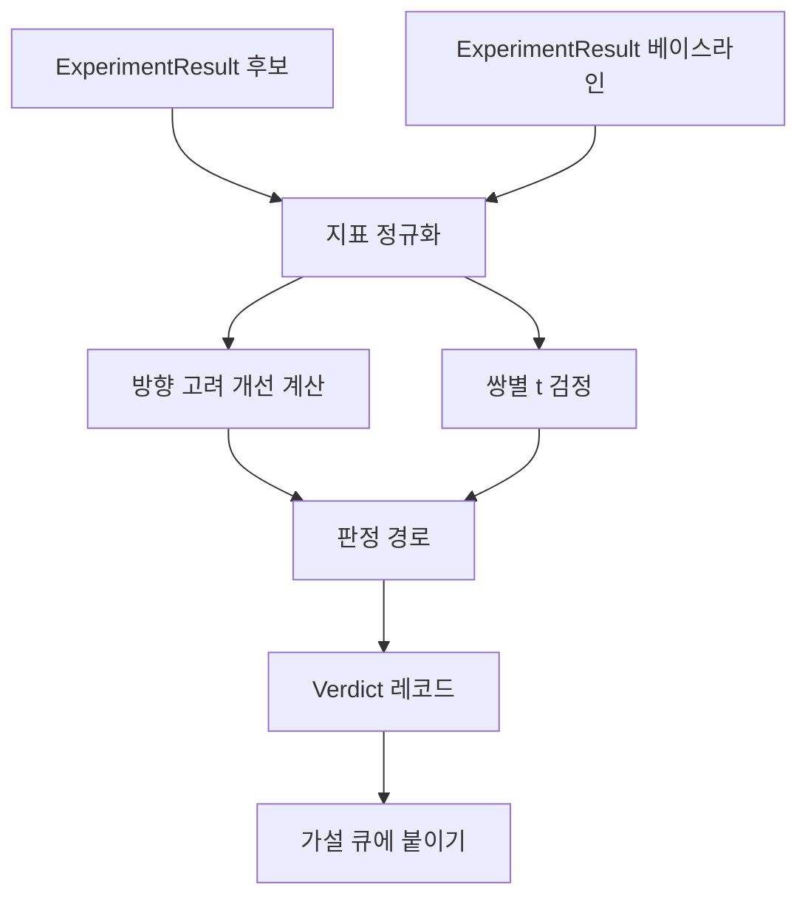

> 🇰🇷 이 문서는 한국어 번역본입니다(ELI5 스타일). 원문: [en.md](en.md)

# 결과 평가기(Result Evaluator)

> 러너가 숫자를 만들어 냈습니다. 그 숫자가 개선인지, 성능 하락인지, 그냥 노이즈인지 판단하는 것이 평가자입니다. 지표를 한 줄 결론으로 바꾸는 판정 경로를 만들어 보세요.

**유형:** Build
**언어:** Python
**선수 지식:** 페이즈 19 트랙 A 레슨 20-29
**시간:** 약 90분

## 학습 목표
- 방향을 고려한 개선 계산과 고정 임계값으로 후보 실행을 베이스라인과 비교한다.
- 시드별 지표를 대상으로 밑바닥부터 쌍별 t 검정(paired t test)을 돌리고, 나온 p값을 읽는다.
- 로그 스케일 지표를 정규화해서, 다운스트림 보고서가 선형 지표와 섞을 수 있게 만든다.
- 오케스트레이터가 레슨 50의 큐에 붙일 수 있는 가설별 판정을 출력한다.
- 모든 단계를 순수 함수로 유지해서, 같은 입력이 항상 같은 판정을 만들게 한다.

## 왜 쌍별 검정인가

러너가 준 숫자 하나로는 변화가 진짜인지 알 수 없습니다. 같은 설정이라도 시드가 다르면 퍼플렉시티가 다릅니다. 그 변화는 노이즈일 수 있습니다. 올바른 비교는 쌍별(paired)입니다. 같은 시드에 같은 데이터를 두고, 후보로 한 번, 베이스라인으로 한 번 실행합니다. 각 시드가 차이 하나를 내놓고, 그 차이들의 평균이 효과입니다. 그 차이들의 표준 오차가 노이즈 바닥(noise floor)입니다.

이 레슨은 검정을 밑바닥부터 구현합니다. `scipy.stats`는 없습니다. 수학은 한 화면에 읽을 수 있을 만큼 작습니다.

```text
diffs    = [a_i - b_i for i in seeds]
mean     = sum(diffs) / n
variance = sum((d - mean) ** 2 for d in diffs) / (n - 1)
t_stat   = mean / sqrt(variance / n)
df       = n - 1
p_value  = two_sided_p(t_stat, df)
```

양측 p값은 정규화된 불완전 베타 함수를 씁니다. 이 레슨은 Lentz 연분수를 쓰는 작은 구현을 함께 제공합니다. 전부 stdlib 수학 60줄짜리입니다.

## 방향을 고려한 개선

어떤 지표는 올라가야 좋습니다(정확도, 처리량). 어떤 지표는 내려가야 좋습니다(손실, 퍼플렉시티, 실제 소요 시간). 평가자는 각 지표에 `direction` 필드를 둡니다.

```text
if direction == "higher_is_better":
    improvement = (candidate - baseline) / abs(baseline)
elif direction == "lower_is_better":
    improvement = (baseline - candidate) / abs(baseline)
```

개선값은 부호가 있습니다. higher_is_better 지표에서 개선값이 음수라는 것은 후보가 더 나쁘다는 뜻입니다. 판정 경로는 부호와 크기를 함께 읽습니다.

평평한 임계값(`improvement_threshold=0.02`, 2퍼센트)이 변화를 언급할 만큼 큰지 결정합니다. 그 아래면 p값과 무관하게 판정은 "noise"입니다. 루프는 사용자가 측정할 수 없는 변화에는 관심이 없습니다.

```figure
cg-paired-verdict
```

## 아키텍처



평가자는 세 개의 독립된 계산을 돌리고 판정 경로에서 결합합니다. 각 계산은 공유 상태가 없는 순수 함수입니다.

## 로그 정규화

퍼플렉시티는 손실의 지수 함수입니다. 손실이 0.1 내려가면 퍼플렉시티는 훨씬 크게 내려갑니다. 두 설정 사이에서 퍼플렉시티를 직접 비교하는 것은 괜찮지만, 하나의 보고서에서 선형 지표와 섞으려면 정규화가 필요합니다.

이 레슨은 `scale` 필드가 `"log"`인 지표는 개선을 계산하기 전에 자연로그를 취합니다. 임계값도 그 다음 로그 공간에서 적용됩니다. 퍼플렉시티가 32에서 28로 떨어진 것은 lower_is_better 지표에서 `log(28) - log(32) = -0.133`이고, 2퍼센트 임계값을 훌쩍 넘습니다.

```text
if scale == "log":
    a = log(candidate)
    b = log(baseline)
else:
    a = candidate
    b = baseline
```

`scale="linear"`(기본값)인 지표는 변환을 건너뜁니다. 같은 코드 경로가 둘 다 처리합니다.

## 시드별 쌍별 검정

레슨 52의 러너는 실행당 최종 지표 덩어리를 하나씩 출력합니다. 쌍별 검정을 위해서 평가자는 후보의 시드별 덩어리와 베이스라인의 시드별 덩어리가 필요합니다. 오케스트레이터는 같은 실험을 두 설정으로, 시드 목록에 걸쳐 실행하고 `ExperimentResult` 레코드 두 목록을 평가자에 넘깁니다.

평가자는 시드로 이들을 짝지습니다(시드는 `result.metrics["seed"]`에 있습니다)하고 요청된 지표를 훑습니다. 두 목록에서 시드가 맞지 않으면 평가자는 `PairingError`를 발생시킵니다. 오케스트레이터가 다시 실행해야 합니다.

## Verdict 형태

```text
Verdict
  hypothesis_id          : int
  metric                 : str
  direction              : "higher_is_better" | "lower_is_better"
  scale                  : "linear" | "log"
  candidate_mean         : float
  baseline_mean          : float
  improvement            : float       (부호 있음, 비율; 방향 규칙 참고)
  p_value                : float | None  (n < 2이면 None)
  significance_threshold : float
  improvement_threshold  : float
  verdict                : "improved" | "regressed" | "noise" | "failed"
  rationale              : str
```

판정 경로는 작은 결정 표입니다:

```text
1. 후보 결과 중 terminal != "ok"인 것이 있으면: verdict = "failed"
2. 그 외 |improvement| < improvement_threshold이면:  verdict = "noise"
3. 그 외 p_value가 None이거나 p_value > significance이면: verdict = "noise"
4. 그 외 improvement > 0이면:                          verdict = "improved"
5. 그 외에는:                                             verdict = "regressed"
```

rationale은 오케스트레이터가 가설 id에 대응해 기록할 수 있는 한 줄짜리 사람이 읽는 문장입니다.

## 코드 읽는 법

`code/main.py`는 `MetricSpec`, `Verdict`, `Evaluator`, t 통계량과 불완전 베타 헬퍼, 그리고 결정론적 데모를 정의합니다. t 검정은 순수 stdlib 수학으로 구현되고, numpy는 지표 목록을 읽고 평균과 분산을 계산할 때만 씁니다.

`code/tests/test_evaluator.py`는 개선 경로, 하락 경로, 노이즈 경로(작은 개선), 노이즈 경로(작은 n), failed terminal 경로, 로그 정규화 경로, 알려진 기준값에 대한 t 검정, 짝짓기 오류를 다룹니다.

## 이 레슨이 끼는 자리

레슨 50이 가설 큐를 만들었습니다. 레슨 51은 문헌이 정리한 것을 걸러 냈습니다. 레슨 52는 후보와 베이스라인 설정으로, 시드에 걸쳐 실험을 돌렸습니다. 레슨 53은 그 실행들을 읽고 판정을 씁니다. 오케스트레이터가 넷을 이어 붙입니다:

```text
for hypothesis in queue:
    literature = retrieval.search(hypothesis.text)
    if literature_settles(hypothesis, literature):
        attach(hypothesis, verdict="settled")
        continue
    candidates = runner.run_all(specs_for(hypothesis))
    baselines  = runner.run_all(baseline_specs_for(hypothesis))
    metric_spec = MetricSpec("perplexity", direction=LOWER, scale=LOG)
    verdict = evaluator.evaluate(hypothesis.id, metric_spec, candidates, baselines)
    attach(hypothesis, verdict)
```

그 오케스트레이터는 이 레슨에 없습니다. 네 레슨은 각자 정의한 데이터클래스 외에 어떤 접착제도 없이 그 오케스트레이터로 조합됩니다.
