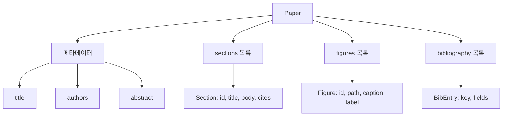
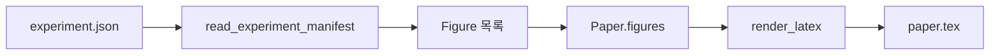
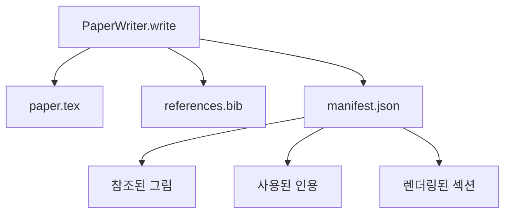

> 🇰🇷 이 문서는 한국어 번역본입니다(ELI5 스타일). 원문: [en.md](en.md)

# 논문 작성기(Paper Writer)

> LaTeX 골격은 연구자와 조판기 사이의 계약입니다. 계약이 깨지면 문서는 컴파일되지 않고, 그 실패는 시끄럽습니다. 골격을 먼저 만들고, 그다음 채우세요.

**유형:** Build
**언어:** Python
**선수 지식:** 페이즈 19 레슨 50-53
**시간:** 약 90분

## 학습 목표

- 연구 논문을 자유 형식 문서가 아니라 알려진 섹션 그래프를 가진 구조화된 산출물로 다룬다.
- 어떤 글이 쓰이기 전에 초록, 섹션, 그림 슬롯, 참고문헌 키를 선언하는 LaTeX 골격을 생성한다.
- 실험 산출물(경로와 캡션)에서 결정론적 슬롯 메커니즘을 통해 그림을 골격에 주입한다.
- 구조화된 개요에서 각 섹션을 채우는 목 처리된 글 생성기를 연결해서, 모델 없이도 하네스를 테스트할 수 있게 만든다.
- `paper.tex` 하나와 `references.bib` 하나, 그리고 참조된 모든 그림과 사용된 모든 인용을 나열하는 매니페스트를 출력한다.

```figure
ch-paper-skeleton
```

## 왜 골격을 먼저 하는가

글에서 출발하는 초안은 구조 부채가 쌓입니다. 서론에 있어야 할 세 문단이 관련 연구 자리에서 자라 납니다. 그림이 정의되기 전에 참조됩니다. 참고문헌에는 같은 논문에 대한 키가 세 개 생깁니다. 저자가 눈치챌 무렵에는 재작성 비용이 쓰기 비용보다 커집니다.

골격은 그것을 뒤집습니다. 구조를 데이터로서 처음부터 선언합니다. 섹션은 이름과 순서를 가진 슬롯입니다. 그림은 id와 캡션을 가진 슬롯입니다. 참고문헌 키는 그것이 가리키는 항목과 함께 맨 위에 선언됩니다. 글은 그 슬롯들에 하나씩 생성됩니다. 하네스는 어떤 글도 쓰이기 전에 검증할 수 있습니다. 모든 그림에 슬롯이 있고, 모든 인용에 항목이 있고, 모든 섹션이 목차에 나타나는지를요.

이것은 이전 레슨들이 계획, 도구 호출, 추적(traces)에 적용한 것과 같은 규율입니다. 구조가 곧 계약입니다.

## Paper 형태



모든 필드는 평범한 Python 데이터입니다. 렌더러는 `Paper`에서 LaTeX 문자열로 가는 순수 함수입니다. 하네스는 렌더링 전에 논문을 들여다볼 수 있습니다. 섹션 개수를 세고, 없는 그림 파일을 나열하고, 모든 `\cite{key}`에 일치하는 `BibEntry`가 있는지 검사하는 것이죠.

## 렌더 계약

렌더러는 세 가지 성질을 보장합니다. 첫째, 골격의 모든 그림 슬롯은 `fig:<id>` 형태의 안정적인 레이블을 단 `\begin{figure}` 블록을 출력합니다. 둘째, 모든 섹션은 `sec:<id>` 형태의 안정적인 레이블을 단 `\section{}`을 출력해서 교차 참조가 작동합니다. 셋째, 참고문헌은 `\bibliography` 블록을 출력하며, 그 `references.bib`에는 논문에 선언된 항목이 정확히 들어 있습니다. 더 많지도 적지도 않습니다.

이 중 하나라도 어기면 경고가 아니라 렌더 오류입니다. 골격이 계약이고, 그림을 조용히 빼먹는 렌더는 계약 파기입니다.

## 실험에서 그림 주입하기

이 트랙의 이전 레슨들은 실험 산출물을 JSON 매니페스트로 만들어 냈습니다. 각 매니페스트는 경로와 짧은 캡션을 가진 산출물 목록을 운반합니다. 논문 작성기는 그 매니페스트를 읽고 `Figure` 레코드를 만듭니다.



주입은 결정론적입니다. 그림 id는 실험 이름에 단조 증가 카운터를 더해 파생됩니다. 캡션은 매니페스트에서 옵니다. 경로는 논문 출력 디렉터리 기준으로 정규화되므로, 실험 산출물이 디스크의 다른 곳에 있어도 LaTeX이 컴파일됩니다.

## 목 처리된 글 생성기

이 레슨은 모델을 호출하지 않습니다. `MockProseGenerator`는 개요 형태를 읽고 결정론적으로 글을 만듭니다. 개요 형태는 섹션당 짧은 문자열 하나입니다. 생성기는 그 문자열을 섹션 제목을 엮어 넣어 두 개의 짧은 문단으로 확장합니다. 생성된 글은 개요가 선언한 바로 그 시점에 그림과 인용을 언급합니다.

이 정도면 작성기의 모든 동작을 테스트하기에 충분합니다. 실제 구현은 생성기를 모델 호출로 바꿉니다. 그 주변의 하네스는 바뀌지 않습니다. 글 생성기를 호출 가능한 객체(callable)로 선언하는 것의 가치가 바로 여기에 있습니다. 테스트는 결정론적 구현으로 대체하고, 프로덕션은 모델 구현으로 대체하며, 파이프라인의 나머지는 동일합니다.

## 매니페스트 출력

작성기는 출력 디렉터리에 세 개의 파일을 만듭니다.



매니페스트는 다운스트림 평가자나 비평 루프가 읽는 것입니다. 그들은 LaTeX을 파싱하지 않고 매니페스트를 읽습니다. 다음 레슨인 비평 루프는 이 매니페스트를 입력으로 받아 피드백 목록을 만듭니다. 그래서 매니페스트는 계약의 일부이고 LaTeX은 아닌 것입니다.

## 검증 게이트

작성기는 파일을 쓰기 전에 네 개의 게이트를 통과합니다.

1. 모든 그림 id는 논문 안에서 고유하다.
2. 모든 섹션의 `cites` 필드는 논문에 선언된 참고문헌 키를 참조한다.
3. 초록은 비어 있지 않다.
4. 제목은 비어 있지 않다.

게이트 실패는 정확한 이유를 담아 `PaperValidationError`를 발생시킵니다. 하네스는 그 이유를 실패 모드로 드러냅니다. 부분 쓰기는 없습니다. 세 파일이 모두 만들어지거나, 아무것도 만들어지지 않거나 둘 중 하나입니다.

## 코드 읽는 법

`code/main.py`는 `Paper`, `Section`, `Figure`, `BibEntry`, `PaperValidationError`, `MockProseGenerator`, `PaperWriter`, 그리고 `render_latex` 함수를 정의합니다. `write` 메서드는 출력 디렉터리를 받아 `paper.tex`, `references.bib`, `manifest.json`을 출력합니다. `read_experiment_manifest` 헬퍼는 실험 매니페스트 목록을 `Figure` 레코드로 변환합니다.

`code/tests/test_paper_writer.py`는 다음을 다룹니다. 섹션 없는 골격 렌더, 두 섹션과 두 그림이 있는 전체 렌더, 누락된 인용 게이트, 중복 그림 id 게이트, 매니페스트 내용, LaTeX 문자열 계약(모든 섹션은 `\section{}`을, 모든 그림은 `\begin{figure}`를 출력).

## 더 나아가기

실제 구현이 원할 두 가지 확장입니다. 첫째, 멀티 형식 렌더. 같은 `Paper` 형태가 블로그 포스트용 Markdown과 미리보기용 HTML로 컴파일됩니다. 렌더러는 `Paper` 위의 전략(strategy)이 됩니다. 둘째, 인용 보강. DOI 로컬 캐시가 주어지면 작성기가 인용 키에서 BibTeX 항목을 가져옵니다. 둘 다 가치를 더하고, 둘 다 골격 계약을 건드리지 않고 추가할 수 있습니다.

골격이 바로 그 베팅입니다. 섹션, 그림, 인용을 데이터로 선언하고, 글을 슬롯에 생성하고, LaTeX과 함께 매니페스트를 출력합니다. 다른 모든 개선은 그 위에 쌓입니다.
