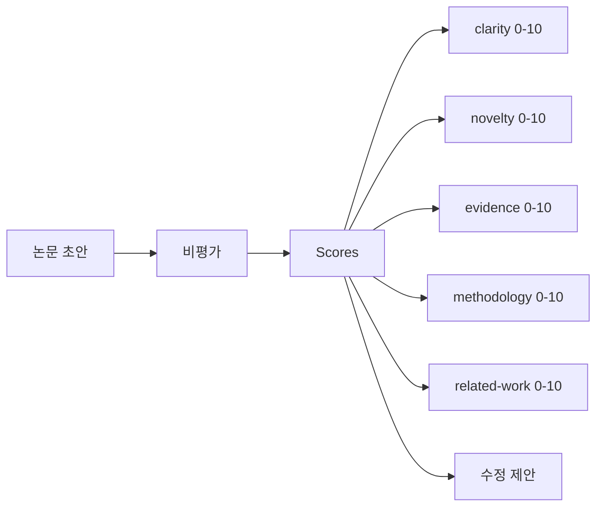
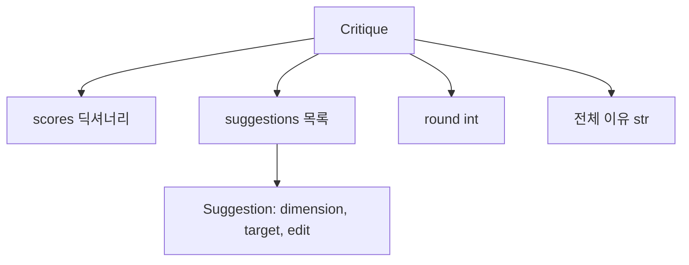
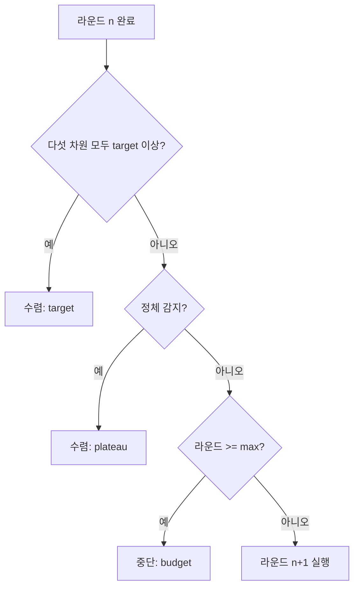
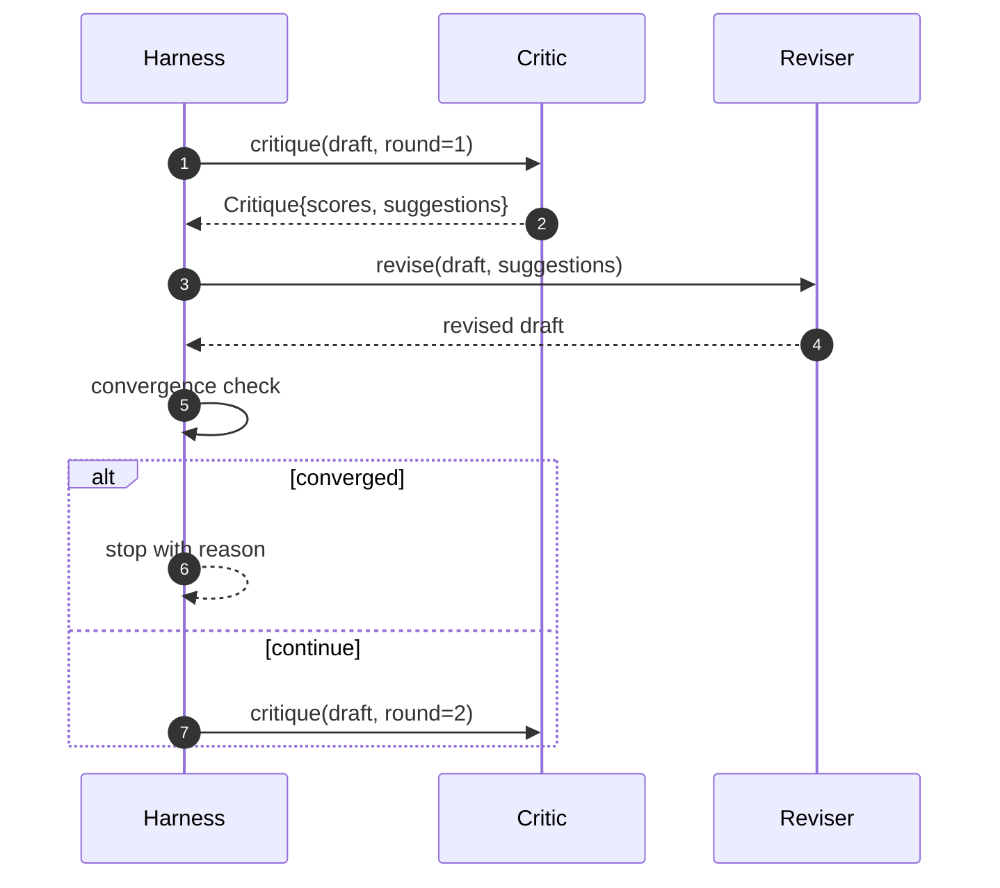

> 🇰🇷 이 문서는 한국어 번역본입니다(ELI5 스타일). 원문: [en.md](en.md)

# 비평 루프(Critic Loop)

> 첫 번째에 "좋아 보입니다"라고 돌려주는 비평가는 고장 난 것입니다. 항상 "보완이 필요합니다"라고 돌려주는 비평가도 고장 난 것입니다. 흥미로운 비평가는 수렴하는 비평가이고, 수렴은 설계해서 만들어야 합니다.

**유형:** Build
**언어:** Python
**선수 지식:** 페이즈 19 레슨 50-53
**시간:** 약 90분

## 학습 목표

- 논문 초안을 다섯 개의 고정 차원으로 채점한다: 명확성, 새로움, 근거, 방법론, 관련 연구.
- 각 라운드의 비평을 자유 형식 재작성이 아니라 구조화된 수정 diff로 적용한다.
- 라운드 사이의 점수 비교로 수렴을 감지한다. 정체(plateau), 목표 달성, 예산 소진 시 중단한다.
- 최대 반복 예산으로 라운드에 상한을 둬서, 수렴하지 않는 비평가가 영원히 돌지 않게 만든다.
- 라운드별 추적(trace)을 출력해서, 대시보드나 다음 단계가 점수 궤적을 그릴 수 있게 만든다.

```figure
ch-critic-converge
```

## 왜 다섯 개의 고정 차원인가

자유 형식 비평가는 제안 한 문단을 돌려주는 모델입니다. 다음 라운드의 수정은 그 문단을 주변 맥락으로 취급합니다. 재작성이 비평을 다루었는지는 검증 불가능합니다. 비평이 처음부터 구조를 갖지 않았기 때문입니다.

다섯 개의 차원이 하네스에 계약을 줍니다.



점수는 벡터입니다. 하네스는 각 차원을 라운드에 걸쳐 감시합니다. clarity를 올리지만 evidence를 끌어내리는 수정은 evidence에서의 성능 하락이고, 수렴 검사가 그것을 봅니다. 모델만 있는 비평가는 그런 보장을 제공할 수 없습니다.

## Critique 형태



모든 제안은 자신이 개선하는 차원, 목표로 하는 섹션, 수정자(reviser)가 적용할 수 있는 `edit` 지시를 운반합니다. 수정자 역시 호출 가능한 객체입니다. 이 레슨은 edit 지시를 섹션에 덧붙이기(append-to-section) 연산으로 해석하는 결정론적 수정자를 함께 제공합니다. 모델 기반 수정자는 같은 필드를 프롬프트로 해석할 것입니다. 계약은 바뀌지 않습니다.

## 수렴 규칙, 순서대로

비평 루프는 세 조건 중 하나라도 발동하면 종료됩니다.



목표(target)가 가장 엄격한 경우입니다. 다섯 차원(clarity, novelty, evidence, methodology, related_work) 모두가 `>= target_score`(기본값 `8.0`)에 도달해야 루프가 성공으로 돌아갑니다. 평균이 높아도 한 차원이 약하면 충분하지 않습니다. 정체(plateau) 감지는 현재 라운드의 평균을 이전 라운드의 평균과 비교합니다. 개선이 `plateau_epsilon`(기본값 `0.1`) 미만이 두 라운드 연속이면 루프는 `plateau`로 빠져나옵니다. 예산은 라운드에 대한 엄격한 상한(기본값 `5`)이고, `budget`으로 빠져나옵니다.

순서가 중요합니다. target이 plateau를 이기고, plateau가 budget을 이깁니다. 세 번째 라운드가 목표에 도달한 반복이 정체도 발동시켰다면 결과는 `plateau`가 아니라 `target`입니다.

## 왜 정체 감지가 두 라운드에 걸쳐 실행되는가

한 라운드짜리 정체는 노이즈입니다. 실제 비평가는 고정된 초안에서도 반복마다 조금씩 다른 점수를 돌려줍니다. 결정론적 채점이라도 어떤 제안이 어떤 순서로 적용되었는지에 따라 달라지기 때문입니다. 두 라운드 연속 정체를 요구하면 그 노이즈가 걸러집니다. 하네스가 정체를 보고했다면, 초안은 정말로 개선을 멈춘 것입니다.

## 이 레슨의 결정론적 비평가

이 레슨은 모델을 호출하지 않습니다. 함께 제공되는 비평가는 세 가지 신호로 초안을 채점하는 호출 가능한 객체입니다. 평균 섹션 본문 길이(clarity), 그림 개수와 인용 개수(evidence), 논문 메타데이터의 `originality_tag` 필드(novelty)가 그것입니다. 수정자는 각 점수를 위로 밀어 올리는 방법을 압니다.

```text
clarity      평균 섹션 본문 길이가 늘어나면 성장
novelty      originality_tag가 "high"로 설정되면 성장
evidence     섹션의 figure_refs가 비어 있지 않으면 성장
methodology  본문이 있는 "Method" 제목의 섹션이 있으면 성장
related-work 본문이 있는 "Related Work" 제목의 섹션이 있으면 성장
```

수정자는 각 제안을 표적화된 덧붙이기로 해석합니다. 첫 라운드 이후 하네스는 점수가 오르는 것을 관찰할 수 있습니다. 테스트는 이 성질을 이용해 루프가 격차를 줄인다고 단언합니다.

## 전체 루프 계약



하네스는 라운드 카운터와 추적과 수렴 검사를 소유합니다. 비평가는 점수를 소유합니다. 수정자는 diff를 소유합니다. 셋 중 누구도 다른 이의 상태를 건드리지 않습니다.

## Trace 출력

모든 라운드는 라운드 번호, 점수 벡터, 제안 개수, 수렴 판정을 담은 추적 이벤트 하나를 출력합니다. 전체 추적은 최종 초안과 함께 반환됩니다. 다운스트림 대시보드는 라운드별 점수 차트를 그릴 수 있습니다. 다음 레슨인 반복 스케줄러는 이 추적을 읽고 그 브랜치를 유지할 가치가 있는지 판단합니다.

## 나쁜 비평가로부터 지켜 주는 예산

점수를 결코 개선하지 않는 제안을 만드는 비평가는 루프를 최대 반복 천장에 가둡니다. 추적이 그것을 보이게 만듭니다. 다섯 라운드, 평평한 점수, 판정 `budget`. 사용자는 그것을 초안의 버그가 아니라 비평가의 버그로 읽습니다. 최종 초안만 보여 주는 대안은 진단을 숨겨 버립니다. 추적 우선 설계는 그것을 드러냅니다.

## 코드 읽는 법

`code/main.py`는 `Critique`, `Suggestion`, `Critic` 프로토콜, `Reviser` 프로토콜, `CriticLoop`, 그리고 결정론적 비평가와 짝이 되는 수정자를 돌려주는 `make_deterministic_critic_pair` 팩토리를 정의합니다. 레슨이 독립적으로 서 있을 수 있게 최소 `Paper` 형태도 포함됩니다.

`code/tests/test_critic_loop.py`는 다음을 다룹니다. 첫 라운드 이후의 단조 증가, 조율된 초안에서의 목표 수렴, 두 라운드 정체 후의 정체 감지, 어떤 제안도 개선하지 않을 때의 예산 소진, 수정자에 의한 제안 적용, 추적 형태.

## 더 나아가기

실제 구현이 원할 두 가지 확장입니다. 첫째, 차원 가중치. 워크숍 논문은 methodology보다 novelty에 더 큰 가중치를 둡니다. 저널은 그 반대입니다. 수렴 검사가 가중 평균이 됩니다. 둘째, 쌍을 이루는 비평가. 한 비평가가 채점하고, 두 번째 비평가가 수정자가 보기 전에 제안을 심사합니다. 둘 다 가치를 더하고, 둘 다 같은 `Critique` 형태 위에서 조합됩니다.

베팅은 점수 벡터입니다. 비평이 한 번 구조화되면 다른 모든 개선, 수렴 규칙, 대시보드, 쌍 비평가가 루프를 바꾸지 않고 끼어듭니다.
