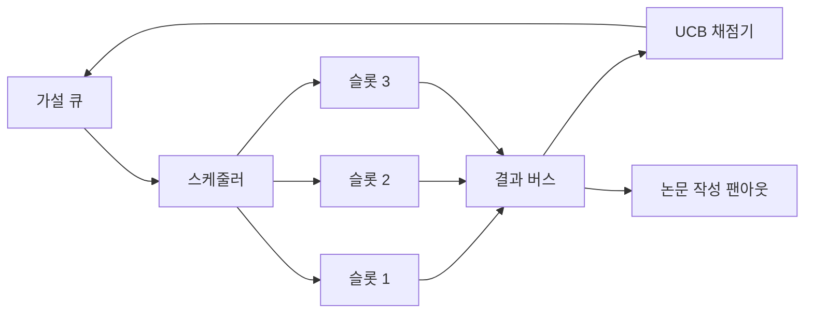
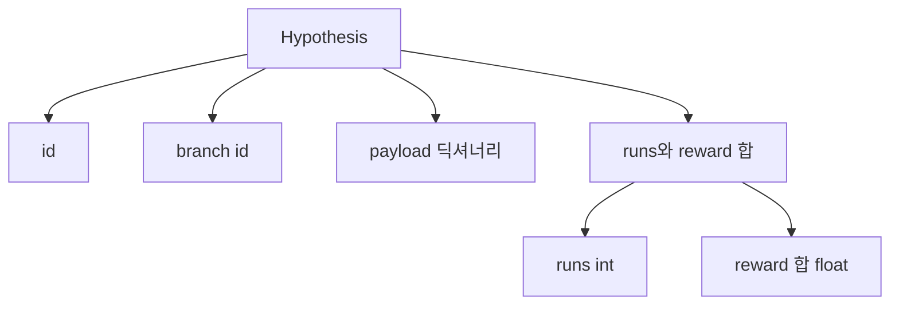
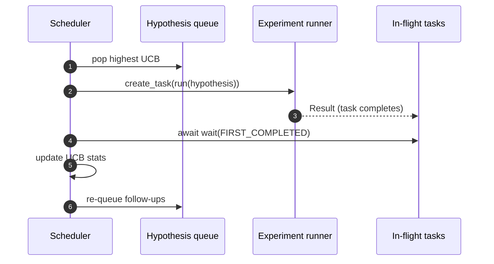

> 🇰🇷 이 문서는 한국어 번역본입니다(ELI5 스타일). 원문: [en.md](en.md)

# 반복 스케줄러(Iteration Scheduler)

> 스케줄러 없는 리서치 루프는 착각에 빠진 작업 대기열일 뿐입니다. 스케줄러는 루프가 무엇의 탐색을 멈출지 결정하는 자리이고, 그 결정이 게임 전부입니다.

**유형:** Build
**언어:** Python
**선수 지식:** 페이즈 19 레슨 50-53
**시간:** 약 90분

## 학습 목표

- 리서치 워크플로를, 가설 큐가 병렬 실험 슬롯을 먹여 주고 그 결과가 다시 되돌아오는 형태로 모델링한다.
- asyncio로 여러 실험을 동시에 실행해서, 스케줄러가 모든 슬롯을 바쁘게 유지할 수 있게 만든다.
- 각 가설 브랜치를 UCB로 채점해서, 탐색을 포기하지 않으면서 저수확 브랜치를 가지치기한다.
- 완료된 결과를 논문 작성 단계와 재큐 단계로 퍼뜨려서(fan-out), 고수확 브랜치가 후속 가설을 낳게 만든다.
- 브랜치 점수, 슬롯 점유율, 가지치기 결정을 담은 반복별 추적(trace)을 드러낸다.

```figure
ch-ucb-scheduler
```

## 왜 작업 목록이 아니라 스케줄러인가

평평한 작업 목록은 제출 순서대로 작업을 돌립니다. 각 작업이 독립적일 때는 괜찮습니다. 하지만 리서치는 독립적이지 않습니다. 실험 3의 발견이 실험 4와 5의 우선순위를 바꿉니다. 결과 팬인(fan-in)을 읽고 큐를 재정렬하는 스케줄러가 컴퓨팅 단위당 더 유용한 작업을 해 냅니다.

흥미로운 설계 선택은 채점 규칙입니다. 탐욕적 채점기는 항상 현재 선두만 고르고 탐색하지 않습니다. 균등 채점기는 활용을 절대 하지 않습니다. UCB(상한 신뢰 경계, upper confidence bound)는 중간 길입니다. 덜 시도한 브랜치를 위한 용량을 남겨 두면서 선두를 활용합니다.

## 시스템 형태



큐는 가설을 담습니다. 스케줄러는 슬롯이 비면 가장 높은 UCB의 가설을 고릅니다. 각 슬롯은 실험을 비동기적으로 실행합니다. 완료된 실험은 결과를 버스에 퍼뜨립니다. 버스는 발생한 브랜치의 UCB 통계를 갱신하고, 브랜치의 수확이 임계값을 넘으면 논문 작성 단계로 퍼뜨립니다.

## Hypothesis 형태



`branch`는 UCB 통계의 키입니다. 여러 가설이 하나의 브랜치를 공유할 수 있습니다(브랜치가 연구 방향이고, 가설은 그 안의 시행 하나입니다). `runs`는 그 브랜치의 완료된 실험 수이고, `reward_sum`은 누적 보상입니다. UCB는 둘 다 읽습니다.

## UCB 채점

이 레슨이 쓰는 UCB 공식은 고전적인 UCB1입니다.

```text
ucb(branch) = mean_reward(branch) + c * sqrt( ln(total_runs) / runs(branch) )
```

`total_runs`는 모든 브랜치에 걸쳐 완료된 모든 실험의 개수입니다. `c`는 탐색 가중치이며, 이 레슨의 기본값은 `sqrt(2)`입니다. 실행 수가 0인 브랜치는 `+inf`를 받으므로, 시도하지 않은 브랜치는 항상 먼저 스케줄됩니다. 평균 보상이 높은 브랜치는 다른 브랜치가 따라올 때까지 높은 점수를 유지합니다. 많이 돌았지만 보상이 시원찮은 브랜치는 덜 돈 대안들에 밀려 사라집니다.

가지치기 게이트는 고르는 것과 별개입니다. 가지치기는 브랜치의 평균 보상이 절대 바닥값(기본값 `0.2`) 아래로 떨어지면, 최소 `prune_after_runs`회 시도(기본값 `3`) 이후에 향후 스케줄링에서 제거합니다. 이것이 큐를 유한하게 유지합니다.

## asyncio로 슬롯 병렬화

스케줄러는 실험을 `asyncio.create_task`로 구동합니다. 각 태스크는 `Result`를 반환하는 실험 러너(`async def` 호출 가능 객체)를 실행합니다. 메인 루프는 진행 중인 태스크 집합을 `asyncio.wait(..., return_when=asyncio.FIRST_COMPLETED)`로 기다렸다가 완료할 때마다 채점 갱신을 발동합니다.



세 개의 슬롯이 동시에 실행됩니다. 메인 루프는 단일 실험에서 절대 막히지 않습니다. 스케줄러는 슬롯이 비는 즉시 새 태스크를 시작하되, 큐가 비고 진행 중인 태스크도 없을 때까지 계속합니다.

## 팬아웃: 논문 트리거

브랜치의 평균 보상이 `paper_threshold`(기본값 `0.7`)를 넘었는데 그 브랜치가 아직 논문을 만들지 않았다면, 스케줄러는 `paper.trigger` 이벤트를 출력 목록에 퍼뜨립니다. 다운스트림에서는 레슨 54의 논문 작성기가 이것을 집어 들을 것입니다. 이 레슨에서는 트리거가 목록으로 캡처되므로 테스트가 단언할 수 있습니다.

## 팬아웃: 후속 가설

고수확 결과가 도착하면 스케줄러는 사용자가 공급한 `expander`를 호출해 같은 브랜치에 하나 이상의 후속 가설을 만들 수 있습니다. 익스팬더는 `Result`에서 `list[Hypothesis]`로 가는 순수 함수입니다. 이 레슨은 보상이 논문 임계값을 넘는 결과에 대해 두 개의 후속 가설을 만드는 결정론적 익스팬더를 함께 제공합니다.

## 예산

두 개의 예산이 스케줄러를 폭주 루프로부터 지킵니다.

```text
max_experiments    : 모든 브랜치에 걸쳐 실행된 실험의 총 개수
max_seconds        : 실제 시간 상한(asyncio 시간)
```

어느 하나라도 발동하면 스케줄러는 새 태스크 스케줄링을 멈추고, 진행 중인 태스크를 기다린 뒤 최종 추적을 반환합니다. 추적에는 `stop_reason`이 포함됩니다.

## Trace와 최종 보고서

스케줄링 결정마다(고르기, 디스패치, 결과, 가지치기, 팬아웃) 이벤트 하나가 출력됩니다. 최종 보고서는 브랜치별 통계, 총 실행 수, 총 실제 시간, 발동된 논문 트리거를 요약합니다. 다음 레슨인 엔드투엔드 데모는 이 보고서를 읽고 논문 작성기를 구동합니다.

## 코드 읽는 법

`code/main.py`는 `Hypothesis`, `Result`, `BranchStats`, `IterationScheduler`, 그리고 예측 가능한 보상을 내는 asyncio 실험 러너를 돌려주는 `make_deterministic_runner` 팩토리를 정의합니다. 러너는 고정된 `delay_ms`(기본값 `5ms`)만큼 잠들어서 동시성이 관측 가능하게 만듭니다.

`code/tests/test_scheduler.py`는 다음을 다룹니다. UCB가 시도하지 않은 브랜치를 먼저 고르는 것, 병렬 슬롯 점유, 임계값을 넘었을 때의 논문 트리거, 저수확 시행 후의 브랜치 가지치기, 후속 가설 팬아웃, 예산 종료(실험 개수와 실제 시간 둘 다).

## 더 나아가기

실제 구현이 원할 세 가지 확장입니다. 첫째, 세션 간 UCB 통계 영속화. 현재 통계는 메모리에 살아 있지만, 실제 스케줄러는 체크포인트로 저장해서 재시작해도 이미 쓴 탐색 예산이 보존되게 할 것입니다. 둘째, 다중 목표 채점. 스칼라 보상 대신 각 결과가 벡터를 출력하고 UCB가 파레토 스타일 선택기가 됩니다. 셋째, 맥락적 밴딧(contextual bandits). 선택기가 가설 특성(길이, 복잡도)에 조건을 붙여서 비슷한 가설들이 탐색을 공유합니다.

스케줄러는 리서치가 작업 목록 이상이 되는 자리입니다. UCB가 한 번 연결되고 슬롯이 병렬로 돌기 시작하면, 다른 모든 개선은 그 위에 쌓입니다.
