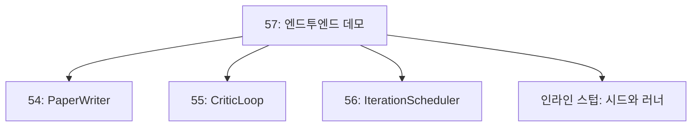
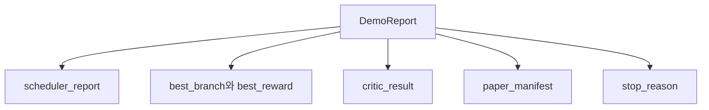

> 🇰🇷 이 문서는 한국어 번역본입니다(ELI5 스타일). 원문: [en.md](en.md)

# 엔드투엔드 리서치 데모(End-to-End Research Demo)

> 데모는 여러분이 앞서 쓴 모든 계약이 조합되어야 하는 자리입니다. 그중 하나라도 새면, 데모가 바로 그것을 잡아 내는 레슨이 됩니다.

**유형:** Build
**언어:** Python
**선수 지식:** 페이즈 19 레슨 50-53
**시간:** 약 90분

## 학습 목표

- 자동 리서치 루프를 엔드투엔드로 연결한다. 가설 시드, 실험 러너, 스케줄러, 비평 루프, 논문 작성기.
- 앞선 네 개의 트랙 D 레슨의 프리미티브를 프레임워크가 아닌 평범한 Python 임포트로 조합한다.
- 루프를 스스로 끝나는 지점까지 실행하고, 모든 단계의 출력을 나열하는 단일 데모 보고서를 출력한다.
- 데모를 결정론적으로 유지해서, 테스트 스위트가 최종 형태를 단언할 수 있게 만든다.
- 어느 단계의 계약이 깨지면 명확한 실패 모드를 드러내서, 다음 단계가 깨진 입력으로 실행되지 않게 만든다.

```figure
ch-research-pipeline
```

## 무엇이 여기서 조합되는가


다섯 단계입니다. 시드는 가설 세 개의 목록입니다. 스케줄러는 세 개의 병렬 슬롯으로 이들에 걸쳐 여섯 개의 실험을 실행합니다. 버스는 논문 트리거를 하나 이상 보고합니다. 선택기는 단일 최고 결과를 고릅니다. 비평 루프는 그 결과로 만든 초안을 반복 개선합니다. 논문 작성기는 최종 LaTeX, BibTeX, 매니페스트를 출력합니다.

## 왜 복사가 아니라 임포트인가

각 이전 레슨은 공개 데이터클래스와 함수를 담은 `main.py`를 함께 제공합니다. 데모는 각 레슨의 부모 디렉터리로 `sys.path`를 조정해 이들을 임포트합니다. 프레임워크 연결이 아닙니다. 앞선 레슨들의 테스트 파일이 이미 쓰는 것과 같은 임포트입니다.



인라인 스텁이 레슨 50~53을 대신합니다. 시드 가설의 작은 생성기와 동기 보상 함수입니다. 사용자는 임포트 두 개만 조정하면 인라인 스텁을 그 레슨들의 실제 프리미티브로 바꿀 수 있습니다.

## 결정론 보장

데모는 구조적으로 결정론적입니다. 실험 러너는 시드가 주어진 numpy입니다. 비평 루프의 수정자는 고정된 순서로 고정된 차원을 훑습니다. 논문 작성기의 글 생성기는 레슨 54의 목 생성기입니다. 스케줄러의 UCB 선택기는 무작위 선택이 아니라 반복 순서로 동점을 깹니다.

같은 시드가 주어지면 데모는 같은 보고서를 출력합니다. 테스트는 데모를 두 번 실행하고 매니페스트를 비교해 이 성질을 단언합니다.

## 데모 보고서 형태



각 필드는 업스트림 단계에서 그대로 옵니다. 데모는 어떤 출력도 변환하지 않습니다. 조합만 합니다. 데모가 바로 그 테스트입니다.

## 실패 모드 처리

각 단계는 성공하거나 형식화된(typed) 오류를 발생시킵니다.

```text
Scheduler ........ stop_reason이 {queue_empty, max_experiments, deadline} 중
                   하나인 SchedulerReport를 반환
Best-result pick . 논문 트리거가 하나도 발동하지 않으면 NoTriggerError 발생
Critic loop ...... status가 converged 또는 stopped인 LoopResult를 반환
Paper writer ..... 계약이 깨지면 PaperValidationError 발생
```

어느 단계의 실패든 형식화된 예외로 데모를 단락시킵니다. 테스트가 이 계약을 고정합니다. `test_no_triggers_raises_typed_error`와 `test_best_picker_raises_when_no_triggers`는 어떤 브랜치도 트리거를 발동하지 않으면 선택기가 `NoTriggerError` / `BestResultError`를 발생시키고 작성기는 호출되지 않는다고 단언합니다.

## 최고 결과 선택기

스케줄러는 브랜치별로 논문 트리거를 출력합니다. 선택기는 모든 트리거에 걸쳐 평균 보상이 가장 높은 브랜치를 고릅니다. 동점은 브랜치 id의 알파벳 순으로 깨지므로 데모는 결정론적입니다. 선택기는 작은 순수 함수이고, 테스트가 고정된 스케줄러 보고서 위에 그것을 고정합니다.

## 비평 루프 연결하기

레슨 55의 비평 루프는 `MiniPaper`를 대상으로 작동합니다. 데모는 고른 브랜치에서 `MiniPaper`를 만듭니다. 초록을 브랜치 id로 채우고, 두 섹션(Introduction과 Results)을 시딩하고, 브랜치의 평균 보상에서 `originality_tag`를 설정합니다(`>= 0.8`이면 high, `>= 0.6`이면 medium, 그 외에는 low).

그런 다음 수정자가 초안을 수렴할 때까지 반복 개선합니다. 출력은 논문 작성기로 갑니다.

## 논문 작성기 연결하기

레슨 54의 논문 작성기는 그림과 참고문헌을 갖춘 전체 `Paper` 형태를 대상으로 작동합니다. 데모는 수렴한 `MiniPaper`를 `mini_to_full_paper`로 업그레이드합니다. 이 함수는 선택된 브랜치의 그림 하나를 붙이고, 비평가가 제안한 cite 키들의 합집합으로 작은 합성 참고문헌을 만듭니다. 데모가 추가하는 모든 cite는 참고문헌 목록에도 추가되므로 검증을 통과합니다.

## 코드 읽는 법

`code/main.py`는 `BestResultError`, `NoTriggerError`, `DemoReport`, `pick_best_branch`, `build_mini_paper`, `mini_to_full_paper`, `run_demo`를 정의합니다. 맨 위의 임포트는 `sys.path`를 한 번 조정해 각 레슨에서 `PaperWriter`, `CriticLoop`, `IterationScheduler`를 끌어옵니다.

`code/tests/test_e2e.py`는 다음을 다룹니다. 데모가 엔드투엔드로 실행되어 다섯 필드가 모두 채워진 보고서를 출력하는 것, 두 실행에 걸친 결정론, 어떤 브랜치도 임계값을 넘지 않을 때의 NoTriggerError, 작성기의 계약이 깨졌을 때의 PaperValidationError, 논문 매니페스트가 고른 브랜치의 그림을 포함하는 것, 스케줄러 stop_reason이 기대값 중 하나인 것.

## 더 나아가기

데모가 초록불이 되면 연결할 가치가 있는 세 가지 확장입니다. 첫째, 상태 영속화. 각 단계의 결과를 작은 JSON 스토어에 기록해서, 재시작이 싼 단계를 다시 돌리지 않고 재개하게 만듭니다. 둘째, 대시보드. 스케줄러와 비평 루프의 추적 이벤트가 하나의 타임라인으로 렌더링됩니다. 셋째, 실제 모델 호출. 목 글 생성기와 결정론적 비평가를 모델 기반 구현으로 바꿉니다. 연결 방법은 바뀌지 않습니다.

데모의 임무는 조합이 곧 아키텍처임을 증명하는 것입니다. 다섯 개의 레슨, 네 개의 임포트, 하나의 보고서. 다음에 단계를 추가하면 연결은 정확히 한 줄만 늘어납니다.
