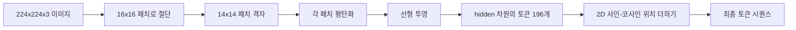

> 🇰🇷 이 문서는 한국어 번역본입니다(ELI5 스타일). 원문: [en.md](en.md)

# 비전 인코더 패치(Vision Encoder Patches)

> 픽셀을 읽는 비전 모델에는 픽셀용 토크나이저가 필요합니다. 패치 임베딩이 바로 그 토크나이저입니다. 이미지를 정사각형 격자로 자르고, 각 정사각형을 평탄화하고, 선형 레이어 하나로 투영한 다음, 2D 위치 신호를 더해서 트랜스포머가 각 정사각형이 원본 이미지의 어디에 있었는지 알게 만드는 것입니다.

**유형:** Build
**언어:** Python
**선수 지식:** 페이즈 19 레슨 30-37 (트랙 B 기초)
**시간:** 약 90분

## 학습 목표

- 이미지를 고정 길이 패치 임베딩 시퀀스로 토큰화한다.
- unfold-후-선형의 수학과 일치하는 `Conv2d` 기반 패치 투영을 구현한다.
- 토큰 순서가 공간적 위치를 부호화하도록 결정론적인 2D 사인-코사인 위치 임베딩을 만든다.
- 합성 고정 데이터(fixture)에서 패치 개수, 임베딩 형태, `Conv2d`/unfold 등가성을 검증한다.

## 문제 상황

트랜스포머는 벡터 시퀀스를 먹습니다. 이미지는 3채널 격자입니다. 모든 픽셀을 토큰으로 읽으면 시퀀스 길이가 폭발합니다. 224x224 RGB 이미지는 150,528개의 토큰인데, 12층 트랜스포머가 어텐션에서 감당할 수 있는 수준이 아닙니다. 이미지를 하나의 거대한 평평한 벡터로 읽으면 지역성(locality)을 버리게 되고, 어텐션 레이어는 그것을 되찾을 수 없습니다. 인코더 앞단의 임무는 픽셀 격자를, 각각이 정사각형 영역 하나를 요약하는 몇백 개의 토큰으로 압축하는 것입니다.

패치 임베딩은 선형 투영 하나로 이 문제를 풉니다. 224x224 이미지를 16x16 패치로 자르면 196개 패치의 14x14 격자가 나옵니다. 각 패치는 `(3, 16, 16) = 768`개 픽셀 값에서 벡터 하나로 평탄화되고, 선형 레이어가 그것을 모델의 히든 차원으로 보냅니다. 트랜스포머는 차원 `hidden`(보통 768)의 토큰 196개와 CLS 토큰 하나를 봅니다. 네트워크의 나머지가 씹을 수 있는 시퀀스입니다.

## 개념



### 픽셀이 아니라 패치인 이유

어텐션은 시퀀스 길이의 제곱입니다. 196개 토큰 시퀀스는 헤드당 레이어당 `196 * 196 = 38,416`개의 어텐션 점수가 들고, 150,528개 토큰 시퀀스는 `150,528 * 150,528 = 226억` 개가 듭니다. 패치는 어텐션 연산을 59만 배 줄여 주고, 16x16 영역 하나만으로도 고수준 비전 과제에 충분한 신호를 운반합니다. 비용은 패치 하나 안의 세밀한 공간 정보가 손실되는 것인데, 그래서 다운스트림 멀티모달 스택은 정밀한 위치 파악이 중요할 때 고해상도 두 번째 브랜치를 돌리는 경우가 흔합니다.

### 선형 투영 하나로 충분한 이유

각 패치는 독립된 벡터로 취급됩니다. 투영은 기저를 학습합니다. 에지 검출기, 색 필터, 단순 텍스처 같은 것들이죠. 단일 선형 레이어는 작고(ViT-Base 기준 `768 * 768 = 589,824`개 파라미터) 빠르게 학습됩니다. 더 깊은 합성곱 스템도 존재합니다("하이브리드" ViT). 하지만 평평한 선형 투영이 표준이고, 대부분의 현대 오픈 웨이트 인코더가 정확히 이 형태로 출시됩니다.

### `Conv2d` 트릭

패딩 없는 `Conv2d(in_channels=3, out_channels=hidden, kernel_size=patch_size, stride=patch_size)`는 unfold-후-선형과 수치적으로 같은 결과를 냅니다. 각 출력 위치가 패치 픽셀과 필터 하나를 내적으로 곱하기 때문입니다. 즉 합성곱이 곧 패치 투영이고, 대부분의 프로덕션(운영 환경) 코드베이스가 이 방식으로 출시합니다. GPU에서 더 빠르고 reshape을 하나 덜 쓰기 때문입니다.

### 위치 임베딩

토큰은 투영에서 나올 때 아무 순서도 갖지 않습니다. 2D 사인-코사인 임베딩은 각 토큰에게 자신의 `(row, col)` 위치를 부호화하는 고정 신호를 줍니다. 임베딩 차원의 절반은 여러 주파수의 sin/cos로 행 위치를 부호화하고, 나머지 절반은 열 위치를 부호화합니다. 인코딩은 결정론적이므로 재학습 없이 해상도를 바꿀 수 있고, 모델이 학습 때 본 적 없는 격자로도 깔끔하게 보간됩니다.

| 구성 요소 | 형태 | 파라미터 수 |
|-----------|-------|------------|
| 패치 투영(`Conv2d`) | `(hidden, 3, patch, patch)` | `3 * P * P * hidden + hidden` |
| 위치 임베딩(고정) | `(num_patches, hidden)` | 0 (계산됨, 학습 안 함) |
| CLS 토큰(학습됨) | `(1, hidden)` | `hidden` |

224 해상도의 ViT-Base/16 기준: 투영에 590,592개, CLS 토큰에 768개, 사인-코사인 위치에는 0개의 파라미터입니다. 다음 레슨(59)은 이 앞단 위에 12층 트랜스포머를 쌓습니다.

### 정상 작동 확인으로서의 등가성

패치 단계에는 두 가지 표기법이 있습니다. `Conv2d` 투영과 명시적인 unfold-후-선형입니다. 같은 가중치에 대해 둘은 같은 출력을 내야 합니다. 그렇지 않다면 unfold 수학이 틀린 것이고, 인코더의 나머지는 모래 위에 지어진 것입니다. 이 레슨의 테스트가 그 등가성을 운용합니다.

```figure
ch-patch-tokenizer
```

## 직접 만들기

`code/main.py`는 다음을 구현합니다:

- `PatchEmbed`: 패치 투영을 위한 `Conv2d`를 감싼 `nn.Module`.
- `sinusoidal_2d(grid_h, grid_w, dim)`: 2D 위치 표를 만드는 상태 없는 함수.
- `VisionFrontEnd`: 패치 임베딩, CLS 앞붙이기, 위치 더하기를 하나의 순전파로 조합.
- `synthesize_image(seed)`: `numpy.random`에서 결정론적인 224x224x3 고정 데이터를 만드는 헬퍼.
- 고정 데이터 이미지 하나를 앞단에 통과시켜 출력 형태, CLS 토큰 노름, 위치 임베딩 한 행을 출력하는 데모.

실행 방법:

```bash
python3 code/main.py
```

출력: 224x224 고정 데이터가 `(1, 197, 768)` 형태의 시퀀스로 토큰화됩니다. 첫 토큰이 CLS이고, 다음 196개가 패치 토큰입니다. 위치 임베딩 노름은 행 내에서 균일한데, 이것이 사인-코사인의 특징적인 서명입니다.

## 활용하기

같은 패치 앞단이 모든 현대 비전-언어 모델에 나타납니다. CLIP ViT-L/14, SigLIP, DINOv2, Qwen-VL 계열, InternVL 스택 모두 `Conv2d` 패치 투영과 위치 신호에서 출발합니다. 계열 간의 차이는 다운스트림에 있습니다(CLS 대 no-CLS 풀링, 레지스터 토큰, 14 vs 16로 갈리는 패치 크기, 보간된 위치를 통한 동적 해상도). 이 레슨의 프론트엔드는 그 모든 모델이 서 있는 기반입니다.

## 테스트

`code/test_main.py`는 다음을 다룹니다:

- 패치 개수가 `(image_size / patch_size) ** 2`와 일치
- 출력 형태가 `(batch, num_patches + 1, hidden)`과 일치
- `Conv2d` 투영이 작은 고정 데이터에서 수동 unfold-후-선형과 동일
- 사인-코사인 위치 표가 호출 간 결정론적
- CLS 토큰이 배치 차원에 걸쳐 새지 않고 브로드캐스트됨

실행 방법:

```bash
python3 -m unittest code/test_main.py
```

## 연습 문제

1. 사인-코사인 위치를 학습되는 `nn.Parameter`로 바꾸고, 작은 합성 분류 과제에서 첫 에포크 손실을 비교해 보세요. 고정 해상도에서는 학습된 위치가 이기고, 학습 후에 해상도를 바꿀 때는 사인-코사인이 이깁니다.

2. `Conv2d`를 명시적인 `nn.Unfold` + `nn.Linear`로 바꾸고, 출력이 부동소수점 허용 오차 이내로 일치하는지 단언해 보세요. 같은 수학, 두 가지 표기법입니다.

3. 정사각형이 아닌 패치 크기(예: 가로가 긴 입력용 32x16)를 지원하고, 위치 표가 비정사각 격자를 처리하는지 검증해 보세요.

4. 배치 크기 1, 8, 64에서 패치 단계를 프로파일링해 보세요. 패치 투영은 병목이 드물고, 다운스트림 어텐션 레이어가 지배적입니다.

5. 앞단을 동결한 특성 추출기로 4클래스 합성 도형 데이터셋(원, 사각형, 삼각형, 별)에서 학습해 보세요. CLS 토큰 출력이 선형적으로 분리되어야 합니다.

## 핵심 용어

| 용어 | 의미 |
|------|---------------|
| 패치 | 이미지의 정사각형 부분 영역. 보통 14x14 또는 16x16 |
| 패치 임베딩 | 평탄화한 패치 하나를 히든 차원으로 보내는 선형 투영 |
| 시퀀스 길이 | 패치 토큰화 이후의 토큰 수. 보통 CLS가 더해짐 |
| 사인-코사인 위치 | 2D 격자 좌표를 부호화하는 고정 sin/cos 신호 |
| CLS 토큰 | 풀링 헤드로 쓰려고 시퀀스 앞에 붙이는 학습된 벡터 |

## 더 읽을거리

- An Image is Worth 16x16 Words (ViT, 2021) — 원조 패치 임베딩 관점.
- Attention Is All You Need (2017) — 이 레슨이 2D로 변형한 사인-코사인 위치 공식.
- DINOv2 논문 — 레지스터 토큰. 연습 문제 6으로 추가할 수 있는 확장.
