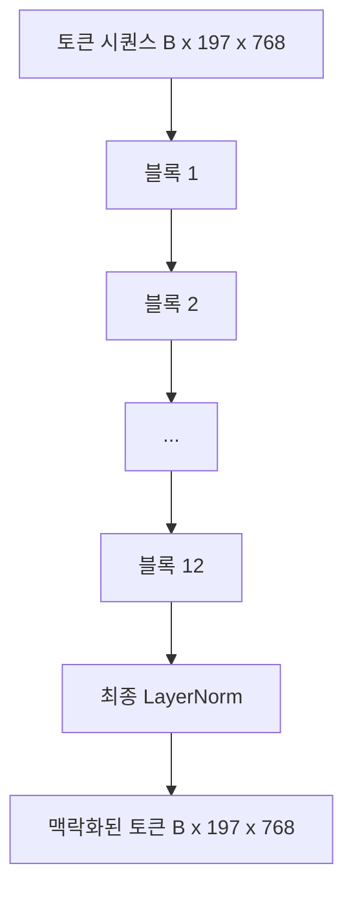
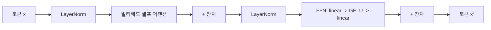

> 🇰🇷 이 문서는 한국어 번역본입니다(ELI5 스타일). 원문: [en.md](en.md)

# 비전 트랜스포머 인코더(Vision Transformer Encoder)

> 패치만으로는 아무것도 보지 못합니다. 어텐션 헤드 12개를 가진 12층 pre-LN 트랜스포머가 패치 토큰 시퀀스를 맥락화된(contextual) 토큰 시퀀스로 바꾸고, CLS 토큰이 마지막 은닉 상태에서 이미지 전체의 특성을 풀링합니다. 이 레슨은 모든 현대 비전-언어 모델의 기관실입니다.

**유형:** Build
**언어:** Python
**선수 지식:** 페이즈 19 레슨 30-37 (트랙 B 기초)
**시간:** 약 90분

## 학습 목표

- 멀티헤드 셀프 어텐션과 피드포워드 하위 레이어를 갖춘 pre-LN 트랜스포머 블록을 구현한다.
- 블록 12개를 헤드 12개로 쌓아 ViT-Base 인코더를 만든다.
- 레슨 58의 패치 앞단을 인코더에 연결하고 순전파를 실행한다.
- CLS 토큰이 모든 패치의 정보를 수집한다는 것을 검증한다.

## 문제 상황

패치 임베딩은 197개 토큰의 시퀀스를 만들어 냅니다. 각 토큰은 다른 어떤 패치도 의식하지 못하는 벡터입니다. 고양이 그림이라면 모든 패치가 알아야 합니다. 어느 패치에 수염이 있고, 어느 패치에 배경이 있고, 어느 패치에 눈이 있는지를요. 트랜스포머가 바로 그 인식을, 어텐션 레이어 한 층씩 쌓아 가며 만드는 메커니즘입니다. 이게 없으면 패치 앞단은 이해력 없는 똑똑한 토크나이저에 불과합니다.

표준 레시피는 깊이 12개 블록, 너비 12개 헤드, pre-LayerNorm 배치, GELU 활성화, 4배 피드포워드 확장입니다. 이 레시피가 CLIP ViT-L, SigLIP, DINOv2, Qwen-VL 계열, InternVL, 그리고 2025-2026년의 다른 모든 오픈 웨이트 비전 인코더의 등뼈입니다. 레시피는 충분히 안정적이라서, 그 논문들을 읽을 때 명시적으로 다르게 말하지 않는 한 이 블록 형태를 가정할 수 있습니다.

## 개념





### Pre-LN 대 post-LN

원조 트랜스포머는 LayerNorm을 잔차 뒤에 놓았습니다. Pre-LN(각 하위 레이어 전에 LayerNorm)은 모든 현대 비전-언어 모델이 쓰는 버전입니다. 학습률 워밍업 트릭 없이도 안정적으로 학습되기 때문입니다. 차이는 순전파의 한 줄이지만, 깊이 12 이상에서의 그래디언트 흐름은 하늘과 땅 차이입니다.

### 멀티헤드 셀프 어텐션

각 헤드는 토큰 벡터를 자신만의 `(query, key, value)` 삼중으로 투영하며, 차원은 `head_dim = hidden / num_heads`입니다. `hidden = 768`, `heads = 12`이면 각 헤드는 `dim = 64`입니다. 12개 헤드가 병렬로 어텐션하고, 그 출력들은 다시 768 차원으로 이어 붙어 출력 투영을 통과합니다. 멀티헤드의 요점은 한 헤드가 "고양이 눈에 어텐션"을 학습하는 동안 다른 헤드가 "배경 그라디언트에 어텐션"을 서로 간섭 없이 학습할 수 있다는 것입니다.

### 피드포워드 확장이 4배인 이유

FFN은 가운데에 GELU를 두고 `hidden -> 4 * hidden -> hidden`으로 흐릅니다. 4라는 배수는 경험적인 것이고 2017년부터 언어와 비전 트랜스포머를 막론하고 유지되어 왔습니다. 더 작으면(2배) 과소적합하고, 더 크면(8배) 고정된 데이터 예산에서 과적합합니다. MLP는 모델이 학습한 사실 대부분을 저장하는 곳이고, 넓은 중간층이 바로 그것들이 앉는 자리입니다.

| 구성 요소 | ViT-Base 규모에서의 파라미터 |
|-----------|------------------------------|
| 블록당 qkv 투영 | `3 * 768 * 768 = 1.77M` |
| 블록당 출력 투영 | `768 * 768 = 590K` |
| 블록당 FFN(4배 확장) | `2 * 768 * 4 * 768 = 4.72M` |
| 블록당 LayerNorm | `4 * 768 = 3K` |
| 블록당 합계 | 약 7.1M |
| 12개 블록 | 약 85M |
| 앞단 포함 | 총 약 86M |

ViT-Base는 86M 파라미터 인코더입니다. 2026년 기준으로는 작습니다(SigLIP-So400M은 400M, Qwen-VL의 ViT는 675M). 하지만 너비와 깊이를 넘어서면 아키텍처는 동일합니다.

### 인과 마스크, 넣을까 말까?

비전 트랜스포머는 인코더 전용이고 양방향입니다. 토큰 `i`는 어떤 쌍에 대해서든 토큰 `j`에 어텐션할 수 있습니다. 마스크 없음. 레슨 61의 디코더 쪽 크로스 어텐션이 인과 마스크를 쓰겠지만, 비전 인코더 안의 어텐션은 완전 연결입니다.

### CLS 토큰이 학습하는 것

CLS 토큰은 학습된 파라미터로 시작하고, 자체 패치 내용이 없으며, 모든 블록에 걸친 어텐션을 통해 정보를 축적합니다. 마지막 레이어에 이르면 CLS 행은 이미지 전체의 벡터 요약입니다. 다운스트림 헤드는 이 단일 벡터를 클래스 로짓, 대조 임베딩, 텍스트 디코더용 크로스 어텐션 키로 투영합니다.

```figure
ch-cls-funnel
```

## 직접 만들기

`code/main.py`는 다음을 구현합니다:

- `MultiHeadSelfAttention`: `qkv`와 출력 투영, 스케일드 점곱 어텐션 수학, 형태 단언문 포함.
- `FeedForward`: 4배 확장 GELU MLP.
- `Block`: 어텐션과 피드포워드 하위 레이어를 잔차와 함께 조합하는 pre-LN 블록.
- `ViT`: 12개 블록과 최종 LayerNorm으로 이루어진 스택.
- `VisionEncoder`: 레슨 58의 `VisionFrontEnd`를 `ViT` 스택에 연결하고, 맥락화된 시퀀스와 풀링된 CLS 벡터를 반환하는 `forward()`를 노출.
- 합성한 224x224 고정 데이터 이미지를 전체 인코더에 통과시켜 입력 형태, 출력 형태, 파라미터 수, 격층마다의 CLS 노름을 출력하는 데모.

실행 방법:

```bash
python3 code/main.py
```

출력: 고정 데이터가 `(1, 197, 768)` 텐서로 인코딩됩니다. CLS 노름은 레이어가 쌓이면서 위로 이동하다가 최종 LayerNorm에서 안정됩니다. 총 파라미터는 약 86M으로 보고됩니다.

## 활용하기

여기서 정의한 인코더는 너비와 깊이를 넘어서면 2025-2026년의 모든 오픈 웨이트 VLM이 내장하는 것과 같은 블록 스택입니다. 차이는 다음에 있습니다:

- **너비와 깊이.** ViT-Large는 `hidden=1024, depth=24, heads=16`이고, SigLIP So400M은 `hidden=1152, depth=27, heads=16`입니다. 같은 블록입니다.
- **풀링 헤드.** CLS 풀링(이 레슨) vs 평균 풀링(SigLIP) vs 어텐션 풀링(이후 VLM들).
- **위치 처리.** 고정 사인-코사인(레슨 58) vs 학습된 1D vs ALiBi vs 2D RoPE. 블록 수학은 그대로입니다.
- **레지스터 토큰.** DINOv2는 학습된 추가 토큰 4개를 앞에 붙입니다. 코드 한 줄입니다.

이 블록 스택이 기반입니다. 다음 레슨들(60-63)이 그 위에 섭니다.

## 테스트

`code/test_main.py`는 다음을 다룹니다:

- 단일 블록이 형태를 보존하고 입력 배치 크기에 불변
- 어텐션 점수가 key 축을 따라 합이 1(softmax 정상 작동 확인)
- 잔차 경로가 연결됨(입력이 0이어도 CLS 토큰 덕에 출력은 0이 아님)
- 4층 스택 순전파가 올바른 형태를 만듦
- 그래디언트가 CLS 출력에서 패치 투영까지 흐름

실행 방법:

```bash
python3 -m unittest code/test_main.py
```

## 연습 문제

1. 레지스터 토큰(CLS 뒤에 앞붙이는 학습된 벡터 4개)을 추가하고 다시 실행해 보세요. 마지막 레이어의 softmax 분산 엔트로피로 어텐션 맵의 매끄러움을 비교하세요.

2. pre-LN을 post-LN으로 바꾸고 합성 도형 분류기에서 한 에포크 학습해 보세요. LR 워밍업 없이 안정적으로 학습되는 쪽이 어느 쪽인지 관찰하세요.

3. 같은 블록을 디코더 블록으로 재사용할 수 있게 `attn_mask` 인자로 인과 마스킹을 구현해 보세요. 마스크 형태는 `(seq, seq)` 하삼각입니다.

4. 배치 크기 1, 8, 64에서 `torch.profiler`로 순전파를 프로파일링해 보세요. 실제 시간을 지배하는 것은 어텐션이 아니라 MLP 레이어입니다.

5. 어텐션 헤드 하나의 q-k-v 투영을 저랭크 LoRA 어댑터로 교체하고 나머지를 동결한 뒤, 그래디언트가 기대한 곳에서만 흐르는지 검증해 보세요.

## 핵심 용어

| 용어 | 의미 |
|------|---------------|
| Pre-LN | LayerNorm을 각 하위 레이어 뒤가 아니라 앞에 적용 |
| 셀프 어텐션 | 각 토큰이 같은 시퀀스의 모든 다른 토큰에 어텐션 |
| 멀티헤드 | 히든 차원이 `H`개의 독립적인 어텐션 헤드로 분할됨 |
| FFN 확장 | 피드포워드 레이어가 수축하기 전에 `4 * hidden`으로 넓어짐 |
| CLS 풀링 | 첫 토큰의 최종 은닉 상태를 이미지 요약으로 사용 |

## 더 읽을거리

- An Image is Worth 16x16 Words (ViT, 2021) — 인코더 레시피.
- DINOv2 (2023) — 레지스터 토큰과 자기지도 사전학습 목적 함수.
- SigLIP (2023) — 평균 풀링 변형과 레슨 62에서 쓰이는 시그모이드 대조 손실.
