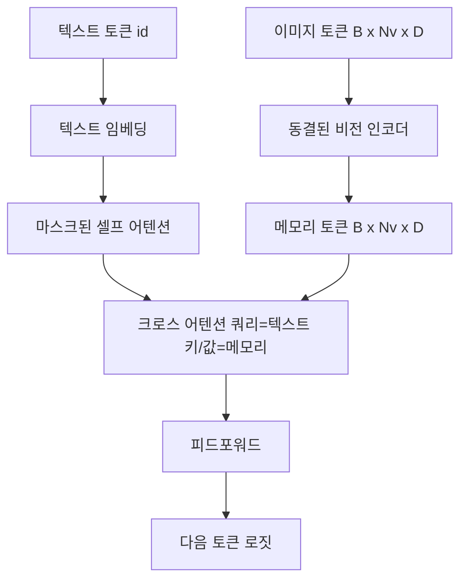
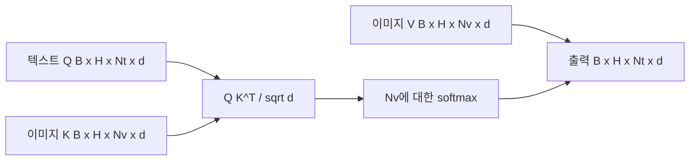

> 🇰🇷 이 문서는 한국어 번역본입니다(ELI5 스타일). 원문: [en.md](en.md)

# 크로스 어텐션 퓨전

> 프로젝션 계층은 이미지 벡터 하나를 캡션 벡터 하나에 맞춰 줍니다. 진짜 비전-언어 디코더는 모든 텍스트 토큰이 모든 패치 토큰을 주시(attend)할 수 있어야, 모델이 각 단어를 이미지의 특정 영역에 근거 지어 붙일 수 있습니다. 그 근거 붙이기(grounding)가 일어나는 통로가 바로 크로스 어텐션입니다. 텍스트가 질문(query)을 던지면, 비전이 키(key)와 값(value)으로 답합니다. 이 레슨은 크로스 어텐션 블록, 인과적(causal) 텍스트 셀프 어텐션, 그리고 둘 다 규칙을 지키게 만들어 주는 마스크 셰이프를 만듭니다.

**유형:** Build
**언어:** Python
**선수 지식:** 페이즈 19 레슨 30-37 (트랙 B 기초)
**시간:** ~90분

## 학습 목표

- 쿼리 스트림은 텍스트, 키/값 스트림은 비전인 멀티헤드 크로스 어텐션을 구현합니다.
- 디코더 블록을 조립합니다: 인과적 셀프 어텐션 + 크로스 어텐션 + 피드포워드.
- 마스크 셰이프를 정확히 잡습니다: 셀프 어텐션에는 인과 마스크, 크로스 어텐션에는 마스크 없음.
- 배치로 묶인 텍스트 토큰과 고정된 이미지 토큰 풀로 포워드 패스를 돌려 봅니다.

## 문제

이미지 토큰과 텍스트 토큰을 한 시퀀스로 이어 붙이는 것도 퓨전 방법 중 하나입니다(얼리 퓨전 — Chameleon과 Emu3가 택한 길). 크로스 어텐션은 나머지 한 방법입니다(레이트 퓨전 — Flamingo가 처음 소개했고 그 뒤를 이은 Flamingo 형태의 디코더들이 모두 베낀 길). 레이트 퓨전에서는 텍스트 디코더가 텍스트 전용 토큰 위에서 돌고, 매 계층마다 크로스 어텐션을 통해 이미지 스트림으로 손을 뻗습니다.

레이트 퓨전에는 두 가지 장점이 있습니다. 첫째, 텍스트 스트림이 깨끗하게 유지되므로 모델이 텍스트 전용 능력을 보존합니다. 둘째, 이미지 스트림은 이미지당 한 번만 계산해서 모든 디코드 스텝에 재사용하므로, 긴 캡션도 생성 비용이 쌉니다. 대가는 블록마다 어텐션 서브 계층이 하나 더 필요하다는 것입니다.

## 개념





### 마스크 셰이프

디코더 블록 안의 두 어텐션은 서로 다른 마스크를 필요로 합니다:

| 어텐션 | 쿼리 길이 | 키 길이 | 마스크 | 이유 |
|-----------|--------------|------------|------|-----|
| 셀프 어텐션 | `Nt` (텍스트) | `Nt` (텍스트) | 인과적: 하삼각 `(Nt, Nt)` | 자기회귀 도중 텍스트 토큰이 앞을 훔쳐보면 안 됨 |
| 크로스 어텐션 | `Nt` (텍스트) | `Nv` (비전) | 마스크 없음 | 이미지 전체가 모든 텍스트 위치에 보임 |

이 레슨에는 셰이프 검증 함수가 하나 들어 있어서, 둘을 헷갈리는 실수가 조용히 망가진 손실 곡선 대신 `ValueError`로 드러납니다.

### 크로스 어텐션에 마스크가 없는 이유

이미지는 텍스트가 한 글자라도 생성되기 전에 온전히 관측됩니다. 캡션의 토큰 `t`는 이미지의 어떤 패치에도 주시할 수 있고, 이미지 패치에는 시간 순서라는 것이 없습니다. 일부 Flamingo 변형은 여러 이미지와 텍스트 조각을 섞을 때 샘플별 마스킹 패턴을 추가하지만, 이미지 한 장에 캡션 하나인 경우 크로스 어텐션은 모든 것을 봅니다.

### 키/값 캐싱

이미지의 키와 값은 디코드 시작 시 한 번 계산되어 캐시에 보관됩니다. 새 텍스트 토큰마다 캐시를 재계산 없이 사용합니다. 캡셔닝 추론이 빠른 이유가 바로 이것입니다: 무거운 ViT는 한 번만 돌고, 크로스 어텐션은 매 스텝 키와 값을 재사용합니다. 이 레슨은 캐시를 노출하고 캐시 히트 경로를 테스트합니다.

### 블록 조립

디코더 블록은 이렇게 돌아갑니다: pre-LN -> 셀프 어텐션 -> 잔차 -> pre-LN -> 크로스 어텐션 -> 잔차 -> pre-LN -> 피드포워드 -> 잔차. 서브 계층 셋, 각각 자기만의 LayerNorm을 가집니다. Flamingo 논문은 크로스 어텐션에 학습 가능한 게이트를 추가해서, 학습 초반의 안정성 비용을 치르면서 모델이 이미지 경로를 거르고(off) 선택할 수 있게 했습니다. 여기서 쓰는 표준 베이스라인에는 게이트가 없습니다.

```python
class DecoderBlock:
  def forward(self, text_tokens, image_tokens, text_mask, cross_mask):
      text_tokens = text_tokens + self.self_attn(self.ln1(text_tokens),
                                                 mask=text_mask)
      text_tokens = text_tokens + self.cross_attn(self.ln2(text_tokens),
                                                  image_tokens,
                                                  mask=cross_mask)
      text_tokens = text_tokens + self.ffn(self.ln3(text_tokens))
      return text_tokens
```

```figure
ch-crossattn-fan
```

## 만들어 보기

`code/main.py`는 다음을 구현합니다:

- `CrossAttention(hidden, heads)` — `q`와 `kv` 프로젝션을 분리한 멀티헤드 크로스 어텐션.
- `CausalSelfAttention(hidden, heads)` — 표준 디코더의 마스크된 셀프 어텐션.
- `DecoderBlock` — pre-LN 잔차로 세 서브 계층을 조립.
- `VisionLanguageDecoder` — 목(mock) 비전 인코더 출력과 작은 텍스트 임베딩 테이블을 먹이는 4층 디코더.
- `causal_mask(length)` — `(length, length)` 하삼각 불리언 텐서를 돌려주는 함수.
- 데모: 길이 10짜리 텍스트 시퀀스 두 개와 길이 197의 이미지 메모리를 배치로 넣고, 출력 셰이프, 셀프 어텐션 마스크 셰이프, 위치별 크로스 어텐션 출력 노름을 출력합니다.

실행:

```bash
python3 code/main.py
```

출력: 디코더가 `(2, 10, text_vocab)` 크기의 로짓 텐서를 만듭니다. 마스크 셰이프는 `(10, 10)`입니다. KV-캐시 재사용 검사는 캐시 경로와 비캐시 경로의 로짓이 동일함을 확인합니다.

## 활용하기

크로스 어텐션은 두 프로덕션 계열에서 등장합니다:

- **Flamingo와 IDEFICS.** K개 언어 모델 블록마다 크로스 어텐션 서브 계층을 삽입하고, LM은 동결합니다. 비전-언어 어댑터는 크로스 어텐션 블록과 그 게이트입니다.
- **BLIP-2.** Q-Former는 고정된 32개 쿼리 토큰 집합에서 이미지 특성(feature)으로 크로스 어텐션을 보낸 뒤, 그 쿼리들을 LM 임베딩 공간으로 프로젝션합니다.

이 레슨의 블록 셰이프는 둘 모두에 그대로 대응합니다. 마스크 규율(셀프에는 인과, 크로스에는 없음)도 같습니다.

## 테스트

`code/test_main.py`가 다루는 것:

- 인과 마스크가 하삼각이고 기대하는 불리언 셰이프와 일치하는지
- 크로스 어텐션 출력 셰이프가 키 길이와 무관하게 `(B, Nt, hidden)`인지
- KV-캐시 경로가 비캐시 경로와 float 허용 오차 안에서 일치하는지
- 텍스트와 이미지 스트림 간 셰이프 불일치가 명확한 `ValueError`를 일으키는지
- 디코더 전체 포워드 패스가 올바른 배치와 시퀀스 셰이프를 만드는지

실행:

```bash
python3 -m unittest code/test_main.py
```

## 연습 문제

1. 크로스 어텐션 잔차에 학습 가능한 tanh 게이트를 추가하고(Flamingo 트릭), 거의 0에 가까운 초기 게이트에서 학습이 수렴하는지 확인합니다. 게이트는 0에서 시작하고, 모델은 이미지 스트림을 섞기 전에 텍스트 전용 행동을 먼저 회복합니다.

2. 같은 디코더가 여러 이미지와 여러 텍스트 조각을 소비하는 인터리브 어텐션을 구현합니다. 텍스트 조각 2가 이미지 1을 주시하지 못하게 막는 샘플별 크로스 어텐션 마스크를 만듭니다.

3. `Nt=64, Nv=576`(더 높은 해상도의 24x24 그리드)에서 크로스 어텐션과 셀프 어텐션 계층의 성능을 프로파일링합니다. 크로스 어텐션 비용은 `Nt * Nv`이며, 이미지 해상도가 높을수록 지배적입니다.

4. 크로스 어텐션 맵에 쿼리 측 드롭아웃을 추가하고 데모에서 캡션 다양성을 측정합니다(크로스 맵의 드롭아웃이 커질수록 캡션 샘플 분산이 증가합니다).

5. 크로스 어텐션 계층을 Q-Former 스타일 어텐션 블록으로 바꿉니다. 고정된 32토큰 쿼리 풀이 계층마다 한 번씩 이미지 특성을 주시합니다.

## 핵심 용어

| 용어 | 의미 |
|------|---------------|
| 레이트 퓨전 | 텍스트와 비전이 별개 스트림에 머물고, 크로스 어텐션이 매 블록에서 다리를 놓음 |
| 크로스 어텐션 | Q는 한 스트림에서, K와 V는 다른 스트림에서 옴 |
| 인과 마스크 | 자기회귀 도중 앞을 훔쳐보지 못하게 하는 하삼각 불리언 마스크 |
| KV 캐시 | 이미지의 키와 값을 한 번 저장해 모든 디코드 스텝에 재사용 |
| 메모리 토큰 | 디코더가 손을 뻗어 참조하는 동결된 이미지 토큰 |

## 더 읽을거리

- Flamingo (2022) — 게이트 달린 크로스 어텐션을 갖춘 정석적인 레이트 퓨전 설계.
- BLIP-2 (2023) — Q-Former, 즉 학습된 쿼리 풀의 옷을 입은 크로스 어텐션 블록.
- IDEFICS (2023) — Flamingo 레시피의 오픈 웨이트 재현.
