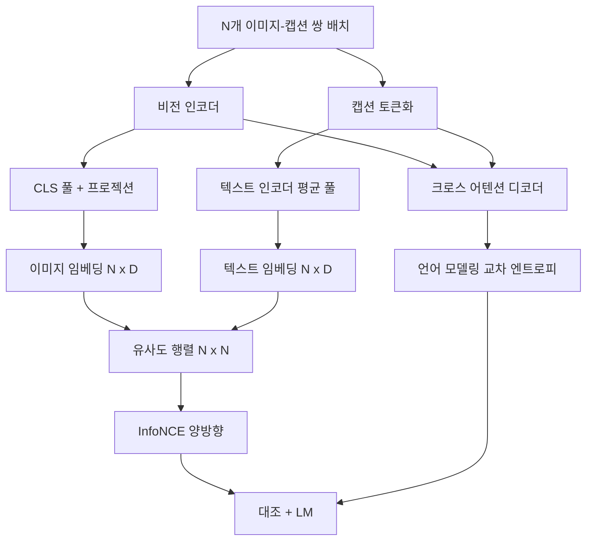

> 🇰🇷 이 문서는 한국어 번역본입니다(ELI5 스타일). 원문: [en.md](en.md)

# 비전-언어 사전학습

> 인코더, 프로젝션, 디코더가 연결되어 있습니다. 이제 이들을 함께 학습시킵니다. 학습을 이끄는 목표는 두 가지입니다. 매칭되는 쌍을 공동 임베딩 공간 안에서 서로 끌어당기는 대조적 이미지-텍스트 손실(InfoNCE), 그리고 디코더에게 각 이미지의 캡션을 쓰라고 요구하는 언어 모델링 손실. 둘을 합치면 네트워크는 '캡션에 맞는 이미지 찾기'와 '이미지에 맞는 캡션 쓰기'를 동시에 배웁니다.

**유형:** Build
**언어:** Python
**선수 지식:** 페이즈 19 레슨 30-37 (트랙 B 기초)
**시간:** ~90분

## 학습 목표

- 이미지-캡션 쌍 배치에 걸쳐 InfoNCE 대조 손실을 구현합니다.
- 대조 손실과 자기회귀 언어 모델링 손실을 조합합니다.
- 실제 데이터셋을 내려받지 않고 200쌍짜리 목(mock) 이미지-캡션 코퍼스를 합성합니다.
- 50스텝 데모 학습 루프를 돌리고 두 손실이 모두 감소하는지 관찰합니다.

## 문제

비전-언어 모델에는 두 가지 능력이 필요합니다. 순위 매기기: 캡션이 주어지면 여러 이미지 중 맞는 이미지를 찾아야 합니다. 생성: 이미지가 주어지면 캡션을 써야 합니다. 한 가지 능력만으로 사전학습하면 절반짜리 시스템이 됩니다. CLIP은 순위 매기기는 완벽했지만 캡션을 쓰지 못합니다. GPT-4V는 캡션은 쓰지만 순위 매기기에는 별도의 검색 헤드를 씁니다. 다목적 사전학습은 한 번의 패스로 둘 다를 얻습니다.

InfoNCE는 순위 매기기 절반을 담당합니다. N쌍짜리 배치에서 모델은 N개의 매칭 쌍을 양성(positive)으로, `N^2 - N`개의 어긋난 쌍을 음성(negative)으로 취급하고, 만들어진 `(N, N)` 유사도 행렬에 교차 엔트로피 손실을 실행합니다. LM 손실은 생성 절반을 담당합니다: 이미지를 조건으로 하는 표준적인 다음 토큰 예측입니다. 두 손실은 모두 미분 가능하고, 인코더·프로젝터·디코더 가중치를 공유할 수 있습니다.

## 개념



### 한 문단으로 보는 InfoNCE

N개의 이미지 임베딩을 행으로, N개의 텍스트 임베딩을 행으로 쌓습니다. 둘 다 L2 정규화합니다. `N x N` 행렬 `S = I T^T / tau`를 계산하는데, `tau`는 학습되는 온도(temperature)입니다. 대각 성분이 매칭 쌍이고, 비대각 성분이 음성입니다. 목표 `argmax`가 대각선을 따라 내려오도록 교차 엔트로피를 적용합니다: 행 `i`의 최댓값이 열 `i`에 있어야 합니다. 열 방향으로도 대칭적으로 같은 일을 합니다. 전체 손실은 둘의 평균입니다. 이것이 여덟 줄짜리 CLIP 손실입니다.

### 온도가 중요한 이유

온도 `tau`는 소프트맥스가 얼마나 뾰족해지는지를 조절합니다. 너무 작으면(예: `tau = 0.01`) 기울기가 가장 어려운 음성에서만 나와서 학습이 시끄러워집니다. 너무 크면 소프트맥스가 평평해져 기울기가 사라집니다. CLIP은 `tau`를 파라미터로 학습하고, 여기의 데모도 같은 일을 합니다.

### 언어 모델링 손실

디코더는 크로스 어텐션으로 이미지 메모리 토큰을 받아들이고, 모든 위치에서 다음 텍스트 토큰을 예측합니다. 손실은 다음 위치를 목표로 하는 표준 교차 엔트로피입니다. 패딩 위치는 손실에서 마스크 처리됩니다.

### 손실 조합하기

`total = contrastive + lm_weight * lm`이며, `lm_weight`는 스칼라입니다(보통 1.0). 두 손실 모두 인코더와 프로젝션으로 기울기를 보내고, LM 손실 기울기는 디코더만 받습니다. 이것이 CoCa, BLIP, SigLIP 스타일 모델들이 각자의 가중치로 쓰는 다중 과제(multi-task) 레시피입니다.

| 구성 요소 | 손실 표면 | 영향을 주는 대상 |
|-----------|--------------|---------|
| InfoNCE | 공동 공간에서의 쌍 순위 매기기 | 인코더 + 프로젝션 + 텍스트 헤드 |
| LM | 이미지 조건의 토큰 예측 | 인코더 + 프로젝션 + 디코더 |
| 결합 | 다중 과제 | 전체 스택 |

### 데모에 50스텝이면 충분한 이유

목 코퍼스는 무작위 이미지와 무작위 캡션 id로 이루어진 합성 200쌍 집합입니다. 배치 크기 16으로 50번의 SGD 스텝을 돌리면, 절댓값이 실제 데이터 모델의 수준에는 못 미치더라도 두 손실 모두 눈에 띄게 떨어집니다. 데모의 목적은 기울기 배관이 끝까지 연결되어 있는지, 그리고 LM 손실을 더해도 대조 목표가 불안정해지지 않는지 확인하는 것입니다.

```figure
ch-infonce-diagonal
```

## 만들어 보기

`code/main.py`는 다음을 구현합니다:

- `MultimodalModel` — 작은 ViT 인코더, MLP 프로젝터, 작은 텍스트 측 인코더(임베딩 id에 대한 평균 풀), 레슨 61의 크로스 어텐션 디코더를 결합.
- `info_nce_loss(image_emb, text_emb, temperature)` — 양방향 CLIP 스타일 대조 손실.
- `lm_loss(logits, target_ids, padding_id)` — 마스크된 다음 토큰 교차 엔트로피.
- `make_mock_corpus(seed, n_pairs)` — 200개의 결정론적 (이미지, 캡션_ids) 쌍을 돌려주는 함수.
- 배치 크기 16, Adam 옵티마이저, 학습되는 로그 온도 파라미터로 50스텝을 도는 학습 루프. 두 손실이 5스텝마다 출력됩니다.

실행:

```bash
python3 code/main.py
```

출력: 대조 손실은 약 `ln(16) = 2.77`에서 2.4 방향으로 떨어지고, LM 손실은 균등 무작위 베이스라인 `ln(512) ≈ 6.24`에서 약 4.7 방향으로 떨어집니다. 두 감소 모두 기울기가 올바르게 연결되어 있음을 증명합니다. 실제 모델은 수백만 스텝을 학습하지만, 역학은 같습니다.

## 활용하기

이것은 다음 제품들에 들어 있는 것과 같은 손실 레시피입니다:

- **CLIP (2021).** 이미지-텍스트 대조만 사용하며, 별도의 동결 인코더 캡션 프로브를 둡니다.
- **CoCa (2022).** 이미지-텍스트 대조와 이미지 캡셔닝 LM 손실을 한 모델에 담습니다. 이 레슨이 만드는 바로 그 패턴입니다.
- **BLIP (2022)와 BLIP-2.** 대조 + LM + 이미지-텍스트 매칭 헤드. 세 손실을 결합합니다.
- **SigLIP (2023).** InfoNCE를 시그모이드 쌍 손실로 바꿉니다; 대조라는 역할은 같고 함수 형태만 다릅니다.
- **LLaVA 계열.** 2단계 학습 — 1단계는 정렬(동결 LM에 대한 코사인), 2단계는 LM을 풀어서(unfreeze) LM 손실을 추가합니다. 레슨 60이 1단계, 이 레슨이 2단계에 해당합니다.

## 테스트

`code/test_main.py`가 다루는 것:

- InfoNCE 손실이 이미지/텍스트 행 방향으로 대칭인지
- 유사도 행렬이 큰 양수의 완벽한 대각선일 때 InfoNCE 손실이 0을 돌려주는지
- LM 손실이 패딩 위치를 올바르게 마스크하는지
- 모델 포워드 패스가 오류 없이 두 손실을 모두 만드는지
- 5스텝 학습 루프가 결합 손실을 줄이는지

실행:

```bash
python3 -m unittest code/test_main.py
```

## 연습 문제

1. InfoNCE를 SigLIP 스타일 시그모이드 쌍 손실로 바꾸고 목 코퍼스에서의 수렴을 비교합니다.

2. 하드 네거티브 마이닝 단계를 추가합니다: 배치 한 번 건너 이전 배치에서 가장 어려운 비대각 쌍을 골라 추가합니다. 학습을 돌리고 대조 손실이 더 빨리 떨어지는지 살펴봅니다.

3. 공동 임베딩 위에 이미지-텍스트 매칭 이진 헤드(참/거짓: 이 둘이 매칭되는가?)를 추가해 세 번째 손실을 만들고, BLIP의 3헤드 구성을 재현합니다.

4. 목 코퍼스를, 이미지 해시를 조건으로 하는 전이 행렬을 가진 마르코프 연쇄에서 뽑은 캡션 id 시퀀스로 바꿉니다. 실제 학습 가능한 신호가 생겼으니 캡셔닝 손실이 더 떨어져야 합니다.

5. 같은 모델을 `lm_weight = 0`으로 한 번, `lm_weight = 1`로 한 번 학습합니다. 대조 손실을 비교합니다. LM 손실이 순위 매기기 목표를 후퇴시켜서는 안 됩니다.

## 핵심 용어

| 용어 | 의미 |
|------|---------------|
| InfoNCE | 노이즈 대조 추정: 유사도 행렬에 대한 교차 엔트로피 |
| 온도 | 대조적 소프트맥스가 얼마나 뾰족한지 조절하는 스칼라 |
| 하드 네거티브 | 모델이 헷갈려 하는 비대각 쌍. 샘플링에 유용 |
| LM 손실 | 캡셔닝 측의 표준적인 다음 토큰 교차 엔트로피 |
| 공동 임베딩 공간 | 프로젝션 이후 이미지 벡터와 텍스트 벡터가 함께 사는 공유 공간 |

## 더 읽을거리

- CLIP 논문 — 원조 대조 레시피.
- CoCa 논문 — 대조와 캡셔닝을 한 모델에 담은 사례.
- SigLIP 논문 — 시그모이드 쌍 손실 변형과 그것이 더 잘 확장되는 이유.
