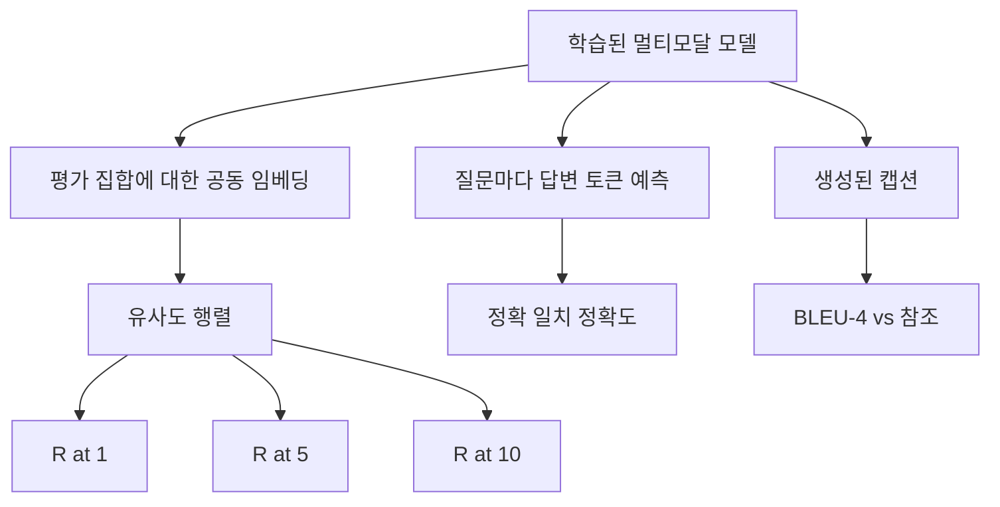

> 🇰🇷 이 문서는 한국어 번역본입니다(ELI5 스타일). 원문: [en.md](en.md)

# 멀티모달 평가

> 학습은 루프의 절반입니다. 나머지 절반은 측정입니다. 이 레슨은 기본 요소들로부터 세 가지 평가 표면을 만듭니다: R@1, R@5, R@10으로 보고하는 이미지-캡션 검색, 정확 일치(Exact Match) 정확도로 보고하는 시각 질의응답(VQA), 그리고 BLEU-4로 보고하는 이미지 캡셔닝. 각 지표는 모델 출력 위에서 돌아가는 함수이며, 몇 초 만에 끝나는 합성 평가 스위트 위에서 실행됩니다.

**유형:** Build
**언어:** Python
**선수 지식:** 페이즈 19 레슨 58-62 (트랙 E 기초: 인코더, 트랜스포머, 프로젝션, 크로스 어텐션 퓨전, 사전학습)
**시간:** ~90분

## 학습 목표

- 이미지 임베딩과 캡션 임베딩 사이의 유사도 행렬로부터 Recall@K를 계산합니다.
- (이미지, 질문) 쌍을 고정된 답변 어휘에 대응시키는 모델로부터 정확 일치 VQA 정확도를 계산합니다.
- 외부 라이브러리 없이 생성 토큰 시퀀스와 참조 시퀀스로부터 BLEU-4를 계산합니다.
- 레슨 62에서 학습한 모델 위에 구축한 합성 스위트에 대해 세 가지 평가를 모두 실행합니다.

## 문제

학습 손실이 정체되면 멀티모달 모델이 완성됐다고 선언하고 싶어집니다. 하지만 학습 손실은 학습 분포에 대한 적합도를 측정할 뿐, 모델이 홀드아웃 배치에서 쌍의 순위를 매길 수 있는지, 질문에 답할 수 있는지, 사람이 받아들일 만한 캡션을 쓸 수 있는지는 측정하지 않습니다. 표준적인 평가 표면은 세 가지입니다:

- **검색 (R@1, R@5, R@10).** 질의 캡션의 공동 임베딩을 만들고, 코사인으로 평가 풀의 모든 이미지 순위를 매긴 뒤, 매칭 이미지가 상위 1, 상위 5, 상위 10 안에 들어오는지 보고합니다. 대칭 형태(이미지→텍스트)도 같은 방식으로 돌아갑니다.
- **시각 질의응답 (정확 일치).** (이미지, 질문)이 주어지면 모델은 답변 토큰 하나를 출력합니다. 정확 일치는 샘플당 한 비트입니다: 예측 답변이 참조 답변과 같았는가? 평가 집합 전체에서 평균을 냅니다.
- **캡셔닝 (BLEU-4).** 캡션을 생성합니다. 참조 캡션들에 대해 1-그램부터 4-그램까지 정밀도의 기하평균을 계산하고, 가짜 패널티(brevity penalty)를 적용합니다. 다중 참조가 표준 형태입니다(이미지 하나, 참조 캡션 여러 개).

각 지표는 얇은 함수입니다. 이 레슨은 모두 코드로 만들어서 수학이 구체적으로 보이고 표면이 여러분의 통제 아래 있게 합니다. 실제 벤치마크 스위트(MS-COCO, VQA v2, GQA, OK-VQA)도 같은 함수 모양에 그대로 꽂힙니다.

## 개념



### 유사도 행렬로부터 Recall@K

이미지 임베딩과 캡션 임베딩 사이의 `(N, N)` 코사인 유사도 행렬을 만듭니다. 각 행에 대해 열을 유사도 내림차순으로 정렬합니다. Recall@K는 대각선 열 인덱스가 상위 K 안에 들어가는 행의 비율입니다. 대칭 Recall@K(캡션→이미지)는 전치 행렬에서 계산합니다. 두 수치를 모두 보고합니다. N=100 평가에서 R@1 = 0.6은 100개 캡션 중 60개가 자기 이미지를 최상위 매칭으로 검색했다는 뜻입니다.

### VQA 정확 일치

각 (이미지, 질문, 답변)에 대해 이미지를 인코딩하고, 질문을 임베딩하고, 디코더로 퓨전한 뒤 다음 토큰을 읽어냅니다. 예측 토큰 id를 참조 id와 비교하고, 같으면 정답입니다. 평가 집합 전체에서 평균을 냅니다. 실제 VQA 데이터셋은 질문마다 여러 사람이 단 답변을 함께 실어 소프트 정확도 공식(10명 중 3명 이상이 같은 답이면 1.0, 그 아래는 비례 축소)을 사용합니다; 이 레슨은 명확성을 위해 단일 답변 정확 일치를 씁니다.

### BLEU-4

```text
BLEU-4 = BP * exp(mean(log p1, log p2, log p3, log p4))
```

여기서 `p_n`은 수정된 n-그램 정밀도(어떤 참조에든 등장하는 생성 n-그램의 클리핑된 개수를 전체 생성 n-그램 개수로 나눈 값)이고, `BP`는 가짜 패널티입니다:

```text
BP = 1                생성 길이 > 참조 길이일 때
   = exp(1 - r/g)     그 외의 경우, r은 참조 길이, g는 생성 길이
```

일부 `p_n`이 0이 되는 작은 샘플에는 스무딩이 필요합니다. 구현은 Chen과 Cherry의 "방법 1"(개수가 0인 항목의 분자와 분모에 1을 더함)을 사용합니다. 낮은 개수 구간에서 가장 안전한 기본값입니다.

### 합성 평가 스위트

50샘플짜리 평가 스위트는 레슨 62에서 쓴 것과 같은 목 코퍼스 패턴을 홀드아웃 시드로 메모리 안에 만듭니다. 스위트는 세 리스트로 이루어집니다:

- `pairs`: 검색용 (이미지, 캡션_ids) 쌍 50개.
- `vqa`: (이미지, 질문_ids, 답변_id) 삼중 항목 50개.
- `caps`: 이미지당 최대 3개의 참조를 갖는 (이미지, [참조_캡션_ids, ...]) 항목 50개.

스위트는 시드로부터 결정론적이며 학습 코퍼스와 겹치지 않으므로, 지표는 모델이 한 번도 본 적 없는 데이터 위에서 계산됩니다. 스위트를 JSON으로 저장하는 것은 연습 문제로 남겨 뒀습니다(아래 참고).

| 지표 | 범위 | 무작위 베이스라인 (N=50) |
|--------|-------|------------------------|
| R@1 | 0부터 1 | 0.02 (1 / N) |
| R@5 | 0부터 1 | 0.10 |
| R@10 | 0부터 1 | 0.20 |
| VQA EM | 0부터 1 | 1 / 어휘 크기 |
| BLEU-4 | 0부터 1 | 작지만 0은 아님 |

합성 데이터에 대한 50스텝 학습에서 지표가 높게 나올 것으로 기대하지 않습니다. 기대하는 것은 무작위 베이스라인보다 높다는 것, 그리고 데모가 바로 그것을 검사한다는 점입니다.

```figure
ch-recall-window
```

## 만들어 보기

`code/main.py`는 다음을 구현합니다:

- `recall_at_k(sim_matrix, k)` — 양방향 모두에 대해 `[0, 1]` 범위의 float를 돌려줌.
- `vqa_exact_match(predictions, references)` — `int` 일치의 평균을 돌려줌.
- `bleu4(generated, references, smoothing=True)` — 다중 참조 지원.
- `build_eval_suite(seed, n_samples, vocab_size, max_len)` — 결정론적 평가 리스트 셋을 돌려줌.
- `evaluate(model, suite)` — 세 지표를 모두 실행하고 숫자로 된 `dict`를 돌려줌.
- 데모: 레슨 62의 멀티모달 모델을 새로 초기화해 평가한 뒤, 50스텝 학습하고 다시 평가하면서 이전/이후 지표를 출력합니다.

실행:

```bash
python3 code/main.py
```

출력: 이전/이후 지표 테이블은 검색이 거의 무작위에서 모델이 학습한 신호 쪽으로 좋아지고, VQA가 무작위 이상으로 좋아지고, BLEU-4가 좋아지는 모습을 보여줍니다(합성 구조만으로도 4-그램 정밀도가 올라가기에 충분합니다).

## 활용하기

각 지표는 프로덕션 벤치마크에 직접 대응합니다:

- **검색.** MS-COCO 5K val, Flickr30K, ImageNet 제로샷은 모두 같은 유사도 행렬 위의 R@K 문제입니다. 합성 평가를 실제 파일로 바꿔도 함수 시그니처는 그대로입니다.
- **VQA.** VQA v2, GQA, OK-VQA는 같은 정확 일치 형태를 씁니다(VQA v2만 단일 답변 EM 대신 소프트 정확도 사용).
- **BLEU-4.** MS-COCO 캡셔닝, NoCaps, Flickr30K 캡셔닝이 모두 BLEU-4에 CIDEr과 METEOR를 더해 씁니다. CIDEr 추가는 함수 하나면 됩니다.

실제 벤치마크에서는 `build_eval_suite`를 실제 로더로 바꾸고 함수 본체는 그대로 두면 됩니다. 수학은 벤치마크와 무관하게 동일합니다.

## 테스트

`code/test_main.py`가 다루는 것:

- 완벽한 항등 유사도 행렬에서 recall@k가 1.0을, 뒤집힌 행렬에서(k < N일 때) 0.0을 돌려주는지
- recall@k가 `k <= N` 상한을 지키는지
- 생성이 참조 하나와 정확히 일치할 때 bleu4가 1.0을 돌려주는지
- 어휘가 전혀 겹치지 않을 때 bleu4가 0.0을 돌려주는지
- VQA 정확 일치가 일치 쌍의 비율과 같은지
- build_eval_suite가 기대한 개수의 쌍, vqa 항목, 캡션 항목을 돌려주는지

실행:

```bash
python3 -m unittest code/test_main.py
```

## 연습 문제

1. 캡셔닝 지표에 CIDEr을 추가합니다. CIDEr는 n-그램에 TF-IDF 가중치를 적용해 정보량 많은 토큰에 보상합니다.

2. 소프트 정확도 VQA를 구현합니다: 질문마다 여러 사람 답변을 두고, 하나라도 일치하면 정확도는 `min(human_count / 3, 1)`입니다. VQA v2를 재현합니다.

3. 빈 생성 시퀀스를 크래시 없이 처리하는 NaN 안전판 `bleu4`를 추가합니다.

4. R@K와 함께 평균 역순위(MRR)를 계산합니다. MRR은 정답이 상위 K를 벗어난 뒤 어디에 놓이는지에 민감하고, R@K는 상위 K 안에 들어오는지에 민감합니다.

5. 학습 중 다섯 체크포인트(스텝 0, 10, 20, 30, 40, 50)에서 모델 평가를 실행하고 학습 곡선을 그립니다. 지표 궤적이 손실 궤적을 따라가는지 확인합니다.

## 핵심 용어

| 용어 | 의미 |
|------|---------------|
| R@K | 정답 매칭이 상위 K 결과 안에 들어오는 질의의 비율 |
| 정확 일치 | 가장 단순한 VQA 채점: 예측 답변이 참조와 같음 |
| BLEU-4 | 1~4-그램 정밀도의 기하평균, 가짜 패널티 포함 |
| 다중 참조 | 캡셔닝 지표가 이미지 하나에 여러 참조 캡션을 받아들임 |
| 홀드아웃 | 평가 집합이 학습 코퍼스와 겹치지 않는 시드에서 샘플링됨 |

## 더 읽을거리

- VQA v2 논문 — 소프트 정확도 공식과 데이터셋 통계.
- CIDEr 논문 — TF-IDF 가중 n-그램 캡셔닝.
- BLEU 원논문 (Papineni et al., 2002) — 스무딩 변형들.
- MS-COCO 캡셔닝 평가 스크립트 — 정석 참조 구현.
